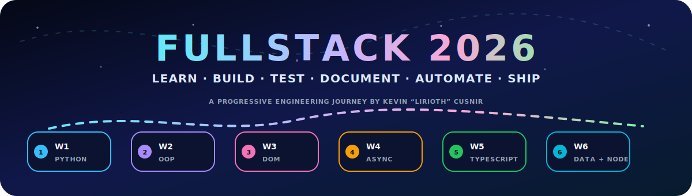
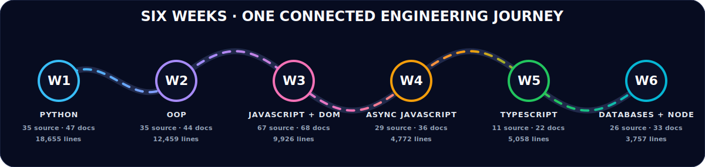
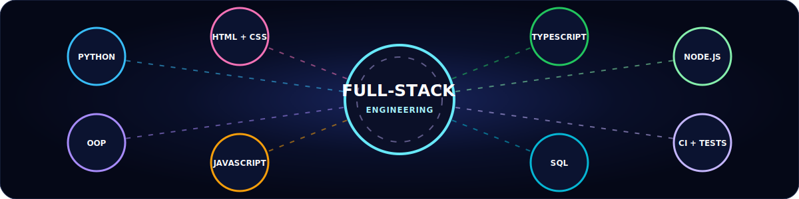
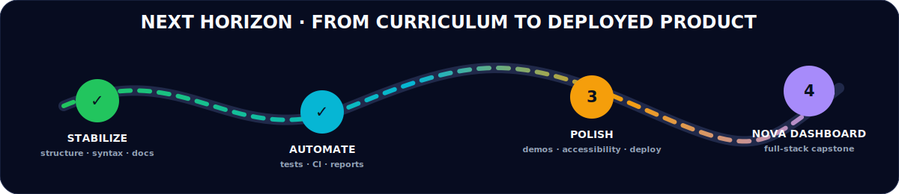
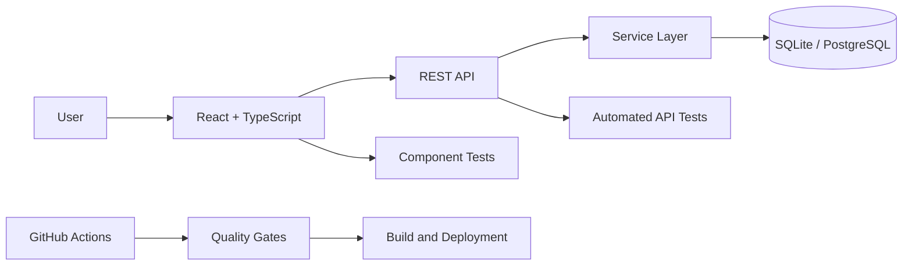
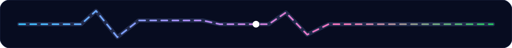

<div align="center">



<br>

[](https://github.com/LiriothTeltanion/Fullstack2026)
[](https://github.com/LiriothTeltanion/Fullstack2026/actions/workflows/quality.yml)
[](https://github.com/LiriothTeltanion/Fullstack2026/commits/main)
[](https://github.com/LiriothTeltanion/Fullstack2026)
[](LICENSE)
[](reports/nova/nova_repo_dashboard.html)
[](tests/)
[](SECURITY.md)

### A six-week full-stack learning archive transformed into a documented, tested, automated portfolio foundation

**Python · Object-Oriented Programming · JavaScript · DOM · HTTP · Async/Await · TypeScript · SQL · Node.js · Testing · CI**

<sub>Repository presentation version <strong>1.1.0</strong> · root README protected as the public GitHub landing page</sub>

</div>

---

## 🧭 Explore the repository

[Overview](#-repository-overview) ·
[Health](#-live-repository-health) ·
[Transformation](#-from-learning-archive-to-engineering-portfolio) ·
[Six weeks](#-the-six-week-learning-journey) ·
[Projects](#-portfolio-project-highlights) ·
[Stack](#-technology-constellation) ·
[Run](#-quick-start) ·
[Quality](#-quality-testing-and-automation) ·
[Roadmap](#-next-horizon) ·
[Reports](#-reports-and-transparency) ·
[Changelog](CHANGELOG.md)

---

## ✨ Repository overview

`Fullstack2026` documents my progression from programming fundamentals to practical full-stack engineering.

It contains real exercises, XP extensions, daily challenges, timed challenges, browser applications, object-oriented models, API integrations, TypeScript exercises, PostgreSQL work, Node.js modules, automated tests, repository tooling, continuous integration, and generated documentation.

This repository is designed to show more than completed assignments. It demonstrates how I:

- break problems into smaller functions and modules;
- improve early solutions without hiding the learning process;
- organize code by week, day, exercise type, and project;
- document goals, execution paths, strengths, and next improvements;
- protect secrets and generated artifacts;
- add deterministic tests around representative projects;
- use GitHub Actions and repeatable quality commands;
- turn a learning archive into an interview-ready engineering portfolio.

> **Honest scope:** this is a broad curriculum repository, not yet one unified production application. The next major milestone is an integrated full-stack capstone built from the strongest ideas developed here.

---

## 🩺 Audited repository health

<!-- NOVA:ROOT-LIVE-SNAPSHOT:START -->
<div align="center">



</div>

### Audited repository baseline — 2026-07-15

| Metric | Audited baseline |
|---|---:|
| Overall readiness | **92.0%** |
| Curriculum weeks | **6** |
| Files scanned | **1,012** |
| Repository size | **3.4 MB** |
| Text lines | **60,948** |
| Source files | **217** |
| Documentation files | **276** |
| Automated test files | **14** |
| Curriculum directories | **250** |
| README coverage | **100.0%** |
| Python syntax errors | **0** |
| Root source archives | **0** |
| Last quality-gate errors | **2** |
| Last quality-gate warnings | **68** |

### Readiness by category

| Category | Score | State |
|---|---:|---|
| 🟢 Learning breadth | **100.0%** | Ready |
| 🟢 Documentation | **100.0%** | Ready |
| 🟢 Structure | **100.0%** | Ready |
| 🟠 Code health | **60.0%** | Developing |
| 🟢 Testing | **100.0%** | Ready |
| 🟢 Tooling | **100.0%** | Ready |
| 🟠 Automation | **60.0%** | Developing |
| 🟢 Portfolio | **100.0%** | Ready |

<table>
<tr>
<td width="50%" valign="top"><h4>🟢 Verified strengths</h4><ul><li>✅ Six curriculum weeks are present without counting ZIP archives as modules.</li><li>✅ README coverage is 100.0% across curriculum directories.</li><li>✅ All Python files pass static syntax parsing.</li><li>✅ GitHub Actions quality workflow is installed with read-only repository access.</li><li>✅ 14 automated test file(s) are discoverable.</li><li>✅ Redundant Week ZIP archives are absent from the repository root.</li></ul></td>
<td width="50%" valign="top"><h4>🛰️ Release 1.1 validation context</h4><ul><li>✅ <code>package-lock.json</code> is present for reproducible <code>npm ci</code> installs.</li><li>✅ The current no-write quality gate passes with 0 errors and 0 warnings.</li><li>ℹ️ The 2 errors and 68 warnings in the table are preserved historical evidence from the dated audit, not claims about the current validation run.</li></ul></td>
</tr>
</table>

> The **92.0%** readiness score and **14 automated test files** are preserved from the dated audit. The score is a transparent repository-maintainability heuristic—not a bootcamp grade—and this release does not retroactively rewrite that evidence or claim that every interactive, SQL, browser, or external-API exercise was manually executed.

<sub>Snapshot generated by NOVA Ultimate v2.0.0 on 2026-07-15T06:23:15+03:00.</sub>
<!-- NOVA:ROOT-LIVE-SNAPSHOT:END -->

---

## 🚀 From learning archive to engineering portfolio

The NOVA stabilization pass preserved the original exercises while improving the repository around them.

| Area | Earlier audit | Post-upgrade baseline (2026-07-15) |
|---|---:|---:|
| Overall readiness | **43.8%** | **92.0%** |
| README coverage | **75%** | **100%** |
| Discoverable test files | **1** | **14** |
| Python syntax errors | **5** | **0** |
| Curriculum modules | ZIP files incorrectly inflated the count | **6 real week modules** |
| Root source archives | **2 ZIP files** | **0** |
| CI | Missing | Installed |
| Portable paths | Multiple inconsistent names | Canonicalized |
| Security configuration | Hardcoded credential patterns | Local configuration templates and security guidance |
| Repository tooling | Partial | Audit, quality gate, tests, rollback, updater, and reports |

### What the upgrade added

- animated README coverage throughout the curriculum;
- a central offline health dashboard;
- Python and Node test infrastructure;
- tests for Tic-Tac-Toe, Hangman, Circle, Timer, math helpers, and repository contracts;
- a read-only GitHub Actions quality workflow;
- Dependabot configuration;
- repeatable npm commands for quality, tests, audit, development, and documentation;
- normalized Week, Day, exercise-tier, and challenge paths;
- removal of redundant source ZIPs;
- `.env.example`, local browser configuration guidance, and `SECURITY.md`;
- reversible NOVA backup and rollback tooling.

---

## 🪐 The six-week learning journey

<div align="center">



</div>

| Week | Primary focus | Files | Source | READMEs | Lines |
|---|---|---:|---:|---:|---:|
| [Week 1 — Python](Week1Python/) | Syntax, collections, control flow, functions, algorithms, CLI projects | 128 | 35 | 47 | 18,655 |
| [Week 2 — OOP](Week2OOP/) | Classes, inheritance, modules, files, JSON, APIs, reusable models | 126 | 35 | 44 | 12,459 |
| [Week 3 — JavaScript & DOM](Week3JavaScriptandDOM/) | JavaScript fundamentals, events, DOM interfaces, browser mini-projects | 200 | 67 | 68 | 9,926 |
| [Week 4 — Advanced & Async JavaScript](Week4AdvAsynchronousJavaScript/) | Array/object methods, forms, HTTP, promises, fetch, async/await | 94 | 29 | 36 | 4,772 |
| [Week 5 — Mini Projects & TypeScript](Week5MiniProjectAndTypeScript/) | API projects, TypeScript types, interfaces, classes, unions, guards | 60 | 11 | 22 | 5,058 |
| [Week 6 — Databases & Node.js](Week6DatabasesAndNodejs/) | PostgreSQL, relational queries, Node modules, npm, filesystem work | 95 | 26 | 33 | 3,757 |

<details>
<summary><strong>🐍 Week 1 — Python foundations</strong></summary>

| Day | Focus | Main folder |
|---|---|---|
| Day 1 | Variables, data types, operators, input/output, conditionals | [Starting with Python](Week1Python/Day1StartingwithPython/) |
| Day 2 | Lists, tuples, sets, loops, iteration, formatting | [Lists and iteration](Week1Python/Day2ListsIteratingAndFormattingData/) |
| Day 3 | Dictionaries, nested structures, transformations, timed challenges | [Dictionaries](Week1Python/Day3Dictionaries/) |
| Day 4 | Functions, parameters, return values, scope, reusable logic | [Functions](Week1Python/Day4Functions/) |
| Day 5 | Algorithms and complete command-line mini-projects | [Mini projects](Week1Python/Day5MiniProject/) |

**Representative work:** [Build Up a String](Week1Python/Day1StartingwithPython/DailyChallenge/BuildUpAString/) · [Happy Birthday](Week1Python/Day2ListsIteratingAndFormattingData/DailyChallenge/GoldHappyBirthday/) · [Caesar Cipher](Week1Python/Day3Dictionaries/DailyChallenge/CaesarCypher/) · [Solve the Matrix](Week1Python/Day4Functions/DailyChallenge/SolveTheMatrix/) · [Hangman](Week1Python/Day5MiniProject/Exercises/Hangman/) · [Tic-Tac-Toe](Week1Python/Day5MiniProject/Exercises/TicTacToe/)

**Outcome:** problem decomposition, input validation, algorithms, functions, collections, and interactive Python programs.

</details>

<details>
<summary><strong>🏗️ Week 2 — Object-oriented Python</strong></summary>

| Day | Focus | Main folder |
|---|---|---|
| Day 1 | Classes, objects, constructors, instance behavior | [Introduction to OOP](Week2OOP/Day1IntroductiontoOOP/) |
| Day 2 | Inheritance, encapsulation, polymorphism | [Inheritance and polymorphism](Week2OOP/Day2OOPInheritanceEncapsulationPolymorphism/) |
| Day 3 | Modules, packages, properties, dunder methods | [OOP and modules](Week2OOP/Day3OOPandModules/) |
| Day 4 | File I/O, JSON, exceptions, external APIs | [Files, JSON and APIs](Week2OOP/Day4PythonFileIOJSONandAPI/) |
| Day 5 | Separated domain logic, CLI flows, reusable mini-projects | [OOP mini projects](Week2OOP/Day5MiniProject/) |
| Remote | Larger simulations and data-model exercises | [Remote OOP work](Week2OOP/RemoteLearningOOP/) |

**Representative work:** [Pagination](Week2OOP/Day2OOPInheritanceEncapsulationPolymorphism/DailyChallenge/Pagination/) · [Circle](Week2OOP/Day3OOPandModules/DailyChallenge/Circle/) · [Text Analysis](Week2OOP/Day4PythonFileIOJSONandAPI/DailyChallenge/TextAnalysis/) · [Anagram Checker](Week2OOP/Day5MiniProject/Exercises/AnagramChecker/) · [Rock Paper Scissors](Week2OOP/Day5MiniProject/Exercises/RockPaperScissors/) · [Weather App](Week2OOP/Day5MiniProject/Exercises/WeatherApp/) · [OOP Quiz](Week2OOP/Day5MiniProject/DailyChallenge/OOPQuiz/) · [Air Management](Week2OOP/RemoteLearningOOP/DailyChallenge/AirManagement/)

**Outcome:** reusable classes, separated responsibilities, domain rules, files, JSON, APIs, and testable models.

</details>

<details>
<summary><strong>🌐 Week 3 — JavaScript and the DOM</strong></summary>

| Day | Focus | Main folder |
|---|---|---|
| Day 1 | JavaScript syntax, arrays, objects, conditions, loops | [Introduction to JavaScript](Week3JavaScriptandDOM/Day1IntroductiontoJavaScript/) |
| Day 2 | Functions, DOM selection, dynamic rendering | [Functions and DOM](Week3JavaScriptandDOM/Day2FunctionsandDOMIntroduction/) |
| Day 3 | Events, forms, interaction, timers, movement | [DOM events](Week3JavaScriptandDOM/Day3LearningDOMEvents/) |
| Day 4 | Advanced functions, object workflows, higher-order patterns | [Advanced JavaScript](Week3JavaScriptandDOM/Day4AdvancedJavaScriptFunctions/) |
| Day 5 | Interactive browser mini-projects | [Mini projects](Week3JavaScriptandDOM/Day5MiniProject/) |
| Remote | Focused browser exercises and games | [Remote JavaScript and DOM](Week3JavaScriptandDOM/RemoteLearningJSAndDOM/) |

**Representative work:** [Solar System](Week3JavaScriptandDOM/Day2FunctionsandDOMIntroduction/DailyChallenge/DailyChallengePlanets/) · [Mad Libs](Week3JavaScriptandDOM/Day3LearningDOMEvents/DailyChallenge/TellTheStory/) · [Todo List](Week3JavaScriptandDOM/Day5MiniProject/DailyChallenge/TodoList/) · [Coloring Game](Week3JavaScriptandDOM/Day5MiniProject/Exercises/MiniProjectColoringGame/) · [Drum Set](Week3JavaScriptandDOM/Day5MiniProject/Exercises/drumset-mini/) · [Whack-a-Mole](Week3JavaScriptandDOM/RemoteLearningJSAndDOM/Exercises/ExercisesXP1/exercise4_whack_a_mole/)

**Outcome:** interactive browser experiences through DOM updates, forms, events, state, audio, timers, and responsive feedback.

</details>

<details>
<summary><strong>⚡ Week 4 — Advanced and asynchronous JavaScript</strong></summary>

| Day | Focus | Main folder |
|---|---|---|
| Day 1 | Advanced array methods and transformations | [Advanced array methods](Week4AdvAsynchronousJavaScript/Day1AdvancedArrayMethods/) |
| Day 2 | Object methods, destructuring, classes | [Advanced object methods](Week4AdvAsynchronousJavaScript/Day2AdvancedObjectMethods/) |
| Day 3 | GET/POST forms, JSON, HTTP-oriented interfaces | [HTTP and forms](Week4AdvAsynchronousJavaScript/Day3HTTPAndFormMethodGETAndPOST/) |
| Day 4 | Promises, sequencing, failure handling | [Asynchronous JavaScript](Week4AdvAsynchronousJavaScript/Day4AsynchronousJavaScript/) |
| Day 5 | Fetch, async/await, external data states | [Fetch and async/await](Week4AdvAsynchronousJavaScript/Day5FetchAndAsyncAwait/) |

**Representative work:** [Car Inventory](Week4AdvAsynchronousJavaScript/Day1AdvancedArrayMethods/DailyChallenge/CarInventory/) · [Go Wildcats](Week4AdvAsynchronousJavaScript/Day1AdvancedArrayMethods/DailyChallenge/GoWildcats/) · [HTML Form](Week4AdvAsynchronousJavaScript/Day3HTTPAndFormMethodGETAndPOST/DailyChallenge/HTMLForm/) · [True or False](Week4AdvAsynchronousJavaScript/Day3HTTPAndFormMethodGETAndPOST/DailyChallenge/TrueOrFalse/) · [Random Quote Generator](Week4AdvAsynchronousJavaScript/Day3HTTPAndFormMethodGETAndPOST/Exercises/RandomQuoteGenerator/) · [Play with Words](Week4AdvAsynchronousJavaScript/Day4AsynchronousJavaScript/DailyChallenge/PlayWithWords/)

**Outcome:** data transformations, HTTP flows, promises, async/await, loading states, validation, and recoverable errors.

</details>

<details>
<summary><strong>🔷 Week 5 — Mini projects and TypeScript</strong></summary>

| Day | Focus | Main folder |
|---|---|---|
| Day 1 | API-powered browser portfolio projects | [Mini projects](Week5MiniProjectAndTypeScript/Day1MiniProject/) |
| Day 2 | TypeScript primitives, unions, type-safe functions | [TypeScript key concepts](Week5MiniProjectAndTypeScript/Day2IntroductionToTypeScriptAndKeyConcepts/) |
| Day 3 | Interfaces, classes, access modifiers, domain modeling | [Advanced TypeScript applications](Week5MiniProjectAndTypeScript/Day3AdvancedTypeScriptConceptsAndApplications/) |
| Day 4 | Type guards, unions, generics, safer branching | [Advanced TypeScript guards](Week5MiniProjectAndTypeScript/Day4AdvancedTypeScriptConceptsAndApplications/) |

**Representative work:** [Currency Converter](Week5MiniProjectAndTypeScript/Day1MiniProject/DailyChallenge/CurrencyConverter/) · [Pokédex](Week5MiniProjectAndTypeScript/Day1MiniProject/Exercises/Pokedex/) · [Star Wars Character Finder](Week5MiniProjectAndTypeScript/Day1MiniProject/StarWarsWebApp/) · [Union Type Validator](Week5MiniProjectAndTypeScript/Day2IntroductionToTypeScriptAndKeyConcepts/DailyChallenge/UnionTypeValidator/) · [Library System](Week5MiniProjectAndTypeScript/Day3AdvancedTypeScriptConceptsAndApplications/DailyChallenge/)

**Outcome:** safer application logic through explicit types, interfaces, classes, unions, narrowing, and API-driven browser projects.

</details>

<details>
<summary><strong>🗄️ Week 6 — Databases and Node.js</strong></summary>

| Day | Focus | Main folder |
|---|---|---|
| Day 1 | Relational concepts, schemas, SQL fundamentals | [Introduction to databases](Week6DatabasesAndNodejs/Day1IntroductionToDatabases/) |
| Day 2 | Queries, filtering, aggregation, database reasoning | [Database concepts 1](Week6DatabasesAndNodejs/Day2DatabaseConcepts1/) |
| Day 3 | Relationships, joins, constraints, DVD Rental dataset | [Database concepts 2](Week6DatabasesAndNodejs/Day3DatabaseConcepts2/) |
| Day 4 | CommonJS, ES modules, npm packages, filesystem workflows | [Node.js introduction](Week6DatabasesAndNodejs/Day4NodejsIntroduction/) |

**Representative work:** [SQL XP](Week6DatabasesAndNodejs/Day1IntroductionToDatabases/Exercises/ExercisesXP/) · [DVD Rental relationships](Week6DatabasesAndNodejs/Day3DatabaseConcepts2/Exercises/ExercisesXP/) · [Node.js and npm challenge](Week6DatabasesAndNodejs/Day4NodejsIntroduction/DailyChallenge/NodejsAppAndNPM/) · [CommonJS products](Week6DatabasesAndNodejs/Day4NodejsIntroduction/Exercises/ExercisesXP/exercise-1-commonjs-products/) · [File manager](Week6DatabasesAndNodejs/Day4NodejsIntroduction/Exercises/ExercisesXP/exercise-3-file-manager-commonjs/) · [Todo module](Week6DatabasesAndNodejs/Day4NodejsIntroduction/Exercises/ExercisesXP/exercise-4-esm-todo/) · [Math app](Week6DatabasesAndNodejs/Day4NodejsIntroduction/Exercises/ExercisesXP/exercise-5-math-app/) · [File explorer](Week6DatabasesAndNodejs/Day4NodejsIntroduction/Exercises/ExercisesXP/exercise-7-file-explorer/)

**Outcome:** relational data, PostgreSQL queries, joins, constraints, server-side JavaScript, modules, packages, and filesystem operations.

</details>

---

## 🌟 Portfolio project highlights

| Project | Technologies | What it demonstrates |
|---|---|---|
| [Hangman](Week1Python/Day5MiniProject/Exercises/Hangman/) | Python | Modular state management, validation, replayable CLI interaction |
| [Tic-Tac-Toe](Week1Python/Day5MiniProject/Exercises/TicTacToe/) | Python | Pure helper functions, board logic, win/tie detection, testability |
| [Circle](Week2OOP/Day3OOPandModules/DailyChallenge/Circle/) | Python OOP | Properties, validation, comparison, arithmetic dunder methods |
| [Page Load Timer](Week2OOP/Day5MiniProject/DailyChallenge/Modules/) | Python, requests | Networking, measurements, aggregation, mocked deterministic tests |
| [Coloring Game](Week3JavaScriptandDOM/Day5MiniProject/Exercises/MiniProjectColoringGame/) | HTML, CSS, JavaScript | Event delegation, responsive grid construction, drawing interaction |
| [Drum Set](Week3JavaScriptandDOM/Day5MiniProject/Exercises/drumset-mini/) | HTML, CSS, JavaScript, audio | Keyboard/mouse interaction, media playback, UI feedback |
| [Random Quote Generator](Week4AdvAsynchronousJavaScript/Day3HTTPAndFormMethodGETAndPOST/Exercises/RandomQuoteGenerator/) | HTML, CSS, JavaScript | State, forms, filtering, navigation, metrics, dynamic rendering |
| [Currency Converter](Week5MiniProjectAndTypeScript/Day1MiniProject/DailyChallenge/CurrencyConverter/) | HTML, CSS, JavaScript, API | Async data, configuration separation, loading/error/result states |
| [Pokédex](Week5MiniProjectAndTypeScript/Day1MiniProject/Exercises/Pokedex/) | HTML, CSS, JavaScript, API | API navigation, visual cards, external data normalization |
| [Star Wars Character Finder](Week5MiniProjectAndTypeScript/Day1MiniProject/StarWarsWebApp/) | HTML, CSS, JavaScript, API | Fetch, response validation, sanitization, animated loading states |
| [Union Type Validator](Week5MiniProjectAndTypeScript/Day2IntroductionToTypeScriptAndKeyConcepts/DailyChallenge/UnionTypeValidator/) | TypeScript | Union types, narrowing, reusable validation |
| [Library System](Week5MiniProjectAndTypeScript/Day3AdvancedTypeScriptConceptsAndApplications/DailyChallenge/) | TypeScript | Interfaces, classes, private/protected fields, inheritance |
| [DVD Rental SQL](Week6DatabasesAndNodejs/Day3DatabaseConcepts2/Exercises/ExercisesXP/) | PostgreSQL | Joins, foreign keys, constraints, cascading deletion, analytical queries |
| [Node Math App](Week6DatabasesAndNodejs/Day4NodejsIntroduction/Exercises/ExercisesXP/exercise-5-math-app/) | Node.js, CommonJS | Reusable pure helpers, package use, automated tests |

---

## 🧬 Technology constellation

<div align="center">



</div>

| Layer | Technologies and concepts |
|---|---|
| Programming foundations | Python, strings, numbers, collections, conditionals, loops, functions, algorithms |
| Object-oriented design | Classes, inheritance, encapsulation, polymorphism, properties, dunder methods |
| Browser engineering | HTML5, CSS3, JavaScript, DOM, events, forms, accessibility, responsive behavior |
| Asynchronous workflows | HTTP, JSON, promises, fetch, async/await, loading/error/empty states |
| Type safety | TypeScript, interfaces, unions, classes, access modifiers, type guards |
| Data | SQL, PostgreSQL, joins, constraints, relationships, aggregation |
| Server-side JavaScript | Node.js, CommonJS, ES modules, npm, filesystem utilities |
| Quality | Python unittest, Node test runner, static syntax checks, repository contracts |
| Tooling | Git, GitHub, GitHub Desktop, ESLint, Prettier, NOVA automation |
| Delivery foundation | GitHub Actions, Dependabot, repeatable audits, generated reports |

---

## ⚡ Quick start

### Clone and install

```powershell
New-Item -ItemType Directory -Force C:\Dev | Out-Null
git clone https://github.com/LiriothTeltanion/Fullstack2026.git C:\Dev\Fullstack2026
Set-Location C:\Dev\Fullstack2026
npm install
```

The first successful `npm install` creates the root `package-lock.json`. Commit that lockfile so CI and future clones can use reproducible dependency versions.

### Run the repository quality workflow

```powershell
npm run quality
npm test
npm run audit
```

### Start a local static server

```powershell
npm run dev
```

Then open `http://localhost:8000`.

### Run representative material directly

```powershell
# Python
python .\Week1Python\Day5MiniProject\Exercises\TicTacToe\tictactoe.py

# Python tests
python -m unittest discover -s tests/python -p "test_*.py" -v

# Node tests
node .\tools\run_node_tests.mjs .

# TypeScript syntax validation
node .\tools\check_typescript_syntax.mjs .

# PostgreSQL example
psql -d dvdrental -f .\Week6DatabasesAndNodejs\Day3DatabaseConcepts2\Exercises\ExercisesXP\xp_dvdrental_relationships.sql
```

---

## 🧪 Quality, testing, and automation

### Root npm commands

| Command | Purpose |
|---|---|
| `npm run lint` | Lint JavaScript and TypeScript curriculum sources |
| `npm run lint:fix` | Apply supported ESLint fixes for review |
| `npm run format` | Format JavaScript and TypeScript with Prettier |
| `npm run format:check` | Verify formatting without changing files |
| `npm run syntax` | Run repository-wide static syntax validation |
| `npm run test:python` | Run the Python unit-test suite |
| `npm run test:js` | Run Node and TypeScript-oriented tests |
| `npm test` | Run both JavaScript and Python test suites |
| `npm run quality` | Execute the strict NOVA quality gate |
| `npm run audit` | Regenerate repository health reports |
| `npm run readme:generate` | Regenerate managed folder README sections |
| `npm run dev` | Serve the repository locally on port 8000 |
| `npm run build` | Treat the strict quality gate as the current repository build |

### Automated safeguards

- `.github/workflows/quality.yml` validates pushes and pull requests.
- Python files receive static syntax parsing.
- JavaScript and TypeScript receive automated syntax/tooling checks.
- Representative domain logic is covered by deterministic tests.
- Repository-contract tests verify critical folders, tooling, archives, and documentation.
- The quality gate reports possible secrets, broken links, missing lockfiles, and structural regressions.
- Dependabot checks npm and GitHub Actions dependencies.

### Safe pre-commit routine

```powershell
npm run format:check
npm run lint
npm run quality
npm test
git status
git diff
```

---

## 📁 Repository organization

```text
Fullstack2026/
├─ .github/
│  ├─ INTERNAL_GUIDE.md
│  ├─ workflows/
│  └─ dependabot.yml
├─ Week1Python/
├─ Week2OOP/
├─ Week3JavaScriptandDOM/
├─ Week4AdvAsynchronousJavaScript/
├─ Week5MiniProjectAndTypeScript/
├─ Week6DatabasesAndNodejs/
├─ assets/readme/
├─ reports/nova/
├─ tests/python/
├─ tests/js/
├─ tools/
├─ .editorconfig
├─ .env.example
├─ CHANGELOG.md
├─ package.json
├─ pyproject.toml
├─ SECURITY.md
├─ LICENSE
└─ README.md
```

### Conventions

- Week and Day folders use descriptive PascalCase names.
- Exercise tiers remain explicit: XP, XP Plus, XP Gold, and XP Ninja.
- Python source files prefer `snake_case`.
- Dependencies, local configuration, caches, and generated output remain outside Git history.
- Exactly one package-manager lockfile should be committed at the root.
- Structural changes belong on focused branches with reviewable commits.

---

## 🛰️ Next horizon

<div align="center">



</div>

### Milestone 1 — Stabilized learning archive ✅

Canonical folders, syntax repairs, archive removal, 100% curriculum README coverage, security templates, reports, and rollback tooling.

### Milestone 2 — Quality and automation foundation ✅

Root quality scripts, representative Python and Node tests, GitHub Actions, Dependabot, and an animated readiness dashboard.

### Milestone 3 — Portfolio polish 🔄

- keep the committed package lockfile synchronized and verify it with `npm ci`;
- reduce remaining quality warnings;
- add screenshots or short recordings to the strongest browser projects;
- add accessibility notes and manual test checklists;
- deepen behavioral tests beyond the first representative anchors;
- publish selected projects through GitHub Pages or another deployment platform.

### Milestone 4 — Nova Learning Dashboard 🎯



Planned experience: authentication, persistent progress, searchable exercise catalog, notes, source links, live demos, skills visualization, responsive design, tests, CI, and public deployment.

---

## 📊 Reports and transparency

| Report | Purpose |
|---|---|
| [Readiness dashboard](reports/nova/nova_repo_dashboard.html) | Interactive offline visual summary |
| [Repository audit](reports/nova/nova_repo_audit.md) | Scores, module metrics, strengths, and remaining risks |
| [Quality report](reports/nova/quality_report.md) | Current quality-gate errors and warnings |
| [Update report](reports/nova/NOVA_UPDATE_REPORT.md) | Full manifest of the automated migration |
| [Changelog](CHANGELOG.md) | Versioned repository-presentation and quality-maintenance history |
| [Tests](tests/) | Deterministic representative project and repository tests |
| [Tools](tools/) | Audit, quality, test, and documentation automation |
| [GitHub automation guide](.github/INTERNAL_GUIDE.md) | Internal workflow map and root-README protection contract |

The reports intentionally show both green results and remaining work. The goal is credible engineering progress, not a false claim of perfection.

---

## 🔐 Security and version-control hygiene

- Never commit `.env`, `config.js`, API keys, access tokens, or credentials.
- Use `.env.example` and `config.example.js` only as safe templates.
- Rotate a credential immediately if it was ever committed.
- Commit exactly one root package-manager lockfile.
- Review generated diffs before committing.
- Read the repository [security policy](SECURITY.md) before reporting a vulnerability.

---

## 🌍 Multilingual summary

<details>
<summary><strong>🇻🇪 Resumen en español</strong></summary>

`Fullstack2026` es mi archivo principal de aprendizaje práctico y la base técnica de mi portafolio como desarrollador full-stack.

Incluye seis semanas de trabajo progresivo con Python, programación orientada a objetos, JavaScript, DOM, asincronía, TypeScript, SQL y Node.js. También incorpora documentación completa, pruebas representativas, auditorías, automatización, CI y un dashboard visual de calidad.

La siguiente gran etapa es **Nova Learning Dashboard**, con React + TypeScript, backend, base de datos, autenticación, pruebas y despliegue público.

</details>

<details>
<summary><strong>🇮🇱 סיכום בעברית</strong></summary>

`Fullstack2026` הוא מאגר הלמידה המעשי המרכזי שלי והבסיס הטכני לתיק העבודות שלי כמפתח Full-Stack.

המאגר כולל שישה שבועות של Python, תכנות מונחה עצמים, JavaScript, DOM, TypeScript, SQL ו-Node.js, יחד עם תיעוד, בדיקות, אוטומציה ו-CI.

השלב הבא הוא **Nova Learning Dashboard** עם React + TypeScript, Backend, מסד נתונים, אימות משתמשים, בדיקות ופריסה ציבורית.

</details>

---

## 👨‍💻 Maintainer

<div align="center">

### Kevin Cusnir · `LiriothTeltanion`

Full-stack development · AI-assisted engineering · automation · creative software

[](https://github.com/LiriothTeltanion)
[](https://github.com/LiriothTeltanion/Fullstack2026)

</div>

---

## 📜 License

Distributed under the [MIT License](LICENSE).

---

<div align="center">



### Build steadily · document honestly · automate responsibly · turn learning into products

**Ultimate root README · NOVA edition · repository presentation v1.1.0 · July 2026**

</div>
