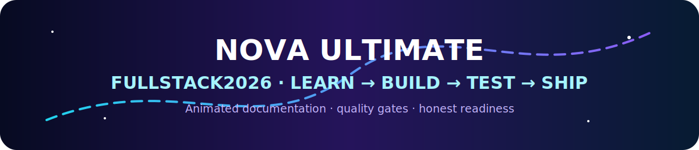
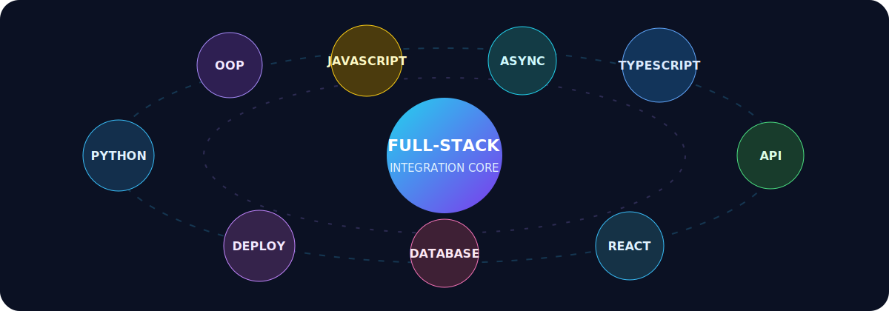
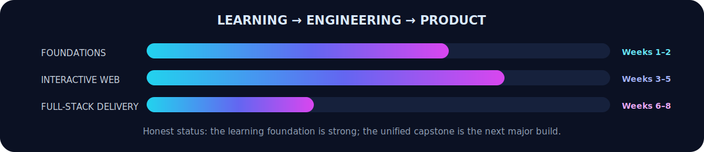
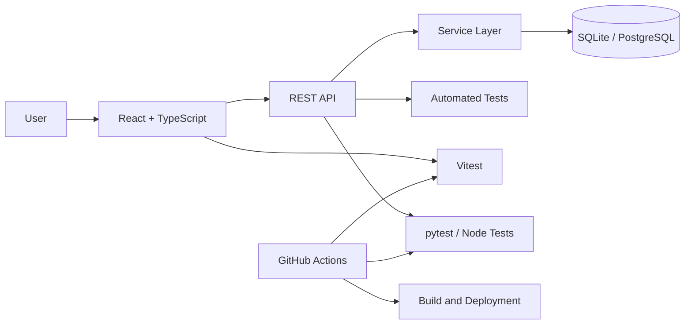

<div align="center">



<br>

[](https://github.com/LiriothTeltanion/Fullstack2026)
[](https://github.com/LiriothTeltanion/Fullstack2026/commits/main)
[](https://github.com/LiriothTeltanion/Fullstack2026)
[](LICENSE)
[](https://github.com/LiriothTeltanion)

### A progressive full-stack learning archive evolving into a complete product portfolio

**Python · OOP · JavaScript · DOM · HTTP · Async · TypeScript · APIs · React · Databases · Deployment**

</div>

<!-- NOVA:HEALTH-CENTER:START -->
<div align="center">





[](reports/nova/nova_repo_dashboard.html)
[](.github/workflows/quality.yml)
[](reports/nova/nova_repo_dashboard.html)
[](tests/)

</div>

## 🧭 Live Repository Health

| Category | Readiness | State |
|---|---:|---|
| 🟢 Learning breadth | **100.0%** | Ready |
| 🟢 Documentation | **100.0%** | Ready |
| 🟢 Structure | **100.0%** | Ready |
| 🟠 Code health | **60.0%** | Developing |
| 🟢 Testing | **100.0%** | Ready |
| 🟢 Tooling | **100.0%** | Ready |
| 🟠 Automation | **60.0%** | Developing |
| 🟢 Portfolio | **100.0%** | Ready |

| Repository metric | Current value |
|---|---:|
| Overall readiness | **92.0%** |
| Files | 1012 |
| Source files | 217 |
| Tests | 14 |
| Curriculum directories | 250 |
| README coverage | **100.0%** |
| Blocking quality errors | 2 |
| Possible current-tree secrets | 1 |

### 🟢 Good now

- ✅ Six curriculum weeks are present without counting ZIP archives as modules.
- ✅ README coverage is 100.0% across curriculum directories.
- ✅ All Python files pass static syntax parsing.
- ✅ GitHub Actions quality workflow is installed with read-only repository access.
- ✅ 14 automated test file(s) are discoverable.
- ✅ Redundant Week ZIP archives are absent from the repository root.

### 🔴 / 🟠 Still needs attention

- ⚠️ 1 possible credential assignment(s) remain; rotate and remove them.
- ⚠️ package-lock.json is still missing; run npm install before pushing.
- ⚠️ The last whole-repository quality gate reported 2 error(s).

> **Interpretation:** Weighted repository-readiness heuristic; not a course grade and not proof every interactive or external-API program ran.
>
> Open the colorful offline dashboard at [`reports/nova/nova_repo_dashboard.html`](reports/nova/nova_repo_dashboard.html).

<sub>Generated by NOVA Ultimate v2.0.0 · 2026-07-15T06:23:15+03:00</sub>
<!-- NOVA:HEALTH-CENTER:END -->

---

## 🧭 Navigation

[About](#-what-fullstack2026-is) ·
[Snapshot](#-live-repository-snapshot) ·
[Learning path](#-learning-architecture) ·
[Projects](#-selected-projects-and-challenges) ·
[Setup](#-quick-start) ·
[Quality](#-engineering-quality-workflow) ·
[Roadmap](#-2026-roadmap) ·
[Capstone](#-proposed-capstone--nova-learning-dashboard) ·
[Languages](#-multilingual-summary)

---

## ✨ What Fullstack2026 is

`Fullstack2026` is my practical development-learning repository and the technical foundation of my software portfolio.

It is not a collection of empty demonstrations. It contains progressive exercises, daily challenges, interactive browser work and increasingly structured mini-projects that document the transition from programming fundamentals toward full-stack product engineering.

### What this repository demonstrates

- 🐍 **Programming foundations:** Python syntax, data structures, functions and problem decomposition
- 🏗️ **Object-oriented design:** classes, inheritance, encapsulation, modularity and reusable models
- 🌐 **Browser engineering:** JavaScript, DOM manipulation, forms, events and accessible interaction
- ⚡ **Asynchronous workflows:** HTTP requests, promises, validation and resilient error states
- 🔷 **Type safety:** TypeScript unions, interfaces, classes, guards and safer domain modeling
- 🧪 **Engineering discipline:** linting, formatting, tests, documentation and version-control hygiene
- 🚀 **Product direction:** planned backend, React, database, authentication, CI and deployment layers

> **Honest current status:** the repository is already a strong learning archive with real exercises and mini-projects. It is not yet one unified production application. Building that integrated capstone is the next major milestone.

---

## 📊 Live repository snapshot

| Metric | Current local value |
|---|---:|
| Working branch | `main` |
| Current revision | `fd10e5e` |
| Local commit count | 283 |
| Tracked files | 375 |
| Week folders detected | 6 |
| Project/challenge candidates detected | 40 |
| Last commit date | 2025-10-21 |
| Last commit message | Move StarWarsWebApp out of Exercises directory |
| README generated | 2026-07-14 |

**Most common tracked extensions:** `.md` 125 · `.py` 70 · `.js` 60 · `.html` 42 · `.json` 14 · `.ts` 12 · `.css` 12 · `.gitignore` 10 · `.wav` 9 · `.txt` 8

> Repository statistics above are generated by `NOVA Fullstack2026 README Studio` from the local Git history and tracked files.

---

## 🪐 Learning architecture



| Module | Main focus | Status |
|---|---|---|
| [Week1Python](Week1Python/) | Python syntax, data structures, control flow, functions and foundational projects. | ✅ Present |
| [Week2OOP](Week2OOP/) | Object-oriented programming, modules, files, JSON, APIs and reusable design. | ✅ Present |
| [Week3JavaScriptandDOM](Week3JavaScriptandDOM/) | Modern JavaScript, DOM manipulation, events and interactive browser interfaces. | ✅ Present |
| [Week4AdvAsynchronousJavaScript](Week4AdvAsynchronousJavaScript/) | Advanced arrays/objects, HTTP forms, promises and asynchronous workflows. | ✅ Present |
| [Week5MiniProjectAndTypeScript](Week5MiniProjectAndTypeScript/) | Mini-projects and TypeScript: unions, interfaces, classes and type guards. | ✅ Present |
| [Week6DatabasesAndNodejs](Week6DatabasesAndNodejs/) | Progressive exercises, challenges and practical integration work. | ✅ Present |
| **Week6 — planned** | Backend fundamentals, routing, REST APIs, validation and service structure. | 🧭 Roadmap |
| **Week7 — planned** | React + TypeScript frontend, state, reusable components and API integration. | 🧭 Roadmap |
| **Week8 — planned** | Database persistence, authentication, automated testing and deployment. | 🧭 Roadmap |

### Target outcomes

By completing the full roadmap, this repository should prove the ability to:

1. Design and explain clear algorithms.
2. Build maintainable Python and TypeScript modules.
3. Create interactive browser interfaces.
4. consume and expose HTTP APIs.
5. Model persistent data safely.
6. Test, document and automate software workflows.
7. Deploy an integrated full-stack product.

---

## 🌟 Selected projects and challenges

| Module | Project or challenge | What it practices |
|---|---|---|
| Week1Python | [DailyChallenge](Week1Python/Day1StartingwithPython/DailyChallenge/) | Focused daily challenge designed to reinforce the module through independent problem solving. |
| Week1Python | [DailyChallenge](Week1Python/Day2ListsIteratingAndFormattingData/DailyChallenge/) | Focused daily challenge designed to reinforce the module through independent problem solving. |
| Week1Python | [DailyChallenge](Week1Python/Day3Dictionaries/DailyChallenge/) | Focused daily challenge designed to reinforce the module through independent problem solving. |
| Week1Python | [DailyChallenge](Week1Python/Day4Functions/DailyChallenge/) | Focused daily challenge designed to reinforce the module through independent problem solving. |
| Week1Python | [Day5MiniProject](Week1Python/Day5MiniProject/) | Integrated mini-project combining the core concepts of its week in a practical browser experience. |
| Week1Python | [DailyChallenge](Week1Python/Day5MiniProject/DailyChallenge/) | Focused daily challenge designed to reinforce the module through independent problem solving. |
| Week2OOP | [DailyChallenge](Week2OOP/Day1IntroductiontoOOP/DailyChallenge/) | Focused daily challenge designed to reinforce the module through independent problem solving. |
| Week2OOP | [DailyChallenge](Week2OOP/Day2OOPInheritanceEncapsulationPolymorphism/DailyChallenge/) | Focused daily challenge designed to reinforce the module through independent problem solving. |
| Week2OOP | [DailyChallenge](Week2OOP/Day3OOPandModules/DailyChallenge/) | Focused daily challenge designed to reinforce the module through independent problem solving. |
| Week2OOP | [DailyChallenge](Week2OOP/Day4PythonFileIOJSONandAPI/DailyChallenge/) | Focused daily challenge designed to reinforce the module through independent problem solving. |
| Week2OOP | [Day5MiniProject](Week2OOP/Day5MiniProject/) | Integrated mini-project combining the core concepts of its week in a practical browser experience. |
| Week2OOP | [DailyChallenge](Week2OOP/Day5MiniProject/DailyChallenge/) | Focused daily challenge designed to reinforce the module through independent problem solving. |
| Week2OOP | [DailyChallenge](Week2OOP/RemoteLearningOOP/DailyChallenge/) | Focused daily challenge designed to reinforce the module through independent problem solving. |
| Week2OOP | [MiniProjectVaccines](Week2OOP/RemoteLearningOOP/Exercises/MiniProjectVaccines/) | Integrated mini-project combining the core concepts of its week in a practical browser experience. |
| Week3JavaScriptandDOM | [DailyChallenge](Week3JavaScriptandDOM/Day1IntroductiontoJavaScript/DailyChallenge/) | Focused daily challenge designed to reinforce the module through independent problem solving. |
| Week3JavaScriptandDOM | [DailyChallengeNotBad](Week3JavaScriptandDOM/Day1IntroductiontoJavaScript/DailyChallenge/DailyChallengeNotBad/) | Focused daily challenge designed to reinforce the module through independent problem solving. |
| Week3JavaScriptandDOM | [DailyChallengeStars](Week3JavaScriptandDOM/Day1IntroductiontoJavaScript/DailyChallenge/DailyChallengeStars/) | Focused daily challenge designed to reinforce the module through independent problem solving. |
| Week3JavaScriptandDOM | [DailyChallenge](Week3JavaScriptandDOM/Day2FunctionsandDOMIntroduction/DailyChallenge/) | Focused daily challenge designed to reinforce the module through independent problem solving. |
| Week3JavaScriptandDOM | [DailyChallengePlanets](Week3JavaScriptandDOM/Day2FunctionsandDOMIntroduction/DailyChallenge/DailyChallengePlanets/) | Focused daily challenge designed to reinforce the module through independent problem solving. |
| Week3JavaScriptandDOM | [DailyChallenge](Week3JavaScriptandDOM/Day3LearningDOMEvents/DailyChallenge/) | Focused daily challenge designed to reinforce the module through independent problem solving. |

The repository also contains XP exercises, Gold/Ninja extensions and focused daily challenges inside the week structure.

---

## 🧬 Technology constellation



| Layer | Current and planned technologies |
|---|---|
| Foundations | Python, object-oriented programming, JSON and file workflows |
| Browser | HTML, CSS, JavaScript, DOM, events, forms and browser DevTools |
| Typed development | TypeScript, interfaces, unions, classes and type guards |
| Tooling | Node.js, npm, ESLint, Prettier, Git and GitHub |
| Planned backend | FastAPI or Express, REST APIs and structured validation |
| Planned frontend | React + TypeScript |
| Planned persistence | SQLite first, optional PostgreSQL migration |
| Planned delivery | Automated tests, GitHub Actions and public deployment |

---

## ⚡ Quick start

### Clone into a short local development path

```powershell
New-Item -ItemType Directory -Force C:\Dev | Out-Null
git clone https://github.com/LiriothTeltanion/Fullstack2026.git C:\Dev\Fullstack2026
Set-Location C:\Dev\Fullstack2026
```

### Install the root JavaScript tooling

```powershell
npm install
npm run format:check
npm run lint
npm test
```

### Run material by module

```powershell
# Python
python .\Week1Python\path\to\exercise.py

# Static browser project
python -m http.server 8000

# TypeScript through npx
npx ts-node .\path\to\exercise.ts

# Compile TypeScript
npx tsc
```

> Use an active Node.js LTS release for the most predictable dependency compatibility. Use a Python virtual environment whenever a module introduces external packages.

---

## 🧰 Available npm commands

| Command | Purpose |
|---|---|
| `npm run lint` | Audit JavaScript and TypeScript sources with ESLint. |
| `npm run lint:fix` | Apply ESLint autofixes; review the resulting diff. |
| `npm run format` | Format supported source files with Prettier. |
| `npm run format:check` | Verify formatting without modifying files. |
| `npm run test` | Run the built-in Node test runner. |
| `npm run dev` | Placeholder until a unified development application exists. |
| `npm run build` | Placeholder until a deployable integrated application exists. |

> `dev` and `build` are currently placeholders. They should become real commands when the repository gains a unified application or capstone workspace.

---

## 📁 Repository organization

```text
Fullstack2026/
├─ Week1Python/
├─ Week2OOP/
├─ Week3JavaScriptandDOM/
├─ Week4AdvAsynchronousJavaScript/
├─ Week5MiniProjectAndTypeScript/
├─ assets/
│  └─ readme/
│     ├─ nova-fullstack-banner.svg
│     ├─ learning-orbit.svg
│     └─ stack-pulse.svg
├─ package.json
├─ .gitignore
├─ LICENSE
└─ README.md
```

### Conventions

- Week and topic folders use readable, descriptive names.
- Python prefers `snake_case`, clear functions and focused modules.
- JavaScript and TypeScript use consistent project-level naming.
- Generated dependencies, caches and build output stay outside Git history.
- The selected package manager should have exactly one tracked lockfile.
- Exercise-specific documentation should live close to the relevant code.
- Larger structural changes should use a dedicated branch and pull request.

---

## ✅ Engineering quality workflow

### Safe pre-commit review

```powershell
npm run format:check
npm run lint
npm test
git status
```

### Deliberate automatic corrections

```powershell
npm run format
npm run lint:fix
git diff
```

Review every generated diff before committing.

### Recommended CI pipeline

A future `.github/workflows/quality.yml` should run:

1. Dependency installation with the tracked lockfile
2. Prettier format verification
3. ESLint
4. Node tests
5. Python tests when pytest coverage is added
6. Build verification once `build` becomes real

---

## 🚦 Current strengths and known gaps

### Strengths

- [x] Progressive Python learning material
- [x] Object-oriented programming exercises
- [x] JavaScript and DOM applications
- [x] HTTP and asynchronous JavaScript practice
- [x] TypeScript challenges and mini-projects
- [x] Root linting and formatting workflow
- [x] Multiple interactive browser projects
- [x] Public Git history preserving the learning progression

### Gaps to address

- [ ] Commit the correct package-manager lockfile
- [ ] Add GitHub Actions
- [ ] Remove obsolete imported citation markers from older documentation
- [ ] Expand automated Python and JavaScript/TypeScript testing
- [ ] Replace placeholder `dev` and `build` commands
- [ ] Add backend and database modules
- [ ] Build an integrated React frontend
- [ ] Deploy one complete capstone application
- [ ] Add screenshots, short demos and accessibility notes to the strongest projects

---

## 🚀 2026 roadmap

### Phase 1 — Stabilize Weeks 1–5

- Run all available formatting, linting and tests
- Repair broken project links and stale documentation
- Normalize project-level README files
- Add screenshots to the strongest browser projects
- Track one lockfile
- Add CI

### Phase 2 — Week 6: Backend engineering

- Build REST endpoints
- Add request/response validation
- Separate routes, services and domain logic
- Add structured error handling
- Add automated backend tests

### Phase 3 — Week 7: React + TypeScript

- Build reusable UI components
- Add routing and state management
- Connect to the backend API
- Add loading, empty and error states
- Apply accessibility and responsive design

### Phase 4 — Week 8: Persistence and delivery

- Add SQLite persistence
- Introduce authentication
- Add integration tests
- Containerize or package the application
- Deploy frontend and backend
- Document the complete architecture

---

## 🏆 Proposed capstone — Nova Learning Dashboard

A complete portfolio application can transform the learning archive into an interactive product.

### Core experience

- User authentication
- Progress tracking by week and day
- Searchable exercise and project catalog
- Completion status and personal notes
- Direct links to source code and live demos
- Skills and technology visualization
- Responsive dashboard design

### Proposed architecture



### Definition of done

- Frontend and backend both run from documented commands
- Authentication and persistent progress work
- Automated tests pass
- CI validates every pull request
- Public deployment is available
- README includes architecture, screenshots and live links
- The project is strong enough to present in a technical interview

---

## 🔐 Version-control hygiene

- Never commit `.env`, API keys or credentials.
- Ignore generated dependencies and caches.
- Commit one package-manager lockfile.
- Keep commits focused and descriptive.
- Use branches for structural work.
- Review pull-request diffs before merging.
- Tag stable milestones and releases.

---

## 🌍 Multilingual summary

<details>
<summary><strong>🇻🇪 Resumen en español</strong></summary>

### ¿Qué es Fullstack2026?

Es mi repositorio principal de aprendizaje práctico de desarrollo full-stack. Conserva ejercicios reales, retos diarios y mini proyectos desde Python y programación orientada a objetos hasta JavaScript, DOM, asincronía y TypeScript.

La siguiente etapa consiste en convertir esta base educativa en un producto completo: backend, React, base de datos, autenticación, pruebas, integración continua y despliegue.

**Objetivo final:** demostrar no solo que sé resolver ejercicios, sino también que puedo diseñar, construir, probar, documentar y publicar una aplicación full-stack completa.

</details>

<details>
<summary><strong>🇮🇱 סיכום בעברית</strong></summary>

### מהו Fullstack2026?

זהו מאגר הלמידה המעשי המרכזי שלי לפיתוח Full-Stack. המאגר כולל תרגילים, אתגרים יומיים ומיני־פרויקטים ב-Python, תכנות מונחה עצמים, JavaScript, DOM, עבודה אסינכרונית ו-TypeScript.

השלב הבא הוא להפוך את בסיס הלמידה למוצר מלא: Backend, ממשק React, מסד נתונים, אימות משתמשים, בדיקות אוטומטיות, CI ופריסה ציבורית.

**המטרה הסופית:** להראות שאני מסוגל לא רק לפתור תרגילים, אלא גם לתכנן, לבנות, לבדוק, לתעד ולפרסם אפליקציית Full-Stack מלאה.

</details>

---

## 👨‍💻 Maintainer

**Kevin Cusnir** — `LiriothTeltanion`

- GitHub: [github.com/LiriothTeltanion](https://github.com/LiriothTeltanion)
- Repository: [Fullstack2026](https://github.com/LiriothTeltanion/Fullstack2026)
- Focus: full-stack development, AI-assisted engineering, practical automation and creative software

---

## 📜 License

Distributed under the [MIT License](LICENSE).

---

<div align="center">

### Build steadily. Document honestly. Turn learning into products.

**README edition 3.0 · Generated 2026-07-14**

</div>
