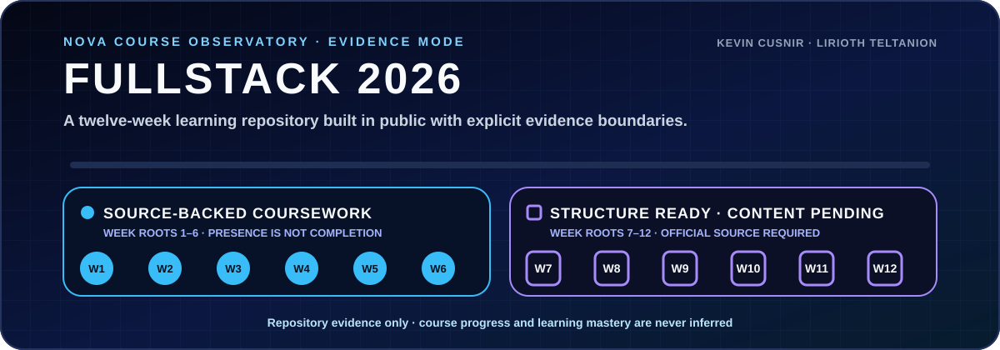
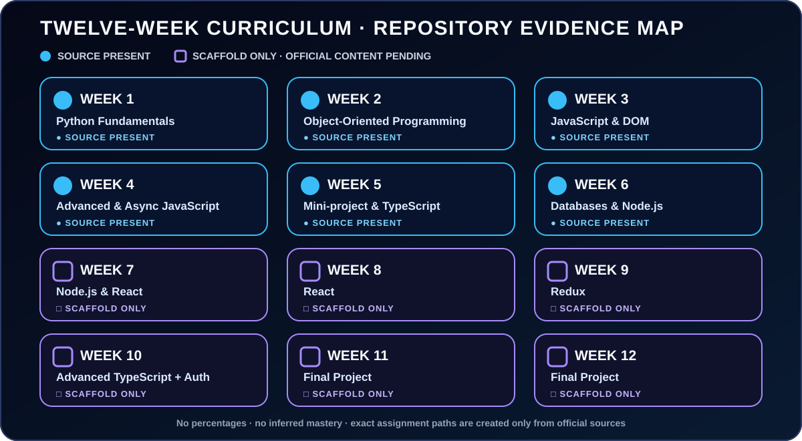
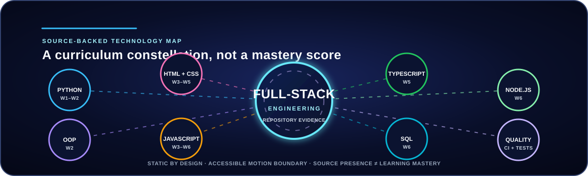

<div align="center">



<br>

[](https://github.com/LiriothTeltanion/Fullstack2026)
[](https://github.com/LiriothTeltanion/Fullstack2026/actions/workflows/quality.yml)
[](https://github.com/LiriothTeltanion/Fullstack2026/commits/main)
[](https://github.com/LiriothTeltanion/Fullstack2026)
[](LICENSE)
[](.learning/PROGRESS.md)
[](tests/)
[](SECURITY.md)

### A twelve-week full-stack course repository with source-backed work, evidence-led scaffolds, and an honest portfolio runway

**Python · OOP · JavaScript · DOM · Async/Await · TypeScript · SQL · Node.js · React · Redux · Authentication · Final Project**

<sub>Repository presentation version <strong>1.2.0</strong> · root README protected as the public GitHub landing page</sub>

</div>

---

## 🧭 Explore the repository

[Overview](#-repository-overview) ·
[Evidence](#-current-course-evidence) ·
[Transformation](#-from-learning-archive-to-engineering-portfolio) ·
[Twelve weeks](#-the-twelve-week-learning-journey) ·
[Projects](#-portfolio-project-highlights) ·
[Stack](#-technology-constellation) ·
[Run](#-quick-start) ·
[Quality](#-quality-testing-and-automation) ·
[Roadmap](#-next-horizon) ·
[Reports](#-reports-and-transparency) ·
[Changelog](CHANGELOG.md)

---

## ✨ Repository overview

`Fullstack2026` documents my twelve-week progression from programming fundamentals to practical full-stack engineering.

Weeks 1–6 contain recovered exercises, XP extensions, daily challenges, timed challenges, browser applications, object-oriented models, API integrations, TypeScript exercises, PostgreSQL work, and Node.js modules. Weeks 7–12 are intentionally limited to source-boundary READMEs until their exact official assignments are reviewed.

This repository is designed to show more than completed assignments. It demonstrates how I:

- break problems into smaller functions and modules;
- improve early solutions without hiding the learning process;
- organize code by week, day, exercise type, and project;
- document goals, execution paths, strengths, and next improvements;
- protect secrets and generated artifacts;
- add deterministic tests around representative projects;
- use GitHub Actions and repeatable quality commands;
- turn a learning archive into an interview-ready engineering portfolio.

> **Honest scope:** a tracked Week root is not proof of completed coursework or learning. Repository evidence, Octopus progress, and demonstrated understanding remain separate. The next major product milestone is the official final-project brief—not an invented capstone.

---

## 🧭 Current course evidence

| Course segment | Public repository evidence | Learning evidence | Current boundary |
|---|---|---|---|
| Weeks 1–6 | Source files and local assignment documentation are present. | `unknown` except for separately recorded bounded exercises. | Runtime, browser, SQL, dependency, and accessibility coverage remains partial. |
| Weeks 7–10 | Canonical root and source-boundary README are present. | `unknown` | Official days, exercises, challenges, and submission rules are pending. |
| Weeks 11–12 | Canonical final-project root and source-boundary README are present. | `unknown` | Official brief, rubric, milestones, deployment, and presentation requirements are pending. |

> **Latest bounded checkpoint:** [Week 1 · Day 1](Week1Python/Day1StartingwithPython/) repository behavior is verified for [Exercises XP 1–9](Week1Python/Day1StartingwithPython/Exercises/ExercisesXP/), [XP Gold 1–2](Week1Python/Day1StartingwithPython/Exercises/ExercisesXPGold/), and [XP Ninja 1–5](Week1Python/Day1StartingwithPython/Exercises/ExercisesXPNinja/) by 23 focused tests. The [Daily Challenge](Week1Python/Day1StartingwithPython/DailyChallenge/) matches the official prompt reviewed read-only on 2026-09-11 and passes 5 additional tests. Kevin's learning, Octopus submission, checker response, instructor review, and grade remain `UNVERIFIED`.

The machine-readable source of truth is [`.learning/course-map.yml`](.learning/course-map.yml). Human-facing icons and readable labels are defined separately in [`.learning/display-map.json`](.learning/display-map.json), so the stable Git paths never need emoji. The sanitized academy review is [`reports/resume/ACADEMY_ALIGNMENT_2026-08-24.md`](reports/resume/ACADEMY_ALIGNMENT_2026-08-24.md).

### Historical audited repository baseline — 2026-07-15 (Weeks 1–6 only)

<!-- NOVA:ROOT-LIVE-SNAPSHOT:START -->
| Metric | Audited baseline |
|---|---:|
| Overall readiness | **92.0%** |
| Source-backed Week roots in that snapshot | **6** |
| Files scanned | **1,012** |
| Repository size | **3.4 MB** |
| Text lines | **60,948** |
| Source files | **217** |
| Documentation files | **276** |
| Automated test files | **14** |
| Curriculum directories | **250** |
| README coverage | **100.0%** |
| Python syntax errors | **0** |
| Root source archives | **0** |
| Last quality-gate errors | **2** |
| Last quality-gate warnings | **68** |

### Readiness by category

| Category | Score | State |
|---|---:|---|
| 🟢 Learning breadth | **100.0%** | Ready |
| 🟢 Documentation | **100.0%** | Ready |
| 🟢 Structure | **100.0%** | Ready |
| 🟠 Code health | **60.0%** | Developing |
| 🟢 Testing | **100.0%** | Ready |
| 🟢 Tooling | **100.0%** | Ready |
| 🟠 Automation | **60.0%** | Developing |
| 🟢 Portfolio | **100.0%** | Ready |

<table>
<tr>
<td width="50%" valign="top"><h4>🟢 Verified strengths</h4><ul><li>✅ Six source-backed Week roots were present without counting ZIP archives as modules.</li><li>✅ README coverage was 100.0% across the then-audited curriculum directories.</li><li>✅ All Python files passed static syntax parsing.</li><li>✅ GitHub Actions quality workflow was installed with read-only repository access.</li><li>✅ 14 automated test file(s) were discoverable.</li><li>✅ Redundant Week ZIP archives were absent from the repository root.</li></ul></td>
<td width="50%" valign="top"><h4>🛰️ Release 1.1 validation context</h4><ul><li>✅ <code>package-lock.json</code> is present for reproducible <code>npm ci</code> installs.</li><li>✅ The current no-write quality gate passes with 0 errors and 0 warnings.</li><li>ℹ️ The 2 errors and 68 warnings in the table are preserved historical evidence from the dated audit, not claims about the current validation run.</li></ul></td>
</tr>
</table>

> The **92.0%** readiness score and **14 automated test files** are preserved from the dated six-root audit. They are historical repository-maintainability evidence—not current course progress, a bootcamp grade, or proof that every interactive, SQL, browser, or external-API exercise was executed.

<sub>Snapshot generated by NOVA Ultimate v2.0.0 on 2026-07-15T06:23:15+03:00.</sub>
<!-- NOVA:ROOT-LIVE-SNAPSHOT:END -->

---

## 🚀 From learning archive to engineering portfolio

The NOVA stabilization pass preserved the original exercises while improving the repository around them.

| Area | Earlier audit | Post-upgrade baseline (2026-07-15) |
|---|---:|---:|
| Overall readiness | **43.8%** | **92.0%** |
| README coverage | **75%** | **100%** |
| Discoverable test files | **1** | **14** |
| Python syntax errors | **5** | **0** |
| Curriculum modules | ZIP files incorrectly inflated the count | **6 real week modules** |
| Root source archives | **2 ZIP files** | **0** |
| CI | Missing | Installed |
| Portable paths | Multiple inconsistent names | Canonicalized |
| Security configuration | Hardcoded credential patterns | Local configuration templates and security guidance |
| Repository tooling | Partial | Audit, quality gate, tests, rollback, updater, and reports |

### What the upgrade added

- structured README coverage throughout the recovered curriculum;
- a central offline health dashboard;
- Python and Node test infrastructure;
- tests for Tic-Tac-Toe, Hangman, Circle, Timer, math helpers, and repository contracts;
- a read-only GitHub Actions quality workflow;
- Dependabot configuration;
- repeatable npm commands for quality, tests, audit, development, and documentation;
- normalized Week, Day, exercise-tier, and challenge paths;
- removal of redundant source ZIPs;
- `.env.example`, local browser configuration guidance, and `SECURITY.md`;
- reversible NOVA backup and rollback tooling.

---

## 🪐 The twelve-week learning journey

<div align="center">



</div>

| Week | Course title | Repository evidence | Learning state |
|---|---|---|---|
| [🐍 Week 1](Week1Python/) | Python Fundamentals | Source present; selected bounded tests exist. | `unknown` |
| [🏗️ Week 2](Week2OOP/) | Object-Oriented Programming | Source present; selected bounded tests exist. | `unknown` |
| [🌐 Week 3](Week3JavaScriptandDOM/) | JavaScript & DOM | Source present; browser and accessibility execution is pending. | `unknown` |
| [⚡ Week 4](Week4AdvAsynchronousJavaScript/) | Advanced & Asynchronous JavaScript | Source present; async/browser behavior remains partially unverified. | `unknown` |
| [🔷 Week 5](Week5MiniProjectAndTypeScript/) | Mini-project & TypeScript | Source present; live API and strict TypeScript gaps remain. | `unknown` |
| [🗄️ Week 6](Week6DatabasesAndNodejs/) | Databases & Node.js | Source present; SQL execution and broader Node verification remain. | `unknown` |
| [🔗 Week 7](Week7NodejsAndReact/) | Node.js & React | Scaffold only; official content pending. | `unknown` |
| [⚛️ Week 8](Week8React/) | React | Scaffold only; official content pending. | `unknown` |
| [🔁 Week 9](Week9Redux/) | Redux | Scaffold only; official content pending. | `unknown` |
| [🛡️ Week 10](Week10AdvancedTypeScriptAndAuthentication/) | Advanced TypeScript and Authentication | Scaffold only; official content pending. | `unknown` |
| [🛠️ Week 11](Week11FinalProject/) | Final Project | Scaffold only; official brief pending. | `unknown` |
| [🚀 Week 12](Week12FinalProject/) | Final Project | Scaffold only; official continuation and delivery requirements pending. | `unknown` |

> **Display-title contract:** icons are navigation aids, not folder-name characters.
> The readable title map covers every top-level repository area, all twelve week
> roots, and every current Day/Remote root. Physical paths remain portable ASCII
> so commands, links, imports, Windows tools, CI, and Octopus submissions keep working.

<details>
<summary><strong>🐍 Week 1 — Python foundations</strong></summary>

| Day | Focus | Main folder |
|---|---|---|
| Day 1 | Variables, data types, operators, input/output, conditionals | [Starting with Python](Week1Python/Day1StartingwithPython/) |
| Day 2 | Lists, tuples, sets, loops, iteration, formatting | [Lists and iteration](Week1Python/Day2ListsIteratingAndFormattingData/) |
| Day 3 | Dictionaries, nested structures, transformations, timed challenges | [Dictionaries](Week1Python/Day3Dictionaries/) |
| Day 4 | Functions, parameters, return values, scope, reusable logic | [Functions](Week1Python/Day4Functions/) |
| Day 5 | Algorithms and complete command-line mini-projects | [Mini projects](Week1Python/Day5MiniProject/) |

**Representative work:** [Build Up a String](Week1Python/Day1StartingwithPython/DailyChallenge/BuildUpAString/) · [Happy Birthday](Week1Python/Day2ListsIteratingAndFormattingData/DailyChallenge/GoldHappyBirthday/) · [Caesar Cipher](Week1Python/Day3Dictionaries/DailyChallenge/CaesarCypher/) · [Solve the Matrix](Week1Python/Day4Functions/DailyChallenge/SolveTheMatrix/) · [Hangman](Week1Python/Day5MiniProject/Exercises/Hangman/) · [Tic-Tac-Toe](Week1Python/Day5MiniProject/Exercises/TicTacToe/)

**Outcome:** problem decomposition, input validation, algorithms, functions, collections, and interactive Python programs.

</details>

<details>
<summary><strong>🏗️ Week 2 — Object-oriented Python</strong></summary>

| Day | Focus | Main folder |
|---|---|---|
| Day 1 | Classes, objects, constructors, instance behavior | [Introduction to OOP](Week2OOP/Day1IntroductiontoOOP/) |
| Day 2 | Inheritance, encapsulation, polymorphism | [Inheritance and polymorphism](Week2OOP/Day2OOPInheritanceEncapsulationPolymorphism/) |
| Day 3 | Modules, packages, properties, dunder methods | [OOP and modules](Week2OOP/Day3OOPandModules/) |
| Day 4 | File I/O, JSON, exceptions, external APIs | [Files, JSON and APIs](Week2OOP/Day4PythonFileIOJSONandAPI/) |
| Day 5 | Separated domain logic, CLI flows, reusable mini-projects | [OOP mini projects](Week2OOP/Day5MiniProject/) |
| Remote | Larger simulations and data-model exercises | [Remote OOP work](Week2OOP/RemoteLearningOOP/) |

**Representative work:** [Pagination](Week2OOP/Day2OOPInheritanceEncapsulationPolymorphism/DailyChallenge/Pagination/) · [Circle](Week2OOP/Day3OOPandModules/DailyChallenge/Circle/) · [Text Analysis](Week2OOP/Day4PythonFileIOJSONandAPI/DailyChallenge/TextAnalysis/) · [Anagram Checker](Week2OOP/Day5MiniProject/Exercises/AnagramChecker/) · [Rock Paper Scissors](Week2OOP/Day5MiniProject/Exercises/RockPaperScissors/) · [Weather App](Week2OOP/Day5MiniProject/Exercises/WeatherApp/) · [OOP Quiz](Week2OOP/Day5MiniProject/DailyChallenge/OOPQuiz/) · [Air Management](Week2OOP/RemoteLearningOOP/DailyChallenge/AirManagement/)

**Outcome:** reusable classes, separated responsibilities, domain rules, files, JSON, APIs, and testable models.

</details>

<details>
<summary><strong>🌐 Week 3 — JavaScript and the DOM</strong></summary>

| Day | Focus | Main folder |
|---|---|---|
| Day 1 | JavaScript syntax, arrays, objects, conditions, loops | [Introduction to JavaScript](Week3JavaScriptandDOM/Day1IntroductiontoJavaScript/) |
| Day 2 | Functions, DOM selection, dynamic rendering | [Functions and DOM](Week3JavaScriptandDOM/Day2FunctionsandDOMIntroduction/) |
| Day 3 | Events, forms, interaction, timers, movement | [DOM events](Week3JavaScriptandDOM/Day3LearningDOMEvents/) |
| Day 4 | Advanced functions, object workflows, higher-order patterns | [Advanced JavaScript](Week3JavaScriptandDOM/Day4AdvancedJavaScriptFunctions/) |
| Day 5 | Interactive browser mini-projects | [Mini projects](Week3JavaScriptandDOM/Day5MiniProject/) |
| Remote | Focused browser exercises and games | [Remote JavaScript and DOM](Week3JavaScriptandDOM/RemoteLearningJSAndDOM/) |

**Representative work:** [Solar System](Week3JavaScriptandDOM/Day2FunctionsandDOMIntroduction/DailyChallenge/DailyChallengePlanets/) · [Mad Libs](Week3JavaScriptandDOM/Day3LearningDOMEvents/DailyChallenge/TellTheStory/) · [Todo List](Week3JavaScriptandDOM/Day5MiniProject/DailyChallenge/TodoList/) · [Coloring Game](Week3JavaScriptandDOM/Day5MiniProject/Exercises/MiniProjectColoringGame/) · [Drum Set](Week3JavaScriptandDOM/Day5MiniProject/Exercises/drumset-mini/) · [Whack-a-Mole](Week3JavaScriptandDOM/RemoteLearningJSAndDOM/Exercises/ExercisesXP1/exercise4_whack_a_mole/)

**Outcome:** interactive browser experiences through DOM updates, forms, events, state, audio, timers, and responsive feedback.

</details>

<details>
<summary><strong>⚡ Week 4 — Advanced and asynchronous JavaScript</strong></summary>

| Day | Focus | Main folder |
|---|---|---|
| Day 1 | Advanced array methods and transformations | [Advanced array methods](Week4AdvAsynchronousJavaScript/Day1AdvancedArrayMethods/) |
| Day 2 | Object methods, destructuring, classes | [Advanced object methods](Week4AdvAsynchronousJavaScript/Day2AdvancedObjectMethods/) |
| Day 3 | GET/POST forms, JSON, HTTP-oriented interfaces | [HTTP and forms](Week4AdvAsynchronousJavaScript/Day3HTTPAndFormMethodGETAndPOST/) |
| Day 4 | Promises, sequencing, failure handling | [Asynchronous JavaScript](Week4AdvAsynchronousJavaScript/Day4AsynchronousJavaScript/) |
| Day 5 | Fetch, async/await, external data states | [Fetch and async/await](Week4AdvAsynchronousJavaScript/Day5FetchAndAsyncAwait/) |

**Representative work:** [Car Inventory](Week4AdvAsynchronousJavaScript/Day1AdvancedArrayMethods/DailyChallenge/CarInventory/) · [Go Wildcats](Week4AdvAsynchronousJavaScript/Day1AdvancedArrayMethods/DailyChallenge/GoWildcats/) · [HTML Form](Week4AdvAsynchronousJavaScript/Day3HTTPAndFormMethodGETAndPOST/DailyChallenge/HTMLForm/) · [True or False](Week4AdvAsynchronousJavaScript/Day3HTTPAndFormMethodGETAndPOST/DailyChallenge/TrueOrFalse/) · [Random Quote Generator](Week4AdvAsynchronousJavaScript/Day3HTTPAndFormMethodGETAndPOST/Exercises/RandomQuoteGenerator/) · [Play with Words](Week4AdvAsynchronousJavaScript/Day4AsynchronousJavaScript/DailyChallenge/PlayWithWords/)

**Outcome:** data transformations, HTTP flows, promises, async/await, loading states, validation, and recoverable errors.

</details>

<details>
<summary><strong>🔷 Week 5 — Mini projects and TypeScript</strong></summary>

| Day | Focus | Main folder |
|---|---|---|
| Day 1 | API-powered browser portfolio projects | [Mini projects](Week5MiniProjectAndTypeScript/Day1MiniProject/) |
| Day 2 | TypeScript primitives, unions, type-safe functions | [TypeScript key concepts](Week5MiniProjectAndTypeScript/Day2IntroductionToTypeScriptAndKeyConcepts/) |
| Day 3 | Interfaces, classes, access modifiers, domain modeling | [Advanced TypeScript applications](Week5MiniProjectAndTypeScript/Day3AdvancedTypeScriptConceptsAndApplications/) |
| Day 4 | Type guards, unions, generics, safer branching | [Advanced TypeScript guards](Week5MiniProjectAndTypeScript/Day4AdvancedTypeScriptConceptsAndApplications/) |

**Representative work:** [Currency Converter](Week5MiniProjectAndTypeScript/Day1MiniProject/DailyChallenge/CurrencyConverter/) · [Pokédex](Week5MiniProjectAndTypeScript/Day1MiniProject/Exercises/Pokedex/) · [Star Wars Character Finder](Week5MiniProjectAndTypeScript/Day1MiniProject/StarWarsWebApp/) · [Union Type Validator](Week5MiniProjectAndTypeScript/Day2IntroductionToTypeScriptAndKeyConcepts/DailyChallenge/UnionTypeValidator/) · [Library System](Week5MiniProjectAndTypeScript/Day3AdvancedTypeScriptConceptsAndApplications/DailyChallenge/)

**Outcome:** safer application logic through explicit types, interfaces, classes, unions, narrowing, and API-driven browser projects.

</details>

<details>
<summary><strong>🗄️ Week 6 — Databases and Node.js</strong></summary>

| Day | Focus | Main folder |
|---|---|---|
| Day 1 | Relational concepts, schemas, SQL fundamentals | [Introduction to databases](Week6DatabasesAndNodejs/Day1IntroductionToDatabases/) |
| Day 2 | Queries, filtering, aggregation, database reasoning | [Database concepts 1](Week6DatabasesAndNodejs/Day2DatabaseConcepts1/) |
| Day 3 | Relationships, joins, constraints, DVD Rental dataset | [Database concepts 2](Week6DatabasesAndNodejs/Day3DatabaseConcepts2/) |
| Day 4 | CommonJS, ES modules, npm packages, filesystem workflows | [Node.js introduction](Week6DatabasesAndNodejs/Day4NodejsIntroduction/) |

**Representative work:** [SQL XP](Week6DatabasesAndNodejs/Day1IntroductionToDatabases/Exercises/ExercisesXP/) · [DVD Rental relationships](Week6DatabasesAndNodejs/Day3DatabaseConcepts2/Exercises/ExercisesXP/) · [Node.js and npm challenge](Week6DatabasesAndNodejs/Day4NodejsIntroduction/DailyChallenge/NodejsAppAndNPM/) · [CommonJS products](Week6DatabasesAndNodejs/Day4NodejsIntroduction/Exercises/ExercisesXP/exercise-1-commonjs-products/) · [File manager](Week6DatabasesAndNodejs/Day4NodejsIntroduction/Exercises/ExercisesXP/exercise-3-file-manager-commonjs/) · [Todo module](Week6DatabasesAndNodejs/Day4NodejsIntroduction/Exercises/ExercisesXP/exercise-4-esm-todo/) · [Math app](Week6DatabasesAndNodejs/Day4NodejsIntroduction/Exercises/ExercisesXP/exercise-5-math-app/) · [File explorer](Week6DatabasesAndNodejs/Day4NodejsIntroduction/Exercises/ExercisesXP/exercise-7-file-explorer/)

**Outcome:** relational data, PostgreSQL queries, joins, constraints, server-side JavaScript, modules, packages, and filesystem operations.

</details>

<details>
<summary><strong>🛰️ Weeks 7–12 — source-boundary scaffolds</strong></summary>

The remaining week roots are intentionally ready for intake, not populated with invented assignments:

- [🔗 Week 7 — Node.js and React](Week7NodejsAndReact/)
- [⚛️ Week 8 — React](Week8React/)
- [🔁 Week 9 — Redux](Week9Redux/)
- [🛡️ Week 10 — Advanced TypeScript and Authentication](Week10AdvancedTypeScriptAndAuthentication/)
- [🛠️ Week 11 — Final Project](Week11FinalProject/)
- [🚀 Week 12 — Final Project](Week12FinalProject/)

Each README records the same safe workflow: retrieve the exact official source, create only proven paths, preserve Kevin's original work, add bounded verification, and keep repository evidence separate from learning evidence.

</details>

---

## 🌟 Portfolio project highlights

| Project | Technologies | What it demonstrates |
|---|---|---|
| [Hangman](Week1Python/Day5MiniProject/Exercises/Hangman/) | Python | Modular state management, validation, replayable CLI interaction |
| [Tic-Tac-Toe](Week1Python/Day5MiniProject/Exercises/TicTacToe/) | Python | Pure helper functions, board logic, win/tie detection, testability |
| [Circle](Week2OOP/Day3OOPandModules/DailyChallenge/Circle/) | Python OOP | Properties, validation, comparison, arithmetic dunder methods |
| [Page Load Timer](Week2OOP/Day5MiniProject/DailyChallenge/Modules/) | Python, requests | Networking, measurements, aggregation, mocked deterministic tests |
| [Coloring Game](Week3JavaScriptandDOM/Day5MiniProject/Exercises/MiniProjectColoringGame/) | HTML, CSS, JavaScript | Event delegation, responsive grid construction, drawing interaction |
| [Drum Set](Week3JavaScriptandDOM/Day5MiniProject/Exercises/drumset-mini/) | HTML, CSS, JavaScript, audio | Keyboard/mouse interaction, media playback, UI feedback |
| [Random Quote Generator](Week4AdvAsynchronousJavaScript/Day3HTTPAndFormMethodGETAndPOST/Exercises/RandomQuoteGenerator/) | HTML, CSS, JavaScript | State, forms, filtering, navigation, metrics, dynamic rendering |
| [Currency Converter](Week5MiniProjectAndTypeScript/Day1MiniProject/DailyChallenge/CurrencyConverter/) | HTML, CSS, JavaScript, API | Async data, configuration separation, loading/error/result states |
| [Pokédex](Week5MiniProjectAndTypeScript/Day1MiniProject/Exercises/Pokedex/) | HTML, CSS, JavaScript, API | API navigation, visual cards, external data normalization |
| [Star Wars Character Finder](Week5MiniProjectAndTypeScript/Day1MiniProject/StarWarsWebApp/) | HTML, CSS, JavaScript, API | Fetch, response validation, sanitization, animated loading states |
| [Union Type Validator](Week5MiniProjectAndTypeScript/Day2IntroductionToTypeScriptAndKeyConcepts/DailyChallenge/UnionTypeValidator/) | TypeScript | Union types, narrowing, reusable validation |
| [Library System](Week5MiniProjectAndTypeScript/Day3AdvancedTypeScriptConceptsAndApplications/DailyChallenge/) | TypeScript | Interfaces, classes, private/protected fields, inheritance |
| [DVD Rental SQL](Week6DatabasesAndNodejs/Day3DatabaseConcepts2/Exercises/ExercisesXP/) | PostgreSQL | Joins, foreign keys, constraints, cascading deletion, analytical queries |
| [Node Math App](Week6DatabasesAndNodejs/Day4NodejsIntroduction/Exercises/ExercisesXP/exercise-5-math-app/) | Node.js, CommonJS | Reusable pure helpers, package use, automated tests |

---

## 🧬 Technology constellation

<p align="center">
  
</p>

> This static map restores the strongest editorial visual from the earlier
> landing page while making its meaning explicit: the nodes are backed by files
> in this repository; they are not scores, certificates, or mastery claims.

| Layer | Technologies and concepts |
|---|---|
| Programming foundations | Python, strings, numbers, collections, conditionals, loops, functions, algorithms |
| Object-oriented design | Classes, inheritance, encapsulation, polymorphism, properties, dunder methods |
| Browser engineering | HTML5, CSS3, JavaScript, DOM, events, forms, accessibility, responsive behavior |
| Asynchronous workflows | HTTP, JSON, promises, fetch, async/await, loading/error/empty states |
| Type safety | TypeScript, interfaces, unions, classes, access modifiers, type guards |
| Data | SQL, PostgreSQL, joins, constraints, relationships, aggregation |
| Server-side JavaScript | Node.js, CommonJS, ES modules, npm, filesystem utilities |
| Source-confirmed future lanes | React, Redux, advanced TypeScript, authentication, final project; official assignment details pending |
| Quality | Python unittest, Node test runner, static syntax checks, repository contracts |
| Tooling | Git, GitHub, GitHub Desktop, ESLint, Prettier, NOVA automation |
| Delivery foundation | GitHub Actions, Dependabot, repeatable audits, generated reports |

---

## ⚡ Quick start

### Clone and install

```powershell
New-Item -ItemType Directory -Force C:\Dev | Out-Null
git clone https://github.com/LiriothTeltanion/Fullstack2026.git C:\Dev\Fullstack2026
Set-Location C:\Dev\Fullstack2026
npm ci
```

The committed root `package-lock.json` makes `npm ci` reproducible for CI and
future clones. Use `npm install` only when you intentionally update dependencies
and are prepared to review the resulting lockfile diff.

### Capture the next exercise in your own words

```powershell
# Fastest path for one exercise.
npm run intake -- add

# Read-only: show the next public-safe queue item.
npm run intake -- next
```

For many current or future exercises, create the ignored local batch template,
edit it using short summaries written independently by Kevin, preview the exact
public records, and apply only after every item validates:

```powershell
npm run intake -- template
npm run intake -- import .private/intake/kevin-batch.json
npm run intake -- import .private/intake/kevin-batch.json --apply
```

The tool never opens Octopus, copies prompts, exposes LMS progress, creates
exercise folders, or submits work. See the
[source-safe intake quickstart](.learning/intake/README.md) and the broader
[Octopus boundary](.learning/OCTOPUS_INTAKE.md).

### Run the repository quality workflow

```powershell
npm run quality
npm test
npm run audit
```

### Start a local static server

```powershell
npm run dev
```

Then open `http://localhost:8000`.

### Run representative material directly

```powershell
# Python
python .\Week1Python\Day5MiniProject\Exercises\TicTacToe\tictactoe.py

# Python tests
python -m unittest discover -s tests/python -p "test_*.py" -v

# Node tests
node .\tools\run_node_tests.mjs .

# TypeScript syntax validation
node .\tools\check_typescript_syntax.mjs .

# PostgreSQL example
psql -d dvdrental -f .\Week6DatabasesAndNodejs\Day3DatabaseConcepts2\Exercises\ExercisesXP\xp_dvdrental_relationships.sql
```

---

## 🧪 Quality, testing, and automation

### Root npm commands

| Command | Purpose |
|---|---|
| `npm run lint` | Lint JavaScript and TypeScript curriculum sources |
| `npm run lint:baseline` | Verify that ESLint reports exactly the documented 65-finding learning backlog |
| `npm run lint:fix` | Apply supported ESLint fixes for review |
| `npm run typecheck:anchor` | Semantically type-check the strict Union Type Validator project without emitting files |
| `npm run format` | Format JavaScript and TypeScript with Prettier |
| `npm run format:check` | Verify formatting without changing files |
| `npm run syntax` | Run repository-wide static syntax validation |
| `npm run test:python` | Run the Python unit-test suite |
| `npm run test:js` | Run Node and TypeScript-oriented tests |
| `npm test` | Run both JavaScript and Python test suites |
| `npm run quality` | Execute the strict NOVA quality gate |
| `npm run audit` | Regenerate repository health reports |
| `npm run intake -- add` | Preview and add one Kevin-authored, public-safe exercise summary |
| `npm run intake -- next` | Print the next queued summary without changing state |
| `npm run intake:check` | Validate the tracked own-words exercise queue |
| `npm run verify:titles` | Validate icon-led display titles while preserving stable physical paths |
| `npm run verify:structure` | Validate canonical paths, catalogs, visuals, privacy, and display titles |
| `npm run readme:generate` | Regenerate managed folder README sections |
| `npm run dev` | Serve the repository locally on port 8000 |
| `npm run build` | Treat the strict quality gate as the current repository build |

### Automated safeguards

- `.github/workflows/quality.yml` validates pushes and pull requests.
- Python files receive static syntax parsing.
- JavaScript and TypeScript receive automated syntax/tooling checks.
- Representative domain logic is covered by deterministic tests.
- Repository-contract tests verify critical folders, tooling, archives, and documentation.
- The quality gate reports possible secrets, broken links, missing lockfiles, and structural regressions.
- Dependabot checks npm and GitHub Actions dependencies.

### Safe pre-commit routine

```powershell
npm run format:check
npm run lint:baseline
npm run typecheck:anchor
npm run lint
npm run quality
npm test
git status
git diff
```

---

## 📁 Repository organization

### Human-readable project areas

| Display title | Stable physical path |
|---|---|
| [🤖 AI Collaboration Context](.ai/) | `.ai/` |
| [⚙️ GitHub Automation and Templates](.github/) | `.github/` |
| [🎓 Learning Evidence and Course State](.learning/) | `.learning/` |
| [🎨 Visual Assets](assets/) | `assets/` |
| [📊 Audits and Evidence Reports](reports/) | `reports/` |
| [🧪 Automated Tests](tests/) | `tests/` |
| [🛠️ Repository Tools](tools/) | `tools/` |

These icons are display labels only. The exact ASCII paths below remain the
portable source of truth for Windows, Git, commands, links, and CI.

```text
Fullstack2026/
├─ .github/
│  ├─ INTERNAL_GUIDE.md
│  ├─ workflows/
│  └─ dependabot.yml
├─ Week1Python/
├─ Week2OOP/
├─ Week3JavaScriptandDOM/
├─ Week4AdvAsynchronousJavaScript/
├─ Week5MiniProjectAndTypeScript/
├─ Week6DatabasesAndNodejs/
├─ Week7NodejsAndReact/
├─ Week8React/
├─ Week9Redux/
├─ Week10AdvancedTypeScriptAndAuthentication/
├─ Week11FinalProject/
├─ Week12FinalProject/
├─ .ai/
├─ .learning/
├─ assets/readme/
├─ reports/nova/
├─ reports/resume/
├─ tests/python/
├─ tests/js/
├─ tools/
├─ .editorconfig
├─ .env.example
├─ CHANGELOG.md
├─ package.json
├─ pyproject.toml
├─ SECURITY.md
├─ LICENSE
└─ README.md
```

### Conventions

- Display titles may use one topic-led icon; physical paths stay ASCII/PascalCase.
- Week and Day folders use descriptive PascalCase names.
- Exercise tiers remain explicit: XP, XP Plus, XP Gold, and XP Ninja.
- Python source files prefer `snake_case`.
- Dependencies, local configuration, caches, and generated output remain outside Git history.
- Exactly one package-manager lockfile should be committed at the root.
- Structural changes belong on focused branches with reviewable commits.

---

## 🛰️ Next horizon

| Phase | Status | Highest-value evidence still required |
|---|---|---|
| 1 — Truth baseline | ✅ Complete | Preserve the dated baseline; do not convert it into course progress. |
| 2 — Structural foundation | ✅ Complete | Keep catalogs and exact-case paths deterministic as new work arrives. |
| 3 — Academy alignment and 12-week presentation | ✅ Published and remotely verified | Preserve exact paths, evidence boundaries, accessible visuals, and release metadata as coursework evolves. |
| 4 — Weeks 1–6 chronological verification | 🔄 Next | Recheck each day against Kevin's own Octopus understanding and existing code; add bounded execution, accessibility, and explanation evidence. |
| 5 — Weeks 7–10 official coursework | 🎯 Remaining | Retrieve each exact assignment, implement it, verify it, explain it, and submit only through the authorized course workflow. |
| 6 — Weeks 11–12 final project | 🎯 Remaining | Build from the official brief with accessibility, tests, security, documentation, deployment evidence, and a presentation story. |
| 7 — Portfolio release | ⏳ Remaining | Select the strongest work, add real visuals/demos and limitations, then publish only with explicit authorization. |

A bounded 2026-08-24 Octopus navigation snapshot is frozen only in Git-ignored
local manifests. Further authenticated automation and copying of course material
into external AI are paused under the current published Octopus policy unless
Developers Institute grants written permission. The immediate learning action is
to use the own-words intake queue for the first Week 1 / Day 1 checkpoint, compare
it with Kevin's existing source, and then advance chronologically through Weeks
1–6 before starting Week 7. Written policy clarification remains important, and
quizzes, submissions, uploads, enrollments, messages, and profile saves remain
separate approval-gated actions.

---

## 📊 Reports and transparency

| Report | Purpose |
|---|---|
| [Readiness dashboard](reports/nova/nova_repo_dashboard.html) | Interactive offline visual summary |
| [Repository audit](reports/nova/nova_repo_audit.md) | Scores, module metrics, strengths, and remaining risks |
| [Quality report](reports/nova/quality_report.md) | Current quality-gate errors and warnings |
| [Update report](reports/nova/NOVA_UPDATE_REPORT.md) | Full manifest of the automated migration |
| [Academy alignment](reports/resume/ACADEMY_ALIGNMENT_2026-08-24.md) | Sanitized Developers Institute, Octopus, twelve-week, privacy, and phase boundary |
| [Course map](.learning/course-map.yml) | Machine-readable repository and learning evidence states |
| [Folder display map](.learning/display-map.json) | Icon-led human labels mapped to stable ASCII paths |
| [Exercise intake quickstart](.learning/intake/README.md) | One-command own-words queue for current and future exercises |
| [Octopus intake workflow](.learning/OCTOPUS_INTAKE.md) | Credential-safe private inventory, assignment, quiz, and profile boundaries |
| [Visual manifest](assets/readme/visual_manifest.json) | Local SVG provenance, hashes, alt text, motion, and privacy review |
| [Changelog](CHANGELOG.md) | Versioned repository-presentation and quality-maintenance history |
| [Tests](tests/) | Deterministic representative project and repository tests |
| [Tools](tools/) | Audit, quality, test, and documentation automation |
| [GitHub automation guide](.github/INTERNAL_GUIDE.md) | Internal workflow map and root-README protection contract |

The reports intentionally show both green results and remaining work. The goal is credible engineering progress, not a false claim of perfection.

---

## 🔐 Security and version-control hygiene

- Never commit `.env`, `config.js`, API keys, access tokens, or credentials.
- Use `.env.example` and `config.example.js` only as safe templates.
- Rotate a credential immediately if it was ever committed.
- Commit exactly one root package-manager lockfile.
- Review generated diffs before committing.
- Read the repository [security policy](SECURITY.md) before reporting a vulnerability.

---

## 🌍 Multilingual summary

<details>
<summary><strong>🇻🇪 Resumen en español</strong></summary>

`Fullstack2026` es mi repositorio principal de aprendizaje práctico y la base técnica de mi portafolio como desarrollador full-stack.

Sigue un esquema de doce semanas. Las semanas 1–6 contienen material y código recuperado de Python, programación orientada a objetos, JavaScript, DOM, asincronía, TypeScript, SQL y Node.js. Las semanas 7–12 son estructuras verificables a nivel de título; su contenido oficial todavía no está almacenado y no se inventa.

El estado del repositorio, el progreso de la plataforma y mi comprensión son evidencias distintas. La próxima acción es revisar cronológicamente desde Week 1 / Day 1 usando mis propios resúmenes, mi código existente y evidencia reproducible; Week 7 comienza después de esa revisión.

</details>

<details>
<summary><strong>🇮🇱 סיכום בעברית</strong></summary>

`Fullstack2026` הוא מאגר הלמידה המעשי המרכזי שלי והבסיס הטכני לתיק העבודות שלי כמפתח Full-Stack.

המאגר עוקב אחר מתווה של שנים-עשר שבועות. שבועות 1–6 כוללים חומר וקוד משוחזר ב-Python, תכנות מונחה עצמים, JavaScript, DOM, TypeScript, SQL ו-Node.js. שבועות 7–12 הם מבני מעקב המבוססים רק על כותרות מאומתות; התוכן הרשמי עדיין לא נשמר ולא מומצא.

מצב המאגר, התקדמות בפלטפורמה והבנת החומר הם סוגי ראיות נפרדים. הצעד הבא הוא לבדוק באופן כרונולוגי החל מ-Week 1 / Day 1 בעזרת סיכומים במילים שלי, הקוד הקיים וראיות שניתן לשחזר; Week 7 יתחיל לאחר הבדיקה הזו.

</details>

---

## 👨‍💻 Maintainer

<div align="center">

### Kevin Cusnir · `LiriothTeltanion`

Full-stack development · AI-assisted engineering · automation · creative software

[](https://github.com/LiriothTeltanion)
[](https://github.com/LiriothTeltanion/Fullstack2026)

</div>

---

## 📜 License

Distributed under the [MIT License](LICENSE).

---

<div align="center">

### Build steadily · document honestly · automate responsibly · turn learning into products

**NOVA Course Observatory · repository presentation v1.2.0 · August 2026**

</div>
