# 💪 Daily Challenge — Build up a string

<!-- NOVA:ULTIMATE:START -->
<div align="center">


### Build Up AString



**Goal:** Solve an independent daily challenge that reinforces the current lesson through focused problem solving.

</div>

## 🧭 NOVA Folder Guide

| Metric | Value |
|---|---:|
| Readiness | **80%** |
| Files | 3 |
| Source files | 1 |
| Test files | 0 |
| Text lines | 345 |

### ▶️ Main paths

- `Week1Python/Day1StartingwithPython/DailyChallenge/BuildUpAString/buildupastring.py`

### 🚀 Run

```bash
python Week1Python/Day1StartingwithPython/DailyChallenge/BuildUpAString/buildupastring.py
```

### 🟢 What is already strong

- ✅ README documentation is generated and repeatable.
- ✅ Contains 1 source file(s) across practical exercises or projects.
- ✅ No Python syntax error was detected in this folder tree.
- ✅ A likely runnable entry point was detected.

### 🟠 What to improve next

- ⚠️ No local unit test is present yet; repository-wide syntax checks still cover the sources.

### 🧪 Validation

```bash
python tools/nova_quality_gate.py --repo . --strict
python -m unittest discover -s tests/python -p "test_*.py" -v
node tools/run_node_tests.mjs .
```

> The readiness value is a transparent repository heuristic, not a course grade and not proof that every interactive or external-API exercise was executed.

<sub>Managed by NOVA Ultimate v2.0.0 · 2026-07-15T06:22:49+03:00</sub>
<!-- NOVA:ULTIMATE:END -->

**Author:** Kevin Cusnir "Lirioth"  
**Course:** Fullstack Bootcamp 2026  
**Last Updated:** October 18, 2025

**A Python script that validates string input and performs step-by-step string analysis.**

## 📊 Quick Stats
- **⏰ Duration**: 20-30 minutes
- **🎯 Difficulty**: 🟡 Intermediate
- **📝 Skills**: String validation, loops, randomization
- **✅ Prerequisites**: Completed ExercisesXP

---

## 🎯 Learning Objectives

By completing this challenge, you will:
- ✅ Implement robust input validation
- ✅ Master string indexing and slicing
- ✅ Use loops for progressive string building
- ✅ Apply random module for string shuffling
- ✅ Create interactive user experiences

---

## 🔄 What it does (step by step)
1. **📝 Ask for input**: the script reads a string from the user.
2. **📏 Length check (exactly 10)**  
   - If length `< 10` ⇒ prints **"🔴 String not long enough."**  
   - If length `> 10` ⇒ prints **"🔴 String too long."**  
   - If length `== 10` ⇒ prints **"🟢 Perfect string"** and continues.
3. **🔤 Show first & last characters** of the string.
4. **🏗️ Build the string gradually**: prints the string character by character, growing one char per line.
5. **🎲 Bonus**: creates a **jumbled (shuffled)** version of the string and prints it.

---

## 🚀 How to run
### Option A — 🖱️ Double click (if you have Python associated to `.py` files)
- Save the code as `buildupastring.py`
- Double click to run (on some systems it opens a console automatically).

### Option B — 💻 Terminal
```bash
# macOS / Linux
python3 buildupastring.py

# Windows (sometimes python or py)
python buildupastring.py
# or
py buildupastring.py
```

When prompted, type a string of **exactly 10 characters** and press Enter.

## 🎨 Visual Example

Let's see how it works with the input `"abcdefghij"`:

**📏 Step 1: Validation** ✅
```
Input: "abcdefghij"
Length: 10 characters ✓ Perfect!
```

**🔍 Step 2: Character Analysis**
```
First character: 'a'
Last character:  'j'
```

**🏗️ Step 3: Build-Up Animation**
```
a           ← 1 character
ab          ← 2 characters
abc         ← 3 characters
abcd        ← 4 characters
abcde       ← 5 characters
abcdef      ← 6 characters
abcdefg     ← 7 characters
abcdefgh    ← 8 characters
abcdefghi   ← 9 characters
abcdefghij  ← 10 characters (complete!)
```

**🎲 Step 4: Shuffle Magic**
```
Original:  abcdefghij
Jumbled:   fdgijbaech  ← (random, varies each run)
```

---

## Example runs

### 1) Too short ❌
```
Enter a string (must be exactly 10 characters): hello
🔴 String not long enough.
```

### 2) Too long ❌
```
Enter a string (must be exactly 10 characters): hellothere!
🔴 String too long.
```

### 3) Perfect (length 10) ✅
```
Enter a string (must be exactly 10 characters): abcdefghij
🟢 Perfect string
First character: a
Last character: j
a
ab
abc
abcd
abcde
abcdef
abcdefg
abcdefgh
abcdefghi
abcdefghij
Jumbled string: fdgijbaech   <-- (your result will vary each time)
```

## Notes / tweaks (optional)
- If you want a **repeatable** jumbled result for testing, add this line before shuffling:
  ```python
  random.seed(0)
  ```
- You can replace `print` lines with formatted strings if you like:
  ```python
  print(f"First character: {s[0]}")
  ```
- If you want to **loop until correct length**, wrap the input logic in a `while True` and `break` when `len(s) == 10`.

---

## 🚀 Challenge Variations

Once you complete the basic challenge, try these extensions to level up! 🎯

### 🥈 Gold Challenge
**Accept strings of ANY length:**
- For strings **< 10**: Suggest words to add to reach 10
- For strings **> 10**: Show multiple ways to trim to exactly 10
- Example:
  ```python
  Input: "hello" (5 chars)
  Output: "Add 5 more characters to reach 10!"
  Suggestions: "hello12345", "helloworld", "hello!!!!"
  ```

### 🥇 Ninja Challenge
**Advanced string manipulation:**
- **Reverse Build-Up**: Show string shrinking from full to single character
- **Color Coding**: Mark first char in RED, last in BLUE (using ANSI colors)
- **Anagram Generator**: Find all valid English words from jumbled letters
- **Pattern Display**: Show alternating characters, vowels only, consonants only

### 🏆 Master Challenge
**Create an interactive string builder:**
```python
Menu:
1. Build up
2. Build down
3. Reverse string
4. Shuffle
5. Find palindromes
6. Exit
```

---

## 💡 Extension Ideas

```python
# Add repeatable shuffle for testing
import random
random.seed(42)  # Same shuffle every time

# Visual progress bar
def build_with_progress(text):
    for i in range(len(text)):
        progress = "█" * (i + 1) + "░" * (len(text) - i - 1)
        print(f"{text[:i+1]:10} [{progress}]")

# Character frequency
from collections import Counter
freq = Counter(text)
print(f"Most common: {freq.most_common(3)}")
```

---

## 📁 Files
- `buildupastring.py` — Complete implementation
- `README.md` — This documentation

---

## 👤 About the Author

**Kevin Cusnir "Lirioth"**  
- 🎓 Fullstack Developer Student  
- 💻 GitHub: [@Lirioth](https://github.com/Lirioth)  
- 📧 Repository: [Fullstack2026](https://github.com/Lirioth/Fullstack2026)

---

**Created with ❤️ for mastering string manipulation in Python**
