# 🧪 Day 1 Exercises

## 🛰️ Current evidence map — 2026-09-11

<div align="center">



</div>

| Exercise tier | Repository state | Focused evidence |
|---|---|---|
| [🥉 Exercises XP](ExercisesXP/) | `VERIFIED` for 9 supplied behaviors | [10 tests](../../../tests/python/test_week1_day1_exercises_xp.py) · [dated record](../../../.learning/evidence/2026-09-10-week1-day1-exercises-xp.md) |
| [🥇 Exercises XP Gold](ExercisesXPGold/) | `VERIFIED` for 2 supplied behaviors | [6 tests](../../../tests/python/test_week1_day1_exercises_xp_gold.py) · [dated record](../../../.learning/evidence/2026-09-11-week1-day1-exercises-xp-gold.md) |
| [🥷 Exercises XP Ninja](ExercisesXPNinja/) | `VERIFIED` for 5 supplied behaviors | [7 tests](../../../tests/python/test_week1_day1_exercises_xp_ninja.py) · [dated record](../../../.learning/evidence/2026-09-11-week1-day1-exercises-xp-ninja.md) |

The separate [Daily Challenge](../DailyChallenge/) matches the current official prompt reviewed read-only on 2026-09-11 and passes five focused tests. Learning, Octopus submission, checker response, instructor review, and grade remain `UNVERIFIED` and are not inferred from repository tests.

<details>
<summary>Historical repository snapshot — generated 2026-07-15</summary>

<!-- NOVA:ULTIMATE:START -->
<div align="center">

### Exercises

**Goal:** Organize practical exercises with clear goals, execution paths, validation, and improvement guidance.

</div>

## 🧭 NOVA Folder Guide

| Metric | Value |
|---|---:|
| Readiness | **80%** |
| Files | 10 |
| Source files | 3 |
| Test files | 0 |
| Text lines | 1,119 |

### ▶️ Main paths

- `Week1Python/Day1StartingwithPython/Exercises/ExercisesXP/exercisesxp.py`
- `Week1Python/Day1StartingwithPython/Exercises/ExercisesXPGold/exercisesxpgold.py`
- `Week1Python/Day1StartingwithPython/Exercises/ExercisesXPNinja/exercisesxpninja.py`

### 🚀 Run

```bash
python Week1Python/Day1StartingwithPython/Exercises/ExercisesXP/exercisesxp.py
python Week1Python/Day1StartingwithPython/Exercises/ExercisesXPGold/exercisesxpgold.py
python Week1Python/Day1StartingwithPython/Exercises/ExercisesXPNinja/exercisesxpninja.py
```

### 🟢 What is already strong

- ✅ README documentation is generated and repeatable.
- ✅ Contains 3 source file(s) across practical exercises or projects.
- ✅ No Python syntax error was detected in this folder tree.
- ✅ A likely runnable entry point was detected.

### 🟠 What to improve next

- ⚠️ No local unit test is present yet; repository-wide syntax checks still cover the sources.

### 🧪 Validation

```bash
python tools/nova_quality_gate.py --repo . --strict
python -m unittest discover -s tests/python -p "test_*.py" -v
node tools/run_node_tests.mjs .
```

> The readiness value is a transparent repository heuristic, not a course grade and not proof that every interactive or external-API exercise was executed.

<sub>Managed by NOVA Ultimate v2.0.0 · 2026-07-15T06:22:48+03:00</sub>
<!-- NOVA:ULTIMATE:END -->

</details>
