# 📅 Day 1 - Starting with Python

<!-- NOVA:ULTIMATE:START -->
<div align="center">


### Day1 Startingwith Python



**Goal:** Strengthen Python fundamentals through progressive exercises, challenges, and complete console projects.

</div>

## 🧭 NOVA Folder Guide

| Metric | Value |
|---|---:|
| Readiness | **80%** |
| Files | 16 |
| Source files | 4 |
| Test files | 0 |
| Text lines | 2,056 |

### ▶️ Main paths

- `Week1Python/Day1StartingwithPython/Exercises/ExercisesXP/exercisesxp.py`
- `Week1Python/Day1StartingwithPython/Exercises/ExercisesXPGold/exercisesxpgold.py`
- `Week1Python/Day1StartingwithPython/Exercises/ExercisesXPNinja/exercisesxpninja.py`

### 🚀 Run

```bash
python Week1Python/Day1StartingwithPython/Exercises/ExercisesXP/exercisesxp.py
python Week1Python/Day1StartingwithPython/Exercises/ExercisesXPGold/exercisesxpgold.py
python Week1Python/Day1StartingwithPython/Exercises/ExercisesXPNinja/exercisesxpninja.py
```

### 🟢 What is already strong

- ✅ README documentation is generated and repeatable.
- ✅ Contains 4 source file(s) across practical exercises or projects.
- ✅ No Python syntax error was detected in this folder tree.
- ✅ A likely runnable entry point was detected.

### 🟠 What to improve next

- ⚠️ No local unit test is present yet; repository-wide syntax checks still cover the sources.

### 🧪 Validation

```bash
python tools/nova_quality_gate.py --repo . --strict
python -m unittest discover -s tests/python -p "test_*.py" -v
node tools/run_node_tests.mjs .
```

> The readiness value is a transparent repository heuristic, not a course grade and not proof that every interactive or external-API exercise was executed.

<sub>Managed by NOVA Ultimate v2.0.0 · 2026-07-15T06:22:48+03:00</sub>
<!-- NOVA:ULTIMATE:END -->

**Author:** Kevin Cusnir "Lirioth"  
**Course:** Fullstack Bootcamp 2026  
**Last Updated:** October 18, 2025

Welcome to your Python programming journey! 🐍 This day covers the fundamental building blocks that form the foundation of all Python programming.

## Overview

Day 1 establishes the baseline Python skills used throughout the bootcamp. You will practice variables, input/output, conditionals, and string manipulation while exploring progressively harder XP, Gold, and Ninja challenges plus a daily project.

## Features

- Structured folders for XP, Gold, Ninja, and Daily Challenge tasks
- Interactive scripts with validation helpers for user input
- Reference tables and quick guides for beginner-friendly revision

## Quick Start

```bash
cd Day1StartingWithPython/Exercises/ExercisesXP
python exercisesxp.py
```

Run the Gold, Ninja, and Daily Challenge programs from their respective directories using the same pattern.

## 📊 Quick Stats

| Metric | Value |
|--------|-------|
| **⏰ Duration** | 5-7 hours |
| **🎯 Difficulty** | 🟢 Beginner |
| **📝 Exercises** | 9 (XP) + 6 (Gold) + 5 (Ninja) + 1 (Daily Challenge) |
| **✅ Prerequisites** | None - perfect for absolute beginners! |
| **🐍 Python Version** | 3.8+ |
| **📚 Key Topics** | Variables, Data Types, Conditionals, Strings |

## 📑 Table of Contents
- [📦 Overview](#overview)
- [✨ Features](#features)
- [⚡ Quick Start](#quick-start)
- [🎯 Learning Objectives](#-learning-objectives)
- [📚 Topics Covered](#-topics-covered)
- [📁 Directory Structure](#-directory-structure)
- [✅ Prerequisites](#-prerequisites)
- [⏰ Time Estimates](#-time-estimates)
- [🗺️ Learning Path](#️-learning-path)
- [💡 Key Concepts Quick Reference](#-key-concepts-quick-reference)
- [🚀 Getting Started](#-getting-started)
- [📊 Assessment Checklist](#-assessment-checklist)
- [🔧 Troubleshooting & Common Issues](#-troubleshooting--common-issues)
- [🔗 Next Steps](#-next-steps)
- [📄 License](#-license)

## 🎯 Learning Objectives

By the end of this day, you will confidently:
- ✅ Write Python programs using proper syntax and data types
- 🔢 Perform arithmetic operations and handle type conversions
- 💬 Create interactive programs with user input and formatted output
- 🔀 Implement conditional logic for decision-making
- 🔤 Manipulate strings with various operations and methods
- 🛡️ Handle errors gracefully with validation techniques

## 📚 Topics Covered

### 🧠 Core Concepts
- **📝 Variables & Data Types**: strings, integers, floats, booleans
- **🔢 Arithmetic Operations**: basic math, exponentiation, modulus
- **🔍 Comparison Operators**: equality, inequality, greater/less than
- **🧩 Boolean Logic**: True/False evaluation and logical operators
- **💬 Input/Output**: `print()` formatting, `input()` collection
- **🔀 Conditional Statements**: `if`, `elif`, `else` decision trees
- **🔤 String Operations**: concatenation, indexing, formatting techniques

### 💡 Key Programming Skills
- Writing clean, readable code with proper naming conventions
- Understanding Python's interactive nature and REPL usage
- Creating user-friendly console applications
- Debugging common syntax and logic errors
- Implementing input validation and error handling

## 📁 Directory Structure

```
Day1StartingWithPython/
├── 📄 README.md                    # This comprehensive guide
├── 🏋️ Exercises/
│   ├── 🥉 ExercisesXP/             # 9 fundamental exercises
│   │   ├── exercisesxp.py          # Complete implementation
│   │   └── README.md               # Exercise descriptions
│   ├── 🥈 ExercisesXPGold/         # Enhanced practice
│   │   ├── exercisesxpgold.py      # Intermediate challenges
│   │   └── README.md               # Challenge descriptions
│   └── 🥇 ExercisesXPNinja/        # Advanced problem-solving
│       ├── exercisesxpninja.py     # Expert-level challenges
│       └── README.md               # Advanced concepts
└── 💪 DailyChallenge/
    └── BuildUpAString/             # String manipulation mastery
        ├── buildupastring.py       # Interactive string builder
        └── README.md               # Challenge specifications
```

## ✅ Prerequisites

Before starting Day 1, make sure you have:
- ✅ **Python 3.8+** installed ([Download](https://www.python.org/downloads/))
- ✅ **Text editor or IDE** (VS Code, PyCharm, or IDLE)
- ✅ **Basic terminal/command prompt** knowledge
- ✅ **No prior programming experience required!** 🎉

### 🖥️ **System Compatibility**
- **Windows 10/11**: ✅ Fully supported
- **macOS 10.15+**: ✅ Fully supported  
- **Linux (Ubuntu 20.04+)**: ✅ Fully supported

**Verify your Python installation:**
```bash
# Windows (PowerShell or CMD)
python --version

# macOS / Linux
python3 --version

# Expected output: Python 3.8.x or higher
```

---

## ⏰ Time Estimates

Plan your learning journey:

| Activity | Duration | Difficulty |
|----------|----------|------------|
| 🥉 **ExercisesXP** | 45-60 minutes | 🟢 Beginner |
| 🥈 **ExercisesXPGold** | 30-45 minutes | 🟡 Intermediate |
| 🥇 **ExercisesXPNinja** | 45-60 minutes | 🔴 Advanced |
| 💪 **Daily Challenge** | 20-30 minutes | 🟡 Intermediate |
| **Total Day 1** | 2.5-4 hours | 🟢 Beginner |

---

## 🗺️ Learning Path

Follow this progression for optimal learning:

```
🎯 START
  ↓
🥉 ExercisesXP (Required)
  ↓
🥈 ExercisesXPGold (Recommended)
  ↓
🥇 ExercisesXPNinja (Optional)
  ↓
💪 Daily Challenge (Skill Test)
  ↓
✅ COMPLETE - Ready for Day 2!
```

---

## 🎮 Try This Right Now! (2 minutes)

Before diving into exercises, let's verify you're ready. Open your Python terminal and type:

```python
>>> name = input("Your name: ")
Your name: Alice
>>> print(f"Hello {name}! 🎉")
Hello Alice! 🎉

>>> age = 2024 - int(input("Birth year: "))
Birth year: 1995
>>> print(f"You are about {age} years old!")
You are about 29 years old!

>>> favorite_color = input("Favorite color: ")
Favorite color: blue
>>> print(f"{name} loves {favorite_color}! 💙")
Alice loves blue! 💙
```

**See?** You're already programming! 🚀 Now let's learn the concepts behind this magic.

---

## 💡 Key Concepts Quick Reference

### 🎯 Variables & Assignment
```python
# Creating variables (no need to declare type!)
name = "Alice"          # String
age = 25                # Integer
height = 5.6            # Float
is_student = True       # Boolean

# Variables can change
score = 100
score = score + 50      # score is now 150
score += 25             # Shorthand: score is now 175
```

### 🔢 Data Types at a Glance
```python
# String - Text in quotes
message = "Hello World"
name = 'Alice'          # Single or double quotes both work

# Integer - Whole numbers
age = 25
year = 2024
score = -10             # Can be negative

# Float - Decimal numbers
price = 19.99
temperature = -5.5

# Boolean - True or False
is_active = True
has_passed = False

# Check type
print(type(name))       # <class 'str'>
print(type(age))        # <class 'int'>
```

### 🔄 Type Conversion
```python
# String to Integer
age_str = "25"
age_int = int(age_str)           # 25

# Integer to String
score = 100
score_str = str(score)           # "100"

# String to Float
price_str = "19.99"
price_float = float(price_str)   # 19.99

# Common mistake!
user_age = input("Age: ")        # Returns STRING!
if user_age > 18:                # ❌ ERROR! Can't compare str with int
    print("Adult")

# Correct way
user_age = int(input("Age: "))   # Convert to int first
if user_age > 18:                # ✅ Works!
    print("Adult")
```

### 🎨 String Operations
```python
# Concatenation
first = "Hello"
last = "World"
message = first + " " + last     # "Hello World"

# F-strings (modern, recommended!)
name = "Alice"
age = 25
info = f"My name is {name} and I'm {age}"
# "My name is Alice and I'm 25"

# String methods
text = "  Hello World  "
print(text.lower())              # "  hello world  "
print(text.upper())              # "  HELLO WORLD  "
print(text.strip())              # "Hello World" (removes spaces)
print(len(text))                 # 15 (includes spaces)
```

### 🔀 Conditionals
```python
# Basic if statement
age = 20
if age >= 18:
    print("Adult")

# if-else
age = 15
if age >= 18:
    print("Adult")
else:
    print("Minor")

# if-elif-else (multiple conditions)
score = 85
if score >= 90:
    print("Grade: A")
elif score >= 80:
    print("Grade: B")
elif score >= 70:
    print("Grade: C")
else:
    print("Grade: F")
```

### 🎯 Comparison Operators
```python
x = 10
y = 5

x == y    # False (equal to)
x != y    # True  (not equal to)
x > y     # True  (greater than)
x < y     # False (less than)
x >= y    # True  (greater than or equal to)
x <= y    # False (less than or equal to)

# Comparing strings
"hello" == "hello"    # True
"Hello" == "hello"    # False (case-sensitive!)
"apple" < "banana"    # True (alphabetical order)
```

### 🧩 Logical Operators
```python
age = 20
has_id = True

# AND - both conditions must be true
if age >= 18 and has_id:
    print("Can enter club")

# OR - at least one condition must be true
if age < 5 or age > 65:
    print("Discount available")

# NOT - reverses the condition
is_weekend = False
if not is_weekend:
    print("It's a weekday")
```

---

## 🚀 Getting Started

### 1. 🥉 **ExercisesXP - Foundation Mastery** (Required)
**⏰ Time: 45-60 minutes | 🎯 Difficulty: 🟢 Beginner**
Master the core concepts with these 9 essential exercises:

```bash
cd Exercises/ExercisesXP
python exercisesxp.py
```

**📋 Exercise Breakdown:**
- **Exercise 1**: 🌍 **Hello World Variations** - Master print() formatting
- **Exercise 2**: 🔢 **Arithmetic Power** - Exponentiation and large number calculations
- **Exercise 3**: 🧩 **Boolean Comparisons** - Truth evaluation and type comparison
- **Exercise 4**: 💻 **Variable Assignment** - String concatenation and variable usage
- **Exercise 5**: 👤 **Personal Information** - Complex string building with type conversion
- **Exercise 6**: 🔍 **Number Comparison** - Conditional logic implementation
- **Exercise 7**: ⚡ **Odd/Even Detector** - Modulus operations with user input
- **Exercise 8**: 🤝 **Name Matching** - String comparison and case handling
- **Exercise 9**: 🎢 **Height Validator** - Practical decision-making application

### 2. 🥈 **ExercisesXPGold - Enhanced Practice** (Recommended)
**⏰ Time: 30-45 minutes | 🎯 Difficulty: 🟡 Intermediate**

Reinforce concepts with real-world scenarios:
```bash
cd Exercises/ExercisesXPGold
python exercisesxpgold.py
```

### 3. 🥇 **ExercisesXPNinja - Advanced Challenges** (Optional)
**⏰ Time: 45-60 minutes | 🎯 Difficulty: 🔴 Advanced**

Push your problem-solving boundaries:
```bash
cd Exercises/ExercisesXPNinja
python exercisesxpninja.py
```

### 4. 💪 **Daily Challenge - BuildUpAString** (Skill Test)
**⏰ Time: 20-30 minutes | 🎯 Difficulty: 🟡 Intermediate**

Test mastery with interactive string manipulation:
```bash
cd DailyChallenge/BuildUpAString
python buildupastring.py
```

**🎯 Challenge Features:**
- ✅ **Length Validation**: Exactly 10 characters required
- 🔍 **Character Analysis**: First/last character extraction
- 🏗️ **Progressive Building**: Character-by-character visualization
- 🔀 **String Shuffling**: Random character rearrangement
- 🛡️ **Error Handling**: Graceful input validation

## 📊 Assessment Checklist

Track your progress and ensure mastery before advancing:

### 🥉 **Essential Skills** (Required for Day 2)
- [ ] ✅ Complete all 9 exercises in ExercisesXP
- [ ] 📝 Understand variable assignment and naming conventions
- [ ] 🔢 Master basic arithmetic and type conversion operations
- [ ] 💬 Write clean input/output operations with proper formatting
- [ ] 🔀 Implement conditional statements with correct logic
- [ ] 🔤 Perform string concatenation and basic manipulation
- [ ] 🛡️ Handle basic error scenarios gracefully

### 🥈 **Intermediate Skills** (Recommended)
- [ ] 🏆 Complete ExercisesXPGold challenges successfully
- [ ] 🎨 Apply advanced string formatting techniques (f-strings)
- [ ] 🧩 Handle edge cases in conditional statements
- [ ] 🔍 Implement input validation with multiple conditions
- [ ] 📊 Understand boolean logic and complex comparisons

### 🥇 **Advanced Skills** (Optional)
- [ ] 🚀 Complete ExercisesXPNinja challenges
- [ ] ⚡ Optimize code for efficiency and readability
- [ ] 🛠️ Add comprehensive error handling
- [ ] 🎯 Create reusable code patterns and functions
- [ ] 📈 Analyze and improve algorithm performance

### 💪 **Challenge Mastery** (Bonus)
- [ ] 🎪 Complete BuildUpAString daily challenge
- [ ] 🔧 Understand string methods and advanced manipulation
- [ ] 🧠 Apply creative problem-solving approaches
- [ ] 🎨 Implement user-friendly interface design
- [ ] 🔬 Demonstrate deep understanding of string processing

## 🔧 Troubleshooting & Common Issues

### 🚨 **Frequent Problems & Solutions**

| Problem | Symptoms | Solution |
|---------|----------|----------|
| **SyntaxError** | `invalid syntax` message | ✅ Check indentation, quotes, and parentheses |
| **NameError** | `name 'variable' is not defined` | ✅ Define variables before using them |
| **TypeError** | `unsupported operand type(s)` | ✅ Use `int()`, `str()`, `float()` for conversion |
| **ValueError** | `invalid literal for int()` | ✅ Validate input before conversion |
| **IndentationError** | `unexpected indent` | ✅ Use consistent spacing (4 spaces recommended) |

### 💡 **Pro Tips for Success**
- **🐌 Start Methodically**: Focus on understanding over speed
- **🔁 Practice Regularly**: Run code frequently to see immediate results
- **❓ Comment Actively**: Use `#` to explain your thinking process
- **🐛 Debug Systematically**: Read error messages carefully and locate line numbers
- **📖 Reference Documentation**: Use Python's built-in `help()` function
- **🤝 Collaborate**: Discuss concepts with peers and instructors

### 🛠️ **Development Environment Tips**
```python
# Use interactive Python shell for quick testing
python3
>>> print("Hello, World!")

# Check Python version
python3 --version

# Use help for built-in functions
>>> help(input)
>>> help(print)
```

## 🔗 Next Steps

After completing Day 1:
- **➡️ Proceed to Day 2**: Lists, iteration, and formatting
- **📖 Review concepts**: Ensure solid understanding before moving on
- **🤔 Reflect**: What was challenging? What was easy?

## 📚 Additional Resources

- [🐍 Python Official Tutorial](https://docs.python.org/3/tutorial/)
- [💡 Python Basics](https://realpython.com/python-basics/)
- [🎮 Python Interactive Shell](https://python.org)

---

## � License

This day’s exercises and notes are distributed under the repository’s [MIT License](../../LICENSE).

---

## �👤 About the Author

**Kevin Cusnir "Lirioth"**  
- 🎓 Fullstack Developer Student  
- 💻 GitHub: [@Lirioth](https://github.com/Lirioth)  
- 📧 Repository: [Fullstack2026](https://github.com/Lirioth/Fullstack2026)

---

## 🐛 Common Errors & Solutions

### Error 1: SyntaxError - Missing quotes
**What it means**: Forgetting quotes around strings

**Example**:
```python
❌ print(Hello World)  # SyntaxError: invalid syntax

✅ print("Hello World")  # Correct - strings need quotes
```

### Error 2: NameError - Using undefined variable
**What it means**: Trying to use a variable that doesn't exist

**Example**:
```python
❌ print(name)  # NameError: name 'name' is not defined

✅ name = "Alice"  # Define variable first
   print(name)     # Now it works
```

### Error 3: TypeError - Wrong data type operation
**What it means**: Trying to combine incompatible types

**Example**:
```python
❌ age = "25"
   next_year = age + 1  # TypeError: can only concatenate str to str

✅ age = int("25")  # Convert to integer first
   next_year = age + 1  # Now works: 26

# Or for display:
✅ age = "25"
   print("Next year: " + str(int(age) + 1))  # Convert, calculate, convert back
```

### Error 4: IndentationError - Wrong spacing
**What it means**: Python requires consistent indentation

**Example**:
```python
❌ if age > 18:
print("Adult")  # IndentationError: expected an indented block

✅ if age > 18:
    print("Adult")  # Correct - indented with 4 spaces
```

### Error 5: ValueError - Input conversion fails
**What it means**: Can't convert string to expected type

**Example**:
```python
❌ age = int(input("Age: "))  # User types "twenty" → ValueError

✅ # Add validation
   age_input = input("Age: ")
   if age_input.isdigit():
       age = int(age_input)
   else:
       print("Please enter a number")
```

### Error 6: Using = instead of == in conditions
**What it means**: Assignment vs comparison

**Example**:
```python
❌ if age = 18:  # SyntaxError: invalid syntax
       print("Eighteen")

✅ if age == 18:  # Correct - use == for comparison
       print("Eighteen")
```

### Error 7: Forgetting to convert input()
**What it means**: input() always returns a string

**Example**:
```python
❌ age = input("Age: ")  # Returns "25" as string
   if age > 18:  # TypeError: '>' not supported between str and int

✅ age = int(input("Age: "))  # Convert to integer
   if age > 18:  # Now works correctly
       print("Adult")
```

---

**⏱️ Estimated Time**: 4-6 hours  
**🎯 Difficulty**: Beginner  
**📋 Prerequisites**: Basic computer literacy

Good luck with your first day of Python programming! 🚀
