# 💪 Daily Challenge GOLD — Happy Birthday

<!-- NOVA:ULTIMATE:START -->
<div align="center">


### Gold Happy Birthday



**Goal:** Solve an independent daily challenge that reinforces the current lesson through focused problem solving.

</div>

## 🧭 NOVA Folder Guide

| Metric | Value |
|---|---:|
| Readiness | **80%** |
| Files | 3 |
| Source files | 1 |
| Test files | 0 |
| Text lines | 221 |

### ▶️ Main paths

- `Week1Python/Day2ListsIteratingAndFormattingData/DailyChallenge/GoldHappyBirthday/happybirthday.py`

### 🚀 Run

```bash
python Week1Python/Day2ListsIteratingAndFormattingData/DailyChallenge/GoldHappyBirthday/happybirthday.py
```

### 🟢 What is already strong

- ✅ README documentation is generated and repeatable.
- ✅ Contains 1 source file(s) across practical exercises or projects.
- ✅ No Python syntax error was detected in this folder tree.
- ✅ A likely runnable entry point was detected.

### 🟠 What to improve next

- ⚠️ No local unit test is present yet; repository-wide syntax checks still cover the sources.

### 🧪 Validation

```bash
python tools/nova_quality_gate.py --repo . --strict
python -m unittest discover -s tests/python -p "test_*.py" -v
node tools/run_node_tests.mjs .
```

> The readiness value is a transparent repository heuristic, not a course grade and not proof that every interactive or external-API exercise was executed.

<sub>Managed by NOVA Ultimate v2.0.0 · 2026-07-15T06:22:49+03:00</sub>
<!-- NOVA:ULTIMATE:END -->

**Author:** Kevin Cusnir "Lirioth"  
**Course:** Fullstack Bootcamp 2026  
**Last Updated:** October 18, 2025

**An interactive birthday celebration program that draws ASCII art cakes with candles based on your age.**

## 📊 Quick Stats
- **⏰ Duration**: 20-30 minutes
- **🎯 Difficulty**: 🟡 Intermediate
- **📝 Modules**: datetime, calendar
- **✅ Prerequisites**: Basic date handling knowledge

## 🎯 Learning Objectives

By completing this challenge, you will:
- ✅ Parse date strings with datetime.strptime()
- ✅ Calculate age from birthdate
- ✅ Use modulo for digit extraction
- ✅ Check leap years with calendar module
- ✅ Create ASCII art programmatically
- ✅ Handle date validation and errors

---

## 🎯 What it does (step by step)
1. **Asks for your birthdate** in the format `DD/MM/YYYY` (example: `16/06/1994`).
2. **Parses** it with `datetime.strptime(...)` and converts to a `date`.
3. **Computes your age** as of **today** (using a common year-difference trick with month/day comparison).
4. **Sets candles** to `age % 10` (the last digit of your age).
   - Example: age **31** → `31 % 10 == 1` → **1 candle**.
   - Example: age **40** → `40 % 10 == 0` → **0 candles** (top row has no `i`).  
5. **Draws the cake** with a small ASCII art. The top line shows the candles as repeated `i` characters.
6. **Leap-year bonus**: if your **birth year** is a leap year (`calendar.isleap(bday.year)`), it prints the cake **twice**.

## 🧁 Example (output shape)
If `candles = 3`, the top looks like:
```
       ___iii___
      |:H:a:p:p:y:|
    __|___________|__
   |^^^^^^^^^^^^^^^^^|
   |:B:i:r:t:h:d:a:y:|
   |                 |
   ~~~~~~~~~~~~~~~~~~~
```

> Note: The script uses **your system date** for “today”, so running on a different day changes the age/candles.

## ▶️ How to run
### Option A — Double click (if `.py` is associated to Python on your OS)
- Save the file as `happybirthday.py` and double click.

### Option B — Terminal / Command Prompt
```bash
# macOS / Linux
python3 happybirthday.py

# Windows
python happybirthday.py
# or
py happybirthday.py
```
When prompted, type your birthdate as `DD/MM/YYYY` and press Enter.

## 🛡️ Error handling (optional improvement)
Right now, if the format is wrong, `strptime` raises a `ValueError`. You can make it friendlier:
```python
while True:
    s = input("Enter your birthdate (DD/MM/YYYY): ").strip()
    try:
        bday = datetime.strptime(s, "%d/%m/%Y").date()
        break
    except ValueError:
        print("Invalid format. Please use DD/MM/YYYY, e.g. 16/06/1994.")
```
Other nice tweaks:
- If `candles == 0`, show **10 candles** instead (`candles = 10`) so a multiple-of-10 birthday still looks festive.
- Print the computed **age** explicitly before the cake (`print("Age:", age)`).
- Internationalize: accept `DD-MM-YYYY` too, or auto-detect separators.

## 📁 Files
- `happybirthday.py` — Complete implementation
- `README.md` — This documentation

---

## 🔧 Troubleshooting

### Common Issues & Solutions

**❌ Problem:** `ValueError: time data does not match format`  
**✅ Solution:** Ensure date format is exactly DD/MM/YYYY (e.g., 16/06/1994)

**❌ Problem:** Age calculation seems wrong  
**✅ Solution:** Code accounts for birthday not yet occurred this year:
```python
age = today.year - bday.year - ((today.month, today.day) < (bday.month, bday.day))
```

**❌ Problem:** No candles show (age ends in 0)  
**✅ Solution:** This is expected! Age 30 → 30 % 10 = 0 candles. Consider using `candles or 10`.

**❌ Problem:** Script crashes on invalid date  
**✅ Solution:** Code includes try/except for ValueError with helpful message.

---

## 💡 Learning Tips

1. **Date parsing** - strptime() format codes: %d (day), %m (month), %Y (year)
2. **Tuple comparison** - Python compares tuples element-by-element
3. **Modulo magic** - `age % 10` gets last digit efficiently
4. **String multiplication** - `"i" * 3` creates "iii"
5. **Leap year check** - `calendar.isleap()` handles all edge cases

---

## 🎨 Enhancement Ideas

**Improvements you could add:**
```python
# Show age explicitly
print(f"You are {age} years old!")

# Handle zero candles
candles = age % 10 or 10  # Show 10 candles for multiples of 10

# Accept different formats
formats = ["%d/%m/%Y", "%d-%m-%Y", "%Y-%m-%d"]
```

---

## 👤 About the Author

**Kevin Cusnir "Lirioth"**  
- 🎓 Fullstack Developer Student  
- 💻 GitHub: [@Lirioth](https://github.com/Lirioth)  
- 📧 Repository: [Fullstack2026](https://github.com/Lirioth/Fullstack2026)

---

**Created with ❤️ for celebrating birthdays with code! 🎂**
