# 💪 Daily Challenge — Lists & Strings

<!-- NOVA:ULTIMATE:START -->
<div align="center">


### List And Strings



**Goal:** Solve an independent daily challenge that reinforces the current lesson through focused problem solving.

</div>

## 🧭 NOVA Folder Guide

| Metric | Value |
|---|---:|
| Readiness | **80%** |
| Files | 3 |
| Source files | 1 |
| Test files | 0 |
| Text lines | 279 |

### ▶️ Main paths

- `Week1Python/Day2ListsIteratingAndFormattingData/DailyChallenge/ListAndStrings/dailychallengelistandstrings.py`

### 🚀 Run

```bash
python Week1Python/Day2ListsIteratingAndFormattingData/DailyChallenge/ListAndStrings/dailychallengelistandstrings.py
```

### 🟢 What is already strong

- ✅ README documentation is generated and repeatable.
- ✅ Contains 1 source file(s) across practical exercises or projects.
- ✅ No Python syntax error was detected in this folder tree.
- ✅ A likely runnable entry point was detected.

### 🟠 What to improve next

- ⚠️ No local unit test is present yet; repository-wide syntax checks still cover the sources.

### 🧪 Validation

```bash
python tools/nova_quality_gate.py --repo . --strict
python -m unittest discover -s tests/python -p "test_*.py" -v
node tools/run_node_tests.mjs .
```

> The readiness value is a transparent repository heuristic, not a course grade and not proof that every interactive or external-API exercise was executed.

<sub>Managed by NOVA Ultimate v2.0.0 · 2026-07-15T06:22:49+03:00</sub>
<!-- NOVA:ULTIMATE:END -->

**Author:** Kevin Cusnir "Lirioth"  
**Course:** Fullstack Bootcamp 2026  
**Last Updated:** October 18, 2025

**Two focused challenges practicing list generation and string manipulation algorithms.**

## 📊 Quick Stats
- **⏰ Duration**: 30-40 minutes
- **🎯 Difficulty**: 🟡 Intermediate
- **📝 Challenges**: 2
- **✅ Prerequisites**: Completed ExercisesXP

## 🎯 Learning Objectives

By completing this challenge, you will:
- ✅ Generate numeric sequences programmatically
- ✅ Apply list comprehensions for concise code
- ✅ Implement character-by-character string processing
- ✅ Remove consecutive duplicates algorithmically
- ✅ Handle edge cases (negative numbers, empty strings)
- ✅ Write pure, testable functions

---

## 🌟 Daily Challenge — Lists & Strings (Python)

A short practice file with two tiny problems: generating multiples and cleaning repeated letters. The code is kept simple with small comments.

> Run with **Python 3.10+** (any recent Python 3 works). No extra packages needed.

---

## How to run

```bash
python dailychallengelistandstrings.py
```
Run the command from the `ListAndStrings` folder. A small `_cli()` wrapper now collects input so importing the module elsewhere stays side-effect free.

The prompt sequence matches the original exercise: two numbers for Challenge 1 (base and length) and a single word for Challenge 2.

---

## Challenge 1 — Multiples of a Number

**Goal:** Read an integer `number` and a positive integer `length`, then print a list containing the first `length` multiples of `number`.

**Example 1**
```
Enter a number: 7
Enter length: 5
Output: [7, 14, 21, 28, 35]
```

**Example 2**
```
Enter a number: -3
Enter length: 4
Output: [-3, -6, -9, -12]
```

**How it works (step by step):**
1. Convert the two inputs into integers.
2. Call `multiples(number, length)` which returns the list of requested multiples.
3. Print the resulting list.

**Helper function:**
```python
from dailychallengelistandstrings import multiples

multiples(7, 5)
# -> [7, 14, 21, 28, 35]
```

**Notes:**
- If `length` is `0` or negative, the current script will produce `[]` or nothing useful. You can add a guard if you want to enforce `length > 0`.
- Works fine with negative `number`; the sign is kept in all multiples.
- Time complexity: **O(length)**; Space: **O(length)**.

---

## Challenge 2 — Remove Consecutive Duplicate Letters

**Goal:** Read a word and print a new string where **consecutive** duplicate letters are collapsed to a single letter.

**Example 1**
```
Enter a word: ppoollee
Output: pole
```

**Example 2**
```
Enter a word: bookkeeper
Output: bokeper
```

**Example 3**
```
Enter a word: AaAa
Output: AaAa   # case-sensitive: 'A' and 'a' are different
```

**How it works (step by step):**
1. Read the string from the user.
2. Pass it into `collapse_duplicates(word)` to obtain the cleaned version.
3. Print the return value.

**Helper function:**
```python
from dailychallengelistandstrings import collapse_duplicates

collapse_duplicates("ppoollee")
# -> "pole"
```

**Notes:**
- This collapses only **neighboring** duplicates. Non-consecutive repeats stay (e.g., `abca` -> `abca`).
- Works with spaces and punctuation as well (the check is character-by-character).
- Time complexity: **O(n)**; Space: up to **O(n)** in worst case.

---

## 📁 Files
- `dailychallengelistandstrings.py` — Complete implementation
- `README.md` — This documentation

---

## 🔧 Troubleshooting

### Common Issues & Solutions

**❌ Problem:** Negative length causes empty list  
**✅ Solution:** Code raises `ValueError` for negative length - proper validation!

**❌ Problem:** Empty string input breaks collapse function  
**✅ Solution:** Function includes empty string check: `if not word: return ""`

**❌ Problem:** Non-consecutive duplicates not removed  
**✅ Solution:** This is correct! Function only removes **consecutive** duplicates.
```python
collapse_duplicates("abba")  # → "aba" (correct)
```

---

## 💡 Learning Tips

1. **List comprehensions** - More Pythonic than loops for simple transformations
2. **Edge cases matter** - Always test with empty inputs, negatives, zeros
3. **Pure functions** - No side effects makes testing easier
4. **Time complexity** - Both functions are O(n) - efficient!
5. **Type hints** - Document expected input/output types

---

## 🎓 Algorithm Analysis

**Challenge 1 - Multiples:**
- Time: O(length)
- Space: O(length)
- Alternative: `[number * i for i in range(1, length + 1)]`

**Challenge 2 - Collapse Duplicates:**
- Time: O(n) where n = string length
- Space: O(n) worst case (no duplicates)
- Algorithm: Compare each char with previous, keep if different

---

## 👤 About the Author

**Kevin Cusnir "Lirioth"**  
- 🎓 Fullstack Developer Student  
- 💻 GitHub: [@Lirioth](https://github.com/Lirioth)  
- 📧 Repository: [Fullstack2026](https://github.com/Lirioth/Fullstack2026)

---

**Created with ❤️ for mastering algorithms**
