# 🥈 Exercises XP Gold - Enhanced Data Manipulation

<!-- NOVA:ULTIMATE:START -->
<div align="center">


### Exercises XPGold



**Goal:** Reinforce the lesson with intermediate scenarios, validation, and stronger edge-case handling.

</div>

## 🧭 NOVA Folder Guide

| Metric | Value |
|---|---:|
| Readiness | **80%** |
| Files | 3 |
| Source files | 1 |
| Test files | 0 |
| Text lines | 340 |

### ▶️ Main paths

- `Week1Python/Day2ListsIteratingAndFormattingData/Exercises/ExercisesXPGold/exercisesxpgold.py`

### 🚀 Run

```bash
python Week1Python/Day2ListsIteratingAndFormattingData/Exercises/ExercisesXPGold/exercisesxpgold.py
```

### 🟢 What is already strong

- ✅ README documentation is generated and repeatable.
- ✅ Contains 1 source file(s) across practical exercises or projects.
- ✅ No Python syntax error was detected in this folder tree.
- ✅ A likely runnable entry point was detected.

### 🟠 What to improve next

- ⚠️ No local unit test is present yet; repository-wide syntax checks still cover the sources.

### 🧪 Validation

```bash
python tools/nova_quality_gate.py --repo . --strict
python -m unittest discover -s tests/python -p "test_*.py" -v
node tools/run_node_tests.mjs .
```

> The readiness value is a transparent repository heuristic, not a course grade and not proof that every interactive or external-API exercise was executed.

<sub>Managed by NOVA Ultimate v2.0.0 · 2026-07-15T06:22:49+03:00</sub>
<!-- NOVA:ULTIMATE:END -->

**Author:** Kevin Cusnir "Lirioth"  
**Course:** Fullstack Bootcamp 2026  
**Last Updated:** October 18, 2025

**Reinforce Python fundamentals with 9 advanced exercises covering list operations, loops, algorithms, and interactive games.**

## 📊 Quick Stats
- **⏰ Duration**: 45-60 minutes
- **🎯 Difficulty**: 🟡 Intermediate
- **📝 Exercises**: 9
- **✅ Prerequisites**: Completed ExercisesXP

## 🎯 Learning Objectives

By completing these exercises, you will:
- ✅ Master list concatenation without operators
- ✅ Apply modulo operations for number filtering
- ✅ Implement index searching in collections
- ✅ Use built-in functions like max() efficiently
- ✅ Classify characters with membership testing
- ✅ Apply find() method for character searching
- ✅ Optimize mathematical calculations (Gauss formula)
- ✅ Convert between data types (list/tuple)
- ✅ Build interactive guessing games with state tracking

---

## 📋 What's inside (quick tour)

### 1️⃣ Concatenate lists (without `+`)
- Make a **copy** with `list(a)` and **extend** it with `c.extend(b)`.
- This avoids using `a + b` and shows how `extend` mutates the list (shallow copy here, which is fine for numbers).

### 2️⃣ Range of numbers (multiples of 5 and 7)
- Loops from **1500 to 2500 inclusive** and prints numbers divisible by **both** 5 and 7 (i.e., by **35**).

### 3️⃣ Check the index
- Given a list of names (with duplicates), asks the user for a name.
- Prints the **first index** using `.index(...)` if found, else prints "name not found".

### 4️⃣ Greatest Number
- Reads three integers and prints the maximum using `max(x, y, z)`.

### 5️⃣ The Alphabet (vowel or consonant)
- Iterates the alphabet; if the letter is in `aeiou`, prints "vowel", otherwise "consonant".
- (Here, **`y`** is treated as a consonant; you can change that if you wish.)

### 6️⃣ Words and letters
- Collects **7 words** and then asks for **1 character** (only first char is used).
- For each word, prints the **index** of the first occurrence (`.find`), or a "not found" message.

### 7) Min, Max, Sum
- Builds a list of `1..1_000_000` and prints its min, max, and sum.
- **Note:** Creating a full list uses memory; a leaner option is to use `range` directly:
  - `min(range(1, 1_000_001))`, `max(range(1, 1_000_001))`, and `sum(range(1, 1_000_001))`.

### 8) List and Tuple
- Reads comma‑separated input, returns **list** and **tuple** of the values (as **strings**).
- Optional: cast to `int` with `[int(x) for x in data.split(",")]` if you want numbers.

### 9) Random number guessing
- Guess a number **1–9** or type **q** to quit.
- Counts wins/losses and prints the final score. Handles invalid or out‑of‑range input.

---

## ▶️ How to run

### Option A — Double click (if `.py` is associated to Python on your OS)
- Save as `exercisesxpgold.py` and double click.

### Option B — Terminal / Command Prompt
```bash
# macOS / Linux
python3 exercisesxpgold.py

# Windows
python exercisesxpgold.py
# or
py exercisesxpgold.py
```

You’ll be prompted for input in several exercises (3–4, 6, 8–9).

---

## 🧪 Tiny sample (trimmed)
```
exercise1: [1, 2, 3, 4, 5, 6]
1505
1540
1575
...
index: 0
The greatest number is: 42
a - vowel
b - consonant
...
['12', '7', '33']
('12', '7', '33')
Guess 1-9 (or 'q' to quit): 5
better luck next time (number was 9 )
Guess 1-9 (or 'q' to quit): q
games won: 0 games lost: 1
```

---

## 📁 Files
- `exercisesxpgold.py` — Complete implementation
- `README.md` — This documentation

---

## 🔧 Troubleshooting

### Common Issues & Solutions

**❌ Problem:** `ValueError: x is not in list` when using index()  
**✅ Solution:** Check membership first:
```python
if name in names:
    index = names.index(name)
```

**❌ Problem:** Exercise 7 runs very slowly  
**✅ Solution:** Current implementation uses Gauss formula - instant! Old approach created 1M items.

**❌ Problem:** Guessing game allows invalid input  
**✅ Solution:** Code includes validation for digits and range checking

**❌ Problem:** String to list conversion loses data  
**✅ Solution:** Use `.split(',')` and `.strip()` to clean data:
```python
data = [x.strip() for x in input_str.split(',')]
```

---

## 💡 Learning Tips

1. **Algorithm optimization matters** - Exercise 7 demonstrates 1000× speedup!
2. **Built-in functions** - `max()`, `min()`, `sum()` are optimized in C
3. **Input validation** - Always validate before converting types
4. **Mathematical formulas** - Gauss formula: `sum(1 to n) = n(n+1)/2`
5. **State tracking** - Games need variables to track wins/losses

---

## 🎓 Performance Note

**Exercise 7 Optimization:**
- ❌ Old: `list(range(1, 1_000_001))` → ~8MB memory, ~500ms
- ✅ New: `n * (n + 1) // 2` → Instant, no memory overhead
- 💡 Lesson: Choose algorithms wisely!

---

## 👤 About the Author

**Kevin Cusnir "Lirioth"**  
- 🎓 Fullstack Developer Student  
- 💻 GitHub: [@Lirioth](https://github.com/Lirioth)  
- 📧 Repository: [Fullstack2026](https://github.com/Lirioth/Fullstack2026)

---

**Created with ❤️ for intermediate Python practice**
