# 📅 Day 2 - Lists, Iterating and Formatting Data

<!-- NOVA:ULTIMATE:START -->
<div align="center">


### Day2 Lists Iterating And Formatting Data



**Goal:** Process collections with lists, loops, formatting, validation, and small business rules.

</div>

## 🧭 NOVA Folder Guide

| Metric | Value |
|---|---:|
| Readiness | **80%** |
| Files | 19 |
| Source files | 5 |
| Test files | 0 |
| Text lines | 2,266 |

### ▶️ Main paths

- `Week1Python/Day2ListsIteratingAndFormattingData/Exercises/ExercisesXP/exercisesxp.py`
- `Week1Python/Day2ListsIteratingAndFormattingData/Exercises/ExercisesXPGold/exercisesxpgold.py`
- `Week1Python/Day2ListsIteratingAndFormattingData/Exercises/ExercisesXPNinja/exercisesxpninja.py`

### 🚀 Run

```bash
python Week1Python/Day2ListsIteratingAndFormattingData/Exercises/ExercisesXP/exercisesxp.py
python Week1Python/Day2ListsIteratingAndFormattingData/Exercises/ExercisesXPGold/exercisesxpgold.py
python Week1Python/Day2ListsIteratingAndFormattingData/Exercises/ExercisesXPNinja/exercisesxpninja.py
```

### 🟢 What is already strong

- ✅ README documentation is generated and repeatable.
- ✅ Contains 5 source file(s) across practical exercises or projects.
- ✅ No Python syntax error was detected in this folder tree.
- ✅ A likely runnable entry point was detected.

### 🟠 What to improve next

- ⚠️ No local unit test is present yet; repository-wide syntax checks still cover the sources.

### 🧪 Validation

```bash
python tools/nova_quality_gate.py --repo . --strict
python -m unittest discover -s tests/python -p "test_*.py" -v
node tools/run_node_tests.mjs .
```

> The readiness value is a transparent repository heuristic, not a course grade and not proof that every interactive or external-API exercise was executed.

<sub>Managed by NOVA Ultimate v2.0.0 · 2026-07-15T06:22:48+03:00</sub>
<!-- NOVA:ULTIMATE:END -->

**Author:** Kevin Cusnir "Lirioth"  
**Course:** Fullstack Bootcamp 2026  
**Last Updated:** October 18, 2025

Master Python's powerful collection types and iteration patterns! 📋 This day transforms you from basic Python user to proficient data handler with practical, real-world applications.

## Overview

Day 2 expands on the fundamentals by introducing Python’s list, tuple, and set toolkits alongside looping patterns. The material blends theory, visual aids, and guided practice so you can build reliable, data-driven console apps.

## Features

- Dedicated XP, Gold, and Ninja exercise tracks targeting progressively harder list and set problems
- Daily challenges that emphasize formatting and string/list interplay
- Performance call-outs that compare Big-O costs across list, set, and tuple operations

## Quick Start

```bash
cd Day2ListsIteratingAndFormattingData/Exercises/ExercisesXP
python exercisesxp.py
```

Run the Gold, Ninja, and Daily Challenge programs from their respective folders to explore the extended practice sets.

## 📑 Table of Contents
- [📦 Overview](#overview)
- [✨ Features](#features)
- [⚡ Quick Start](#quick-start)
- [🎯 Learning Objectives](#-learning-objectives)
- [📚 Topics Covered](#-topics-covered)
- [📊 Data Structure Comparison](#-data-structure-comparison)
- [⚡ Performance Insights](#-performance-insights)
- [🎨 Visual Data Structure Examples](#-visual-data-structure-examples)
- [📁 Directory Structure](#-directory-structure)
- [🚀 Getting Started](#-getting-started)
- [📊 Assessment Checklist](#-assessment-checklist)
- [🔧 Common Patterns & Best Practices](#-common-patterns--best-practices)
- [🔧 Troubleshooting](#-troubleshooting)
- [🔗 Next Steps](#-next-steps)
- [📄 License](#-license)

## 📊 Quick Stats
- **⏰ Duration**: 5-7 hours
- **🎯 Difficulty**: 🟡 Intermediate
- **📝 Exercises**: 10 (XP) + 9 (Gold) + 4 (Ninja) + 2 (Daily Challenges)
- **✅ Prerequisites**: Day 1 completion

## 🎯 Learning Objectives

By the end of this day, you will confidently:
- 📝 Create, manipulate, and transform lists with built-in methods
- 🔄 Implement efficient iteration patterns with `for` and `while` loops
- 🎯 Leverage sets for unique value operations and mathematical set operations
- 📦 Understand tuple immutability and appropriate use cases
- 🎨 Format strings professionally for user-friendly output
- 💼 Build practical applications: calculators, ordering systems, ticket pricing systems

## 📚 Topics Covered

### 🧠 Core Concepts
- **📝 Lists**: creation, indexing, slicing, methods
- **🔄 Iteration**: `for` loops, `while` loops, `enumerate()`, `range()`
- **📦 Tuples**: immutable sequences and their use cases
- **🎯 Sets**: unique collections and set operations
- **🎨 String Formatting**: f-strings, `.format()`, old-style formatting

### 💡 Key Skills
- Building and modifying dynamic lists
- Iterating through data collections
- Understanding when to use different data types
- Formatting output for better readability
- Processing user input into structured data

---

## 📊 Data Structure Comparison

Understanding when to use each data structure is crucial for writing efficient code:

| Feature | List `[]` | Set `{}` | Tuple `()` |
|---------|-----------|----------|------------|
| **Ordered** | ✅ Yes | ❌ No | ✅ Yes |
| **Mutable** | ✅ Yes | ✅ Yes | ❌ No |
| **Duplicates** | ✅ Allowed | ❌ No | ✅ Allowed |
| **Indexing** | ✅ `list[0]` | ❌ No | ✅ `tuple[0]` |
| **Syntax** | `[1, 2, 3]` | `{1, 2, 3}` | `(1, 2, 3)` |
| **Use Case** | General purpose | Unique items | Constants |
| **Example** | Shopping cart | Unique tags | GPS coordinates |

### 🎯 When to Use What?

| Your Need | Best Choice | Why? |
|-----------|-------------|------|
| Store items in order | 📝 **List** | Maintains insertion order, indexable |
| Remove duplicates | 🎯 **Set** | Automatically keeps unique values |
| Protect data from changes | 📦 **Tuple** | Immutable, safe for constants |
| Fast membership testing | 🎯 **Set** | O(1) lookup vs O(n) for lists |
| Multiple values to return | 📦 **Tuple** | Common function return pattern |

---

## ⚡ Performance Insights

Understanding Big-O complexity helps you write faster code:

### 📝 List Operations
| Operation | Complexity | Speed | When to Use |
|-----------|------------|-------|-------------|
| `list.append(x)` | O(1) | ⚡ Instant | Adding to end |
| `list.insert(0, x)` | O(n) | 🐌 Slow | Avoid for large lists |
| `x in list` | O(n) | 🔍 Linear | Small lists only |
| `list[i]` | O(1) | ⚡ Instant | Random access |
| `list.sort()` | O(n log n) | 🚀 Fast | Built-in sorting |

### 🎯 Set Operations
| Operation | Complexity | Speed | When to Use |
|-----------|------------|-------|-------------|
| `set.add(x)` | O(1) | ⚡ Instant | Adding unique items |
| `x in set` | O(1) | ⚡ Instant | Membership tests |
| `set1.union(set2)` | O(n+m) | 🚀 Fast | Combining sets |
| `set1.intersection(set2)` | O(min(n,m)) | 🚀 Fast | Common elements |

### 📦 Tuple Operations
| Operation | Complexity | Speed | Note |
|-----------|------------|-------|------|
| `tuple[i]` | O(1) | ⚡ Instant | Same as lists |
| `x in tuple` | O(n) | 🔍 Linear | Same as lists |
| **Creation** | Faster | ⚡ | Less memory than lists |

**💡 Pro Tip:** Use sets when you need fast membership testing (`if x in collection`). Convert list to set: `unique_items = set(my_list)`

## 🎨 Visual Data Structure Examples

### **List Operations Visualized**
```
Original List: [1, 2, 3, 4, 5]
                    ↓
.append(6)      →  [1, 2, 3, 4, 5, 6]
                    ↓
.insert(0, 0)   →  [0, 1, 2, 3, 4, 5, 6]
                    ↓
.remove(3)      →  [0, 1, 2, 4, 5, 6]
                    ↓
.pop()          →  [0, 1, 2, 4, 5]  (removed 6)
                    ↓
.reverse()      →  [5, 4, 2, 1, 0]
```

### **Set Operations Visualized**
```
Set A = {1, 2, 3, 4}        Set B = {3, 4, 5, 6}

Union (A | B or A.union(B)):
    {1, 2, 3, 4, 5, 6}  ← All unique elements

Intersection (A & B or A.intersection(B)):
    {3, 4}  ← Only common elements

Difference (A - B or A.difference(B)):
    {1, 2}  ← In A but not in B

Symmetric Difference (A ^ B):
    {1, 2, 5, 6}  ← In either A or B, but not both
```

### **Loop Iteration Patterns**
```python
# For loop with range
for i in range(5):
    print(i)
# Output: 0, 1, 2, 3, 4

# For loop with enumerate (index + value)
fruits = ["apple", "banana", "cherry"]
for index, fruit in enumerate(fruits):
    print(f"{index}: {fruit}")
# Output:
# 0: apple
# 1: banana
# 2: cherry

# While loop with counter
count = 0
while count < 3:
    print(f"Count: {count}")
    count += 1
# Output: Count: 0, Count: 1, Count: 2
```

## 📁 Directory Structure

```
Day2ListsIteratingAndFormattingData/
├── 📄 README.md                    # This overview file
├── 🏋️ Exercises/
│   ├── 🥉 ExercisesXP/             # Lists, sets, tuples practice
│   ├── 🥈 ExercisesXPGold/         # Advanced data manipulation
│   └── 🥇 ExercisesXPNinja/        # Complex iteration challenges
└── 💪 DailyChallenge/
    ├── ListAndStrings/             # String and list manipulation
    └── GoldHappyBirthday/          # Birthday formatting challenge
```

## 🚀 Getting Started

### 1. 🥉 **ExercisesXP - Master the Fundamentals** (Required)

```bash
cd Exercises/ExercisesXP
python exercisesxp.py
```

**📋 Complete 10-Exercise Breakdown:**

- **Exercise 1**: 💖 **Favorite Numbers (Sets)** - Set operations: `add()`, `discard()`, `union()`
- **Exercise 2**: 📦 **Tuples** - Immutability and concatenation techniques
- **Exercise 3**: 📝 **Basket List** - Methods: `remove()`, `append()`, `insert()`, `count()`, `clear()`
- **Exercise 4**: 🔢 **Floats** - Build sequences with decimal increments and conditionals
- **Exercise 5**: 🔄 **For Loop** - `range()` and `enumerate()` iteration patterns
- **Exercise 6**: ⏳ **While Loop** - Input validation until conditions met
- **Exercise 7**: 🍎 **Favorite Fruits** - String parsing with `.split()` and membership testing
- **Exercise 8**: 🍕 **Pizza Toppings** - Interactive order builder with price calculation
- **Exercise 9**: 🎬 **Cinemax Tickets** - Age-based pricing logic with accumulator pattern
- **Exercise 10**: 🥪 **Sandwich Orders** - Order processing system with list manipulation

### 2. 🥈 Intermediate Challenges
Advance to more complex data operations:
```bash
cd Exercises/ExercisesXPGold
python exercisesxpgold.py
```

⚠️ **Performance Note**: Exercise 7 has been optimized! The original approach created 1 million list items (~8MB memory, ~500ms runtime). The current implementation uses Gauss's formula for instant calculation. This demonstrates the importance of choosing the right algorithm!

### 3. 🥇 Advanced Techniques
Master complex iteration patterns:
```bash
cd Exercises/ExercisesXPNinja
python exercisesxpninja.py
```

### 4. 💪 Daily Challenges
Apply your skills to real-world problems:

**List and Strings Challenge:**
```bash
cd DailyChallenge/ListAndStrings
python dailychallengelistandstrings.py
```

**Birthday Formatting (Gold):**
```bash
cd DailyChallenge/GoldHappyBirthday
python happybirthday.py
```

## 📊 Assessment Checklist

Track your progress through each level:

### 🥉 Essential (Required)
- [ ] Create and manipulate lists with basic methods
- [ ] Understand list indexing and slicing
- [ ] Use for loops to iterate through collections
- [ ] Work with sets for unique value operations
- [ ] Apply basic tuple operations

### 🥈 Intermediate (Recommended)
- [ ] Master enumerate() for indexed iteration
- [ ] Use list comprehensions for efficient data processing
- [ ] Apply string formatting in various contexts
- [ ] Handle nested data structures

### 🥇 Advanced (Optional)
- [ ] Optimize iteration for performance
- [ ] Create complex data transformation pipelines
- [ ] Handle edge cases in data processing

### 💪 Challenges (Bonus)
- [ ] Complete ListAndStrings daily challenge
- [ ] Solve GoldHappyBirthday formatting challenge
- [ ] Create elegant, readable solutions

## 🔧 Common Patterns & Best Practices

### 📝 List Operations
```python
# Creating lists
numbers = [1, 2, 3]
mixed = ["hello", 42, True]

# List methods
numbers.append(4)        # Add to end
numbers.insert(0, 0)     # Insert at position
numbers.remove(2)        # Remove first occurrence
numbers.pop()            # Remove and return last
```

### 🔄 Iteration Patterns
```python
# Basic iteration
for item in my_list:
    print(item)

# With index
for i, item in enumerate(my_list):
    print(f"Index {i}: {item}")

# Range-based
for i in range(len(my_list)):
    print(my_list[i])
```

### 🎨 String Formatting
```python
name = "Alice"
age = 25

# f-strings (recommended)
print(f"Hello, {name}! You are {age} years old.")

# .format() method
print("Hello, {}! You are {} years old.".format(name, age))
```

## 🔧 Troubleshooting

### Common Issues
| Problem | Solution |
|---------|----------|
| `IndexError` | Check list bounds before accessing |
| `ValueError` | Ensure element exists before removing |
| `TypeError` | Verify data types in operations |
| Infinite loops | Check loop conditions and increments |

### 💡 Performance Tips
- **🚀 List comprehensions**: Often faster than explicit loops
- **📦 Choose right data type**: List vs set vs tuple
- **🔍 Avoid repeated searches**: Store indices when needed
- **💭 Think before coding**: Plan your data structure

## 🔗 Next Steps

After mastering Day 2:
- **➡️ Day 3**: Dictionaries and key-value data
- **🔄 Practice**: Try creating your own list-based programs
- **📊 Experiment**: Test different data structures for various tasks

## 📚 Additional Resources

- [📝 Python Lists Documentation](https://docs.python.org/3/tutorial/datastructures.html)
- [🔄 Python Loops Tutorial](https://realpython.com/python-for-loop/)
- [🎨 String Formatting Guide](https://realpython.com/python-string-formatting/)

---

## 🐛 Common Errors & Solutions

### Error 1: IndexError - List index out of range
**What it means**: Trying to access an index that doesn't exist

**Example**:
```python
❌ fruits = ["apple", "banana"]
   print(fruits[2])  # IndexError: list index out of range

✅ # Always check length first
   if len(fruits) > 2:
       print(fruits[2])
   else:
       print("Not enough items")

✅ # Or use try-except
   try:
       print(fruits[2])
   except IndexError:
       print("Index doesn't exist")
```

### Error 2: Modifying list while iterating
**What it means**: Changing a list's size during iteration causes skipped items

**Example**:
```python
❌ numbers = [1, 2, 3, 4, 5]
   for num in numbers:
       if num % 2 == 0:
           numbers.remove(num)  # Skips items!

✅ # Create new list instead
   numbers = [1, 2, 3, 4, 5]
   odd_numbers = [num for num in numbers if num % 2 != 0]

✅ # Or iterate over a copy
   for num in numbers[:]:  # [:] creates a copy
       if num % 2 == 0:
           numbers.remove(num)
```

### Error 3: TypeError - Unhashable type in set
**What it means**: Sets can't contain mutable types like lists

**Example**:
```python
❌ my_set = {[1, 2], [3, 4]}  # TypeError: unhashable type: 'list'

✅ # Use tuples instead (immutable)
   my_set = {(1, 2), (3, 4)}

✅ # Or convert to frozenset
   my_set = {frozenset([1, 2]), frozenset([3, 4])}
```

### Error 4: Infinite while loop
**What it means**: Loop condition never becomes False

**Example**:
```python
❌ i = 0
   while i < 10:
       print(i)  # Infinite loop - i never changes!

✅ i = 0
   while i < 10:
       print(i)
       i += 1  # Remember to update the counter!
```

### Error 5: Using append() vs extend() incorrectly
**What it means**: append() adds entire object, extend() adds individual items

**Example**:
```python
❌ numbers = [1, 2, 3]
   numbers.append([4, 5])
   # Result: [1, 2, 3, [4, 5]] - nested list!

✅ numbers = [1, 2, 3]
   numbers.extend([4, 5])
   # Result: [1, 2, 3, 4, 5] - flat list

✅ # Or use +=
   numbers += [4, 5]
```

### Error 6: Tuple immutability confusion
**What it means**: Can't change tuple contents, but can change mutable objects inside

**Example**:
```python
❌ coordinates = (10, 20)
   coordinates[0] = 15  # TypeError: tuple doesn't support item assignment

✅ # Tuples are immutable - create new one
   coordinates = (15, 20)

⚠️  # But mutable objects inside CAN change:
   data = ([1, 2], 3)
   data[0].append(4)  # Works! → ([1, 2, 4], 3)
   # The list inside changed, tuple structure didn't
```

---

## 📄 License

This day’s exercises and notes are distributed under the repository’s [MIT License](../../LICENSE).

### Error 7: range() off-by-one errors
**What it means**: range() stops BEFORE the end value

**Example**:
```python
❌ # Trying to print 1 to 10
   for i in range(1, 10):
       print(i)  # Only prints 1-9!

✅ for i in range(1, 11):  # Must go to 11 to include 10
       print(i)  # Prints 1-10

✅ # Or use len() for indexing
   items = ["a", "b", "c"]
   for i in range(len(items)):  # 0, 1, 2
       print(f"{i}: {items[i]}")
```

---

## 👤 About the Author

**Kevin Cusnir "Lirioth"**  
- 🎓 Fullstack Developer Student  
- 💻 GitHub: [@Lirioth](https://github.com/Lirioth)  
- 📧 Repository: [Fullstack2026](https://github.com/Lirioth/Fullstack2026)

---

**⏱️ Estimated Time**: 5-7 hours  
**🎯 Difficulty**: Beginner to Intermediate  
**📋 Prerequisites**: Day 1 completion

Ready to master Python data collections! 🚀
