# Daily Challenge GOLD — Caesar Cipher 🔐🧠

<!-- NOVA:ULTIMATE:START -->
<div align="center">


### Caesar Cypher



**Goal:** Solve an independent daily challenge that reinforces the current lesson through focused problem solving.

</div>

## 🧭 NOVA Folder Guide

| Metric | Value |
|---|---:|
| Readiness | **80%** |
| Files | 3 |
| Source files | 1 |
| Test files | 0 |
| Text lines | 207 |

### ▶️ Main paths

- `Week1Python/Day3Dictionaries/DailyChallenge/CaesarCypher/caesarcipher.py`

### 🚀 Run

```bash
python Week1Python/Day3Dictionaries/DailyChallenge/CaesarCypher/caesarcipher.py
```

### 🟢 What is already strong

- ✅ README documentation is generated and repeatable.
- ✅ Contains 1 source file(s) across practical exercises or projects.
- ✅ No Python syntax error was detected in this folder tree.
- ✅ A likely runnable entry point was detected.

### 🟠 What to improve next

- ⚠️ No local unit test is present yet; repository-wide syntax checks still cover the sources.

### 🧪 Validation

```bash
python tools/nova_quality_gate.py --repo . --strict
python -m unittest discover -s tests/python -p "test_*.py" -v
node tools/run_node_tests.mjs .
```

> The readiness value is a transparent repository heuristic, not a course grade and not proof that every interactive or external-API exercise was executed.

<sub>Managed by NOVA Ultimate v2.0.0 · 2026-07-15T06:22:49+03:00</sub>
<!-- NOVA:ULTIMATE:END -->

A clean Python implementation of the **Caesar cipher** with **encrypt**, **decrypt**, and **brute-force** modes.

## ✅ Features
- Shifts letters with wrap‑around (A↔Z, a↔z), preserves case.
- Leaves non‑letters (spaces, punctuation, digits) unchanged.
- Works **interactively** or with **CLI flags**.
- Accepts positive or negative shifts.

## ▶️ Run (interactive)
```bash
python caesarcipher.py
```
Then choose: **E**ncrypt / **D**ecrypt / **B**rute‑force / **Q**uit.

## ▶️ Run (CLI)
```bash
# Encrypt
python caesarcipher.py --mode encrypt --shift 3 --text "Hello, World!"
# -> Khoor, Zruog!

# Decrypt
python caesarcipher.py --mode decrypt --shift 3 --text "Khoor, Zruog!"
# -> Hello, World!

# Brute-force (unknown shift)
python caesarcipher.py --mode brute --text "Khoor, Zruog!"
```

## 🧪 How it works
For each letter: convert to a 0–25 index, add the shift, wrap modulo 26, and convert back. Non‑letters pass through untouched.

## 📝 File
- `caesarcipher.py` — single‑file solution (no external deps).

---

## 👤 Author

**Kevin Cusnir 'Lirioth'**  
Repository: [Fullstack2026](https://github.com/Lirioth/Fullstack2026)  
Week 1 Day 3 - Daily Challenge

---

Have fun encrypting like Julius Caesar! 🏺✨
