# 💪 Daily Challenge - Dictionaries

<!-- NOVA:ULTIMATE:START -->
<div align="center">


### Dictionaries



**Goal:** Solve an independent daily challenge that reinforces the current lesson through focused problem solving.

</div>

## 🧭 NOVA Folder Guide

| Metric | Value |
|---|---:|
| Readiness | **80%** |
| Files | 3 |
| Source files | 1 |
| Test files | 0 |
| Text lines | 627 |

### ▶️ Main paths

- `Week1Python/Day3Dictionaries/DailyChallenge/Dictionaries/dictionaries.py`

### 🚀 Run

```bash
python Week1Python/Day3Dictionaries/DailyChallenge/Dictionaries/dictionaries.py
```

### 🟢 What is already strong

- ✅ README documentation is generated and repeatable.
- ✅ Contains 1 source file(s) across practical exercises or projects.
- ✅ No Python syntax error was detected in this folder tree.
- ✅ A likely runnable entry point was detected.

### 🟠 What to improve next

- ⚠️ No local unit test is present yet; repository-wide syntax checks still cover the sources.

### 🧪 Validation

```bash
python tools/nova_quality_gate.py --repo . --strict
python -m unittest discover -s tests/python -p "test_*.py" -v
node tools/run_node_tests.mjs .
```

> The readiness value is a transparent repository heuristic, not a course grade and not proof that every interactive or external-API exercise was executed.

<sub>Managed by NOVA Ultimate v2.0.0 · 2026-07-15T06:22:49+03:00</sub>
<!-- NOVA:ULTIMATE:END -->

**Author:** Kevin Cusnir "Lirioth"  
**Course:** Fullstack Bootcamp 2026  
**Last Updated:** October 19, 2025

Two focused dictionary challenges: building a letter index mapper and filtering affordable items with currency parsing.

## 📊 Quick Stats

- **⏰ Duration**: 30-45 minutes
- **🎯 Difficulty**: 🟡 Intermediate
- **📝 Challenges**: 2
- **✅ Prerequisites**: Completed ExercisesXP
- **🐍 Python Version**: 3.10+
- **📚 Key Topics**: Dictionary building with `enumerate()`, string parsing, filtering, sorting

## 🎯 Learning Objectives

By completing this challenge, you will:
- ✅ Build dictionaries programmatically using `enumerate()`
- ✅ Create efficient character-to-positions mappings
- ✅ Parse and clean currency-formatted strings
- ✅ Filter dictionary items based on computed conditions
- ✅ Sort results alphabetically
- ✅ Handle edge cases (empty results, missing data)

---

## 📖 Challenge Overview

### Challenge 1: Letter Index Dictionary
Build a dictionary mapping each character to all positions where it appears in a string.

### Challenge 2: Affordable Items Filter
Filter a price dictionary to find items within budget, handling currency formatting like `"$1,234"`.

---

## 🔍 Challenge 1: Letter Index Dictionary

### Goal
Read a word and create a dictionary where:
- **Key**: Each unique character
- **Value**: List of all positions (indexes) where that character appears

### Example

**Input**: `"mississippi"`

**Output**:
```python
{
    'm': [0],
    'i': [1, 4, 7, 10],
    's': [2, 3, 5, 6],
    'p': [8, 9]
}
```

### Step-by-Step Process

1. **Input**: Read the word from user
2. **Enumerate**: Loop through characters with their positions
3. **Build Dictionary**: For each character:
   - If character not in dict → create new list with this position
   - If character already in dict → append position to existing list
4. **Output**: Print the resulting dictionary

### Visual Example

```
Word: "mississippi"

Position: 0  1  2  3  4  5  6  7  8  9  10
Character: m  i  s  s  i  s  s  i  p  p   i

Building process:
m → appears at position 0 → {'m': [0]}
i → appears at position 1 → {'m': [0], 'i': [1]}
s → appears at position 2 → {'m': [0], 'i': [1], 's': [2]}
s → appears at position 3 → {'m': [0], 'i': [1], 's': [2, 3]}
i → appears at position 4 → {'m': [0], 'i': [1, 4], 's': [2, 3]}
...and so on

Final result: {'m': [0], 'i': [1, 4, 7, 10], 's': [2, 3, 5, 6], 'p': [8, 9]}
```

### Solution Approach

```python
def letter_indices(word):
    """
    Build dictionary mapping characters to their positions.
    
    Args:
        word (str): Input word to analyze
        
    Returns:
        dict: {character: [list of positions]}
    """
    result = {}
    
    # Loop through characters with their positions
    for index, char in enumerate(word):
        # Method 1: Manual check
        if char not in result:
            result[char] = []
        result[char].append(index)
        
        # Method 2: Using .setdefault() (alternative)
        # result.setdefault(char, []).append(index)
    
    return result

# Test it
word = input("Enter a word: ")
indices = letter_indices(word)
print(indices)
```

### Alternative Pythonic Solution

Using `defaultdict` (more advanced):
```python
from collections import defaultdict

def letter_indices(word):
    result = defaultdict(list)
    for index, char in enumerate(word):
        result[char].append(index)
    return dict(result)  # Convert back to regular dict
```

### Test Cases

| Input | Expected Output | What It Tests |
|-------|----------------|---------------|
| `"mississippi"` | `{'m': [0], 'i': [1, 4, 7, 10], 's': [2, 3, 5, 6], 'p': [8, 9]}` | Normal case |
| `"hello"` | `{'h': [0], 'e': [1], 'l': [2, 3], 'o': [4]}` | Consecutive repeats |
| `"a"` | `{'a': [0]}` | Single character |
| `""` | `{}` | Empty string |
| `"aaa"` | `{'a': [0, 1, 2]}` | All same character |

### Key Learning Points

1. **`enumerate()` is perfect for this task**:
```python
for index, char in enumerate("hello"):
    print(f"Position {index}: '{char}'")
# Output:
# Position 0: 'h'
# Position 1: 'e'
# Position 2: 'l'
# Position 3: 'l'
# Position 4: 'o'
```

2. **Building lists in dictionaries**:
```python
# Pattern 1: Manual check
if key not in dict:
    dict[key] = []
dict[key].append(value)

# Pattern 2: .setdefault()
dict.setdefault(key, []).append(value)

# Pattern 3: defaultdict (import required)
from collections import defaultdict
dict = defaultdict(list)
dict[key].append(value)
```

3. **Time Complexity**: O(n) where n is the length of the word
   - Single pass through the string
   - Dictionary operations are O(1) on average

---

## 🔍 Challenge 2: Affordable Items

### Goal
Given a dictionary of items with currency-formatted prices (`"$1,234"`) and a wallet amount, find all items you can afford. Return them sorted alphabetically, or "Nothing" if none are affordable.

### Example 1

**Input**:
```python
items_purchase = {
    "Water": "$1",
    "Bread": "$3",
    "TV": "$1,000",
    "Fertilizer": "$20"
}
wallet = "$300"
```

**Process**:
```
Parse wallet: $300 → 300
Parse prices:
  Water: $1 → 1 ✅ (1 <= 300)
  Bread: $3 → 3 ✅ (3 <= 300)
  TV: $1,000 → 1000 ❌ (1000 > 300)
  Fertilizer: $20 → 20 ✅ (20 <= 300)

Affordable: [Water, Bread, Fertilizer]
Sorted: [Bread, Fertilizer, Water]
```

**Output**: `['Bread', 'Fertilizer', 'Water']`

### Example 2

**Input**:
```python
items_purchase = {
    "Apple": "$4",
    "Honey": "$3",
    "Fan": "$14",
    "Bananas": "$4",
    "Pan": "$100",
    "Spoon": "$2"
}
wallet = "$100"
```

**Output**: `['Apple', 'Bananas', 'Fan', 'Honey', 'Pan', 'Spoon']`

### Example 3 - Edge Case

**Input**:
```python
items_purchase = {
    "Phone": "$999",
    "Speakers": "$300",
    "Laptop": "$5,000",
    "PC": "$1,200"
}
wallet = "$1"
```

**Output**: `"Nothing"`

### Solution Approach

```python
def to_int(price_str):
    """
    Convert currency string to integer.
    
    Args:
        price_str (str): Price like "$1,234"
        
    Returns:
        int: Numeric value like 1234
        
    Examples:
        "$1" → 1
        "$1,234" → 1234
        "$1,000,000" → 1000000
    """
    # Remove $ and commas, then convert to int
    return int(price_str.replace("$", "").replace(",", ""))


def affordable_items(items, wallet):
    """
    Find all items within budget, sorted alphabetically.
    
    Args:
        items (dict): {item_name: price_string}
        wallet (str): Budget as currency string
        
    Returns:
        list or str: Sorted list of affordable items, or "Nothing"
    """
    budget = to_int(wallet)
    affordable = []
    
    # Check each item
    for item_name, price_str in items.items():
        price = to_int(price_str)
        if price <= budget:
            affordable.append(item_name)
    
    # Sort alphabetically
    affordable.sort()
    
    # Return result
    return affordable if affordable else "Nothing"


# Test it
items = {
    "Water": "$1",
    "Bread": "$3",
    "TV": "$1,000",
    "Fertilizer": "$20"
}
wallet = "$300"

result = affordable_items(items, wallet)
print(result)  # ['Bread', 'Fertilizer', 'Water']
```

### Alternative Pythonic Solution

Using filter and list comprehension:
```python
def affordable_items(items, wallet):
    budget = to_int(wallet)
    
    # List comprehension + filter
    affordable = sorted([
        name for name, price in items.items()
        if to_int(price) <= budget
    ])
    
    return affordable or "Nothing"
```

### Test Cases

| Wallet | Items | Expected Output | Tests |
|--------|-------|----------------|-------|
| `"$300"` | See Example 1 | `['Bread', 'Fertilizer', 'Water']` | Normal filtering |
| `"$100"` | See Example 2 | All except Laptop/PC | Multiple affordable |
| `"$1"` | See Example 3 | `"Nothing"` | No affordable items |
| `"$0"` | Any items | `"Nothing"` | Zero budget |
| `"$1000000"` | Any items | All items | Unlimited budget |

### String Parsing Breakdown

**Challenge**: Convert `"$1,234"` → `1234`

**Step-by-step**:
```python
original = "$1,234"

# Step 1: Remove dollar sign
step1 = original.replace("$", "")  # "1,234"

# Step 2: Remove commas
step2 = step1.replace(",", "")      # "1234"

# Step 3: Convert to integer
result = int(step2)                  # 1234

# All in one line:
result = int(original.replace("$", "").replace(",", ""))
```

**Why chaining works**:
```python
"$1,234".replace("$", "")     # Returns new string: "1,234"
         .replace(",", "")    # Operates on "1,234", returns: "1234"
int()                          # Converts "1234" to 1234
```

### Key Learning Points

1. **String Cleaning Pattern**:
```python
# Remove unwanted characters
clean = dirty.replace("char_to_remove", "")

# Multiple replacements
clean = dirty.replace("$", "").replace(",", "").replace(" ", "")
```

2. **List Sorting**:
```python
# In-place sort
my_list.sort()  # Modifies original list

# Create new sorted list
sorted_list = sorted(my_list)  # Original unchanged
```

3. **Filtering Pattern**:
```python
# Manual loop
result = []
for item in collection:
    if condition(item):
        result.append(item)

# List comprehension (Pythonic)
result = [item for item in collection if condition(item)]
```

4. **Handling Empty Results**:
```python
# Pattern: Return default if list is empty
result = my_list if my_list else "Nothing"

# Or using 'or' operator
result = my_list or "Nothing"
```

---

## 🧪 Testing Your Solutions

### Manual Testing in REPL

```python
# Test Challenge 1
>>> letter_indices("mississippi")
{'m': [0], 'i': [1, 4, 7, 10], 's': [2, 3, 5, 6], 'p': [8, 9]}

>>> letter_indices("hello")
{'h': [0], 'e': [1], 'l': [2, 3], 'o': [4]}

# Test Challenge 2
>>> to_int("$1")
1
>>> to_int("$1,234")
1234

>>> items = {"Water": "$1", "TV": "$1,000"}
>>> affordable_items(items, "$500")
['Water']
```

---

## 🐛 Common Errors & Solutions

### Challenge 1 Errors

#### Error 1: Overwriting instead of appending
```python
❌ # Wrong - each occurrence overwrites
result[char] = index  

✅ # Correct - append to list
result[char].append(index)
```

#### Error 2: Not initializing list
```python
❌ # Wrong - KeyError if char not in dict
result[char].append(index)

✅ # Correct - create list first
if char not in result:
    result[char] = []
result[char].append(index)
```

### Challenge 2 Errors

#### Error 1: Forgetting to sort
```python
❌ # Wrong - random order
return affordable

✅ # Correct - alphabetically sorted
affordable.sort()
return affordable
```

#### Error 2: Returning empty list instead of "Nothing"
```python
❌ # Wrong - returns []
return affordable

✅ # Correct - returns "Nothing" if empty
return affordable if affordable else "Nothing"
```

#### Error 3: Not handling commas in prices
```python
❌ # Wrong - ValueError on "$1,000"
int(price_str.replace("$", ""))

✅ # Correct - remove commas too
int(price_str.replace("$", "").replace(",", ""))
```

---

## 🚀 Running the Code

```bash
# Navigate to directory
cd Day3Dictionaries/DailyChallenge/Dictionaries

# Run the script
python dictionaries.py
```

**Expected Flow**:
1. Prompts for word (Challenge 1)
2. Displays character-to-position mapping
3. Uses predefined items and wallet (Challenge 2)
4. Displays affordable items or "Nothing"

---

## 💡 Extension Challenges

For advanced students:

### Challenge 1 Extensions
1. **Case-Insensitive Version**: Treat 'A' and 'a' as the same character
   ```python
   letter_indices("Hello")  # {'h': [0], 'e': [1], 'l': [2, 3], 'o': [4]}
   ```

2. **Word Frequency**: Instead of positions, count occurrences
   ```python
   letter_counts("mississippi")  # {'m': 1, 'i': 4, 's': 4, 'p': 2}
   ```

3. **Most Common Letter**: Find letter that appears most
   ```python
   most_common("mississippi")  # 'i' or 's' (tie)
   ```

### Challenge 2 Extensions
1. **Best Value**: Find item with lowest price per unit (if quantities given)
   
2. **Shopping List Optimizer**: Given desired items and budget, maximize items purchased

3. **Multiple Currencies**: Handle `"€100"`, `"£50"`, etc. with conversion rates

4. **Discount System**: Apply percentage discounts to certain items

---

## 🎓 Key Takeaways

After completing these challenges, you should understand:

1. **`enumerate()` is powerful** for getting both index and value
2. **String parsing** requires careful handling of special characters
3. **Building dictionaries incrementally** is a common pattern
4. **Filtering and sorting** work well together
5. **Edge cases matter** - always handle empty results
6. **Clean, single-purpose functions** make code easier to test

---

## 🔗 Navigation

**📚 Week 1 Python**
- [← Exercises XP](../../Exercises/ExercisesXP/)
- [Next: Day 4 Functions →](../../../Day4Functions/)
- [📖 Week 1 Overview](../../../)

**📂 Day 3**
- [Main Concepts](../../README.md)
- [Exercises XP](../../Exercises/ExercisesXP/)
- [Daily Challenge](../Dictionaries/) ← You are here
- [Caesar Cipher](../CaesarCypher/)

---

**Author:** Kevin Cusnir "Lirioth"  
**Repository:** [Fullstack2026](https://github.com/Lirioth/Fullstack2026)  
**Week 1 Day 3** - Daily Challenge - Dictionaries
