# 📈 Python Practice — Student Grade Summary & Sales Data Analysis

<!-- NOVA:ULTIMATE:START -->
<div align="center">


### Exercises XPPlus



**Goal:** Practice a distinct additional XP tier without merging it into the standard XP exercises.

</div>

## 🧭 NOVA Folder Guide

| Metric | Value |
|---|---:|
| Readiness | **80%** |
| Files | 3 |
| Source files | 1 |
| Test files | 0 |
| Text lines | 373 |

### ▶️ Main paths

- `Week1Python/Day3Dictionaries/Exercises/ExercisesXPPlus/exercisesxpplus.py`

### 🚀 Run

```bash
python Week1Python/Day3Dictionaries/Exercises/ExercisesXPPlus/exercisesxpplus.py
```

### 🟢 What is already strong

- ✅ README documentation is generated and repeatable.
- ✅ Contains 1 source file(s) across practical exercises or projects.
- ✅ No Python syntax error was detected in this folder tree.
- ✅ A likely runnable entry point was detected.

### 🟠 What to improve next

- ⚠️ No local unit test is present yet; repository-wide syntax checks still cover the sources.

### 🧪 Validation

```bash
python tools/nova_quality_gate.py --repo . --strict
python -m unittest discover -s tests/python -p "test_*.py" -v
node tools/run_node_tests.mjs .
```

> The readiness value is a transparent repository heuristic, not a course grade and not proof that every interactive or external-API exercise was executed.

<sub>Managed by NOVA Ultimate v2.0.0 · 2026-07-15T06:22:49+03:00</sub>
<!-- NOVA:ULTIMATE:END -->

Two small exercises: one for computing grade summaries and letter grades, and one for basic data analysis over a list of sales transactions. The code stays clean with tiny comments.

> ▶️ Run with **Python 3.10+**. No external packages needed.

---

## 🚀 How to run

```bash
python3 exercisesxpplus.py
```
Run the bundled script `exercisesxpplus.py`.

---

## 📚 Exercise 1 — Student Grade Summary

**🎯 Goal:** for each student, compute the **average** and assign a **letter grade**. Also compute the **class average**.

**📊 Letter rule:**  
- `avg >= 90 → "🅰️ A"`  
- `avg >= 80 → "🅱️ B"`  
- `avg >= 70 → "🇨 C"`  
- `avg >= 60 → "D"`  
- otherwise `"F"`

**How it works (step by step):**
1. Loop through `student_grades` (`name → [scores]`).
2. Compute the average with `sum(grades) / len(grades)`.
3. Decide letter based on the thresholds above.
4. Store results in two dicts: `student_averages` and `student_letter_grades`.
5. Compute `class_average` by averaging all student averages.
6. Print the class average (rounded) and each student with their numbers.

**Tiny code peek:**
```python
student_averages = {}
student_letter_grades = {}

for name, grades in student_grades.items():
    avg = sum(grades) / len(grades)       # mean
    student_averages[name] = avg

    if avg >= 90:       letter = "A"
    elif avg >= 80:     letter = "B"
    elif avg >= 70:     letter = "C"
    elif avg >= 60:     letter = "D"
    else:               letter = "F"

    student_letter_grades[name] = letter

class_average = sum(student_averages.values()) / len(student_averages)
print("class average:", round(class_average, 2))
for name in student_grades:
    print(name, "-", round(student_averages[name], 2), student_letter_grades[name])
```

**Notes:**
- `round(x, 2)` formats to 2 decimals for readability.
- If a student list is empty (not in this data), guard `len(grades) > 0` to avoid division by zero.
- Time: **O(n·m)** where `n` = students, `m` = grades per student. Space: **O(n)**.

---

## Exercise 2 — Advanced Data Manipulation and Analysis

**Goal:** work over a list of transaction dicts and compute basic analytics.

**Dataset shape:**
```python
sales_data = [
    {"customer_id": 1, "product": "Smartphone", "price": 600, "quantity": 1, "date": "2023-04-03"},
    # ...
]
```
Each transaction has `customer_id`, `product`, `price`, `quantity`, `date`.

### 2.1 Add `total_price` and compute totals
- For each transaction, add `t["total_price"] = t["price"] * t["quantity"]`.
- Build `product_totals[product] += total_price`.
- Build `customer_totals[cid] += total_price`.

**Tiny code peek:**
```python
product_totals = {}
customer_totals = {}

for t in sales_data:
    t["total_price"] = t["price"] * t["quantity"]
    product_totals[t["product"]] = product_totals.get(t["product"], 0) + t["total_price"]
    customer_totals[t["customer_id"]] = customer_totals.get(t["customer_id"], 0) + t["total_price"]

print("product totals:", product_totals)
print("customer totals:", customer_totals)
```

### 2.2 High‑value transactions (> 500), sorted desc
- Filter transactions by `total_price > 500`.
- Sort by `total_price` descending.

**Tiny code peek:**
```python
high_value = [t for t in sales_data if t["total_price"] > 500]
high_value.sort(key=lambda x: x["total_price"], reverse=True)
print("high value:", high_value)
```

### 2.3 Loyalty — customers with more than one purchase
- Count transactions per `customer_id`.
- Pick those with count > 1.

**Tiny code peek:**
```python
counts = {}
for t in sales_data:
    cid = t["customer_id"]
    counts[cid] = counts.get(cid, 0) + 1

loyal = [cid for cid, c in counts.items() if c > 1]
print("loyal customers:", loyal)
```

### 2.4 Average transaction value per product
- Track sum and count per `product`, then divide.

**Tiny code peek:**
```python
prod_sum = {}
prod_cnt = {}
for t in sales_data:
    p = t["product"]
    prod_sum[p] = prod_sum.get(p, 0) + t["total_price"]
    prod_cnt[p] = prod_cnt.get(p, 0) + 1

prod_avg = {}
for p in prod_sum:
    prod_avg[p] = prod_sum[p] / prod_cnt[p]

print("avg transaction by product:", prod_avg)
```

### 2.5 Most popular product by **quantity** sold
- Sum `quantity` per `product`.
- Find the max and list all products that reach it (in case of ties).

**Tiny code peek:**
```python
qty_sum = {}
for t in sales_data:
    p = t["product"]
    qty_sum[p] = qty_sum.get(p, 0) + t["quantity"]

max_qty = max(qty_sum.values())
popular = [p for p, q in qty_sum.items() if q == max_qty]
print("most popular:", popular)
```

**Notes:**
- When value ties are possible (e.g., popularity), returning a **list** keeps it fair.
- To sort by date later, parse `date` with `datetime.strptime` first.
- Time: each pass is **O(n)**; sorting high‑value list costs **O(k log k)**.

---

## Ideas for future me
- Wrap each step into a function for easier unit testing.
- Use `collections.Counter` or `defaultdict` to simplify counting.
- Consider reading from a CSV using `csv.DictReader` if data grows.

---

## License
MIT — free to use, copy, and modify.
---

## 👤 Author

**Kevin Cusnir 'Lirioth'**  
Repository: [Fullstack2026](https://github.com/Lirioth/Fullstack2026)  
Week 1 Day 3 - Exercises XP+

---

*Happy coding!* 🐍✨
