# timed challenge #1 — reverse the sentence 🔁📝

<!-- NOVA:ULTIMATE:START -->
<div align="center">


### Timed Challenge1



**Goal:** Organize practical exercises with clear goals, execution paths, validation, and improvement guidance.

</div>

## 🧭 NOVA Folder Guide

| Metric | Value |
|---|---:|
| Readiness | **80%** |
| Files | 3 |
| Source files | 1 |
| Test files | 0 |
| Text lines | 64 |

### ▶️ Main paths

- `Week1Python/Day3Dictionaries/Exercises/TimedChallenge1/timedsentence.py`

### 🚀 Run

```bash
python Week1Python/Day3Dictionaries/Exercises/TimedChallenge1/timedsentence.py
```

### 🟢 What is already strong

- ✅ README documentation is generated and repeatable.
- ✅ Contains 1 source file(s) across practical exercises or projects.
- ✅ No Python syntax error was detected in this folder tree.
- ✅ A likely runnable entry point was detected.

### 🟠 What to improve next

- ⚠️ No local unit test is present yet; repository-wide syntax checks still cover the sources.

### 🧪 Validation

```bash
python tools/nova_quality_gate.py --repo . --strict
python -m unittest discover -s tests/python -p "test_*.py" -v
node tools/run_node_tests.mjs .
```

> The readiness value is a transparent repository heuristic, not a course grade and not proof that every interactive or external-API exercise was executed.

<sub>Managed by NOVA Ultimate v2.0.0 · 2026-07-15T06:22:49+03:00</sub>
<!-- NOVA:ULTIMATE:END -->

Programa simple en **Python** que invierte el orden de las palabras en una oración.

## ▶️ cómo ejecutar
```bash
python timedsentence.py
```
Escribe una línea y presiona **Enter**.

## 🧪 ejemplo
**Entrada**
```
You have entered a wrong domain
```
**Salida**
```
domain wrong a entered have You
```
---

## 👤 Author

**Kevin Cusnir 'Lirioth'**  
Repository: [Fullstack2026](https://github.com/Lirioth/Fullstack2026)  
Week 1 Day 3 - Timed Challenge 1

---

*Happy coding!* 🐍✨
