# 📅 Day 3 - Dictionaries

<!-- NOVA:ULTIMATE:START -->
<div align="center">


### Day3 Dictionaries



**Goal:** Strengthen Python fundamentals through progressive exercises, challenges, and complete console projects.

</div>

## 🧭 NOVA Folder Guide

| Metric | Value |
|---|---:|
| Readiness | **80%** |
| Files | 28 |
| Source files | 8 |
| Test files | 0 |
| Text lines | 3,256 |

### ▶️ Main paths

- `Week1Python/Day3Dictionaries/Exercises/ExercisesXP/exercisesxp.py`
- `Week1Python/Day3Dictionaries/Exercises/ExercisesXPGold/exercisesxpgold.py`
- `Week1Python/Day3Dictionaries/Exercises/ExercisesXPNinja/xpninjacars.py`

### 🚀 Run

```bash
python Week1Python/Day3Dictionaries/Exercises/ExercisesXP/exercisesxp.py
python Week1Python/Day3Dictionaries/Exercises/ExercisesXPGold/exercisesxpgold.py
python Week1Python/Day3Dictionaries/Exercises/ExercisesXPNinja/xpninjacars.py
```

### 🟢 What is already strong

- ✅ README documentation is generated and repeatable.
- ✅ Contains 8 source file(s) across practical exercises or projects.
- ✅ No Python syntax error was detected in this folder tree.
- ✅ A likely runnable entry point was detected.

### 🟠 What to improve next

- ⚠️ No local unit test is present yet; repository-wide syntax checks still cover the sources.

### 🧪 Validation

```bash
python tools/nova_quality_gate.py --repo . --strict
python -m unittest discover -s tests/python -p "test_*.py" -v
node tools/run_node_tests.mjs .
```

> The readiness value is a transparent repository heuristic, not a course grade and not proof that every interactive or external-API exercise was executed.

<sub>Managed by NOVA Ultimate v2.0.0 · 2026-07-15T06:22:48+03:00</sub>
<!-- NOVA:ULTIMATE:END -->

**Author:** Kevin Cusnir "Lirioth"  
**Course:** Fullstack Bootcamp 2026  
**Last Updated:** October 18, 2025

Master Python's most versatile data structure! 🗂️ Dictionaries unlock the power of key-value relationships for efficient data modeling and real-world applications.

## Overview

Day 3 dives into Python dictionaries and demonstrates how to model real-world entities with nested key/value structures, safe lookups, and transformation patterns that prepare you for APIs and data pipelines.

## Features

- XP, Gold, Ninja, and Daily Challenge tracks that emphasize safe key access and mutation patterns
- Visual aids that compare dictionaries with lists, sets, and tuples for quick decision-making
- Real-world scenarios such as ticket pricing, catalog management, and cipher mechanics

## Quick Start

```bash
cd Day3Dictionaries/Exercises/ExercisesXP
python exercisesxp.py
```

Explore the Gold, Ninja, Timed Challenge, and Daily Challenge folders for extended practice using the same command structure.

## 📊 Quick Stats

| Metric | Value |
|--------|-------|
| **⏰ Duration** | 5-7 hours |
| **🎯 Difficulty** | 🟡 Intermediate |
| **📝 Exercises** | 4 (XP) + 5 (Gold) + 5 (Ninja) + 2 (Challenges) |
| **✅ Prerequisites** | Days 1-2 completion |
| **🐍 Python Version** | 3.8+ |
| **📚 Key Topics** | Key-Value Pairs, Methods, Nested Structures |

## 📑 Table of Contents
- [📦 Overview](#overview)
- [✨ Features](#features)
- [⚡ Quick Start](#quick-start)
- [🎯 Learning Objectives](#-learning-objectives)
- [📚 Topics Covered](#-topics-covered)
- [🎨 Dictionary Structure Visualization](#-dictionary-structure-visualization)
- [🤔 When to Use Dictionaries vs Other Structures](#-when-to-use-dictionaries-vs-other-structures)
- [🔍 Real-World Dictionary Examples](#-real-world-dictionary-examples)
- [🎯 Dictionary Method Cheat Sheet](#-dictionary-method-cheat-sheet)
- [⚡ Dictionary Performance](#-dictionary-performance)
- [📁 Directory Structure](#-directory-structure)
- [🚀 Getting Started](#-getting-started)
- [📊 Assessment Checklist](#-assessment-checklist)
- [🔧 Troubleshooting](#-troubleshooting)
- [🔗 Next Steps](#-next-steps)
- [📄 License](#-license)

## 🎯 Learning Objectives

By the end of this day, you will confidently:
- 🗝️ Create and manipulate Python dictionaries with various methods
- 🧠 Understand when dictionaries outperform lists and other structures
- 🏗️ Build and navigate complex nested data structures
- 🔄 Apply dictionary methods for professional data processing
- 🛡️ Handle missing keys, validation, and error cases gracefully
- 💼 Model real-world entities: brands, users, inventories, characters

## 📚 Topics Covered

### 🧠 Core Concepts
- **🗝️ Dictionary Basics**: creation with `{}` and `dict()`, key-value pairs, indexing
- **🔧 Dictionary Methods**: `.get()`, `.keys()`, `.values()`, `.items()`, `.pop()`, `.update()`
- **🔄 Dictionary Operations**: adding, modifying, deleting entries, merging dictionaries
- **🏗️ Nested Structures**: multi-level dictionaries, lists within dictionaries
- **🔍 Data Access**: safe key access, default values, membership testing with `in`
- **⚡ Advanced Techniques**: `zip()` for pairing, sorted keys, dictionary transformations
- **📊 Data Modeling**: representing real-world entities with structured data

---

## 🎨 Dictionary Structure Visualization

### **Simple Dictionary**
```python
# Basic key-value pairs
person = {
    "name": "Alice",      # String key → String value
    "age": 25,            # String key → Integer value
    "city": "Paris",      # String key → String value
    "active": True        # String key → Boolean value
}

# Access values
print(person["name"])     # Output: Alice
print(person.get("age"))  # Output: 25 (safer method)
```

### **Nested Dictionary** (Dictionary inside Dictionary)
```python
company = {
    "name": "TechCorp",
    "employees": {              # ← Dictionary inside!
        "CEO": "Bob Smith",
        "CTO": "Charlie Brown"
    },
    "products": ["App", "Web"], # ← List inside!
    "founded": 2020
}

# Access nested values
print(company["employees"]["CEO"])    # Output: Bob Smith
print(company["products"][0])         # Output: App
```

### **List of Dictionaries** (Common pattern for databases)
```python
users = [
    {"id": 1, "name": "Alice", "role": "admin"},
    {"id": 2, "name": "Bob", "role": "user"},
    {"id": 3, "name": "Charlie", "role": "user"}
]

# Find user by ID
for user in users:
    if user["id"] == 2:
        print(user["name"])  # Output: Bob
```

---

## 🤔 When to Use Dictionaries vs Other Structures

| Scenario | Best Choice | Example | Why? |
|----------|-------------|---------|------|
| **User profile data** | 🗝️ Dictionary | `{"name": "Alice", "age": 25}` | Named attributes |
| **Shopping cart** | 🗝️ Dictionary | `{"apple": 3, "banana": 5}` | Item → Quantity mapping |
| **Configuration settings** | 🗝️ Dictionary | `{"debug": True, "port": 8000}` | Key-value settings |
| **Ordered todo list** | 📝 List | `["task1", "task2", "task3"]` | Sequence matters |
| **Unique visitor IDs** | 🎯 Set | `{101, 102, 103}` | No duplicates needed |
| **GPS coordinates** | 📦 Tuple | `(40.7128, -74.0060)` | Fixed lat/lng pair |
| **Database records** | 📋 List of Dicts | `[{"id": 1, "name": "A"}, ...]` | Multiple entities |

### 💡 Quick Decision Guide

```
Need to store data with names/labels? → 🗝️ Dictionary
Need to keep things in order? → 📝 List
Need unique items only? → 🎯 Set
Need to protect from changes? → 📦 Tuple
```

---

## 🔍 Real-World Dictionary Examples

### 📱 Example 1: User Profile (Social Media App)
```python
user_profile = {
    "username": "alice_codes",
    "email": "alice@example.com",
    "age": 28,
    "is_premium": True,
    "followers": 1520,
    "interests": ["coding", "gaming", "music", "travel"],
    "settings": {
        "theme": "dark",
        "notifications": True,
        "language": "en"
    },
    "recent_posts": [
        {"id": 1, "content": "Learning Python!", "likes": 42},
        {"id": 2, "content": "Built my first app", "likes": 89}
    ]
}

# Access nested data
print(user_profile["settings"]["theme"])  # → "dark"
print(user_profile["recent_posts"][0]["likes"])  # → 42

# Safely check if premium
if user_profile.get("is_premium", False):
    print("🌟 Premium features enabled")
```

### 🛒 Example 2: E-commerce Product Catalog
```python
product = {
    "id": "PROD-12345",
    "name": "Wireless Mouse",
    "price": 29.99,
    "stock": 150,
    "category": "Electronics",
    "tags": ["wireless", "gaming", "rgb"],
    "specifications": {
        "dpi": 16000,
        "battery_life": "70 hours",
        "connectivity": "Bluetooth 5.0"
    },
    "reviews": [
        {"user": "Alice", "rating": 5, "comment": "Great mouse!"},
        {"user": "Bob", "rating": 4, "comment": "Good value"}
    ],
    "average_rating": 4.5
}

# Calculate total review count
review_count = len(product["reviews"])
print(f"📊 {review_count} reviews")

# Calculate revenue potential
potential_revenue = product["price"] * product["stock"]
print(f"💰 Potential revenue: ${potential_revenue:,.2f}")
```

### 🎓 Example 3: Student Grade Book
```python
student = {
    "name": "John Doe",
    "student_id": "S12345",
    "grades": {
        "Math": [85, 90, 88, 92],
        "Science": [78, 82, 85, 88],
        "English": [90, 88, 92, 95]
    },
    "attendance": 95.5,
    "extracurricular": ["Chess Club", "Soccer Team"]
}

# Calculate average for a subject
math_avg = sum(student["grades"]["Math"]) / len(student["grades"]["Math"])
print(f"📊 Math average: {math_avg:.1f}")

# Overall performance
all_grades = []
for subject_grades in student["grades"].values():
    all_grades.extend(subject_grades)
overall_avg = sum(all_grades) / len(all_grades)
print(f"🎓 Overall GPA: {overall_avg:.2f}")
```

## 🎯 Dictionary Method Cheat Sheet

| Method | Use Case | Example | Result |
|--------|----------|---------|--------|
| `.get(key, default)` | Safe access | `user.get("age", 0)` | No KeyError risk |
| `.keys()` | Get all keys | `list(user.keys())` | `['name', 'age', ...]` |
| `.values()` | Get all values | `list(user.values())` | `['Alice', 25, ...]` |
| `.items()` | Key-value pairs | `for k, v in user.items()` | Loop through both |
| `.pop(key)` | Remove & return | `age = user.pop("age")` | Returns 25, removes key |
| `.update(other)` | Merge dicts | `user.update(settings)` | Combines dictionaries |
| `.setdefault(key, val)` | Get or create | `user.setdefault("score", 0)` | Creates if missing |
| `key in dict` | Check existence | `"email" in user` | True/False |

### 💻 Practical Method Examples
```python
user = {"name": "Alice", "age": 25}

# Safe access with default
city = user.get("city", "Unknown")  # Returns "Unknown" if key missing

# Iterate through dictionary
for key, value in user.items():
    print(f"{key}: {value}")

# Merge two dictionaries
settings = {"theme": "dark", "language": "en"}
user.update(settings)  # Adds theme and language to user

# Remove key and get its value
age = user.pop("age")  # age = 25, user no longer has "age" key

# Set default value if key doesn't exist
score = user.setdefault("score", 0)  # Creates "score": 0 if not exists
```

---

## ⚡ Dictionary Performance

Dictionaries are **extremely fast** for lookups! ✨

| Operation | Complexity | Speed | Example |
|-----------|------------|-------|---------|
| **Get value** | O(1) | ⚡ Instant | `person["name"]` |
| **Set value** | O(1) | ⚡ Instant | `person["age"] = 26` |
| **Check key exists** | O(1) | ⚡ Instant | `"name" in person` |
| **Delete key** | O(1) | ⚡ Instant | `del person["city"]` |
| **Iterate items** | O(n) | 🔍 Linear | `for k, v in person.items()` |

**Why so fast?** Dictionaries use **hash tables** internally! 🎯

### 💡 Key Programming Skills
- Mapping complex relationships between data elements
- Efficient O(1) data lookup and retrieval operations
- Building hierarchical data structures for configuration and metadata
- Processing JSON-like data structures for APIs
- Creating data transformation and validation pipelines
- Implementing business logic with age-based pricing, inventory management

## 📁 Directory Structure

```
Day3Dictionaries/
├── 📄 README.md                    # This overview file
├── 🏋️ Exercises/
│   ├── 🥉 ExercisesXP/             # Basic dictionary operations
│   ├── 🥈 ExercisesXPGold/         # Intermediate data manipulation
│   ├── 🥷 ExercisesXPNinja/        # High-difficulty practice set
│   ├── 🕒 TimedChallenge1/         # Speed-focused sentence tasks
│   └── 🕒 TimedChallenge2/         # Speed-focused number analysis
└── 💪 DailyChallenge/
    ├── Dictionaries/               # Complex dictionary challenges
    └── CaesarCypher/               # Encryption-themed challenge
```

## 🚀 Getting Started

### 1. 🥉 **ExercisesXP - Dictionary Fundamentals** (Required)

```bash
cd Exercises/ExercisesXP
python exercisesxp.py
```

**📋 Complete 4-Exercise Breakdown:**

#### **Exercise 1: 🔄 Converting Lists into Dictionaries**
Master the `zip()` function and `dict()` constructor
- Creating dictionaries from parallel lists
- Understanding key-value pairing with `zip()`
- Expected output: `{'Ten': 10, 'Twenty': 20, 'Thirty': 30}`

#### **Exercise 2: 🎬 Cinemax #2 - Family Ticket Pricing**
Implement age-based pricing logic with dictionaries
- Dictionary iteration with `.items()`
- Conditional pricing based on age brackets:
  - Under 3 years: Free
  - 3-12 years: $10
  - Over 12 years: $15
- Accumulator pattern for total calculation
- **Bonus**: Dynamic family member addition with input validation

#### **Exercise 3: 🏢 Zara Brand Analysis**
Complex nested dictionary manipulation
- Multi-level data structure navigation
- Dictionary methods: `.pop()`, `.update()`, `append()` on nested lists
- Key operations covered:
  - Updating store count
  - Displaying clients from nested lists
  - Adding country of creation
  - Appending to international competitors
  - Removing creation_date with `.pop()`
  - Accessing nested dictionary values (US colors)
  - Counting keys with `len()`
  - Merging dictionaries with `.update()`

#### **Exercise 4: 🎭 Disney Characters - Multiple Indexing Strategies**
Create three different dictionary indexing approaches
- **Dict 1**: Character → Index mapping
- **Dict 2**: Index → Character mapping  
- **Dict 3**: Sorted characters with new indices
- Practice with `enumerate()` and `sorted()`
- Understanding different access patterns for different use cases

### 2. 🥈 **ExercisesXPGold - Advanced Manipulation** (Recommended)
Tackle more complex dictionary scenarios:
```bash
cd Exercises/ExercisesXPGold
python exercisesxpgold.py
```
**Features**: Complex data transformations, advanced filtering, nested operations

### 3. 📈 **ExercisesXP+ - Extended Practice** (Recommended)
Additional challenges for comprehensive mastery:
```bash
cd Exercises/ExercisesXP+
python exercisesxpplus.py
```
**Features**: Enhanced problem-solving, real-world data modeling

### 4. 🥷 **ExercisesXPNinja - Car Management System** (Optional)
Expert-level challenge with complex data relationships:
```bash
cd Exercises/ExercisesXPNinja
python xpninjacars.py
```
**Features**: Multi-entity management, advanced CRUD operations, data validation

### 5. 💪 **Daily Challenge - Dictionaries**
Apply all skills to comprehensive problems:
```bash
cd DailyChallenge/Dictionaries
python dictionaries.py
```
**Focus**: Advanced dictionary manipulation and problem-solving

### 6. 🔐 **Daily Challenge - Caesar Cipher**
Cryptography with character mapping:
```bash
cd DailyChallenge/CaesarCypher
python caesarcipher.py
```
**Features**: 
- Character-to-character mapping with dictionaries
- Encryption and decryption algorithms
- String transformation with shift operations

### 7. ⚡ **Timed Challenge 1 - Sentence Analysis**
Speed-focused problem solving:
```bash
cd Exercises/TimedChallenge1
python timedsentence.py
```
**Goal**: Fast dictionary operations under time pressure

### 8. ⚡ **Timed Challenge 2 - Perfect Number**
Mathematical analysis challenge:
```bash
cd Exercises/TimedChallenge2
python perfectnumber.py
```
**Goal**: Efficient algorithm implementation with dictionaries

### 8. 🔐 Caesar Cipher Challenge
Decode and encode messages using classic cryptography:
```bash
cd DailyChallenge/CaesarCypher
python caesarcipher.py
```

## 📊 Assessment Checklist

Track your mastery of dictionary operations and data modeling:

### 🥉 **Essential Skills** (Required for Day 4)
- [ ] ✅ Create dictionaries using `{}` literal and `dict()` constructor
- [ ] 🔄 Convert lists to dictionaries with `zip()`
- [ ] 🗝️ Access values safely with `.get()` method
- [ ] 📝 Modify dictionary values and add new key-value pairs
- [ ] 🔧 Use core methods: `.keys()`, `.values()`, `.items()`, `.pop()`, `.update()`
- [ ] 🏗️ Navigate nested dictionary structures (multi-level access)
- [ ] 🔍 Check key membership with `in` operator
- [ ] 🔁 Iterate through dictionaries with `.items()`
- [ ] 💼 Implement business logic with dictionary data (pricing, scoring)
- [ ] ✅ Complete all 4 ExercisesXP successfully

### 🥈 **Intermediate Skills** (Recommended)
- [ ] 🏆 Complete ExercisesXPGold challenges
- [ ] 📊 Build complex nested data structures
- [ ] 🔄 Merge dictionaries using `.update()` and `|` operator
- [ ] 🎯 Choose optimal data structures for specific tasks
- [ ] 🛡️ Handle missing keys with default values
- [ ] 🧮 Implement accumulator patterns with dictionaries
- [ ] 📈 Process dynamic user input into structured dictionaries
- [ ] 🎨 Model real-world entities with appropriate structures

### 🥇 **Advanced Skills** (Optional)
- [ ] 🥷 Complete ExercisesXPNinja car management system
- [ ] ⚡ Apply dictionary comprehensions for data transformation
- [ ] 🔐 Implement Caesar Cipher encryption/decryption
- [ ] 🧩 Optimize dictionary operations for performance
- [ ] 📊 Create reusable data processing functions
- [ ] 🎯 Complete both timed challenges successfully
- [ ] 🔧 Handle edge cases and validate input data

### 💪 **Challenge Mastery** (Bonus)
- [ ] 🎪 Complete all daily challenges (Dictionaries + Caesar Cipher)
- [ ] ⏱️ Excel in timed challenges under pressure
- [ ] 🌟 Write elegant, Pythonic solutions
- [ ] 🧠 Demonstrate deep understanding of data modeling
- [ ] 🏅 Apply dictionary patterns to novel problems
- [ ] 📝 Document code with clear explanations

## 🔧 Dictionary Patterns & Best Practices

### 🗝️ Basic Operations
```python
# Creating dictionaries
student = {"name": "Alice", "age": 20, "grade": "A"}
empty_dict = {}
dict_from_lists = dict(zip(keys, values))

# Accessing values safely
name = student.get("name", "Unknown")  # Preferred
age = student["age"]                   # Direct access
```

### 🔄 Common Methods
```python
# Dictionary methods
keys = student.keys()      # dict_keys object
values = student.values()  # dict_values object
items = student.items()    # dict_items object

# Updating dictionaries
student.update({"gpa": 3.8, "major": "CS"})
student.setdefault("courses", [])
```

### 🏗️ Nested Structures
```python
# Complex data modeling
school = {
    "students": {
        "alice": {"age": 20, "courses": ["Math", "CS"]},
        "bob": {"age": 19, "courses": ["Physics", "Math"]}
    },
    "courses": {
        "Math": {"instructor": "Dr. Smith", "credits": 3},
        "CS": {"instructor": "Prof. Johnson", "credits": 4}
    }
}
```

### ⚡ Advanced Techniques
```python
# Dictionary comprehensions
squared = {x: x**2 for x in range(5)}
filtered = {k: v for k, v in data.items() if v > 10}

# Merging dictionaries (Python 3.9+)
merged = dict1 | dict2
```

---

## 📊 Assessment Checklist

Track your progress through each skill level:

### 🥉 Essential (Required)
- [ ] Create dictionaries with `{}` and `dict()` constructor
- [ ] Access values using bracket notation `dict[key]`
- [ ] Use `.get()` for safe key access with defaults
- [ ] Add and modify key-value pairs
- [ ] Iterate through dictionaries with `.items()`
- [ ] Understand when to use dictionaries vs lists

### 🥈 Intermediate (Recommended)
- [ ] Navigate nested dictionary structures
- [ ] Use dictionary methods: `.keys()`, `.values()`, `.pop()`, `.update()`
- [ ] Implement age-based or conditional logic with dictionaries
- [ ] Build dictionaries from lists using `zip()`
- [ ] Handle missing keys gracefully
- [ ] Model real-world entities (users, products, etc.)

### 🥇 Advanced (Optional)
- [ ] Design complex nested data structures
- [ ] Optimize dictionary operations for performance
- [ ] Implement data transformation pipelines
- [ ] Use dictionaries for caching and memoization
- [ ] Build multiple indexing strategies from same dataset
- [ ] Handle JSON-like data structures

### 💪 Challenges (Bonus)
- [ ] Complete Caesar Cipher challenge
- [ ] Solve Dictionaries daily challenge
- [ ] Complete Timed Challenges 1 and 2
- [ ] Build a complete inventory management system

---

## 🔧 Troubleshooting

### Common Issues
| Problem | Solution |
|---------|----------|
| `KeyError` | Use `.get()` method or check with `in` |
| `TypeError` | Ensure keys are immutable (hashable) |
| Nested access errors | Check each level exists before accessing |
| Memory issues | Consider using generators for large datasets |

### 💡 Performance Tips
- **🚀 Use `.get()`**: Safer than direct key access
- **🔍 Check membership**: Use `in` for key existence
- **📊 Choose right structure**: Dict vs list for lookups
- **💭 Plan your keys**: Use meaningful, consistent naming

## 🌍 Real-World Applications

### 📊 Data Processing
- Configuration files (JSON-like structures)
- API response handling
- Database record representation
- Caching and memoization

### 🏗️ Common Patterns
- **Counting**: `counts[item] = counts.get(item, 0) + 1`
- **Grouping**: Organize lists by categories
- **Mapping**: Create lookup tables for fast access
- **Caching**: Store computed results for reuse

## 🔗 Next Steps

After mastering dictionaries:
- **➡️ Day 4**: Functions and code organization
- **🔄 Practice**: Build data processing scripts
- **📊 Experiment**: Create your own data models

## 📚 Additional Resources

- [🗝️ Python Dictionaries Documentation](https://docs.python.org/3/tutorial/datastructures.html#dictionaries)
- [⚡ Dictionary Methods Guide](https://realpython.com/python-dicts/)
- [🏗️ Working with JSON Data](https://realpython.com/working-with-json-data-in-python/)

---

## � License

This day’s exercises and notes are distributed under the repository’s [MIT License](../../LICENSE).

---

## �🐛 Common Errors & Solutions

### Error 1: KeyError - Accessing non-existent key
**What it means**: Trying to access a key that doesn't exist in the dictionary

**Example**:
```python
❌ person = {"name": "Alice", "age": 25}
   print(person["email"])  # KeyError: 'email'

✅ # Option 1: Use .get() with default value
   print(person.get("email", "Not provided"))

✅ # Option 2: Check if key exists first
   if "email" in person:
       print(person["email"])
   else:
       print("Email not found")
```

### Error 2: Unhashable type as dictionary key
**What it means**: Using mutable types (lists, dicts) as keys

**Example**:
```python
❌ data = {[1, 2]: "value"}  # TypeError: unhashable type: 'list'

✅ # Use immutable types as keys
   data = {(1, 2): "value"}  # Tuples work
   data = {"1,2": "value"}   # Strings work
   data = {frozenset([1, 2]): "value"}  # Frozensets work
```

### Error 3: Modifying dictionary while iterating
**What it means**: Changing dictionary size during iteration

**Example**:
```python
❌ prices = {"apple": 1.50, "banana": 0.75, "cherry": 2.00}
   for item in prices:
       if prices[item] < 1.00:
           del prices[item]  # RuntimeError!

✅ # Create list of keys first
   to_remove = [item for item, price in prices.items() if price < 1.00]
   for item in to_remove:
       del prices[item]

✅ # Or create new dictionary
   prices = {item: price for item, price in prices.items() if price >= 1.00}
```

### Error 4: Confusing .keys(), .values(), .items()
**What it means**: Using wrong method for iteration needs

**Example**:
```python
❌ person = {"name": "Alice", "age": 25}
   for item in person.items():
       print(item)  # Prints tuples: ('name', 'Alice')

✅ # For key-value pairs separately
   for key, value in person.items():
       print(f"{key}: {value}")

✅ # For just keys
   for key in person.keys():  # or just: for key in person
       print(key)

✅ # For just values
   for value in person.values():
       print(value)
```

### Error 5: Not handling nested dictionary access safely
**What it means**: Accessing deep levels without checking intermediate keys

**Example**:
```python
❌ data = {"user": {"profile": {"name": "Alice"}}}
   email = data["user"]["contact"]["email"]  # KeyError!

✅ # Option 1: Check each level
   if "user" in data and "contact" in data["user"]:
       email = data["user"]["contact"].get("email", "No email")

✅ # Option 2: Use try-except
   try:
       email = data["user"]["contact"]["email"]
   except KeyError:
       email = "Not found"

✅ # Option 3: Use get() chaining
   email = data.get("user", {}).get("contact", {}).get("email", "Not found")
```

### Error 6: Overwriting dictionary values accidentally
**What it means**: Not checking if key already exists before adding

**Example**:
```python
❌ scores = {"Alice": 85, "Bob": 92}
   scores["Alice"] = 78  # Overwrites 85!

✅ # Check before updating
   if "Alice" in scores:
       print(f"Warning: Overwriting {scores['Alice']} with 78")
   scores["Alice"] = 78

✅ # Or use setdefault to avoid overwriting
   scores.setdefault("Alice", 78)  # Only sets if key doesn't exist
```

### Error 7: Using list when dictionary is better
**What it means**: Inefficient data access patterns

**Example**:
```python
❌ # Searching through lists of tuples
   users = [("alice", 25), ("bob", 30), ("charlie", 35)]
   for name, age in users:
       if name == "bob":  # O(n) lookup
           print(age)

✅ # Use dictionary for O(1) lookup
   users = {"alice": 25, "bob": 30, "charlie": 35}
   print(users["bob"])  # Instant access
```

### Error 8: Not using .update() for merging dictionaries
**What it means**: Manually copying keys one by one

**Example**:
```python
❌ dict1 = {"a": 1, "b": 2}
   dict2 = {"c": 3, "d": 4}
   for key in dict2:
       dict1[key] = dict2[key]  # Verbose!

✅ # Use .update() method
   dict1.update(dict2)

✅ # Or use unpacking (Python 3.5+)
   merged = {**dict1, **dict2}

✅ # Or use union operator (Python 3.9+)
   merged = dict1 | dict2
```

---

**⏱️ Estimated Time**: 4-6 hours  
**🎯 Difficulty**: Intermediate  
**📋 Prerequisites**: Days 1-2 completion

Time to unlock the power of dictionaries! 🗝️

---

## 👤 Author

**Kevin Cusnir 'Lirioth'**  
📂 Repository: [Fullstack2026](https://github.com/Lirioth/Fullstack2026)  
📅 Week 1 Day 3 - Dictionaries
