# 💪 Daily Challenge - Solve The Matrix

<!-- NOVA:ULTIMATE:START -->
<div align="center">


### Solve The Matrix



**Goal:** Solve an independent daily challenge that reinforces the current lesson through focused problem solving.

</div>

## 🧭 NOVA Folder Guide

| Metric | Value |
|---|---:|
| Readiness | **80%** |
| Files | 3 |
| Source files | 1 |
| Test files | 0 |
| Text lines | 272 |

### ▶️ Main paths

- `Week1Python/Day4Functions/DailyChallenge/SolveTheMatrix/solvethematrix.py`

### 🚀 Run

```bash
python Week1Python/Day4Functions/DailyChallenge/SolveTheMatrix/solvethematrix.py
```

### 🟢 What is already strong

- ✅ README documentation is generated and repeatable.
- ✅ Contains 1 source file(s) across practical exercises or projects.
- ✅ No Python syntax error was detected in this folder tree.
- ✅ A likely runnable entry point was detected.

### 🟠 What to improve next

- ⚠️ No local unit test is present yet; repository-wide syntax checks still cover the sources.

### 🧪 Validation

```bash
python tools/nova_quality_gate.py --repo . --strict
python -m unittest discover -s tests/python -p "test_*.py" -v
node tools/run_node_tests.mjs .
```

> The readiness value is a transparent repository heuristic, not a course grade and not proof that every interactive or external-API exercise was executed.

<sub>Managed by NOVA Ultimate v2.0.0 · 2026-07-15T06:22:49+03:00</sub>
<!-- NOVA:ULTIMATE:END -->

Decode a matrix by reading column-by-column and extracting letters to reconstruct a hidden message.

## 📊 Quick Stats

- **Difficulty**: 🥈 Intermediate  
- **Time Required**: 45-60 minutes  
- **Concepts**: Matrix traversal, string processing, character filtering  
- **Prerequisites**: Understanding of 2D data structures and loops

## 🎓 Learning Objectives

- ✅ Traverse matrices column-wise instead of row-wise
- ✅ Handle jagged arrays (rows of different lengths)
- ✅ Filter characters based on type (letters vs non-letters)
- ✅ Implement state machines for text cleaning
- ✅ Optimize string concatenation

## 🚀 Quick Start

```bash
cd DailyChallenge/SolveTheMatrix
python solvethematrix.py
```

## 🎯 Challenge Description

### Input Matrix

```
7ir
Tsi
h%x
i ?
sM# 
$a 
#t%
```

### Algorithm Steps

1. **Read Column-Wise**: Top → Bottom, Left → Right
2. **Extract Letters**: Keep only alphabetic characters
3. **Clean Noise**: Replace non-letter sequences between words with single spaces
4. **Output**: `This is Matrix`

### How It Works

```python
def decode_matrix(matrix_str: str) -> str:
    """
    Decode matrix by column-wise reading and letter extraction.
    
    Process:
    1. Split into rows and find max column count
    2. Read each column top to bottom
    3. Filter: keep letters, replace non-letter runs with spaces
    4. Trim leading/trailing non-letters
    """
```

**Example**:
- Column 0: `7`, `T`, `h`, `i`, `s`, `$`, `#` → Extract `This`
- Column 1: `i`, `s`, `%`, ` `, `M`, `a`, `t` → Extract `is Mat`
- Column 2: `r`, `i`, `x`, `?`, `#`, ` `, `%` → Extract `rix`

Result: `This is Matrix`

---

## 💡 Key Concepts

### Column-Wise Traversal
```python
rows = matrix_str.split("\n")
cols = max(len(r) for r in rows)

for c in range(cols):          # Iterate columns
    for r in rows:             # Iterate rows
        if c < len(r):         # Check bounds
            process(r[c])
```

### Character Filtering
```python
if ch.isalpha():
    # It's a letter - keep it
else:
    # Non-letter - handle as separator
```

### State Machine
```python
seen_letter = False

if ch.isalpha():
    result += ch
    seen_letter = True
else:
    if seen_letter:
        # Add space between words
        if result and result[-1] != " ":
            result += " "
```

---

## 🔧 Implementation Details

### Handling Jagged Arrays

**Problem**: Rows may have different lengths

**Solution**: Check bounds before accessing
```python
for c in range(cols):
    for r in rows:
        if c < len(r):  # Safe access
            char = r[c]
```

### Complexity Analysis

- **Time**: O(R × C) where R = rows, C = columns
- **Space**: O(R × C) for intermediate concatenation
- **Can be optimized**: Stream processing instead of full concatenation

### Edge Cases

1. **Empty matrix**: Returns empty string
2. **All non-letters**: Returns empty string
3. **Single column**: Works normally
4. **Single row**: Works normally

---

## 🔧 Troubleshooting

| Issue | Solution |
|-------|----------|
| Extra spaces in output | Check space insertion logic |
| Missing characters | Verify column bounds checking |
| Wrong order | Confirm column-wise (not row-wise) traversal |
| IndexError | Add bounds check: `if c < len(r)` |

### Testing Strategy

```python
# Test with simple matrix
test_matrix = """
Abc
Def
"""
# Expected: "ADef" (column 0: A,D; column 1: b,e; column 2: c,f)
# Actual output: "AD be cf" or "ADbecf" depending on spacing logic
```

---

## 🎯 Extension Ideas

1. **Keep Digits**: Modify to include numbers as valid characters
2. **Preserve Punctuation**: Keep certain punctuation marks
3. **Multiple Matrices**: Decode several matrices in one run
4. **Reverse Operation**: Encode a message into a matrix
5. **Visualization**: Print the column-reading process step-by-step

---

## 🚀 Success Criteria

- [ ] Correctly reads matrix column-by-column
- [ ] Handles jagged rows without errors
- [ ] Extracts only letters from the sequence
- [ ] Inserts spaces appropriately between words
- [ ] Returns clean, properly formatted message

---

## 📚 Additional Resources

- [2D Array Traversal Patterns](https://www.geeksforgeeks.org/print-2-d-array-matrix/)
- [String Processing in Python](https://realpython.com/python-strings/)
- [State Machines Explained](https://brilliant.org/wiki/finite-state-machines/)

---

**Author**: Kevin Cusnir 'Lirioth'  
**Repository**: [Fullstack2026](https://github.com/Lirioth/Fullstack2026)  
**Week 1 Day 4** - Functions - Daily Challenge
