# 📅 Day 4 - Functions

<!-- NOVA:ULTIMATE:START -->
<div align="center">


### Day4 Functions



**Goal:** Decompose problems into focused functions with clear parameters, return values, validation, and reusable behavior.

</div>

## 🧭 NOVA Folder Guide

| Metric | Value |
|---|---:|
| Readiness | **80%** |
| Files | 19 |
| Source files | 5 |
| Test files | 0 |
| Text lines | 3,256 |

### ▶️ Main paths

- `Week1Python/Day4Functions/Exercises/ExercisesXP/exercisesxp.py`
- `Week1Python/Day4Functions/Exercises/ExercisesXPGold/xpgoldfunctions.py`
- `Week1Python/Day4Functions/Exercises/ExercisesXPNinja/xpninjafunctionssingle.py`

### 🚀 Run

```bash
python Week1Python/Day4Functions/Exercises/ExercisesXP/exercisesxp.py
python Week1Python/Day4Functions/Exercises/ExercisesXPGold/xpgoldfunctions.py
python Week1Python/Day4Functions/Exercises/ExercisesXPNinja/xpninjafunctionssingle.py
```

### 🟢 What is already strong

- ✅ README documentation is generated and repeatable.
- ✅ Contains 5 source file(s) across practical exercises or projects.
- ✅ No Python syntax error was detected in this folder tree.
- ✅ A likely runnable entry point was detected.

### 🟠 What to improve next

- ⚠️ No local unit test is present yet; repository-wide syntax checks still cover the sources.

### 🧪 Validation

```bash
python tools/nova_quality_gate.py --repo . --strict
python -m unittest discover -s tests/python -p "test_*.py" -v
node tools/run_node_tests.mjs .
```

> The readiness value is a transparent repository heuristic, not a course grade and not proof that every interactive or external-API exercise was executed.

<sub>Managed by NOVA Ultimate v2.0.0 · 2026-07-15T06:22:48+03:00</sub>
<!-- NOVA:ULTIMATE:END -->

**Author:** Kevin Cusnir "Lirioth"  
**Course:** Fullstack Bootcamp 2026  
**Last Updated:** October 18, 2025

Transform your code with functions! ⚙️ Master modular programming, code reusability, and the DRY (Don't Repeat Yourself) principle for professional-grade applications.

## Overview

Day 4 consolidates everything learned earlier in the week by focusing on how to design, document, and test functions. You will practice parameter patterns, scope management, return values, and composition techniques that underpin maintainable Python applications.

## Features

- XP, Gold, and Ninja tracks that build towards multi-function consoles and small systems
- Best-practice playbooks covering docstrings, type hints, unit testing, and scope diagrams
- Sample architectures showing how to break larger problems into reusable building blocks

## Quick Start

```bash
cd Day4Functions/Exercises/ExercisesXP
python exercisesxp.py
```

Use the same pattern inside the Gold, Ninja, and Daily Challenge directories to explore more advanced prompts.

## 📊 Quick Stats

| Metric | Value |
|--------|-------|
| **⏰ Duration** | 6-8 hours |
| **🎯 Difficulty** | 🟡 Intermediate |
| **📝 Exercises** | 7 (XP) + 5 (Gold) + 3 (Ninja) + 1 (Challenge) |
| **✅ Prerequisites** | Days 1-3 completion |
| **🐍 Python Version** | 3.8+ |
| **📚 Key Topics** | Function Definition, Parameters, Scope, Return Values |

## 📑 Table of Contents
- [📦 Overview](#overview)
- [✨ Features](#features)
- [⚡ Quick Start](#quick-start)
- [🎯 Learning Objectives](#-learning-objectives)
- [📚 Topics Covered](#-topics-covered)
- [🚀 Quick Start](#-quick-start)
- [🎯 Function Design Best Practices](#-function-design-best-practices)
- [📁 Directory Structure](#-directory-structure)
- [🚀 Getting Started](#-getting-started)
- [📊 Assessment Checklist](#-assessment-checklist)
- [🔧 Troubleshooting](#-troubleshooting)
- [🔗 Next Steps](#-next-steps)
- [📄 License](#-license)

## 🎯 Learning Objectives

By the end of this day, you will confidently:
- ⚙️ Define and call functions with positional, keyword, and default parameters
- 🌐 Master function scope and variable visibility rules
- 🔄 Use return values to create data transformation pipelines
- 🚀 Apply advanced parameter techniques: `*args` and `**kwargs`
- 🎲 Implement random number generation and conditional logic in functions
- 🧩 Write clean, maintainable, self-documenting code
- 🐛 Debug function-related issues with systematic approaches

## 📚 Topics Covered

### 🧠 Core Concepts
- **⚙️ Function Definition**: `def`, parameters, return statements
- **📞 Function Calls**: arguments, parameter passing, return values
- **🔧 Parameter Types**: positional, keyword, default values
- **🌐 Scope**: local vs global variables, variable lifetime
- **📦 Advanced Parameters**: `*args`, `**kwargs`, unpacking

### 💡 Key Skills
- Breaking down complex problems into smaller functions
- Creating reusable code modules
- Managing data flow between functions
- Understanding when and how to use different parameter types
- Writing self-documenting code with proper function design

---

## 🚀 Quick Start

```bash
cd Day4Functions/Exercises/ExercisesXP
python exercisesxp.py
```

**What you'll learn today:**
- ⚙️ Define reusable functions with parameters
- 🔄 Return values and create data pipelines
- 🌐 Understand variable scope (local vs global)

---

## 🎯 Function Design Best Practices

<details>
<summary><strong>📖 Click to expand: Complete Best Practices Guide</strong></summary>

### ✅ DO: Good Function Practices

1. **Single Responsibility Principle**
   ```python
   # ✅ Good: Each function does ONE thing
   def calculate_total(prices):
       return sum(prices)
   
   def apply_discount(total, discount_percent):
       return total * (1 - discount_percent / 100)
   
   def format_price(amount):
       return f"${amount:.2f}"
   ```

2. **Clear, Descriptive Names**
   ```python
   # ✅ Good: Name tells you what it does
   def calculate_average_score(scores):
       return sum(scores) / len(scores)
   
   # ❌ Bad: Unclear purpose
   def do_stuff(x):
       return sum(x) / len(x)
   ```

3. **Use Type Hints**
   ```python
   # ✅ Good: Types are clear
   def greet_user(name: str, age: int) -> str:
       return f"Hello {name}, you are {age} years old"
   
   # ❌ Bad: Types are unclear
   def greet_user(name, age):
       return f"Hello {name}, you are {age} years old"
   ```

4. **Add Docstrings**
   ```python
   # ✅ Good: Documented
   def calculate_bmi(weight_kg: float, height_m: float) -> float:
       """
       Calculate Body Mass Index.
       
       Args:
           weight_kg: Weight in kilograms
           height_m: Height in meters
           
       Returns:
           BMI value as float
           
       Example:
           >>> calculate_bmi(70, 1.75)
           22.86
       """
       return weight_kg / (height_m ** 2)
   ```

5. **Return Values Instead of Printing**
   ```python
   # ✅ Good: Returns value (flexible)
   def double_number(n: int) -> int:
       return n * 2
   
   result = double_number(5)
   print(f"Result: {result}")  # Can format as needed
   
   # ❌ Bad: Prints inside (inflexible)
   def double_number(n: int) -> None:
       print(n * 2)  # Can't use the value elsewhere
   ```

### ❌ DON'T: Common Pitfalls

1. **Too Many Parameters** (> 4 is too many)
   ```python
   # ❌ Bad: Too many parameters
   def create_user(name, age, email, phone, address, city, zip):
       pass
   
   # ✅ Good: Use a dictionary or class
   def create_user(user_data: dict):
       pass
   
   create_user({
       "name": "Alice",
       "age": 25,
       "email": "alice@example.com"
   })
   ```

2. **Modifying Global Variables**
   ```python
   # ❌ Bad: Side effects
   counter = 0
   def increment():
       global counter
       counter += 1
   
   # ✅ Good: Pass and return
   def increment(counter: int) -> int:
       return counter + 1
   
   counter = increment(counter)
   ```

3. **Doing Too Much**
   ```python
   # ❌ Bad: Does everything
   def process_order(items, customer):
       total = sum(item['price'] for item in items)
       discount = total * 0.1 if customer['vip'] else 0
       final = total - discount
       tax = final * 0.08
       grand_total = final + tax
       send_email(customer['email'], grand_total)
       update_inventory(items)
       return grand_total
   
   # ✅ Good: Break into smaller functions
   def calculate_subtotal(items):
       return sum(item['price'] for item in items)
   
   def apply_discount(total, is_vip):
       return total * 0.1 if is_vip else 0
   
   def calculate_tax(amount):
       return amount * 0.08
   ```

</details>

---

## 🌐 Variable Scope Visualization

<details>
<summary><strong>🔍 Click to expand: Complete Scope Guide</strong></summary>

Understanding scope prevents bugs and makes code predictable:

```
🌍 GLOBAL SCOPE (Entire program)
│
├─ global_var = 100  ✅ Accessible everywhere
│
├─ def outer_function():
│   │
│   ├─ 🏠 LOCAL SCOPE (outer_function)
│   │   │
│   │   ├─ outer_var = 200  ✅ Accessible in outer_function
│   │   └─ global_var  ✅ Can READ global variables
│   │
│   └─ def inner_function():
│       │
│       └─ 🛋️ LOCAL SCOPE (inner_function)
│           │
│           ├─ inner_var = 300  ✅ Only in inner_function
│           ├─ outer_var  ✅ Can READ from outer
│           └─ global_var  ✅ Can READ global
```

### Scope Rules:
```python
# Global variable
counter = 0

def function_a():
    # ✅ Can READ global variable
    print(counter)  # Works: prints 0
    
    # ❌ Cannot MODIFY without 'global' keyword
    # counter = 1  # Creates NEW local variable!
    
    # ✅ To modify global, use 'global' keyword
    global counter
    counter = 1  # Now modifies the global counter

def function_b():
    # Local variable (doesn't affect global)
    counter = 999
    print(counter)  # Prints: 999

function_a()
print(counter)  # Prints: 1 (modified by function_a)
function_b()
print(counter)  # Still prints: 1 (function_b didn't change global)
```

**💡 Best Practice:** Avoid using `global`. Instead, pass values as parameters and return results!

</details>

---

## 🧪 Testing Your Functions

<details>
<summary><strong>🧪 Click to expand: Complete Testing Guide</strong></summary>

### Why Testing Matters
Functions should be **predictable** and **reliable**. Here's how to verify they work correctly:

#### Method 1: Simple Assert Statements
```python
def add(a: int, b: int) -> int:
    """Add two numbers."""
    return a + b

# Test cases (run these after defining the function)
assert add(2, 3) == 5, "Should add positive numbers"
assert add(-1, 1) == 0, "Should handle negative numbers"
assert add(0, 0) == 0, "Should handle zeros"
print("✅ All add() tests passed!")

def is_even(n: int) -> bool:
    """Check if number is even."""
    return n % 2 == 0

# Test cases
assert is_even(4) == True
assert is_even(7) == False
assert is_even(0) == True
print("✅ All is_even() tests passed!")
```

#### Method 2: Test Function Pattern
```python
def calculate_discount(price: float, percent: float) -> float:
    """Calculate discounted price."""
    return price * (1 - percent / 100)

def test_calculate_discount():
    """Test the discount calculator."""
    # Test normal case
    result = calculate_discount(100, 10)
    assert result == 90, f"Expected 90, got {result}"
    
    # Test edge cases
    assert calculate_discount(100, 0) == 100, "0% discount should return original"
    assert calculate_discount(100, 100) == 0, "100% discount should be free"
    
    # Test with decimals
    result = calculate_discount(50, 20)
    assert abs(result - 40) < 0.01, "Should handle decimal precision"
    
    print("✅ All discount tests passed!")

# Run the test
test_calculate_discount()
```

#### Method 3: Using unittest (Advanced)
```python
import unittest

def multiply(a: int, b: int) -> int:
    """Multiply two numbers."""
    return a * b

class TestMathFunctions(unittest.TestCase):
    """Test suite for math functions."""
    
    def test_multiply_positive(self):
        """Test multiplying positive numbers."""
        self.assertEqual(multiply(2, 3), 6)
        self.assertEqual(multiply(5, 5), 25)
    
    def test_multiply_negative(self):
        """Test multiplying negative numbers."""
        self.assertEqual(multiply(-2, 3), -6)
        self.assertEqual(multiply(-2, -3), 6)
    
    def test_multiply_zero(self):
        """Test multiplying by zero."""
        self.assertEqual(multiply(5, 0), 0)
        self.assertEqual(multiply(0, 0), 0)

# Run tests
if __name__ == "__main__":
    unittest.main()
```

### 🎯 What to Test

| Test Type | Description | Example |
|-----------|-------------|---------|
| **Normal Cases** | Typical expected inputs | `add(2, 3) → 5` |
| **Edge Cases** | Boundary values | `add(0, 0) → 0` |
| **Error Cases** | Invalid inputs | `divide(5, 0) → Error` |
| **Type Cases** | Different data types | `add(2.5, 3.5) → 6.0` |

</details>

---

## 🎯 Function Patterns Cookbook

<details>
<summary><strong>📚 Click to expand: Common Function Patterns</strong></summary>

### Pattern 1: Validator Function
```python
def is_valid_email(email: str) -> bool:
    """
    Check if email format is valid.
    
    Args:
        email: Email address to validate
        
    Returns:
        True if valid format, False otherwise
        
    Example:
        >>> is_valid_email("user@example.com")
        True
        >>> is_valid_email("invalid.email")
        False
    """
    return "@" in email and "." in email.split("@")[1]

# Usage
email = input("Enter email: ")
if is_valid_email(email):
    print("✅ Valid email!")
else:
    print("❌ Invalid email format")
```

### Pattern 2: Transformer Function
```python
def normalize_name(name: str) -> str:
    """
    Normalize name to title case and trim whitespace.
    
    Args:
        name: Name to normalize
        
    Returns:
        Normalized name
        
    Example:
        >>> normalize_name("  john DOE  ")
        'John Doe'
    """
    return name.strip().title()

# Usage
raw_name = "  alice SMITH  "
clean_name = normalize_name(raw_name)
print(f"Clean name: {clean_name}")  # "Alice Smith"
```

### Pattern 3: Calculator Function
```python
def calculate_total(prices: list[float], tax_rate: float = 0.1) -> float:
    """
    Calculate total price with tax.
    
    Args:
        prices: List of item prices
        tax_rate: Tax rate as decimal (default 0.1 = 10%)
        
    Returns:
        Total price including tax
        
    Example:
        >>> calculate_total([10, 20, 30])
        66.0
        >>> calculate_total([10, 20, 30], 0.2)
        72.0
    """
    subtotal = sum(prices)
    return subtotal * (1 + tax_rate)

# Usage
cart = [29.99, 49.99, 15.99]
total = calculate_total(cart, tax_rate=0.08)
print(f"Total: ${total:.2f}")
```

### Pattern 4: Factory Function
```python
from datetime import datetime

def create_user(name: str, age: int, email: str = None) -> dict:
    """
    Create user dictionary with defaults.
    
    Args:
        name: User's name
        age: User's age
        email: User's email (optional)
        
    Returns:
        User dictionary with default values
        
    Example:
        >>> user = create_user("Alice", 25, "alice@example.com")
        >>> user["active"]
        True
    """
    return {
        "name": name,
        "age": age,
        "email": email,
        "created_at": datetime.now().isoformat(),
        "active": True,
        "role": "user"
    }

# Usage
new_user = create_user("Bob", 30, "bob@example.com")
print(f"Created user: {new_user['name']}")
```

### Pattern 5: Filter Function
```python
def filter_adults(people: list[dict]) -> list[dict]:
    """
    Filter list to only include adults (age >= 18).
    
    Args:
        people: List of person dictionaries with 'age' key
        
    Returns:
        List containing only adults
        
    Example:
        >>> people = [{"name": "Alice", "age": 25}, {"name": "Bob", "age": 15}]
        >>> filter_adults(people)
        [{'name': 'Alice', 'age': 25}]
    """
    return [person for person in people if person["age"] >= 18]

# Usage
users = [
    {"name": "Alice", "age": 25},
    {"name": "Bob", "age": 15},
    {"name": "Charlie", "age": 30}
]
adults = filter_adults(users)
print(f"Found {len(adults)} adults")
```

</details>

---

## 📁 Directory Structure

```
Day4Functions/
├── 📄 README.md                    # This overview file
├── 🏋️ Exercises/
│   ├── 🥉 ExercisesXP/             # Basic function practice
│   ├── 🥈 ExercisesXPGold/         # Advanced function patterns
│   ├── 🥷 ExercisesXPNinja/        # Single-script drills for speed and accuracy
│   └── ⏱️ TimedChallenge1/         # Rapid-fire count occurrences challenge
└── 💪 DailyChallenge/
    └── SolveTheMatrix/             # Matrix manipulation challenge
```

## 🚀 Getting Started

### 1. 🥉 **ExercisesXP - Function Mastery** (Required)

```bash
cd Exercises/ExercisesXP
python exercisesxp.py
```

**📋 Complete 7-Exercise Breakdown:**

#### **Exercise 1: 🎯 display_message()**
Basic function definition and calling
- Simple function with no parameters
- Prints a message about learning functions

#### **Exercise 2: 📚 favorite_book(title)**
Functions with parameters and string interpolation
- Single parameter function
- F-string formatting for output
- Example: `favorite_book("Alice in Wonderland")`

#### **Exercise 3: 🏙️ describe_city(city, country="Unknown")**
Default parameter implementation
- Positional and default parameters
- Demonstrating optional arguments
- Example: `describe_city("Reykjavik", "Iceland")` or `describe_city("Santiago")`

#### **Exercise 4: 🎲 compare_number(n)**
Random number generation with conditional logic
- Using `random.randint(1, 100)`
- Comparison operations in functions
- Success/fail feedback based on match

#### **Exercise 5: 👕 make_shirt(size="large", text="I love Python")**
Multiple default parameters and customization
- Two default parameters
- Demonstrating parameter override
- Various calling patterns: positional, keyword, mixed

#### **Exercise 6: 🎪 Magicians - show_magicians() & make_great()**
Functions that manipulate data structures
- `show_magicians(names)`: Iterate and print list items
- `make_great(names)`: Modify list in-place
- Working with list references and mutations
- Global list: `['Harry Houdini', 'David Blaine', 'Criss Angel']`

#### **Exercise 7: 🌡️ Weather System - get_random_temp() & report_weather()**
Multi-function systems with conditional responses
- `get_random_temp()`: Returns random temperature (-10 to 40°C)
- `report_weather()`: Calls get_random_temp() and provides feedback
- Temperature-based conditional messages:
  - Below 0°C: "Brrr, freezing! Wear extra layers"
  - 0-16°C: "Quite chilly! Don't forget your coat"
  - 16-24°C: "Nice weather"
  - 24-33°C: "A bit warm, stay hydrated"
  - Above 33°C: Hot weather warning
- Function composition and call chaining

### 2. 🥈 Advanced Patterns
Explore sophisticated function techniques:
```bash
cd Exercises/ExercisesXPGold
    python xpgoldfunctions.py
```

### 2.5 🥷 Ninja Speed Drills
Sharpen your reflexes with compact, high-intensity exercises:
```bash
cd Exercises/ExercisesXPNinja
python xpninjafunctionssingle.py
```

### 3. 💪 Matrix Challenge
Apply your skills to complex problem-solving:
```bash
cd DailyChallenge/SolveTheMatrix
python solvethematrix.py
```

### 3.5 ⏱️ Timed Challenge
Test your accuracy under pressure with timed occurrence counting:
```bash
cd Exercises/TimedChallenge1
python countoccurence.py
```

## 📊 Assessment Checklist

Track your journey from function basics to mastery:

### 🥉 **Essential Skills** (Required for Day 5)
- [ ] ⚙️ Define functions with `def` keyword and proper syntax
- [ ] 📞 Call functions with correct arguments
- [ ] 🔄 Use `return` statements to return values
- [ ] 🎛️ Implement positional parameters correctly
- [ ] 🌟 Apply default parameter values for optional arguments
- [ ] 🎲 Use `random` module for number generation
- [ ] 🔍 Understand parameter vs argument distinction
- [ ] 📝 Modify lists and data structures within functions
- [ ] 🏗️ Call functions from within other functions
- [ ] ✅ Complete all 7 ExercisesXP successfully

### 🥈 **Intermediate Skills** (Recommended)
- [ ] 🏆 Complete ExercisesXPGold challenges
- [ ] 🔧 Use `*args` for variable-length arguments
- [ ] 🔑 Use `**kwargs` for keyword arguments
- [ ] 🌐 Master local vs global scope rules
- [ ] 📊 Create data processing pipelines with multiple functions
- [ ] 🎨 Write clear docstrings for documentation
- [ ] 🧪 Test functions with various input scenarios
- [ ] ♻️ Refactor code to eliminate repetition

### 🥇 **Advanced Skills** (Optional)
- [ ] 🚀 Complete ExercisesXPNinja speed drills
- [ ] 💪 Solve the Matrix decoding challenge
- [ ] ⚡ Complete timed occurrence counting challenge
- [ ] 🎯 Optimize functions for performance
- [ ] 🧩 Create higher-order functions (functions that return functions)
- [ ] 🔧 Implement decorator patterns (preview of advanced Python)
- [ ] 📈 Analyze time and space complexity

### 💪 **Challenge Mastery** (Bonus)
- [ ] 🎪 Complete all challenges under time constraints
- [ ] 🌟 Write elegant, Pythonic function designs
- [ ] 🧠 Demonstrate deep understanding of scope and namespaces
- [ ] 🏅 Create reusable function libraries
- [ ] 📝 Document code with professional standards
- [ ] 🎨 Apply DRY principle throughout all code

---

## 🔧 Advanced Concepts & Patterns

<details>
<summary><strong>⚙️ Click to expand: Advanced Function Techniques</strong></summary>

### ⚙️ Basic Function Structure
```python
def function_name(parameter1, parameter2="default"):
    """
    Function docstring explaining purpose.
    
    Args:
        parameter1: Description of first parameter
        parameter2: Description with default value
    
    Returns:
        Description of return value
    """
    # Function body
    result = parameter1 + parameter2
    return result
```

### 🎛️ Parameter Techniques
```python
# Default parameters
def greet(name, greeting="Hello"):
    return f"{greeting}, {name}!"

# Variable arguments
def sum_all(*args):
    return sum(args)

# Keyword arguments
def create_profile(**kwargs):
    return kwargs

# Mixed parameters (order matters!)
def complex_function(required, default="value", *args, **kwargs):
    pass
```

### 🌐 Scope Best Practices
```python
# Global variable
counter = 0

def increment():
    global counter  # Explicit global access
    counter += 1
    return counter

def pure_function(value):
    # Local scope only - preferred approach
    return value * 2
```

### 📊 Data Processing Functions
```python
def process_data(data_list, operation="sum"):
    """Process a list with specified operation."""
    if operation == "sum":
        return sum(data_list)
    elif operation == "average":
        return sum(data_list) / len(data_list)
    elif operation == "max":
        return max(data_list)
    else:
        return data_list
```

## 🔧 Troubleshooting

### Common Issues
| Problem | Solution |
|---------|----------|
| `TypeError: missing arguments` | Check function call has all required parameters |
| `UnboundLocalError` | Use `global` keyword or pass variables as parameters |
| Function returns `None` | Add explicit `return` statement |
| Incorrect parameter order | Review positional vs keyword arguments |

### 💡 Function Design Tips
- **📝 Single purpose**: Each function should do one thing well
- **📖 Clear names**: Function names should describe what they do
- **📋 Document well**: Use docstrings for complex functions
- **🔍 Test thoroughly**: Verify functions work with different inputs
- **🚫 Avoid side effects**: Prefer functions that don't modify global state

## 🌍 Real-World Applications

### 🏗️ Code Organization
- **Modularity**: Break large problems into smaller functions
- **Reusability**: Write functions that can be used in multiple contexts
- **Maintenance**: Easier to update and fix isolated functions
- **Testing**: Functions make code easier to test and debug

### 📦 Common Function Patterns
- **Validators**: Functions that check data validity
- **Transformers**: Functions that convert data formats
- **Calculators**: Functions that perform computations
- **Utilities**: Helper functions for common tasks

</details>

---

## � Assessment Checklist

Track your mastery of function concepts:

### 🥉 Essential (Required)
- [ ] Define functions with `def` keyword
- [ ] Call functions with correct arguments
- [ ] Use `return` to return values from functions
- [ ] Understand the difference between `print()` and `return`
- [ ] Write functions with parameters
- [ ] Use default parameter values

### 🥈 Intermediate (Recommended)
- [ ] Understand local vs global scope
- [ ] Create functions that call other functions
- [ ] Use the `random` module in functions
- [ ] Write functions with multiple return values
- [ ] Implement conditional logic within functions
- [ ] Modify lists in-place vs returning new lists
- [ ] Write clear docstrings for your functions

### 🥇 Advanced (Optional)
- [ ] Use `*args` for variable positional arguments
- [ ] Use `**kwargs` for variable keyword arguments
- [ ] Create higher-order functions (functions that take functions)
- [ ] Implement recursion (functions that call themselves)
- [ ] Use type hints for better code documentation
- [ ] Design function composition patterns

### 💪 Challenges (Bonus)
- [ ] Complete all ExercisesXP with elegant solutions
- [ ] Solve ExercisesXPGold challenges
- [ ] Master ExercisesXPNinja advanced problems
- [ ] Complete Solve The Matrix daily challenge
- [ ] Refactor old code to use functions

---

## 🔗 Next Steps

After mastering functions:
- **➡️ Day 5**: Apply all skills in a comprehensive mini-project
- **🔄 Practice**: Refactor existing code to use functions
- **📚 Learn**: Explore modules and importing functions

## 📚 Additional Resources

- [⚙️ Python Functions Documentation](https://docs.python.org/3/tutorial/controlflow.html#defining-functions)
- [📖 Function Best Practices](https://realpython.com/defining-your-own-python-function/)
- [🔧 Advanced Function Techniques](https://realpython.com/python-args-kwargs/)

---

## � License

This day’s exercises and notes are distributed under the repository’s [MIT License](../../LICENSE).

---

## �🐛 Common Errors & Solutions

### Error 1: UnboundLocalError - Local variable referenced before assignment
**What it means**: Trying to modify a global variable inside a function without declaring it

**Example**:
```python
❌ count = 0
   def increment():
       count += 1  # UnboundLocalError
   
✅ # Option 1: Use global keyword
   count = 0
   def increment():
       global count
       count += 1

✅ # Option 2: Return new value (better practice)
   count = 0
   def increment(value):
       return value + 1
   count = increment(count)
```

### Error 2: Missing return statement
**What it means**: Function doesn't explicitly return, returns None

**Example**:
```python
❌ def add_numbers(a, b):
       result = a + b  # No return!
   
   total = add_numbers(5, 3)  # total is None

✅ def add_numbers(a, b):
       return a + b  # Explicit return
   
   total = add_numbers(5, 3)  # total is 8
```

### Error 3: Positional vs keyword argument order
**What it means**: Positional arguments must come before keyword arguments

**Example**:
```python
❌ def greet(name, greeting="Hello"):
       return f"{greeting}, {name}!"
   
   greet(greeting="Hi", "Alice")  # SyntaxError

✅ greet("Alice", greeting="Hi")  # Correct order
✅ greet("Alice", "Hi")  # Both positional
✅ greet(name="Alice", greeting="Hi")  # Both keyword
```

### Error 4: Mutable default arguments
**What it means**: Using mutable defaults (list, dict) creates shared reference

**Example**:
```python
❌ def add_item(item, items=[]):
       items.append(item)
       return items
   
   list1 = add_item("apple")  # ["apple"]
   list2 = add_item("banana")  # ["apple", "banana"] - Unexpected!

✅ def add_item(item, items=None):
       if items is None:
           items = []  # Create new list each time
       items.append(item)
       return items
```

### Error 5: Forgetting to call the function
**What it means**: Using function name without () doesn't execute it

**Example**:
```python
❌ def calculate_tax(price):
       return price * 0.15
   
   tax = calculate_tax  # Just assigns function reference
   print(tax)  # <function calculate_tax at 0x...>

✅ tax = calculate_tax(100)  # Actually calls function
   print(tax)  # 15.0
```

### Error 6: Scope confusion - shadowing variables
**What it means**: Creating local variable with same name as global

**Example**:
```python
❌ name = "Global"
   
   def change_name():
       name = "Local"  # Creates NEW local variable
   
   change_name()
   print(name)  # Still "Global" - unchanged!

✅ # If you need to modify:
   def change_name():
       global name
       name = "Modified"

✅ # Better: Return new value
   def get_new_name():
       return "Modified"
   name = get_new_name()
```

### Error 7: TypeError - Wrong number of arguments
**What it means**: Calling function with incorrect argument count

**Example**:
```python
❌ def calculate_area(width, height):
       return width * height
   
   area = calculate_area(5)  # TypeError: missing 1 required argument

✅ area = calculate_area(5, 10)  # Provide all required arguments

✅ # Or use default value
   def calculate_area(width, height=10):
       return width * height
   area = calculate_area(5)  # height defaults to 10
```

### Error 8: Confusing *args and **kwargs
**What it means**: Using wrong unpacking operator

**Example**:
```python
❌ def print_info(*data):
       print(data["name"])  # TypeError: tuple not dict

✅ # Use *args for positional
   def print_values(*args):
       for value in args:
           print(value)

✅ # Use **kwargs for keyword
   def print_info(**kwargs):
       print(kwargs["name"])
       print(kwargs.get("age", "Unknown"))
```

---

**⏱️ Estimated Time**: 5-7 hours  
**🎯 Difficulty**: Intermediate  
**📋 Prerequisites**: Days 1-3 completion

Ready to build organized, professional code! ⚙️

---

## 👤 Author

**Kevin Cusnir 'Lirioth'**  
📂 Repository: [Fullstack2026](https://github.com/Lirioth/Fullstack2026)  
📅 Week 1 Day 4 - Functions
