# 🔬 Advanced Algorithm - Two Sum Problem

<!-- NOVA:ULTIMATE:START -->
<div align="center">


### Advanced Algorithm



**Goal:** Solve an independent daily challenge that reinforces the current lesson through focused problem solving.

</div>

## 🧭 NOVA Folder Guide

| Metric | Value |
|---|---:|
| Readiness | **80%** |
| Files | 5 |
| Source files | 3 |
| Test files | 0 |
| Text lines | 371 |

### ▶️ Main paths

- `Week1Python/Day5MiniProject/DailyChallenge/AdvancedAlgorithm/main.py`

### 🚀 Run

```bash
python Week1Python/Day5MiniProject/DailyChallenge/AdvancedAlgorithm/main.py
```

### 🟢 What is already strong

- ✅ README documentation is generated and repeatable.
- ✅ Contains 3 source file(s) across practical exercises or projects.
- ✅ No Python syntax error was detected in this folder tree.
- ✅ A likely runnable entry point was detected.

### 🟠 What to improve next

- ⚠️ No local unit test is present yet; repository-wide syntax checks still cover the sources.

### 🧪 Validation

```bash
python tools/nova_quality_gate.py --repo . --strict
python -m unittest discover -s tests/python -p "test_*.py" -v
node tools/run_node_tests.mjs .
```

> The readiness value is a transparent repository heuristic, not a course grade and not proof that every interactive or external-API exercise was executed.

<sub>Managed by NOVA Ultimate v2.0.0 · 2026-07-15T06:22:49+03:00</sub>
<!-- NOVA:ULTIMATE:END -->

High-performance implementation of the classic two-sum problem with multiple algorithmic approaches and performance analysis.

## 📊 Quick Stats

| Metric | Value |
|--------|-------|
| **Difficulty** | ⭐⭐⭐⭐ Advanced |
| **Python Version** | 3.8+ |
| **Topics** | Algorithm Optimization, Hash Tables, Two-Pointer Technique |
| **Files** | 3 Python files (1 main + 2 modules) |
| **Concepts** | Time Complexity, Space Complexity, Performance Profiling |

## 🎯 Learning Objectives

By completing this challenge, you will:

- ✅ **Implement hash-based algorithms** achieving O(n) time complexity
- ✅ **Master two-pointer technique** for sorted array problems
- ✅ **Understand time-space tradeoffs** comparing different approaches
- ✅ **Profile algorithm performance** using Python's `timeit` module
- ✅ **Handle edge cases** (duplicates, multiplicities, large datasets)
- ✅ **Work with combinatorics** calculating index pair counts

## 📂 Project Structure

```
AdvancedAlgorithm/
├── main.py                  # CLI runner with performance comparison
├── README.md               # This file
└── src/
    ├── pairs.py            # Core algorithms (hash & two-pointer)
    └── demodata.py         # Test data generation
```

## 🚀 How to Run

```bash
# Navigate to the AdvancedAlgorithm directory
cd DailyChallenge/AdvancedAlgorithm

# Run with default dataset (20,000 numbers)
python main.py

# Run with custom seed for reproducible results
python main.py --seed 42

# Run with different dataset size
python main.py --size 10000
```

## 🎯 Problem Statement

**Given**: A list of integers and a target sum  
**Find**: All pairs of numbers that add up to the target

### Requirements
- Return **unique value pairs** `(a, b)` where `a + b = target` and `a ≤ b`
- Calculate **total index pairs** accounting for duplicate values
- Handle large datasets efficiently (20,000+ elements)
- Support both unique pairs and combinatorial counts

### Example
```python
numbers = [1, 2, 3, 4, 5, 6]
target = 7

# Unique value pairs:
[(1, 6), (2, 5), (3, 4)]

# If numbers = [1, 2, 2, 5, 5, 5]:
# (2, 5) appears as 6 index pairs: 2 choices for 2, × 3 choices for 5
```

## 💡 Algorithm Approaches

### Approach 1: Hash-Based (Optimal)
**File**: `src/pairs.py::find_value_pairs_hash()`

**Strategy**:
1. Count occurrences of each number using `Counter`
2. For each unique number `a`, check if `target - a` exists
3. Handle special case where `a + a = target` (combinatorics)
4. Calculate total index pairs using multiplication principle

**Complexity**:
- **Time**: O(n) - single pass to count, single pass through unique values
- **Space**: O(n) - hash table storing counts

**Advantages**:
- Fastest for large unsorted datasets
- Handles duplicates naturally
- Provides combinatorial count

```python
from collections import Counter

counts = Counter(nums)
for a in sorted(counts):
    b = target - a
    if b in counts:
        # Handle pairing logic
```

### Approach 2: Two-Pointer (Sorted)
**File**: `src/pairs.py::find_value_pairs_two_pointer()`

**Strategy**:
1. Sort the array: O(n log n)
2. Use left and right pointers at array ends
3. Move pointers based on sum comparison
4. Returns unique value pairs only

**Complexity**:
- **Time**: O(n log n) - dominated by sorting
- **Space**: O(n) - sorted copy of input

**Advantages**:
- Simple and elegant
- Good for already-sorted data
- Easy to verify correctness

```python
sorted_nums = sorted(nums)
left, right = 0, len(sorted_nums) - 1
while left < right:
    current_sum = sorted_nums[left] + sorted_nums[right]
    if current_sum == target:
        # Found pair
    elif current_sum < target:
        left += 1
    else:
        right -= 1
```

## 🔧 Performance Comparison

Default dataset: **20,000 random integers** (0-10,000), target = **3728**

Typical results:
```
Hash-based approach:
  Found X unique pairs
  Total index pairs: Y
  Time: ~0.003 seconds

Two-pointer approach:
  Found X unique pairs  
  Time: ~0.008 seconds
```

**Analysis**: Hash-based is ~2-3× faster due to avoiding O(n log n) sort.

## 🧩 Edge Cases Handled

1. **No pairs exist**: Returns empty list
2. **Self-pairing** (`a + a = target`):
   - Requires at least 2 occurrences of `a`
   - Combinatorial count: `C(count, 2) = count × (count-1) / 2`
3. **Multiple duplicates**: 
   - Correctly counts all index pair combinations
   - Example: `[2,2,2,5,5]` with target 7 → 6 index pairs `(2,5)`
4. **Large datasets**: Efficient handling of 20,000+ elements

## 🔬 Troubleshooting

| Issue | Solution |
|-------|----------|
| **Import errors** | Run from `AdvancedAlgorithm/` directory or use `python -m main` |
| **Performance slow** | Reduce dataset size with `--size` argument |
| **Different results** | Use `--seed` for deterministic random generation |
| **Memory issues** | Hash approach uses O(n) space, ensure sufficient RAM |

## 🎓 Concepts Demonstrated

1. **Hash Table Optimization**
   - `Counter` for O(1) lookups
   - Avoiding nested loops (O(n²) → O(n))

2. **Two-Pointer Technique**
   - Sorted array exploitation
   - Opposite-end convergence

3. **Combinatorics**
   - Multiplication principle for counting
   - Combination formula: `C(n,2) = n×(n-1)/2`

4. **Performance Profiling**
   - `timeit` for accurate timing
   - Comparing algorithmic approaches

5. **Command-Line Arguments**
   - `argparse` for user configuration
   - Reproducible experiments with seeding

## 📝 Code Quality Notes

- ✅ **Full type hints** including modern union syntax (`int | None`)
- ✅ **Comprehensive docstrings** explaining algorithms
- ✅ **Modular design** separating concerns (algorithms, data, CLI)
- ✅ **Efficient implementations** avoiding redundant work
- ✅ **Extensive comments** explaining complex logic

## 🎯 Extension Ideas

Want to go further? Try:

1. **Three-sum problem**: Find triplets summing to target (O(n²) optimal)
2. **K-sum generalization**: Solve for any k pairs
3. **Range queries**: Find pairs within target ± tolerance
4. **Visualization**: Plot performance scaling with dataset size
5. **Alternative data structures**: Try BST, sorted arrays
6. **Parallel processing**: Use multiprocessing for huge datasets

## 👤 Author

**Kevin Cusnir 'Lirioth'**  
Repository: [Fullstack2026](https://github.com/Lirioth/Fullstack2026)  
Week 1 Day 5 - Daily Challenge

---

*Optimize everything!* 🔬⚡
