# 📝 Daily Challenge - String Sorting & Analysis

<!-- NOVA:ULTIMATE:START -->
<div align="center">


### Challenges



**Goal:** Solve an independent daily challenge that reinforces the current lesson through focused problem solving.

</div>

## 🧭 NOVA Folder Guide

| Metric | Value |
|---|---:|
| Readiness | **80%** |
| Files | 3 |
| Source files | 1 |
| Test files | 0 |
| Text lines | 317 |

### ▶️ Main paths

- `Week1Python/Day5MiniProject/DailyChallenge/Challenges/challenges.py`

### 🚀 Run

```bash
python Week1Python/Day5MiniProject/DailyChallenge/Challenges/challenges.py
```

### 🟢 What is already strong

- ✅ README documentation is generated and repeatable.
- ✅ Contains 1 source file(s) across practical exercises or projects.
- ✅ No Python syntax error was detected in this folder tree.
- ✅ A likely runnable entry point was detected.

### 🟠 What to improve next

- ⚠️ No local unit test is present yet; repository-wide syntax checks still cover the sources.

### 🧪 Validation

```bash
python tools/nova_quality_gate.py --repo . --strict
python -m unittest discover -s tests/python -p "test_*.py" -v
node tools/run_node_tests.mjs .
```

> The readiness value is a transparent repository heuristic, not a course grade and not proof that every interactive or external-API exercise was executed.

<sub>Managed by NOVA Ultimate v2.0.0 · 2026-07-15T06:22:49+03:00</sub>
<!-- NOVA:ULTIMATE:END -->

Two essential string manipulation challenges: alphabetical sorting of comma-separated input and finding the longest word in a sentence.

## 📊 Quick Stats

| Metric | Value |
|--------|-------|
| **Difficulty** | ⭐⭐ Beginner-Intermediate |
| **Python Version** | 3.8+ |
| **Topics** | String Parsing, Sorting, Regular Expressions |
| **Exercises** | 2 Complete Solutions |
| **Concepts** | Input Validation, Text Processing, Algorithm Design |

## 🎯 Learning Objectives

By completing these challenges, you will:

- ✅ **Parse comma-separated input** handling edge cases
- ✅ **Implement sorting algorithms** using built-in functions
- ✅ **Master regular expressions** for text cleaning
- ✅ **Handle special characters** (punctuation, whitespace)
- ✅ **Write robust functions** with comprehensive validation
- ✅ **Practice defensive programming** anticipating invalid input

## 📂 Project Structure

```
Challenges/
├── challenges.py           # Both challenge solutions
└── README.md              # This file
```

## 🚀 How to Run

```bash
# Navigate to the Challenges directory
cd DailyChallenge/Challenges

# Run interactive prompts
python challenges.py

# View built-in test cases
# (Tests run automatically after user input)
```

## 📝 Challenge Details

### Challenge 1: Alphabetical Sorting

**Task**: Accept comma-separated words from user and output them in alphabetical order.

#### Input
```
Enter comma-separated words: banana,apple,cherry,date
```

#### Output
```
apple,banana,cherry,date
```

#### Features
- **Trimming**: Removes extra whitespace around words
- **Validation**: Handles empty input gracefully
- **Case-insensitive sorting**: Optional enhancement
- **Robust parsing**: Handles irregular spacing

#### Implementation
```python
def sort_comma_separated(text: str) -> list[str]:
    """
    Parse comma-separated string, return sorted list.
    Strips whitespace, filters empty strings.
    """
    entries = [w.strip() for w in text.split(",") if w.strip()]
    return sorted(entries)
```

### Challenge 2: Longest Word Finder

**Task**: Find the longest word in a sentence, preserving original punctuation.

#### Input Examples
```
Margaret's toy is a pretty doll.
A thing of beauty is a joy forever.
Forgetfulness is by all means powerless!
```

#### Outputs
```
Margaret's      (10 letters)
forever.        (8 letters)
Forgetfulness   (13 letters)
```

#### Key Rules
1. **Preserve punctuation**: `Margaret's` is one word, return as-is
2. **Count letters only**: `Wow!!!` has 3 letters, not 6
3. **Ties**: Return first occurrence
4. **No words**: Return empty string

#### Implementation Strategy
```python
import re

def longest_word(sentence: str) -> str:
    """
    Find longest word by letter count.
    Uses regex to extract only letters for counting.
    """
    words = sentence.split()
    best = ""
    longest_length = 0
    
    for w in words:
        # Remove all non-letters to count
        cleaned = re.sub(r"[^a-zA-Z]", "", w)
        if len(cleaned) > longest_length:
            longest_length = len(cleaned)
            best = w  # Return original with punctuation
    
    return best
```

## 💡 Key Concepts

### String Parsing
```python
# Split by delimiter
words = text.split(",")

# Strip whitespace
clean = word.strip()

# Filter empty strings
valid = [w for w in words if w]
```

### Regular Expressions
```python
import re

# Remove all non-letters
letters_only = re.sub(r"[^a-zA-Z]", "", text)

# Match pattern
if re.match(r"^\w+$", word):
    # Word contains only alphanumeric
```

### Sorting
```python
# Alphabetical sort
sorted_list = sorted(words)

# Case-insensitive sort
sorted_list = sorted(words, key=str.lower)

# Custom comparison
sorted_list = sorted(words, key=lambda w: len(w))
```

## 🧩 Test Cases

### Challenge 1: Sorting
```python
# Normal case
"apple,banana,cherry" → ["apple", "banana", "cherry"]

# Extra spaces
"  apple  ,  banana  " → ["apple", "banana"]

# Empty input
"" → []

# Single word
"apple" → ["apple"]
```

### Challenge 2: Longest Word
```python
# With apostrophe
"Margaret's toy is a pretty doll." → "Margaret's"

# With period
"A thing of beauty is a joy forever." → "forever."

# With exclamation
"Forgetfulness is by all means powerless!" → "Forgetfulness"

# Only punctuation
"!!! 123 ..." → ""
```

## 🔧 Troubleshooting

| Issue | Solution |
|-------|----------|
| **Extra whitespace in output** | Ensure `.strip()` is called on each word |
| **Punctuation counted as letters** | Use `re.sub(r"[^a-zA-Z]", "", word)` to remove |
| **Empty strings in result** | Filter with `if w.strip()` before processing |
| **Incorrect longest word** | Verify you're counting letters, not total characters |

## 🎓 Concepts Demonstrated

1. **Input Validation**
   - Handling empty input
   - Filtering invalid data
   - Defensive programming

2. **String Manipulation**
   - Splitting by delimiter (`,`)
   - Stripping whitespace
   - Preserving original formatting

3. **Regular Expressions**
   - Pattern matching: `r"[^a-zA-Z]"`
   - Substitution: `re.sub()`
   - Character classes

4. **Algorithm Design**
   - Linear search for maximum
   - Tracking best candidate
   - Tie-breaking strategy (first occurrence)

5. **Testing**
   - Assertion-based validation
   - Edge case coverage
   - Automated test suite

## 📝 Code Quality Notes

- ✅ **Type hints** on all function signatures
- ✅ **Comprehensive docstrings** explaining behavior
- ✅ **Edge case handling** for empty/invalid input
- ✅ **Automated tests** with assertions
- ✅ **Clean code structure** with helper functions

## 🎯 Extension Ideas

Want more practice? Try:

1. **Case variations**: Implement case-sensitive vs case-insensitive sorting option
2. **Reverse sorting**: Add parameter for descending order
3. **Length sorting**: Sort by word length instead of alphabet
4. **Multiple delimiters**: Support semicolons, pipes, etc.
5. **Word frequency**: Count and display occurrences
6. **Longest unique words**: Exclude duplicates from consideration

## 👤 Author

**Kevin Cusnir 'Lirioth'**  
Repository: [Fullstack2026](https://github.com/Lirioth/Fullstack2026)  
Week 1 Day 5 - Daily Challenge

---

*String mastery unlocked!* 📝✨
