# 💪 Challenges Set 1 - 20 Python Exercises

<!-- NOVA:ULTIMATE:START -->
<div align="center">


### Challenges1



**Goal:** Organize practical exercises with clear goals, execution paths, validation, and improvement guidance.

</div>

## 🧭 NOVA Folder Guide

| Metric | Value |
|---|---:|
| Readiness | **80%** |
| Files | 3 |
| Source files | 1 |
| Test files | 0 |
| Text lines | 553 |

### ▶️ Main paths

- `Week1Python/Day5MiniProject/Exercises/Challenges1/challengessolutions.py`

### 🚀 Run

```bash
python Week1Python/Day5MiniProject/Exercises/Challenges1/challengessolutions.py
```

### 🟢 What is already strong

- ✅ README documentation is generated and repeatable.
- ✅ Contains 1 source file(s) across practical exercises or projects.
- ✅ No Python syntax error was detected in this folder tree.
- ✅ A likely runnable entry point was detected.

### 🟠 What to improve next

- ⚠️ No local unit test is present yet; repository-wide syntax checks still cover the sources.

### 🧪 Validation

```bash
python tools/nova_quality_gate.py --repo . --strict
python -m unittest discover -s tests/python -p "test_*.py" -v
node tools/run_node_tests.mjs .
```

> The readiness value is a transparent repository heuristic, not a course grade and not proof that every interactive or external-API exercise was executed.

<sub>Managed by NOVA Ultimate v2.0.0 · 2026-07-15T06:22:49+03:00</sub>
<!-- NOVA:ULTIMATE:END -->

Comprehensive collection of 20 programming challenges covering fundamental Python concepts from Week 1.

## 📊 Quick Stats

| Metric | Value |
|--------|-------|
| **Difficulty** | ⭐⭐ Beginner-Intermediate |
| **Python Version** | 3.8+ |
| **Topics** | Strings, Lists, Functions, Algorithms |
| **Exercises** | 20 Complete Solutions |
| **Concepts** | Data Structures, Iteration, String Manipulation |

## 🎯 Learning Objectives

By completing these challenges, you will:

- ✅ **Master string operations** (reversal, manipulation, formatting)
- ✅ **Practice list algorithms** (filtering, mapping, reduction)
- ✅ **Build utility functions** for common programming tasks
- ✅ **Implement mathematical algorithms** (factorials, series, GCD/LCM)
- ✅ **Work with data structures** (sets, dictionaries, lists)
- ✅ **Develop problem-solving skills** across varied scenarios

## 📂 Project Structure

```
Challenges1/
├── challengessolutions.py    # All 20 solutions with docstrings
└── README.md                 # This file
```

## 🚀 How to Run

```bash
# Navigate to the Challenges1 directory
cd Exercises/Challenges1

# Run all exercises
python challengessolutions.py
```

## 📝 Complete Exercise List

### String Manipulation (1-7)
1. **Display Name**: Print greeting with your name
2. **Favorite Number**: Calculate age in 10 years
3. **Favorite Food**: Conditional message based on food input
4. **Average Purchase**: Calculate average of 3 input numbers
5. **Concatenate Strings**: Print concatenated result
6. **Long String**: Print multi-line string with triple quotes
7. **Five Operations**: Demonstrate arithmetic operators

### Lists & Sequences (8-12)
8. **Print List**: Display list of favorite fruits
9. **List Operations**: Add, modify, remove elements
10. **Loop Through List**: Print each item with f-strings
11. **Print Range**: Display numbers 1-20
12. **Even Range**: Print even numbers 1-20

### Advanced List Operations (13-16)
13. **Odd Removal**: Remove odd numbers from list
14. **Sorted Names**: Sort names by length
15. **List Operations**: Calculate sum, min, max of list
16. **Challenge Question**: Print numbers 1-100, special for multiples

### Functions & Algorithms (17-20)
17. **Magician Names**: Modify list with comprehensions
18. **Cinemax Ticket**: Calculate ticket price by age
19. **Teenager Check**: List comprehension for teen ages
20. **Sandwich Orders**: Process sandwich list (fulfilled/pending)

## 💡 Key Concepts Demonstrated

### String Operations
```python
# String reversal, formatting, multi-line strings
name = "Kevin"
print(f"Hello, {name}!")
```

### List Comprehensions
```python
# Filtering and transforming data
teens = [age for age in ages if 13 <= age <= 19]
even_nums = [n for n in range(1, 21) if n % 2 == 0]
```

### Mathematical Functions
```python
# Calculating averages, sums, min/max
avg = sum(numbers) / len(numbers)
total = sum(prices)
```

### Conditional Logic
```python
# Age-based pricing, value checking
if age < 3:
    price = 0
elif age <= 12:
    price = 10
else:
    price = 15
```

## 🔧 Troubleshooting

| Issue | Solution |
|-------|----------|
| **Import errors** | File is self-contained, no external dependencies needed |
| **f-string syntax errors** | Ensure Python 3.6+ is being used |
| **List modification errors** | Remember lists are mutable, use `.copy()` if needed |
| **Division by zero** | Verify input validation before calculations |

## 🎓 Skills Practiced

1. **Input/Output**: Reading user input, formatting output
2. **Variables**: Assignment, types, naming conventions
3. **Operators**: Arithmetic, comparison, logical
4. **Control Flow**: if/elif/else, loops (for, while)
5. **Data Structures**: Lists, sets, dictionaries
6. **Functions**: Definition, parameters, return values
7. **String Methods**: `.split()`, `.join()`, `.format()`
8. **List Methods**: `.append()`, `.remove()`, `.sort()`
9. **Built-in Functions**: `len()`, `sum()`, `min()`, `max()`
10. **List Comprehensions**: Filtering, mapping, transforming

## 📝 Code Quality Notes

- ✅ **All 20 exercises completed** with detailed solutions
- ✅ **Comprehensive docstrings** explaining each exercise
- ✅ **Type hints** on function signatures
- ✅ **Clean code style** following PEP 8
- ✅ **Emoji markers** for easy navigation (`# 🤖 Exercise X`)

## 🎯 Extension Ideas

Want more practice? Try:

1. **Add unit tests**: Write pytest tests for each function
2. **Error handling**: Add try/except for robust input validation
3. **User interface**: Create menu system to select exercises
4. **Data persistence**: Save results to JSON file
5. **Performance testing**: Measure execution time of algorithms
6. **Alternative solutions**: Implement same exercise multiple ways

## 👤 Author

**Kevin Cusnir 'Lirioth'**  
Repository: [Fullstack2026](https://github.com/Lirioth/Fullstack2026)  
Week 1 Day 5 - Mini Project

---

*Master the fundamentals!* 💪✨
