# 🎨 Challenges Set 2 - Pattern Drawing & Algorithm Analysis

<!-- NOVA:ULTIMATE:START -->
<div align="center">


### Challenges2



**Goal:** Organize practical exercises with clear goals, execution paths, validation, and improvement guidance.

</div>

## 🧭 NOVA Folder Guide

| Metric | Value |
|---|---:|
| Readiness | **80%** |
| Files | 5 |
| Source files | 3 |
| Test files | 0 |
| Text lines | 398 |

### ▶️ Main paths

- `Week1Python/Day5MiniProject/Exercises/Challenges2/main.py`

### 🚀 Run

```bash
python Week1Python/Day5MiniProject/Exercises/Challenges2/main.py
```

### 🟢 What is already strong

- ✅ README documentation is generated and repeatable.
- ✅ Contains 3 source file(s) across practical exercises or projects.
- ✅ No Python syntax error was detected in this folder tree.
- ✅ A likely runnable entry point was detected.

### 🟠 What to improve next

- ⚠️ No local unit test is present yet; repository-wide syntax checks still cover the sources.

### 🧪 Validation

```bash
python tools/nova_quality_gate.py --repo . --strict
python -m unittest discover -s tests/python -p "test_*.py" -v
node tools/run_node_tests.mjs .
```

> The readiness value is a transparent repository heuristic, not a course grade and not proof that every interactive or external-API exercise was executed.

<sub>Managed by NOVA Ultimate v2.0.0 · 2026-07-15T06:22:49+03:00</sub>
<!-- NOVA:ULTIMATE:END -->

Advanced exercises focusing on ASCII pattern generation and algorithm understanding through detailed code analysis.

## 📊 Quick Stats

| Metric | Value |
|--------|-------|
| **Difficulty** | ⭐⭐⭐ Intermediate |
| **Python Version** | 3.8+ |
| **Topics** | Nested Loops, Algorithm Analysis, Pattern Generation |
| **Exercises** | 2 Major Challenges |
| **Concepts** | Loop Design, Code Tracing, Algorithmic Thinking |

## 🎯 Learning Objectives

By completing these challenges, you will:

- ✅ **Master nested loops** for 2D pattern generation
- ✅ **Understand loop mechanics** controlling rows and columns
- ✅ **Analyze complex algorithms** by tracing execution step-by-step
- ✅ **Recognize sorting patterns** (selection sort implementation)
- ✅ **Practice code annotation** adding explanatory comments
- ✅ **Develop debugging skills** through manual execution tracing

## 📂 Project Structure

```
Challenges2/
├── main.py                  # Exercise runner
├── README.md               # This file
└── src/
    ├── patterns.py         # Pattern drawing functions
    └── ex2analysis.py      # Algorithm analysis documentation
```

## 🚀 How to Run

```bash
# Navigate to the Challenges2 directory
cd Exercises/Challenges2

# Run all pattern demonstrations
python main.py
```

## 📝 Exercise Details

### Exercise 1: Pattern Drawing

Generate various ASCII patterns using nested for-loops. All patterns demonstrate different loop control techniques.

#### Pattern A - Pyramid
```
  *
 ***
*****
```
**Concepts**: Centered alignment, odd-number sequences

#### Pattern B - Inverted Pyramid
```
*****
 ***
  *
```
**Concepts**: Reverse iteration, decreasing stars

#### Pattern C - Right Triangle
```
*
**
***
****
*****
```
**Concepts**: Simple incremental growth

#### Pattern D - Left Triangle
```
    *
   **
  ***
 ****
*****
```
**Concepts**: Right alignment with spaces

#### Pattern E - Diamond
```
  *
 ***
*****
 ***
  *
```
**Concepts**: Combined pyramid + inverted pyramid

#### Pattern F - Number Pyramid
```
1
22
333
4444
55555
```
**Concepts**: Digit repetition, character variation

### Exercise 2: Algorithm Analysis

Detailed analysis of a selection sort implementation.

#### Provided Code
```python
my_list = [2, 24, 12, 354, 233]
for i in range(len(my_list) - 1):
    minimum = i
    for j in range(i + 1, len(my_list)):
        if (my_list[j] < my_list[minimum]):
            minimum = j
            if (minimum != i):
                my_list[i], my_list[minimum] = my_list[minimum], my_list[i]
print(my_list)
```

#### Analysis Tasks
1. **Line-by-line annotation** with comments explaining each operation
2. **Step-by-step trace** showing variable values and list state after each iteration
3. **Algorithm identification** recognizing the sorting pattern
4. **Complexity analysis** understanding nested loop behavior

## 💡 Pattern Generation Techniques

### Nested Loop Structure
```python
for row in range(height):
    # Calculate spaces for current row
    spaces = " " * (height - row - 1)
    
    # Calculate stars for current row
    stars = "*" * (2 * row + 1)
    
    # Combine and print
    print(spaces + stars)
```

### Key Concepts
- **Outer loop**: Controls rows (vertical)
- **Inner calculations**: Determine spaces and characters per row
- **Mathematical formulas**: 
  - Odd numbers: `2*i + 1`
  - Even spacing: `height - i`
  - Centered alignment: `spaces + content + spaces`

## 🔧 Troubleshooting

| Issue | Solution |
|-------|----------|
| **Patterns misaligned** | Check space calculations, ensure terminal has monospace font |
| **Extra/missing rows** | Verify loop range (inclusive/exclusive endpoints) |
| **Wrong character count** | Review mathematical formula for stars/digits |
| **Analysis confusion** | Trace one iteration at a time with paper and pencil |

## 🎓 Concepts Demonstrated

### 1. Nested Loop Control
```python
for i in range(outer_iterations):
    for j in range(inner_iterations):
        # Inner work depends on both i and j
```

### 2. Mathematical Sequences
- Arithmetic progression: `1, 2, 3, 4, 5`
- Odd numbers: `1, 3, 5, 7, 9`
- Reverse sequences: `5, 4, 3, 2, 1`

### 3. String Multiplication
```python
"*" * 5  # → "*****"
" " * 3  # → "   "
str(4) * 4  # → "4444"
```

### 4. Algorithm Tracing
- Variable state tracking
- Loop iteration counting
- Swap operation visualization
- Invariant identification

## 📝 Code Quality Notes

- ✅ **Modular architecture** separating patterns and analysis
- ✅ **Type hints** on all functions
- ✅ **Comprehensive docstrings** explaining pattern logic
- ✅ **Return and print** for flexibility (can use patterns programmatically)
- ✅ **Detailed annotations** in algorithm analysis

## 🎯 Extension Ideas

Want more challenges? Try:

1. **Custom patterns**: Create hollow diamonds, zigzags, spirals
2. **Parameterization**: Accept height/width as function parameters
3. **Color output**: Use ANSI escape codes for colored patterns
4. **Pattern validation**: Write tests verifying correct output
5. **Algorithm variations**: Implement bubble sort, quick sort with same analysis
6. **Interactive patterns**: User selects pattern type and dimensions

## 👤 Author

**Kevin Cusnir 'Lirioth'**  
Repository: [Fullstack2026](https://github.com/Lirioth/Fullstack2026)  
Week 1 Day 5 - Mini Project

---

*Think algorithmically!* 🎨🔍
