# 🎮 Hangman Game# 🎮 Hangman Game# 🎮 Mini-Project #2 — Hangman (Python) ✨

<!-- NOVA:ULTIMATE:START -->
<div align="center">


### Hangman



**Goal:** Build and test a state-driven word game with input validation and reusable domain logic.

</div>

## 🧭 NOVA Folder Guide

| Metric | Value |
|---|---:|
| Readiness | **80%** |
| Files | 6 |
| Source files | 4 |
| Test files | 0 |
| Text lines | 974 |

### ▶️ Main paths

- `Week1Python/Day5MiniProject/Exercises/Hangman/main.py`

### 🚀 Run

```bash
python Week1Python/Day5MiniProject/Exercises/Hangman/main.py
```

### 🟢 What is already strong

- ✅ README documentation is generated and repeatable.
- ✅ Contains 4 source file(s) across practical exercises or projects.
- ✅ No Python syntax error was detected in this folder tree.
- ✅ A likely runnable entry point was detected.

### 🟠 What to improve next

- ⚠️ No local unit test is present yet; repository-wide syntax checks still cover the sources.

### 🧪 Validation

```bash
python tools/nova_quality_gate.py --repo . --strict
python -m unittest discover -s tests/python -p "test_*.py" -v
node tools/run_node_tests.mjs .
```

> The readiness value is a transparent repository heuristic, not a course grade and not proof that every interactive or external-API exercise was executed.

<sub>Managed by NOVA Ultimate v2.0.0 · 2026-07-15T06:22:49+03:00</sub>
<!-- NOVA:ULTIMATE:END -->

**Author:** Kevin Cusnir "Lirioth"  

**Course:** Fullstack Bootcamp 2026  

**Last Updated:** October 19, 2025A fully playable terminal-based Hangman game implementing conditionals, loops, functions, and modular programming concepts.Learn and practice **Conditionals, Loops, Functions, and Modules** by building a fully playable **Hangman** game in the terminal.  


A fully playable terminal-based Hangman game implementing conditionals, loops, functions, and modular programming concepts. Learn and practice **Conditionals, Loops, Functions, and Modules** by building a complete **Hangman** game in the terminal.English-only code & comments ✅ — Emoji-rich README ✅ — Simple to run ✅


## 📊 Quick Stats## 📊 Quick Stats


| Metric | Value |## 📂 Structure

|--------|-------|

| **⏰ Duration** | 2-3 hours || Metric | Value |```

| **🎯 Difficulty** | ⭐⭐⭐ Intermediate |

| **📝 Files** | 4 Python files (1 main + 3 modules) ||--------|-------|hangman_project/

| **✅ Prerequisites** | Days 1-4 completion |

| **🐍 Python Version** | 3.8+ || **Difficulty** | ⭐⭐⭐ Intermediate |├─ src/

| **📚 Key Topics** | Game Logic, Classes, Modular Design, State Machines, Input Validation, ASCII Art |

| **Python Version** | 3.8+ |│  ├─ game.py    # Core game logic (HangmanGame class)

## 📑 Table of Contents

- [🎯 Learning Objectives](#-learning-objectives)| **Topics** | Game Logic, Classes, Modular Design |│  ├─ words.py   # Word list + random chooser

- [📂 Project Structure](#-project-structure)

- [🚀 How to Run](#-how-to-run)| **Files** | 4 Python files (1 main + 3 modules) |│  └─ art.py     # ASCII gallows for 0..6 mistakes

- [🎮 Game Rules](#-game-rules)

- [🏗️ Code Architecture](#️-code-architecture)| **Concepts** | State Machines, Input Validation, ASCII Art |└─ main.py       # CLI runner (play again loop)

- [💡 Key Features](#-key-features)

- [🧩 Example Words](#-example-words)```

- [🧪 Testing](#-testing)

- [🔧 Troubleshooting](#-troubleshooting)## 🎯 Learning Objectives  

- [🎓 Concepts Demonstrated](#-concepts-demonstrated)

- [🎯 Extension Ideas](#-extension-ideas)## 🚀 Run


## 🎯 Learning ObjectivesBy completing this project, you will:```bash


By completing this project, you will:python3 main.py

- ✅ **Build a complete game loop** with play-again functionality

- ✅ **Design state machines** tracking game progress and user input- ✅ **Build a complete game loop** with play-again functionality```

- ✅ **Implement modular architecture** separating concerns (game logic, data, UI)

- ✅ **Practice OOP principles** with the `HangmanGame` class- ✅ **Design state machines** tracking game progress and user inputYou’ll see the ASCII gallows and a masked word (letters as `*`). Type a **single letter** and press Enter to guess.  

- ✅ **Master input validation** accepting only single letters

- ✅ **Work with ASCII art** for visual feedback- ✅ **Implement modular architecture** separating concerns (game logic, data, UI)- Correct? Letters appear in all matching positions.  

- ✅ **Use Python sets** for efficient guess tracking

- ✅ **Handle edge cases** like repeated guesses and invalid input- ✅ **Practice OOP principles** with the `HangmanGame` class- Wrong? A new body part is added (6 total).  


---- ✅ **Master input validation** accepting only single letters- No repeated guesses allowed.  


## 📂 Project Structure- ✅ **Work with ASCII art** for visual feedback- Spaces and punctuation in phrases are shown as-is.  


```

Hangman/

├── main.py              # 🎮 CLI runner with play-again loop## 📂 Project Structure## 🧠 Rules Recap

└── src/                 # 📦 Core game modules

    ├── game.py          # 🎯 Core game logic (HangmanGame class)- The computer picks a random word/phrase and shows `*` for each letter (spaces remain visible).

    ├── words.py         # 📚 Word list + random selection

    └── art.py           # 🎨 ASCII gallows art (0-6 mistakes)```- You guess letters until you **solve** it or the gallows completes (6 mistakes).

```

Hangman/- Repeating a guessed letter is not allowed and doesn’t cost a life.

### File Responsibilities

- **`main.py`**: User interface, game loop, input prompts, replay handling├── main.py              # CLI runner with play-again loop

- **`src/game.py`**: Game state machine, guess validation, win/loss detection, masking logic

- **`src/words.py`**: Word database and random word selection└── src/## 🛠️ Notes

- **`src/art.py`**: Visual feedback (ASCII art gallows for each mistake level)

    ├── game.py          # Core game logic (HangmanGame class)- Clean, well-commented code for readability.

---

    ├── words.py         # Word list + random selection- Separated into modules to emphasize **modularity**.

## 🚀 How to Run

    └── art.py           # ASCII gallows art (0-6 mistakes)- Works with Python 3.8+ and no external dependencies.

```bash

# Navigate to the Hangman directory```

cd Exercises/Hangman

## 🎯 Example Words

# Run the game

python main.py## 🚀 How to RunIncludes the starter list (e.g., `correction`, `python`, `credit card`, `south`, etc.). You can add more in `src/words.py`.

```


### What You'll See

``````bash## 💡 Tips

=== HANGMAN 🪢 — Guess the word! ===

# Navigate to the Hangman directory- Keep guesses to **one letter**.  

  +---+

  |   |cd Exercises/Hangman- If you want to add a “guess the full word” feature, it’s easy—look for the input loop in `main.py`.

      |

      |

      |

======# Run the gameHave fun & happy hacking! ✨🐍

Word: *******

Lives: 6python main.py

```

Enter a letter: p

✅ Hit!## 🎮 Game Rules

  +---+

  |   |1. **Objective**: Guess the hidden word/phrase before the gallows completes

      |2. **Gameplay**:

      |   - Computer picks a random word/phrase

      |   - Letters are shown as `*`, spaces/punctuation remain visible

======   - Guess one letter at a time

Word: p******   - Correct guesses reveal all matching positions

Guessed: p   - Wrong guesses add a body part to the gallows (max 6 mistakes)

Lives: 63. **Win Condition**: Reveal all letters before 6 wrong guesses

4. **Lose Condition**: Complete the gallows (6 wrong guesses)

Enter a letter: a

❌ Miss!## 💡 Key Features

  +---+

  |   |### Modular Design

  O   |- **`game.py`**: Contains `HangmanGame` class managing game state

      |  - Tracks guessed letters, wrong attempts, masked display

      |  - Only letters are maskable; spaces/punctuation show as-is

======- **`words.py`**: Word source with `random_word()` function

Word: p******  - Starter list: `correction`, `python`, `credit card`, `south`, etc.

Guessed: a p  - Easy to expand with more words/phrases

Lives: 5- **`art.py`**: ASCII art for visual feedback

```  - 7 gallows stages (0-6 wrong guesses)

  - Defines `MAX_WRONG = 6` constant

---

### Intelligent Masking

## 🎮 Game Rules```python

# Example: "credit card"

### Objective# Display: "****** ****"

Guess the hidden word/phrase before the gallows completes (6 wrong guesses).# After guessing 'c': "c***c* c***"

# After guessing 'r': "cr***c car*"

### Gameplay Flow```

1. **Computer picks** a random word/phrase from the word list

2. **Display shows** `*` for each letter; spaces and punctuation remain visible### Input Validation

3. **Player guesses** one letter at a time- Accepts only single alphabetic characters

4. **Correct guess**: All matching positions reveal the letter ✅- Rejects repeated guesses (doesn't count as wrong)

5. **Wrong guess**: A body part is added to the gallows (max 6 mistakes) ❌- Case-insensitive (converts all to lowercase)

6. **Repeated guess**: Not allowed - doesn't count as wrong

## 🧩 Example Words

### Win/Loss Conditions

- **🏆 Win**: Reveal all letters before 6 wrong guessesThe starter word list includes:

- **💀 Lose**: Complete the gallows (6 wrong guesses)- `correction`, `childish`, `beach`, `python`

- `assertive`, `interference`, `complete`

### Example Progression- `share`, `credit card`, `rush`, `south`

```

Round 1: Word: "******" → Guess 'p' → "p*****" ✅**Add more in `src/words.py`** to expand the game!

Round 2: Word: "p*****" → Guess 'y' → "py****" ✅

Round 3: Word: "py****" → Guess 'z' → "py****" ❌ (1 mistake)## 🔧 Troubleshooting

Round 4: Word: "py****" → Guess 't' → "pyt***" ✅

Round 5: Word: "pyt***" → Guess 'h' → "pyth**" ✅| Issue | Solution |

Round 6: Word: "pyth**" → Guess 'o' → "pytho*" ✅|-------|----------|

Round 7: Word: "pytho*" → Guess 'n' → "python" ✅ 🎉 YOU WIN!| **Import errors** | Ensure you run from the `Hangman/` directory or use `python -m` |

```| **ASCII art not displaying** | Use a terminal with proper Unicode support |

| **"No guesses left" immediately** | Check `MAX_WRONG` in `art.py` is set to 6 |

---| **Repeated guess allowed** | Verify `guessed` set is tracking correctly in `game.py` |


## 🏗️ Code Architecture## 🎓 Concepts Demonstrated


### Data Flow Diagram1. **Object-Oriented Programming**

```   - `HangmanGame` class encapsulating state and behavior

1. main.py calls random_word() from words.py   - Methods: `guess()`, `display()`, `is_won()`, `is_lost()`

        ↓

2. Creates HangmanGame instance with secret word2. **Modular Programming**

        ↓   - Separation of concerns (game logic, data, UI)

3. Game loop: prompt user → guess() → update state   - Clean imports between modules

        ↓

4. Display: gallows() from art.py + masked() from game.py3. **State Management**

        ↓   - Tracking guessed letters with `Set[str]`

5. Check: is_won() or is_lost()   - Wrong attempt counter

        ↓   - Win/loss conditions

6. End game or continue loop

        ↓4. **String Manipulation**

7. Ask play again? → Repeat or exit   - Character masking with `*`

```   - Case normalization

   - Letter detection with `isalpha()`

### Class Design: HangmanGame

## 📝 Code Quality Notes

```python

class HangmanGame:- ✅ **Full type hints** on all functions and methods

    """- ✅ **Comprehensive docstrings** explaining behavior

    Hangman game state machine.- ✅ **Clean separation of concerns** across modules

    - ✅ **No external dependencies** - pure Python 3.8+

    Attributes:- ✅ **Emoji-rich output** for engaging user experience

        secret (str): Target word/phrase (lowercase)

        guessed (Set[str]): Letters guessed so far## 🎯 Extension Ideas

        wrong (int): Number of incorrect guesses (0-6)

    """Want to enhance the game? Try:

    

    # Public Methods1. **Difficulty levels**: Easy/Medium/Hard word lists

    def guess(ch: str) -> str:2. **Score tracking**: Keep track of wins/losses across sessions

        """Process guess, return 'hit'|'miss'|'repeat'"""3. **Hint system**: Reveal random letter for cost of 1 wrong guess

        4. **Full word guessing**: Allow typing entire word as final guess

    def masked() -> str:5. **Multiplayer**: Player 1 enters word, Player 2 guesses

        """Return display string with '*' for unknown letters"""6. **Save/Load**: Persist game state to continue later

        

    def is_won() -> bool:## 👤 Author

        """Check if all letters revealed"""

        **Kevin Cusnir 'Lirioth'**  

    def is_lost() -> bool:Repository: [Fullstack2026](https://github.com/Lirioth/Fullstack2026)  

        """Check if 6 wrong guesses reached"""Week 1 Day 5 - Mini Project

        

    def gallows() -> str:---

        """Return ASCII art for current wrong count"""

```*Have fun and happy hacking!* ✨🐍


### Module Interactions

```
┌─────────────┐
│   main.py   │ ← User Interface Layer
└──────┬──────┘
       │ imports
       ├───────────────┬───────────────┐
       ↓               ↓               ↓
┌──────────┐    ┌──────────┐    ┌──────────┐
│ game.py  │    │ words.py │    │  art.py  │
│ (Logic)  │    │  (Data)  │    │  (View)  │
└──────────┘    └──────────┘    └──────────┘
```

---

## 💡 Key Features

### 1. Modular Design
Each file has a single, clear responsibility:

- **`game.py`**: Contains `HangmanGame` class managing game state
  - Tracks guessed letters, wrong attempts, masked display
  - Only letters are maskable; spaces/punctuation show as-is
  
- **`words.py`**: Word source with `random_word()` function
  - Starter list: `correction`, `python`, `credit card`, `south`, etc.
  - Easy to expand with more words/phrases
  
- **`art.py`**: ASCII art for visual feedback
  - 7 gallows stages (0-6 wrong guesses)
  - Defines `MAX_WRONG = 6` constant

### 2. Intelligent Masking

The game smartly handles different character types:

```python
# Example: "credit card"
Initial:         "****** ****"
After 'c':       "c***c* c***"
After 'r':       "cr***c car*"
After 'd':       "cr*d*c card"
After 'e':       "cred*c card"
After 'i':       "credi* card"
After 't':       "credit card" ✅ WIN!
```

**Key Logic:**
- Letters → Masked as `*` until guessed
- Spaces → Always visible
- Punctuation → Always visible
- Case-insensitive → All converted to lowercase

### 3. Input Validation

Robust validation prevents errors:

```python
# Validation Rules
✅ Accept: Single letter (a-z or A-Z)
❌ Reject: Numbers, symbols, multiple characters
❌ Reject: Empty input
❌ Reject: Already guessed letters (shows message, no penalty)

# Examples
"a" → ✅ Valid
"A" → ✅ Valid (converted to lowercase)
"ab" → ❌ "Please enter a single letter"
"1" → ❌ "Please enter a single letter"
"" → ❌ "Please enter a single letter"
"a" (again) → ⚠️ "Already guessed, try different letter"
```

### 4. State Machine Pattern

The game uses a state machine to track progress:

```
┌─────────────┐
│   PLAYING   │ ← Initial state
└─────┬───────┘
      │
      ├─── Guess correct? → Update masked word
      │                      └─ All revealed? → WON state
      │
      └─── Guess wrong? → Increment wrong counter
                           └─ wrong >= 6? → LOST state
```

---

## 🧩 Example Words

The starter word list includes:
- **Single words**: `correction`, `childish`, `beach`, `python`, `assertive`, `interference`, `complete`, `share`, `rush`, `south`
- **Phrases**: `credit card` (space visible during gameplay)

**Add more words in `src/words.py`**:
```python
WORD_LIST = [
    "correction",
    "python",
    "credit card",
    # Add your own words/phrases here!
    "machine learning",
    "artificial intelligence",
    "programming",
]
```

---

## 🧪 Testing

### Manual Testing Checklist

Test the game with these scenarios:

#### Normal Gameplay
- [ ] Start game and see masked word
- [ ] Guess correct letter → letter reveals
- [ ] Guess wrong letter → gallows updates
- [ ] Complete word → win message
- [ ] 6 wrong guesses → lose message

#### Edge Cases
- [ ] Guess already-guessed letter → warning message, no penalty
- [ ] Word with spaces (e.g., "credit card") → spaces visible
- [ ] Capital letter input → converts to lowercase, works correctly
- [ ] Win with 0 mistakes → perfect score
- [ ] Lose on 6th mistake → game ends correctly

#### Invalid Input
- [ ] Enter number → error message
- [ ] Enter multiple letters → error message
- [ ] Enter symbol → error message
- [ ] Empty input → error message

### Test Inputs

| Input | Expected Behavior | What It Tests |
|-------|-------------------|---------------|
| `p` (correct) | Letter reveals, lives stay same | Normal hit |
| `z` (wrong) | Gallows updates, lives decrease | Normal miss |
| `p` (repeat) | Warning message, no penalty | Repeat detection |
| `P` (uppercase) | Works same as `p` | Case handling |
| `abc` | Error message | Multi-char validation |
| `5` | Error message | Non-letter validation |
| `` (empty) | Error message | Empty input handling |

---

## 🔧 Troubleshooting

### Common Issues

#### Issue 1: Import Errors
**Symptom**: `ModuleNotFoundError: No module named 'src'`

**Cause**: Running from wrong directory

**Solution**:
```bash
# Make sure you're in the Hangman directory
cd Exercises/Hangman
python main.py
```

#### Issue 2: ASCII Art Not Displaying Properly
**Symptom**: Gallows looks broken or misaligned

**Cause**: Terminal encoding issues

**Solution**: 
- Use a terminal with UTF-8 support
- Try different terminal (Windows Terminal, iTerm2, etc.)

#### Issue 3: "No Guesses Left" Immediately
**Symptom**: Game starts with 0 lives

**Cause**: `MAX_WRONG` constant issue

**Solution**: Check `src/art.py` has `MAX_WRONG = 6`

#### Issue 4: Repeated Guess Still Counts as Wrong
**Symptom**: Guessing same letter twice adds to wrong count

**Cause**: Logic error in `game.py`

**Solution**: Verify `if ch in self.guessed: return 'repeat'` comes BEFORE incrementing `self.wrong`

---

## 🎓 Concepts Demonstrated

### 1. Object-Oriented Programming
```python
class HangmanGame:
    def __init__(self, secret: str):
        self.secret = secret.lower()
        self.guessed: Set[str] = set()
        self.wrong = 0
```
**Learning**: Encapsulation of state and behavior

### 2. Type Hints
```python
def guess(self, ch: str) -> str:
    """Return 'hit', 'miss', or 'repeat'"""
```
**Learning**: Clear function contracts and better IDE support

### 3. Set Data Structure
```python
self.guessed: Set[str] = set()
if ch in self.guessed:  # O(1) lookup!
    return 'repeat'
```
**Learning**: Efficient membership testing

### 4. String Manipulation
```python
def masked(self) -> str:
    return ''.join(
        ch if ch in self.guessed else '*'
        if ch.isalpha() else ch
        for ch in self.secret
    )
```
**Learning**: List comprehension, conditional expressions

### 5. Modular Programming
```
main.py → game.py (logic)
       → words.py (data)
       → art.py (display)
```
**Learning**: Separation of concerns, maintainability

---

## 🎯 Extension Ideas

Want to enhance the game? Try these challenges:

### 🟢 Beginner Extensions (30-60 min each)
1. **Add Difficulty Levels**
   - Easy: 10 lives, short words
   - Medium: 6 lives, medium words (current)
   - Hard: 4 lives, long/complex words

2. **Color Output**
   - Use `colorama` library for colored text
   - Green for correct, red for wrong

3. **Show Letter Bank**
   - Display all 26 letters
   - Cross out guessed letters

### 🟡 Intermediate Extensions (1-2 hours each)
4. **Score Tracking**
   - Keep win/loss record across games
   - Save to JSON file
   - Display statistics

5. **Hint System**
   - Reveal random letter for cost of 1 wrong guess
   - Limit to 2 hints per game

6. **Category System**
   - Organize words by category (Animals, Foods, etc.)
   - Player chooses category before playing

### 🔴 Advanced Extensions (2-4 hours each)
7. **Multiplayer Mode**
   - Player 1 enters custom word
   - Player 2 guesses (screen cleared between)

8. **AI Opponent**
   - Computer guesses based on letter frequency
   - Compare player vs AI performance

9. **Web Interface**
   - Convert to Flask/FastAPI web app
   - Visual gallows with SVG/Canvas

---

## 📝 Code Quality Highlights

This project demonstrates professional coding practices:

- ✅ **Full type hints** on all functions and methods
- ✅ **Comprehensive docstrings** explaining behavior
- ✅ **Clean separation of concerns** across modules
- ✅ **No external dependencies** - pure Python 3.8+
- ✅ **Emoji-rich output** for engaging user experience
- ✅ **Error handling** with try/except and validation
- ✅ **State machine pattern** for game logic
- ✅ **Efficient data structures** (sets for O(1) lookup)

---

## 🔗 Navigation

**📚 Week 1 Python**
- [← Day 4 Functions](../../Day4Functions/)
- [📖 Week 1 Overview](../../)
- [🏠 Course Home](../../../)

**📂 Day 5 Projects**
- [Main Overview](../../README.md)
- [Tic-Tac-Toe](../TicTacToe/)
- [Hangman](../Hangman/) ← You are here
- [Challenges 1](../Challenges1/)
- [Challenges 2](../Challenges2/)

---

**Author:** Kevin Cusnir "Lirioth"  
**Repository:** [Fullstack2026](https://github.com/Lirioth/Fullstack2026)  
**Week 1 Day 5** - Mini Project - Hangman

---

*Have fun and happy hacking!* ✨🐍
