# Tic-Tac-Toe 🎮

<!-- NOVA:ULTIMATE:START -->
<div align="center">


### Tic Tac Toe



**Goal:** Model a two-player grid game with deterministic move, win, tie, and replay behavior.

</div>

## 🧭 NOVA Folder Guide

| Metric | Value |
|---|---:|
| Readiness | **80%** |
| Files | 3 |
| Source files | 1 |
| Test files | 0 |
| Text lines | 146 |

### ▶️ Main paths

- `Week1Python/Day5MiniProject/Exercises/TicTacToe/tictactoe.py`

### 🚀 Run

```bash
python Week1Python/Day5MiniProject/Exercises/TicTacToe/tictactoe.py
```

### 🟢 What is already strong

- ✅ README documentation is generated and repeatable.
- ✅ Contains 1 source file(s) across practical exercises or projects.
- ✅ No Python syntax error was detected in this folder tree.
- ✅ A likely runnable entry point was detected.

### 🟠 What to improve next

- ⚠️ No local unit test is present yet; repository-wide syntax checks still cover the sources.

### 🧪 Validation

```bash
python tools/nova_quality_gate.py --repo . --strict
python -m unittest discover -s tests/python -p "test_*.py" -v
node tools/run_node_tests.mjs .
```

> The readiness value is a transparent repository heuristic, not a course grade and not proof that every interactive or external-API exercise was executed.

<sub>Managed by NOVA Ultimate v2.0.0 · 2026-07-15T06:22:49+03:00</sub>
<!-- NOVA:ULTIMATE:END -->

Classic two-player tic-tac-toe implemented as a simple CLI exercise for Day 5 of Week 1.

## Overview
- 3×3 board rendered with row and column headers.
- Players `X` and `O` alternate turns by typing coordinates like `2 3`.
- Input validation prevents out-of-range moves or overwriting occupied cells.
- Automatic win detection for rows, columns, and diagonals.
- Detects stalemates when the board is full.
- Optional replay loop lets you dive right back into another match.

## Running The Game
```pwsh
python tictactoe.py
```

## Game Controls
- Enter two numbers separated by a space: `row column` (each 1–3).
- Example: `2 3` marks row 2, column 3.
- Enter `Ctrl+C` to quit at any time.

## Next Steps
If you want to extend the project:
1. Add an AI opponent using minimax or heuristics.
2. Track player scores across rounds.
3. Export game history to a log file.
