# 🐍 Week1Python - Python Foundations

<!-- NOVA:ULTIMATE:START -->
<div align="center">


### Week1 Python



**Goal:** Strengthen Python fundamentals through progressive exercises, challenges, and complete console projects.

</div>

## 🧭 NOVA Folder Guide

| Metric | Value |
|---|---:|
| Readiness | **80%** |
| Files | 115 |
| Source files | 35 |
| Test files | 0 |
| Text lines | 15,917 |

### ▶️ Main paths

- `Week1Python/Day5MiniProject/DailyChallenge/AdvancedAlgorithm/main.py`
- `Week1Python/Day5MiniProject/Exercises/Challenges2/main.py`
- `Week1Python/Day5MiniProject/Exercises/Hangman/main.py`

### 🚀 Run

```bash
python Week1Python/Day5MiniProject/DailyChallenge/AdvancedAlgorithm/main.py
python Week1Python/Day5MiniProject/Exercises/Challenges2/main.py
python Week1Python/Day5MiniProject/Exercises/Hangman/main.py
```

### 🟢 What is already strong

- ✅ README documentation is generated and repeatable.
- ✅ Contains 35 source file(s) across practical exercises or projects.
- ✅ No Python syntax error was detected in this folder tree.
- ✅ A likely runnable entry point was detected.

### 🟠 What to improve next

- ⚠️ No local unit test is present yet; repository-wide syntax checks still cover the sources.

### 🧪 Validation

```bash
python tools/nova_quality_gate.py --repo . --strict
python -m unittest discover -s tests/python -p "test_*.py" -v
node tools/run_node_tests.mjs .
```

> The readiness value is a transparent repository heuristic, not a course grade and not proof that every interactive or external-API exercise was executed.

<sub>Managed by NOVA Ultimate v2.0.0 · 2026-07-15T06:22:47+03:00</sub>
<!-- NOVA:ULTIMATE:END -->

Master Python fundamentals through progressive daily exercises and exciting mini-projects. This comprehensive week builds from basic syntax to complete applications!

---

## 🚀 Quickstart

```bash
# Navigate to Week 1
cd Week1Python

# Start with Day 1 - Basic Exercises
cd Day1StartingWithPython/Exercises/ExercisesXP
python exercisesxp.py

# Continue with Day 2 - Lists and Iteration
cd ../../Day2ListsIteratingAndFormattingData/Exercises/ExercisesXP
python exercisesxp.py
```

---

## 📖 Table of Contents

- [🎯 Learning Objectives](#-learning-objectives)
- [📅 Daily Breakdown](#-daily-breakdown)
  - [📚 Day 1: Starting With Python](#-day1startingwithpython---foundations)
  - [📋 Day 2: Lists, Iterating and Formatting Data](#-day2listsiteratingandformattingdata---data-structures)
  - [🗂️ Day 3: Dictionaries](#️-day3dictionaries---key-value-data-management)
  - [⚙️ Day 4: Functions](#️-day4functions---code-organization-and-reusability)
  - [🎮 Day 5: Mini Projects](#-day5miniproject---integration-and-application)
- [📊 Weekly Schedule](#-weekly-schedule)
- [🏆 Assessment & Progression](#-assessment--progression)

---

## 🎯 Learning Objectives
By the end of Week1, you should be able to:
- ✅ Write clean, readable Python code using proper syntax and style
- 🔧 Manipulate data using strings, numbers, lists, and dictionaries
- 🔄 Control program flow with conditionals and loops
- ⚙️ Create reusable functions with proper parameter handling
- 🐛 Debug common Python errors and apply problem-solving strategies
- 🎮 Build complete interactive applications (Tic-Tac-Toe, Hangman, etc.)

---

## 📅 Suggested Weekly Schedule

```
Monday    [████████░░] Day1: Python Basics (4-6h)
          Focus: Variables, Data Types, Conditionals
          
Tuesday   [████████░░] Day2: Lists & Loops (5-7h)
          Focus: Collections, Iteration, Formatting
          
Wednesday [████████░░] Day3: Dictionaries (5-7h)
          Focus: Key-Value Data, Nested Structures
          
Thursday  [████████░░] Day4: Functions (6-8h)
          Focus: Code Organization, Parameters, Scope
          
Friday    [██████████] Day5: Mini Projects (8-10h)
          Focus: Integration, Tic-Tac-Toe, Hangman
```

**Total Week Time:** ⏰ 28-38 hours | **Recommended Pace:** 5-8 hours/day

---

## 🖼️ What You'll Build This Week

By Friday, you'll have created these impressive projects:

### 🎮 **Tic-Tac-Toe Game**
```
  1 2 3
1 X|O|X
  -----
2 O|X|O
  -----
3  | |X
🏆 Player X wins!
```
**Skills Used:** Lists, Loops, Functions, Input Validation

### 🎪 **Hangman Word Game**
```
  +---+
  |   |
  O   |
 /|\  |
 / \  |
======
Word: P _ T H O N
Lives: 2 | Guessed: A,E,I,O,U,R,S,T
```
**Skills Used:** Strings, Random, Functions, Game Logic

### ✨ **Plus More Challenges:**
- 🔐 Caesar Cipher encryption tool
- 🧮 Matrix decoder algorithm
- 📊 Data processing applications
- 🎯 Problem-solving challenges

---
## 📅 Daily Breakdown

### 📚 Day1StartingWithPython - Foundations
**Duration**: ⏱️ 4-6 hours | **Difficulty**: 🟢 Beginner

**🎯 Learning Goals:**
- Master Python syntax and fundamental data types
- Handle user input/output with proper validation
- Apply conditional logic for decision-making
- Create interactive console programs

**🧠 Core Concepts:**
- Variables and assignment operations
- Data types: strings, integers, floats, booleans
- Input/output with `input()` and `print()`
- Conditional statements (`if`, `elif`, `else`)
- Comparison and logical operators
- String manipulation and concatenation

**🏋️ Exercise Structure:**
- **🥉 ExercisesXP**: 9 fundamental exercises covering core concepts
  - Hello World variations and output formatting
  - Arithmetic operations and type conversions
  - Boolean comparisons and conditional logic
  - Interactive user input programs
  - Height validation and decision making
- **🥈 ExercisesXPGold**: Enhanced practice with real-world scenarios
- **🥇 ExercisesXPNinja**: Advanced challenges requiring creative solutions
- **💪 DailyChallenge**: String manipulation with validation and visualization

**⚡ Key Skills Developed:**
- Type conversion and input validation
- String operations and character manipulation
- Boolean logic and decision trees
- Error handling and user experience design

### 📋 Day2ListsIteratingAndFormattingData - Data Structures
**Duration**: ⏱️ 5-7 hours | **Difficulty**: 🟡 Beginner-Intermediate

**🎯 Learning Goals:**
- Master list operations and iteration patterns
- Apply efficient data processing techniques
- Format output for professional user interfaces
- Work with sets, tuples, and sequence types

**🧠 Core Concepts:**
- List creation, indexing, and slicing operations
- List methods: `append()`, `remove()`, `insert()`, `count()`, `clear()`
- Set operations: `add()`, `discard()`, `union()` for unique collections
- Tuple immutability and concatenation techniques
- `for` and `while` loops with practical applications
- String formatting and user input processing
- Range operations and enumeration

**🏋️ Exercise Structure:**
- **🥉 ExercisesXP**: 10 comprehensive exercises covering:
  - Set operations with favorite numbers
  - Tuple manipulation and immutability concepts
  - List management for shopping baskets
  - Numeric sequence generation with floats
  - Interactive loops for user input validation
  - Pizza topping calculator with pricing
  - Cinema ticket pricing system
  - Sandwich order processing system
- **🥈 ExercisesXPGold**: Advanced list comprehensions and data processing
- **💪 DailyChallenge**: 
  - **ListAndStrings**: Complex string and list manipulation
  - **GoldHappyBirthday**: Interactive birthday greeting system

**⚡ Key Skills Developed:**
- Data collection and processing workflows
- Menu systems and user interface design
- Batch operations on datasets
- Price calculation and business logic implementation

### 🗂️ Day3Dictionaries - Key-Value Data Management
**Duration**: ⏱️ 5-7 hours | **Difficulty**: 🟠 Intermediate

**🎯 Learning Goals:**
- Efficiently store and retrieve data using dictionaries
- Model real-world entities with key-value relationships
- Combine lists and dictionaries for complex data structures
- Implement data validation and transformation workflows

**🧠 Core Concepts:**
- Dictionary creation with `dict()` and literal syntax
- Key access, modification, and validation techniques
- Dictionary methods: `keys()`, `values()`, `items()`, `get()`, `pop()`, `update()`
- Nested data structures and multi-level access
- Data merging and dictionary comprehensions
- Type checking and error handling patterns

**🏋️ Exercise Structure:**
- **🥉 ExercisesXP**: 4 comprehensive exercises covering:
  - **Converting Lists to Dictionaries**: Using `zip()` and `dict()` for data transformation
  - **Cinemax #2**: Family ticket pricing with age-based calculations
  - **Zara Brand Analysis**: Complex nested dictionary manipulation and updates
  - **Disney Characters**: Multiple indexing strategies and sorted data processing
- **🥈 ExercisesXP+**: Enhanced data processing challenges
- **🥇 ExercisesXPGold**: Advanced dictionary algorithms
- **🥷 ExercisesXPNinja**: Car management system with complex data relationships
- **💪 DailyChallenge**: 
  - **Dictionaries**: Advanced key-value manipulation
  - **CaesarCypher**: Encryption/decryption with character mapping
- **⚡ TimedChallenges**: Fast-paced problem solving with dictionaries

**⚡ Key Skills Developed:**
- Real-world data modeling (user profiles, inventory systems)
- Configuration and metadata storage patterns
- Data validation and sanitization techniques
- Business logic implementation with pricing systems

**🌍 Real-world Applications:**
- User management systems
- E-commerce product catalogs
- Configuration management
- Data analysis and reporting tools

### ⚙️ Day4Functions - Code Organization and Reusability
**Duration**: ⏱️ 6-8 hours | **Difficulty**: 🟠 Intermediate

**🎯 Learning Goals:**
- Design functions with clear purposes and clean interfaces
- Manage data flow with parameters and return values
- Apply scope and modularity principles for maintainable code
- Implement robust error handling and validation

**🧠 Core Concepts:**
- Function definition and calling syntax
- Parameter types: positional, keyword, default values
- Return statements and multiple return patterns
- Variable scope: local vs global namespace management
- Function documentation with docstrings and type hints
- Random number generation and conditional logic
- Temperature conversion and range validation

**🏋️ Exercise Structure:**
- **🥉 ExercisesXP**: 7 practical exercises covering:
  - **display_message()**: Basic function definition and calling
  - **favorite_book()**: String interpolation with parameters
  - **describe_city()**: Default parameter implementation
  - **compare_number()**: Random number generation and comparison logic
  - **make_shirt()**: Multiple default parameters and customization
  - **show_magicians() & make_great()**: List manipulation with functions
  - **Weather System**: Temperature reporting with conditional responses
- **🥈 ExercisesXPGold**: Advanced function patterns and algorithms
- **🥇 ExercisesXPNinja**: Complex function composition and optimization
- **💪 DailyChallenge**: **SolveTheMatrix** - Multi-dimensional data processing
- **⚡ TimedChallenge**: **Count Occurrence** - Efficient string analysis

**🚀 Advanced Topics:**
- `*args` and `**kwargs` for flexible parameter handling
- Lambda functions and functional programming concepts
- Function composition and higher-order functions
- Error handling with try/except patterns
- Code optimization and performance considerations

**⚡ Key Skills Developed:**
- Modular code design and reusability patterns
- Input validation and error handling strategies
- Algorithm implementation and optimization
- Documentation and code maintenance practices

### 🎮 Day5MiniProject - Integration and Application
**Duration**: ⏱️ 8-10 hours | **Difficulty**: 🔴 Intermediate-Advanced

**🚀 Project Portfolio:** Complete interactive applications demonstrating all Week1 concepts

#### 🎯 **Main Projects:**

**🎮 Tic-Tac-Toe Game**
- Complete 3x3 grid-based strategy game
- Two-player turn management system
- Input validation with friendly error messages
- Win/draw detection algorithms
- Clean console interface with visual board display

**🎪 Hangman Game**
- Word guessing game with ASCII art visualization
- Letter tracking and validation system
- Multiple difficulty levels and word categories
- Interactive feedback and scoring system
- Modular code structure with separate game logic

#### 🏆 **Additional Challenges:**

**💡 Challenge Sets**
- **Challenges1**: Algorithm-focused problem solving
- **Challenges2**: Data analysis and pattern recognition
- **Advanced Algorithms**: Complex data structure manipulation

**💪 Daily Challenge: Advanced Algorithm**
- Pair analysis and pattern matching
- Data processing with custom algorithms
- Performance optimization techniques

**⚡ Skills Integration:**
- All Week1 concepts unified in cohesive applications
- User experience design for console applications
- Code organization and debugging methodologies
- Problem decomposition and algorithm design
- Error handling and input validation
- Modular programming with clean function interfaces

**🎯 Assessment Criteria:**
- Functional completeness and bug-free operation
- Code organization and readability
- User interface design and experience
- Error handling and edge case management
- Documentation and code comments

---
## 🏆 Exercise Tier System

### 🥉 XP (Standard) - Core Learning
- **Purpose**: Master fundamental concepts required for progression
- **Expectation**: Complete all XP exercises before moving to next day
- **Support**: Detailed explanations and examples provided

### 🥈 XP Gold - Enhanced Practice
- **Purpose**: Reinforce concepts with additional scenarios
- **Expectation**: Recommended for solid understanding
- **Benefits**: Better preparation for real-world applications

### 🥇 XP Ninja - Advanced Challenges
- **Purpose**: Push boundaries with creative problem-solving
- **Expectation**: Optional but valuable for skill development
- **Benefits**: Develops algorithmic thinking and code optimization

---
## 💻 Development Environment

### 🛠️ Setup Requirements

#### Prerequisites Checklist
- ✅ **Python 3.8+** installed ([Download](https://www.python.org/downloads/))
- ✅ **VS Code** or any text editor
- ✅ **Terminal** access (Command Prompt/PowerShell/Bash)
- ✅ **15 GB** free disk space for projects

#### Verify Your Setup
```bash
# Check Python version (must be 3.8+)
python --version

# Test Python works
python -c "print('✅ Python is ready!')"

# Check pip is available
pip --version
```

#### Create Virtual Environment (Recommended)
```bash
# Create virtual environment
python -m venv ../week1_env

# Activate it
source ../week1_env/bin/activate  # macOS/Linux
..\week1_env\Scripts\activate     # Windows PowerShell

# Verify activation (you should see (week1_env) in prompt)
which python  # macOS/Linux
where python  # Windows

# No external packages required for Week1! 🎉
```

#### Quick Setup Test Script
Create a file `test_setup.py` and run it to verify everything works:
```python
# test_setup.py
import sys
import random

print(f"✅ Python version: {sys.version}")
print(f"✅ Random number: {random.randint(1, 100)}")
print(f"✅ Lists work: {[1, 2, 3]}")
print(f"✅ Dictionaries work: {{'name': 'Python'}}")
print("\n🎉 Your environment is ready for Week 1!")
```

Run with: `python test_setup.py`

### 🚀 Running Exercises
```bash
# Navigate to specific exercise
cd Day1StartingwithPython/Exercises/ExercisesXP/

# Run exercises
python exercisesxp.py

# Run mini-project
cd Day5MiniProject/MiniProjectTicTacToe/
python tictactoe.py
```

---
## ⚠️ Common Challenges & Solutions

### � Error Guide: "If you see this, do this"

| Error Message | What It Means | Solution |
|---------------|---------------|----------|
| `SyntaxError: invalid syntax` | Missing colon or wrong indentation | Check for `:` after `if`, `for`, `def` |
| `NameError: name 'x' is not defined` | Using variable before creating it | Define variable first: `x = 10` |
| `TypeError: '>' not supported...` | Comparing different types | Convert: `int(input())` not `input()` |
| `IndexError: list index out of range` | Accessing non-existent list item | Check: `if i < len(list)` |
| `KeyError: 'key'` | Dictionary key doesn't exist | Use: `dict.get('key', default)` |
| `ValueError: invalid literal for int()` | Converting non-number to int | Validate input first or use try/except |
| `IndentationError` | Inconsistent spaces/tabs | Use 4 spaces (not tabs) everywhere |

### �🔧 Detailed Solutions

#### Problem 1: Input Handling Issues
**Symptom**: Scripts hang waiting for user input during automated testing
**Solution**: 
```python
# ✅ Good: Wrap interactive code
def main():
    user_input = input("Enter value: ")
    # ... process input

if __name__ == "__main__":
    main()  # Only runs when script executed directly

# ✅ Better: Add timeout or default for testing
def get_input_with_default(prompt, default=""):
    """Get input with optional default for testing."""
    try:
        return input(prompt)
    except EOFError:  # No input available
        return default
```

#### Problem 2: Type Conversion Errors
**Symptom**: `ValueError: invalid literal for int() with base 10: 'abc'`
**Solution**:
```python
# ❌ Bad: No validation
age = int(input("Enter age: "))  # Crashes on non-numeric input

# ✅ Good: Try-except with loop
while True:
    try:
        age = int(input("Enter age: "))
        break  # Exit loop on success
    except ValueError:
        print("❌ Please enter a valid number")

# ✅ Better: Reusable function with validation
def get_int(prompt, min_val=None, max_val=None):
    """Get validated integer input."""
    while True:
        try:
            value = int(input(prompt))
            if min_val is not None and value < min_val:
                print(f"⚠️ Must be at least {min_val}")
                continue
            if max_val is not None and value > max_val:
                print(f"⚠️ Must be at most {max_val}")
                continue
            return value
        except ValueError:
            print("❌ Please enter a valid number")
```

#### Problem 3: List Index Errors
**Symptom**: `IndexError: list index out of range`
**Solution**:
```python
# ❌ Bad: No boundary check
items = [1, 2, 3]
print(items[5])  # Crashes!

# ✅ Good: Check bounds first
if 0 <= index < len(items):
    value = items[index]
else:
    print("❌ Index out of range")

# ✅ Better: Use .get() equivalent for lists
def safe_get_list(lst, index, default=None):
    """Safely get list item by index."""
    return lst[index] if 0 <= index < len(lst) else default

# ✅ Best: Use try-except when appropriate
try:
    value = items[index]
except IndexError:
    print(f"❌ No item at index {index}")
    value = None
```

#### Problem 4: Dictionary KeyError
**Symptom**: `KeyError: 'missing_key'`
**Solution**:
```python
user = {"name": "Alice", "age": 25}

# ❌ Bad: Direct access without checking
email = user["email"]  # Crashes if key missing!

# ✅ Good: Use .get() with default
email = user.get("email", "No email provided")

# ✅ Better: Check membership first
if "email" in user:
    email = user["email"]
else:
    email = "No email provided"

# ✅ Best: Use try-except for exceptional cases
try:
    email = user["email"]
except KeyError:
    print("⚠️ Email not found, using default")
    email = "no-email@example.com"
```

#### Problem 5: String/Integer Comparison
**Symptom**: `TypeError: '>' not supported between instances of 'str' and 'int'`
**Solution**:
```python
# ❌ Bad: Comparing string with number
age = input("Age: ")  # This is a STRING!
if age > 18:  # TypeError!

# ✅ Good: Convert first
age = int(input("Age: "))  # Convert to integer
if age > 18:
    print("Adult")

# ✅ Better: Validate and convert
user_input = input("Age: ")
if user_input.isdigit():
    age = int(user_input)
    if age > 18:
        print("Adult")
else:
    print("❌ Please enter a number")
```

### 🐛 Debugging Strategies

#### Strategy 1: Print Statement Debugging
```python
def calculate_total(prices):
    print(f"🐛 DEBUG: prices = {prices}")  # Check input
    total = sum(prices)
    print(f"🐛 DEBUG: total = {total}")    # Check result
    return total
```

#### Strategy 2: Type Checking
```python
# Check variable types during debugging
value = input("Enter number: ")
print(f"Type: {type(value)}, Value: {value}")  # Shows: <class 'str'>
```

#### Strategy 3: Break Down Complex Logic
```python
# ❌ Hard to debug
if len([x for x in items if x > 10 and x % 2 == 0]) > 0:
    # What went wrong?

# ✅ Easy to debug
filtered = [x for x in items if x > 10 and x % 2 == 0]
print(f"Filtered items: {filtered}")  # See intermediate result
if len(filtered) > 0:
    # Now you can see what's happening!
```

### 💡 Prevention Tips

1. **Always validate user input** before using it
2. **Use type hints** to catch type errors early: `def greet(name: str) -> str:`
3. **Test edge cases**: empty lists, None values, negative numbers
4. **Read error messages carefully** - they tell you exactly what's wrong!
5. **Use descriptive variable names** so debugging is easier

---
## ✅ Self-Assessment Checklist

### 📚 Day1 Mastery
- [ ] Can create variables of different types
- [ ] Understand type conversion and when to use it
- [ ] Can write conditional statements for decision making
- [ ] Comfortable with user input and output formatting
- [ ] Can debug basic syntax and logic errors

### 📋 Day2 Mastery
- [ ] Can create and manipulate lists effectively
- [ ] Understand different loop types and when to use each
- [ ] Can format strings for professional output
- [ ] Comfortable with list indexing and slicing
- [ ] Can iterate through data and apply transformations

### 🗂️ Day3 Mastery
- [ ] Can design dictionary structures for real problems
- [ ] Understand when to use lists vs dictionaries
- [ ] Can navigate nested data structures
- [ ] Comfortable with dictionary methods and operations
- [ ] Can validate and handle missing data

### ⚙️ Day4 Mastery
- [ ] Can design functions with clear purposes
- [ ] Understand parameter types and return values
- [ ] Can apply scope rules correctly
- [ ] Write documentation and maintainable code
- [ ] Can break down complex problems into functions

### 🎮 Day5 Mastery
- [ ] Successfully completed Tic-Tac-Toe project
- [ ] Code demonstrates all Week1 concepts
- [ ] Application handles user input gracefully
- [ ] Functions are well-organized and documented
- [ ] Can explain design decisions and trade-offs

---
## 🚀 Extension Activities

### ⚡ For Fast Learners
1. **Enhanced Tic-Tac-Toe**: Add computer player with basic AI
2. **Data Analysis**: Create a gradebook system with statistics
3. **Text Adventure**: Build a simple choose-your-own-adventure game
4. **Unit Testing**: Learn `unittest` and write tests for your functions

### 📚 For Additional Practice
1. **Code Review**: Analyze and improve provided example solutions
2. **Debugging Challenges**: Fix intentionally broken code snippets
3. **Performance Optimization**: Compare different approaches to same problems
4. **Documentation**: Write comprehensive docstrings and README files

---
## 🎯 Preparation for Week2

Before starting Week2 (OOP), ensure you:
- [ ] Complete all Day1-4 XP exercises
- [ ] Successfully run the Tic-Tac-Toe mini-project
- [ ] Understand function design principles
- [ ] Can debug common Python errors independently
- [ ] Feel confident with Python syntax and basic problem-solving

**Estimated Total Time**: ⏱️ 25-30 hours across 5 days
**Prerequisites for Week2**: ✅ Completion of all Week1 core concepts

---
## 📚 Resources & Support

### 📖 Documentation
- [Python Official Tutorial](https://docs.python.org/3/tutorial/)
- [Python Built-in Functions](https://docs.python.org/3/library/functions.html)
- [PEP 8 Style Guide](https://www.python.org/dev/peps/pep-0008/)

### 🏃‍♀️ Practice Platforms
- [Python.org Exercises](https://docs.python.org/3/tutorial/)
- [HackerRank Python Track](https://www.hackerrank.com/domains/python)
- [LeetCode Easy Problems](https://leetcode.com/problemset/all/?difficulty=Easy)

### 🐛 Debugging Tools
- Python IDLE debugger
- VS Code Python extension
- Print statement debugging techniques

---

## 👤 Author

**Kevin Cusnir 'Lirioth'**  
Repository: [Fullstack2026](https://github.com/Lirioth/Fullstack2026)  
Week 1 Python - Fullstack Bootcamp 2026

---

**Last Updated**: 📅 October 2025 | **Estimated Completion**: ⏰ 5-7 days  
*Happy coding!* 🐍✨
