# 📅 Day 1 - Introduction to Object-Oriented Programming

<!-- NOVA:ULTIMATE:START -->
<div align="center">


### Day1 Introductionto OOP



**Goal:** Apply object-oriented design through classes, inheritance, encapsulation, modules, and reusable models.

</div>

## 🧭 NOVA Folder Guide

| Metric | Value |
|---|---:|
| Readiness | **80%** |
| Files | 16 |
| Source files | 4 |
| Test files | 0 |
| Text lines | 1,695 |

### ▶️ Main paths

- `Week2OOP/Day1IntroductiontoOOP/DailyChallenge/oldmcdonaldsfarm.py`
- `Week2OOP/Day1IntroductiontoOOP/Exercises/ExercisesXP/exercisesxp.py`
- `Week2OOP/Day1IntroductiontoOOP/Exercises/ExercisesXPGold/exercisesxpgold.py`

### 🚀 Run

```bash
python Week2OOP/Day1IntroductiontoOOP/DailyChallenge/oldmcdonaldsfarm.py
python Week2OOP/Day1IntroductiontoOOP/Exercises/ExercisesXP/exercisesxp.py
python Week2OOP/Day1IntroductiontoOOP/Exercises/ExercisesXPGold/exercisesxpgold.py
```

### 🟢 What is already strong

- ✅ README documentation is generated and repeatable.
- ✅ Contains 4 source file(s) across practical exercises or projects.
- ✅ No Python syntax error was detected in this folder tree.
- ✅ A likely runnable entry point was detected.

### 🟠 What to improve next

- ⚠️ No local unit test is present yet; repository-wide syntax checks still cover the sources.

### 🧪 Validation

```bash
python tools/nova_quality_gate.py --repo . --strict
python -m unittest discover -s tests/python -p "test_*.py" -v
node tools/run_node_tests.mjs .
```

> The readiness value is a transparent repository heuristic, not a course grade and not proof that every interactive or external-API exercise was executed.

<sub>Managed by NOVA Ultimate v2.0.0 · 2026-07-15T06:22:48+03:00</sub>
<!-- NOVA:ULTIMATE:END -->

Welcome to your first day of Object-Oriented Programming! Today you'll learn to think about code in terms of objects and classes, a fundamental shift that will transform how you approach programming.

## 🎯 Learning Objectives

By the end of this day, you will be able to:
- ✅ Understand the fundamental concepts of Object-Oriented Programming
- ✅ Create classes and instantiate objects from them
- ✅ Implement instance methods and attributes
- ✅ Use the `__init__` constructor method effectively
- ✅ Distinguish between class and instance variables
- ✅ Apply basic encapsulation principles

## 📚 Topics Covered

### 🧠 Core Concepts
- **🏗️ Classes**: Blueprints for creating objects
- **📦 Objects**: Instances of classes with their own data
- **🔧 Methods**: Functions that belong to a class
- **📋 Attributes**: Variables that store object data
- **🏁 Constructor**: The `__init__` method for object initialization
- **🎭 Encapsulation**: Organizing data and methods together

### 💡 Key Skills
- Designing classes to model real-world entities
- Creating objects and calling their methods
- Understanding the `self` parameter
- Organizing code with object-oriented principles
- Building reusable and maintainable code structures

## 📁 Directory Structure

```
Day1IntroductiontoOOP/
├── 📄 README.md                    # This overview file
├── 🏋️ Exercises/
│   └── 📄 exercises.py            # Main OOP exercises
└── 💪 DailyChallenge/
    └── 📄 oldmcdonaldsfarm.py     # Farm simulation challenge
```

## 🚀 Getting Started

### 1. 🏋️ Core Exercises
Master the fundamentals of OOP:
```bash
cd Exercises
python exercises.py
```

**What you'll practice:**
- 🏗️ Creating your first classes
- 📦 Instantiating objects and calling methods
- 🔧 Implementing instance methods
- 📋 Working with attributes and properties
- 🏁 Using constructors effectively

### 2. 💪 Daily Challenge
Apply OOP concepts to a fun simulation:
```bash
cd DailyChallenge
python oldmcdonaldsfarm.py
```

**What you'll build:**
- 🐄 Animal classes with different behaviors
- 🚜 Farm management system
- 🎵 Interactive farm simulation
- 🏗️ Class hierarchy design

## 📊 Assessment Checklist

Track your progress through OOP fundamentals:

### 🏗️ Essential (Required)
- [ ] Create a class with `__init__` method
- [ ] Add instance methods to a class
- [ ] Create multiple objects from the same class
- [ ] Understand how `self` works in methods
- [ ] Access and modify object attributes

### 🎯 Intermediate (Recommended)
- [ ] Use class variables vs instance variables appropriately
- [ ] Implement methods that interact with object state
- [ ] Create classes that model real-world entities
- [ ] Apply basic encapsulation principles

### 💪 Challenge (Bonus)
- [ ] Design a complete farm simulation system
- [ ] Create multiple interacting classes
- [ ] Implement complex object behaviors
- [ ] Apply OOP thinking to problem-solving

## 🔧 OOP Fundamentals & Patterns

### 🏗️ Basic Class Structure
```python
class Animal:
    \"\"\"A basic animal class to demonstrate OOP concepts.\"\"\"
    
    # Class variable (shared by all instances)
    species_count = 0
    
    def __init__(self, name, age):
        \"\"\"Constructor method to initialize object.\"\"\"
        # Instance variables (unique to each object)
        self.name = name
        self.age = age
        Animal.species_count += 1
    
    def make_sound(self):
        \"\"\"Instance method that uses object data.\"\"\"
        return f\"{self.name} makes a sound!\"
    
    def get_info(self):
        \"\"\"Method that returns object information.\"\"\"
        return f\"{self.name} is {self.age} years old\"
    
    def celebrate_birthday(self):
        \"\"\"Method that modifies object state.\"\"\"
        self.age += 1
        return f\"Happy birthday {self.name}! Now {self.age} years old.\"
```

### 📦 Creating and Using Objects
```python
# Creating objects (instantiation)
dog = Animal("Buddy", 3)
cat = Animal("Whiskers", 2)

# Calling methods
print(dog.make_sound())        # "Buddy makes a sound!"
print(cat.get_info())          # "Whiskers is 2 years old"

# Accessing attributes
print(f"Dog's name: {dog.name}")  # "Dog's name: Buddy"

# Modifying object state
dog.celebrate_birthday()
print(dog.age)                 # 4

# Accessing class variables
print(Animal.species_count)    # 2
```

### 🎭 Encapsulation Basics
```python
class BankAccount:
    \"\"\"Demonstrates basic encapsulation.\"\"\"
    
    def __init__(self, owner, initial_balance=0):
        self.owner = owner
        self._balance = initial_balance  # Protected attribute
    
    def deposit(self, amount):
        \"\"\"Public method to modify balance safely.\"\"\"
        if amount > 0:
            self._balance += amount
            return f\"Deposited ${amount}. New balance: ${self._balance}\"
        return \"Invalid deposit amount\"
    
    def withdraw(self, amount):
        \"\"\"Public method with validation.\"\"\"
        if 0 < amount <= self._balance:
            self._balance -= amount
            return f\"Withdrew ${amount}. New balance: ${self._balance}\"
        return \"Insufficient funds or invalid amount\"
    
    def get_balance(self):
        \"\"\"Public method to access protected data.\"\"\"
        return self._balance
```

## 🔧 Troubleshooting

### Common OOP Issues
| Problem | Solution |
|---------|----------|
| `NameError: name 'self' is not defined` | Remember to include `self` as first parameter in methods |
| `TypeError: __init__() missing required argument` | Check constructor parameters when creating objects |
| `AttributeError: object has no attribute` | Verify attribute names and ensure they're initialized |
| Methods not working as expected | Check indentation and ensure methods are inside the class |

### 💡 OOP Success Tips
- **🎯 Start simple**: Begin with basic classes before adding complexity
- **📝 Plan your design**: Think about what attributes and methods you need
- **🔍 Use meaningful names**: Class names should be nouns, method names should be verbs
- **🧪 Test frequently**: Create objects and test methods as you build
- **📚 Think in objects**: Identify real-world entities to model

## 🌍 Real-World Applications

### 🏗️ When to Use Classes
- **📊 Data modeling**: Representing entities like User, Product, Order
- **🎮 Game development**: Player, Enemy, Weapon objects
- **💼 Business logic**: Account, Transaction, Customer classes
- **🔧 Utility organization**: Grouping related functions and data

### 📋 Design Guidelines
- **Single Responsibility**: Each class should have one clear purpose
- **Meaningful Names**: Use descriptive class and method names
- **Proper Initialization**: Always implement `__init__` when needed
- **Logical Organization**: Group related attributes and methods together

## 🔗 Next Steps

After mastering Day 1:
- **➡️ Day 2**: Inheritance, Encapsulation, and Polymorphism
- **🔄 Practice**: Create your own classes for different scenarios
- **📖 Study**: Look at how other developers design classes

## 📚 Additional Resources

- [🐍 Python Classes Tutorial](https://docs.python.org/3/tutorial/classes.html)
- [🏗️ OOP Concepts Explained](https://realpython.com/python3-object-oriented-programming/)
- [📝 Class Design Best Practices](https://realpython.com/python-classes/)

---
**⏱️ Estimated Time**: 4-6 hours  
**🎯 Difficulty**: Beginner to Intermediate  
**📋 Prerequisites**: Week 1 completion

Ready to enter the world of objects and classes! 🏗️
