# 📚 Daily Challenge – Pagination Utility

<!-- NOVA:ULTIMATE:START -->
<div align="center">


### Pagination



**Goal:** Solve an independent daily challenge that reinforces the current lesson through focused problem solving.

</div>

## 🧭 NOVA Folder Guide

| Metric | Value |
|---|---:|
| Readiness | **80%** |
| Files | 3 |
| Source files | 1 |
| Test files | 0 |
| Text lines | 113 |

### ▶️ Main paths

- `Week2OOP/Day2OOPInheritanceEncapsulationPolymorphism/DailyChallenge/Pagination/pagination.py`

### 🚀 Run

```bash
python Week2OOP/Day2OOPInheritanceEncapsulationPolymorphism/DailyChallenge/Pagination/pagination.py
```

### 🟢 What is already strong

- ✅ README documentation is generated and repeatable.
- ✅ Contains 1 source file(s) across practical exercises or projects.
- ✅ No Python syntax error was detected in this folder tree.
- ✅ A likely runnable entry point was detected.

### 🟠 What to improve next

- ⚠️ No local unit test is present yet; repository-wide syntax checks still cover the sources.

### 🧪 Validation

```bash
python tools/nova_quality_gate.py --repo . --strict
python -m unittest discover -s tests/python -p "test_*.py" -v
node tools/run_node_tests.mjs .
```

> The readiness value is a transparent repository heuristic, not a course grade and not proof that every interactive or external-API exercise was executed.

<sub>Managed by NOVA Ultimate v2.0.0 · 2026-07-15T06:22:49+03:00</sub>
<!-- NOVA:ULTIMATE:END -->

## 🎯 Challenge Overview
Recreate a lightweight pagination helper that slices a list into pages of configurable size. The provided `pagination.py` script already implements:
- Tracking the current page index.
- Navigating through pages (`first_page`, `next_page`, `previous_page`, `last_page`, `go_to_page`).
- Returning the items visible on the current page with `get_visible_items()`.
- Defensive checks that raise a `ValueError` when a requested page is out of range or when the page size is invalid.

Use the code as a reference to understand how a pagination component can be designed for future projects.

---

## 🧠 Learning Goals
- Reinforce encapsulation by keeping pagination state (`current_idx`, `total_pages`) inside the class.
- Practise method chaining by returning `self` from navigation helpers.
- Learn to validate input and raise meaningful exceptions for invalid navigation.
- Gain experience formatting console output to inspect page contents quickly.

---

## ▶️ Running the Demo
1. Open a terminal in this folder.
2. Execute the script:
   ```bash
   python pagination.py
   ```
3. Review the printed output showing:
   - The first two pages of the alphabet with a page size of four.
   - Navigation to the last page.
   - Exception handling when jumping to non-existent pages (`0` or `10`).

Feel free to modify the `alphabetList`, adjust the `page_size`, or add new experiments inside the `__main__` block to deepen your understanding.

---

## ✅ After Completing the Challenge, You Should Be Able To…
- Describe how a pagination class calculates slices using the current page index and page size.
- Implement boundary-safe navigation methods for paginated data structures.
- Extend the pattern to paginate API responses, database records, or any iterable collection.
