# 🏗️ Day 2 - OOP: Inheritance, Encapsulation, Polymorphism

<!-- NOVA:ULTIMATE:START -->
<div align="center">


### Day2 OOPInheritance Encapsulation Polymorphism



**Goal:** Apply object-oriented design through classes, inheritance, encapsulation, modules, and reusable models.

</div>

## 🧭 NOVA Folder Guide

| Metric | Value |
|---|---:|
| Readiness | **80%** |
| Files | 16 |
| Source files | 4 |
| Test files | 0 |
| Text lines | 1,187 |

### ▶️ Main paths

- `Week2OOP/Day2OOPInheritanceEncapsulationPolymorphism/Exercises/ExercisesXP/exercisesxp.py`
- `Week2OOP/Day2OOPInheritanceEncapsulationPolymorphism/Exercises/ExercisesXPGold/exercisesxpgoldinheritance.py`
- `Week2OOP/Day2OOPInheritanceEncapsulationPolymorphism/Exercises/ExercisesXPNinja/exercisesxpninjainheritance.py`

### 🚀 Run

```bash
python Week2OOP/Day2OOPInheritanceEncapsulationPolymorphism/Exercises/ExercisesXP/exercisesxp.py
python Week2OOP/Day2OOPInheritanceEncapsulationPolymorphism/Exercises/ExercisesXPGold/exercisesxpgoldinheritance.py
python Week2OOP/Day2OOPInheritanceEncapsulationPolymorphism/Exercises/ExercisesXPNinja/exercisesxpninjainheritance.py
```

### 🟢 What is already strong

- ✅ README documentation is generated and repeatable.
- ✅ Contains 4 source file(s) across practical exercises or projects.
- ✅ No Python syntax error was detected in this folder tree.
- ✅ A likely runnable entry point was detected.

### 🟠 What to improve next

- ⚠️ No local unit test is present yet; repository-wide syntax checks still cover the sources.

### 🧪 Validation

```bash
python tools/nova_quality_gate.py --repo . --strict
python -m unittest discover -s tests/python -p "test_*.py" -v
node tools/run_node_tests.mjs .
```

> The readiness value is a transparent repository heuristic, not a course grade and not proof that every interactive or external-API exercise was executed.

<sub>Managed by NOVA Ultimate v2.0.0 · 2026-07-15T06:22:48+03:00</sub>
<!-- NOVA:ULTIMATE:END -->

## 🎯 Learning Objectives

By the end of this day, you will be able to:
- 👨‍👩‍👧‍👦 **Implement inheritance** between classes effectively
- 🔒 **Apply encapsulation** to protect data and methods
- 🎭 **Use polymorphism** to create flexible and reusable code
- 🏛️ **Design well-structured class hierarchies**
- 🔧 **Override methods** and use `super()`
- 🎨 **Create consistent interfaces** through polymorphism

## 📚 Key Concepts

### 👨‍👩‍👧‍👦 Inheritance
```python
# Parent class (superclass)
class Animal:
    def __init__(self, name, species):
        self.name = name
        self.species = species
    
    def make_sound(self):
        return "Some generic animal sound"
    
    def info(self):
        return f"{self.name} is a {self.species}"

# Child class (subclass)
class Dog(Animal):
    def __init__(self, name, breed):
        super().__init__(name, "Dog")
        self.breed = breed
    
    def make_sound(self):  # Overridden method
        return "Woof!"
    
    def fetch(self):  # Specific method
        return f"{self.name} is fetching the ball!"
```

### 🔒 Encapsulation
```python
class BankAccount:
    def __init__(self, owner, initial_balance=0):
        self.owner = owner  # Public
        self._account_number = self._generate_account()  # Protected
        self.__balance = initial_balance  # Private
    
    def _generate_account(self):  # Protected method
        import random
        return f"ACC{random.randint(100000, 999999)}"
    
    def __validate_amount(self, amount):  # Private method
        return amount > 0
    
    def deposit(self, amount):  # Public method
        if self.__validate_amount(amount):
            self.__balance += amount
            return True
        return False
    
    def get_balance(self):  # Getter
        return self.__balance
    
    @property
    def balance(self):  # Property
        return self.__balance
```

### 🎭 Polymorphism
```python
# Different classes with the same interface
class Shape:
    def area(self):
        raise NotImplementedError("Subclass must implement")
    
    def perimeter(self):
        raise NotImplementedError("Subclass must implement")

class Rectangle(Shape):
    def __init__(self, width, height):
        self.width = width
        self.height = height
    
    def area(self):
        return self.width * self.height
    
    def perimeter(self):
        return 2 * (self.width + self.height)

class Circle(Shape):
    def __init__(self, radius):
        self.radius = radius
    
    def area(self):
        import math
        return math.pi * self.radius ** 2
    
    def perimeter(self):
        import math
        return 2 * math.pi * self.radius

# Polymorphism in action
def print_shape_info(shape):
    print(f"Area: {shape.area():.2f}")
    print(f"Perimeter: {shape.perimeter():.2f}")

shapes = [Rectangle(5, 3), Circle(4)]
for shape in shapes:
    print_shape_info(shape)  # Same method, different behaviors
```

## 🛠️ Advanced Features

### 🔧 The `super()` Method
```python
class Vehicle:
    def __init__(self, brand, model, year):
        self.brand = brand
        self.model = model
        self.year = year
    
    def start_engine(self):
        return f"{self.brand} {self.model} engine started"

class ElectricCar(Vehicle):
    def __init__(self, brand, model, year, battery_capacity):
        super().__init__(brand, model, year)  # Call parent constructor
        self.battery_capacity = battery_capacity
    
    def start_engine(self):
        base_message = super().start_engine()  # Call parent method
        return f"{base_message} (Electric mode)"
```

### 🏛️ Multiple Inheritance
```python
class Flyable:
    def fly(self):
        return "Flying in the sky"

class Swimmable:
    def swim(self):
        return "Swimming in water"

class Duck(Animal, Flyable, Swimmable):
    def __init__(self, name):
        super().__init__(name, "Duck")
    
    def make_sound(self):
        return "Quack!"
```

### 🎨 Abstract Methods
```python
from abc import ABC, abstractmethod

class PaymentProcessor(ABC):
    @abstractmethod
    def process_payment(self, amount):
        pass
    
    @abstractmethod
    def validate_payment(self, payment_data):
        pass

class CreditCardProcessor(PaymentProcessor):
    def process_payment(self, amount):
        return f"Processing ${amount} via Credit Card"
    
    def validate_payment(self, payment_data):
        return len(payment_data.get('card_number', '')) == 16
```

## 📋 Daily Activities

### 🥉 **Beginner Level**
- [ ] Create a base class `Vehicle` with child classes `Car`, `Motorcycle`, `Bicycle`
- [ ] Implement encapsulation in a `Student` class with private attributes
- [ ] Practice method overriding with `__str__` and `__repr__`

### 🥈 **Intermediate Level**
- [ ] Design an employee hierarchy with different types and salaries
- [ ] Implement a geometric shapes system using polymorphism
- [ ] Create a `BankAccount` class with validations and full encapsulation

### 🥇 **Advanced Level**
- [ ] Animal system with multiple inheritance and traits
- [ ] Implement the Strategy pattern using polymorphism
- [ ] Create a notification system with different channels

### 💪 **Ninja Challenge**
- [ ] Develop a mini OOP framework for games
- [ ] Plugin system with dynamic class loading
- [ ] Implement the Observer pattern with inheritance

## 🎮 Practical Exercises

### 📁 [Exercises](./Exercises/README.md)
- **Exercise 1**: 🏠 Real Estate Property System
- **Exercise 2**: 🎵 Music Player with Polymorphism
- **Exercise 3**: 🏦 Banking System with Encapsulation
- **Exercise 4**: 🐾 Virtual Zoo with Inheritance

### 🏆 [Daily Challenge](./DailyChallenge/README.md)
**🏰 Medieval Kingdom Management System**
- Create a complete character hierarchy (King, Nobles, Knights, Peasants)
- Implement a polymorphic combat system
- Manage kingdom resources with encapsulation

## 🔍 Concepts to Research

### 🤔 Reflection Questions
1. **When to use inheritance vs composition?**
2. **What problems does encapsulation solve?**
3. **How does polymorphism improve code maintainability?**
4. **What are the disadvantages of multiple inheritance?**

### 🔬 Experiments
- Compare performance: inheritance vs composition
- Analyze Method Resolution Order (MRO) in Python
- Implement different design patterns with OOP

## ✅ Progress Checklist

### 🎯 Completed Objectives
- [ ] I understand the difference between inheritance, encapsulation, and polymorphism
- [ ] I can create effective class hierarchies
- [ ] I know when and how to use `super()`
- [ ] I implement encapsulation with private and protected attributes
- [ ] I apply polymorphism to create flexible code
- [ ] I understand MRO in multiple inheritance

### 🛠️ Technical Skills
- [ ] Overriding special methods (`__str__`, `__repr__`, etc.)
- [ ] Using properties for getters and setters
- [ ] Implementing abstract methods
- [ ] Handling multiple inheritance
- [ ] Applying basic SOLID principles

### 🎨 Day Project
- [ ] Design a complete OOP architecture
- [ ] Implement at least 3 levels of inheritance
- [ ] Use encapsulation effectively for all critical attributes
- [ ] Demonstrate polymorphism in multiple contexts

## 🚀 Preparation for Tomorrow

### 📖 Recommended Readings
- Design patterns in Python
- Python modules and packages
- Organizing code in large projects

### 🎯 Next Topics
- **Day 3**: 📦 OOP and Modules - Code organization and structure
- Importing modules and packages
- Creating custom libraries
- Code and API documentation

## 🆘 Troubleshooting

### ❌ Common Errors
1. **AttributeError with inheritance**
    ```python
    # ❌ Problem
    class Child(Parent):
         def __init__(self):
              self.child_attr = "value"  # Missing super().__init__()
   
    # ✅ Solution
    class Child(Parent):
         def __init__(self):
              super().__init__()
              self.child_attr = "value"
    ```

2. **Accessing private attributes**
    ```python
    # ❌ Problem
    account.__balance  # AttributeError
   
    # ✅ Solution
    account.get_balance()  # Use public method
    ```

3. **Confusing multiple inheritance**
    ```python
    # ✅ Check MRO
    print(MyClass.__mro__)
    # ✅ Use super() consistently
    ```

### 🔧 Debugging Tips
- Use `isinstance()` and `issubclass()` to check types
- Print `__dict__` to see instance attributes
- Use `help()` for method documentation
- Step-by-step debugger to understand inheritance

## 📚 Additional Resources

### 🎥 Recommended Videos
- "Python OOP Tutorial: Inheritance, Encapsulation, Polymorphism"
- "Design Patterns in Python"
- "Advanced Python OOP Concepts"

### 📖 Documentation
- [Python Class Tutorial](https://docs.python.org/3/tutorial/classes.html)
- [Python Data Model](https://docs.python.org/3/reference/datamodel.html)
- [Python ABC Module](https://docs.python.org/3/library/abc.html)

### 🛠️ Tools
- **pylint**: OOP code analysis
- **mypy**: Type checking for classes
- **pydoc**: Documentation generation

---

**💡 Remember**: Object-oriented programming is about modeling the real world in code. Think in terms of objects, their properties, and how they interact.

**🎯 Goal of the day**: Build a complete system that demonstrates the three pillars of OOP working together harmoniously.
