# 🎯 Daily Challenge – Circle Class Practice

<!-- NOVA:ULTIMATE:START -->
<div align="center">


### Circle



**Goal:** Solve an independent daily challenge that reinforces the current lesson through focused problem solving.

</div>

## 🧭 NOVA Folder Guide

| Metric | Value |
|---|---:|
| Readiness | **80%** |
| Files | 3 |
| Source files | 1 |
| Test files | 0 |
| Text lines | 133 |

### ▶️ Main paths

- `Week2OOP/Day3OOPandModules/DailyChallenge/Circle/circle.py`

### 🚀 Run

```bash
python Week2OOP/Day3OOPandModules/DailyChallenge/Circle/circle.py
```

### 🟢 What is already strong

- ✅ README documentation is generated and repeatable.
- ✅ Contains 1 source file(s) across practical exercises or projects.
- ✅ No Python syntax error was detected in this folder tree.
- ✅ A likely runnable entry point was detected.

### 🟠 What to improve next

- ⚠️ No local unit test is present yet; repository-wide syntax checks still cover the sources.

### 🧪 Validation

```bash
python tools/nova_quality_gate.py --repo . --strict
python -m unittest discover -s tests/python -p "test_*.py" -v
node tools/run_node_tests.mjs .
```

> The readiness value is a transparent repository heuristic, not a course grade and not proof that every interactive or external-API exercise was executed.

<sub>Managed by NOVA Ultimate v2.0.0 · 2026-07-15T06:22:49+03:00</sub>
<!-- NOVA:ULTIMATE:END -->

The daily challenge for Day 3 centers on the [`Circle`](circle.py) class. You'll explore encapsulation, dunder methods, and operator overloading while keeping the implementation friendly and well-documented.

## 🧱 Requirements Covered by `circle.py`
- Accept either a radius **or** diameter during initialization (but not both).
- Validate that radius/diameter values stay positive using property setters.
- Expose `radius` and `diameter` as interchangeable properties.
- Provide an `area()` method powered by `math.pi`.
- Implement `__str__`/`__repr__` for human-readable output.
- Overload `+` to combine two circles by summing their radii.
- Support equality and comparisons (`==`, `<`, `>`) based on the radius so circles can be sorted.

## ▶️ Running the Demo
From this directory, execute the script to trigger the built-in walkthrough:

```bash
python circle.py
```

You will see output similar to:

```text
c1: Circle(r=3.00, d=6.00)
c2: Circle(r=4.00, d=8.00)
c1 area: 28.27
c2 area: 50.27
c3 = c1 + c2: Circle(r=7.00, d=14.00)
c1 > c2: False
c1 == c2: False
sorted by radius: [1.0, 3.0, 4.0, 7.0, 10.0]
```

## 🛠️ Try It Yourself
- Change the sample radii/diameters in the `__main__` section to observe new comparisons.
- Create additional helper functions or experiments—`Circle` objects are lightweight and easy to extend.
- Import the class into another module to reuse the validation and comparison logic in your own geometric utilities.

Enjoy the geometry! 🔵✨
