# Daily challenge: Translator 🌍🗣️

<!-- NOVA:ULTIMATE:START -->
<div align="center">


### Translator



**Goal:** Solve an independent daily challenge that reinforces the current lesson through focused problem solving.

</div>

## 🧭 NOVA Folder Guide

| Metric | Value |
|---|---:|
| Readiness | **80%** |
| Files | 3 |
| Source files | 1 |
| Test files | 0 |
| Text lines | 92 |

### ▶️ Main paths

- `Week2OOP/Day3OOPandModules/DailyChallenge/Translator/dailychallengetranslator.py`

### 🚀 Run

```bash
python Week2OOP/Day3OOPandModules/DailyChallenge/Translator/dailychallengetranslator.py
```

### 🟢 What is already strong

- ✅ README documentation is generated and repeatable.
- ✅ Contains 1 source file(s) across practical exercises or projects.
- ✅ No Python syntax error was detected in this folder tree.
- ✅ A likely runnable entry point was detected.

### 🟠 What to improve next

- ⚠️ No local unit test is present yet; repository-wide syntax checks still cover the sources.

### 🧪 Validation

```bash
python tools/nova_quality_gate.py --repo . --strict
python -m unittest discover -s tests/python -p "test_*.py" -v
node tools/run_node_tests.mjs .
```

> The readiness value is a transparent repository heuristic, not a course grade and not proof that every interactive or external-API exercise was executed.

<sub>Managed by NOVA Ultimate v2.0.0 · 2026-07-15T06:22:49+03:00</sub>
<!-- NOVA:ULTIMATE:END -->

Single-file solution in `dailychallengetranslator.py`.  
Comments/docstrings in **English** with emojis. ✨

## What it does
- Translates a list of French words to English using **googletrans** (Google Translate API wrapper).
- If the module or network isn't available, it **falls back** to a tiny hard-coded mapping for the provided demo list so you can still see the expected output.

## Install
```bash
pip install googletrans==4.0.0-rc1
```

## Run
```bash
python dailychallengetranslator.py
```
Expected output for the provided list:
```
{"Bonjour": "Hello", "Au revoir": "Goodbye", "Bienvenue": "Welcome", "A bientôt": "See you soon"}
```

## How it works
- The function `translate_words(words, src="fr", dest="en")` imports `Translator` lazily and batch-translates the list.
- The main block prints the resulting **dict mapping original→translated**, preserving the input order.
