# Daily Challenge GOLD — User Info 🧠✨

<!-- NOVA:ULTIMATE:START -->
<div align="center">


### User Info



**Goal:** Solve an independent daily challenge that reinforces the current lesson through focused problem solving.

</div>

## 🧭 NOVA Folder Guide

| Metric | Value |
|---|---:|
| Readiness | **80%** |
| Files | 3 |
| Source files | 1 |
| Test files | 0 |
| Text lines | 116 |

### ▶️ Main paths

- `Week2OOP/Day3OOPandModules/DailyChallenge/UserInfo/dailychallengegolduserinfo.py`

### 🚀 Run

```bash
python Week2OOP/Day3OOPandModules/DailyChallenge/UserInfo/dailychallengegolduserinfo.py
```

### 🟢 What is already strong

- ✅ README documentation is generated and repeatable.
- ✅ Contains 1 source file(s) across practical exercises or projects.
- ✅ No Python syntax error was detected in this folder tree.
- ✅ A likely runnable entry point was detected.

### 🟠 What to improve next

- ⚠️ No local unit test is present yet; repository-wide syntax checks still cover the sources.

### 🧪 Validation

```bash
python tools/nova_quality_gate.py --repo . --strict
python -m unittest discover -s tests/python -p "test_*.py" -v
node tools/run_node_tests.mjs .
```

> The readiness value is a transparent repository heuristic, not a course grade and not proof that every interactive or external-API exercise was executed.

<sub>Managed by NOVA Ultimate v2.0.0 · 2026-07-15T06:22:49+03:00</sub>
<!-- NOVA:ULTIMATE:END -->

Single-file OOP solution in `dailychallengegolduserinfo.py`.  
Comments/docstrings in **English** with emojis. ✅

## What it does
- Prompts **5 times** for `Name,Age,Score` (example: `John,20,90`).
- Builds a list of tuples as **strings** `(name, age, score)` to match the expected output.
- Sorts by **Name > Age > Score** using a **lambda** key:
  ```python
  sorted(records, key=lambda t: (t[0], int(t[1]), int(t[2])))
  ```

## Run
```bash
python dailychallengegolduserinfo.py
```
If interactive input isn't available, the script prints the sorted result for the sample in the prompt.

## Sample (from the prompt)
Input tuples:
```
Tom,19,80
John,20,90
Jony,17,91
Jony,17,93
Json,21,85
```
Output:
```
[('John', '20', '90'), ('Jony', '17', '91'), ('Jony', '17', '93'), ('Json', '21', '85'), ('Tom', '19', '80')]
```
