# Full-Stack Coding Bootcamp – OOP & Modules XP (All-In-One) ✨

<!-- NOVA:ULTIMATE:START -->
<div align="center">


### Exercises XP



**Goal:** Complete the standard exercises required to master the lesson's core concepts.

</div>

## 🧭 NOVA Folder Guide

| Metric | Value |
|---|---:|
| Readiness | **80%** |
| Files | 3 |
| Source files | 1 |
| Test files | 0 |
| Text lines | 333 |

### ▶️ Main paths

- `Week2OOP/Day3OOPandModules/Exercises/ExercisesXP/xp_oop_modules_all.py`

### 🚀 Run

```bash
python Week2OOP/Day3OOPandModules/Exercises/ExercisesXP/xp_oop_modules_all.py
```

### 🟢 What is already strong

- ✅ README documentation is generated and repeatable.
- ✅ Contains 1 source file(s) across practical exercises or projects.
- ✅ No Python syntax error was detected in this folder tree.
- ✅ A likely runnable entry point was detected.

### 🟠 What to improve next

- ⚠️ No local unit test is present yet; repository-wide syntax checks still cover the sources.

### 🧪 Validation

```bash
python tools/nova_quality_gate.py --repo . --strict
python -m unittest discover -s tests/python -p "test_*.py" -v
node tools/run_node_tests.mjs .
```

> The readiness value is a transparent repository heuristic, not a course grade and not proof that every interactive or external-API exercise was executed.

<sub>Managed by NOVA Ultimate v2.0.0 · 2026-07-15T06:22:49+03:00</sub>
<!-- NOVA:ULTIMATE:END -->

This repository (or folder) contains a **single Python file** that solves all the XP exercises for **Object Oriented Programming & Modules** in one place, plus this README for quick instructions. Simple, clean, and commented in English (with some friendly emojis).

---

## 📂 Files

- `xp_oop_modules_all.py` — All exercises combined in one script.  
  Exercises included:
  1. **Currencies** (dunder methods: `__str__`, `__repr__`, `__int__`, `__add__`, `__iadd__`, `__radd__`)
  2. **Import** (inlined here as a function `sum_two_numbers`; originally meant to be in `func.py`)
  3. **String module** (random 5-letter string using `string` + `random`)
  4. **Current date** (using `datetime.date`)
  5. **Time until Jan 1st** (using `datetime.datetime`)
  6. **Birthday → minutes lived** (parsing with `datetime.strptime`, `.total_seconds()`)
  7. **Faker module** (fake users list; optional dependency)

> ℹ️ Exercise 2 originally asked to create two files (`func.py` and `exercise_one.py`). Because **everything is combined into ONE file** for this request, we simply keep the function inside the same script and call it in the demo section. The logic is the same.

---

## ✅ Requirements

- Python **3.10+** recommended
- Optional: `Faker` module for Exercise 7  
  Install with:
  ```bash
  pip install faker
  ```

---

## ▶️ How to Run

From the folder that contains the files:

```bash
python xp_oop_modules_all.py
```

This will run a **demo for each exercise** in order and print the outputs to the console.

---

## 🔎 What You’ll See

- **Exercise 1**: Currency class demo with the exact behaviors described (string rep, `int()`, add, iadd, and error for different currencies).  
- **Exercise 2**: A function `sum_two_numbers(7, 13)` prints `20`.  
- **Exercise 3**: Random 5-letter string (letters only).  
- **Exercise 4**: Today’s date in ISO format.  
- **Exercise 5**: Time left until **January 1st of next year** (days/hours/minutes/seconds).  
- **Exercise 6**: Minutes lived since a given birthdate (example uses `1994-06-16`).  
- **Exercise 7**: A list of **5 fake users** (name, language code, address) printed to one line each. If `Faker` is **not installed**, the script will tell you how to install it and skip the output.

---

## 🧪 Modifying the Demo

If you want to change the example values (e.g., your birthdate or the number of fake users), open `xp_oop_modules_all.py` and edit the calls in the `run_all_demos()` function near the bottom of the file.

For example:
```python
# Change the birthdate:
minutes_lived("1994-06-16")

# Change how many fake users to generate:
users = generate_users(10)
```

---

## 🚀 Pushing to GitHub

```bash
git add -A
git commit -m "Add all-in-one OOP & Modules XP solutions + README ✨"
git push
```

---

## 🧠 Tip

If your instructor wants **Exercise 2** in **separate files**, you can still extract it easily:
- Create `func.py` and move `sum_two_numbers` there.
- Create `exercise_one.py` and import from `func.py`:
  ```python
  from func import sum_two_numbers

  if __name__ == "__main__":
      sum_two_numbers(7, 13)
  ```

Then run:
```bash
python exercise_one.py
```

---

**Have fun and keep it simple.** 🐍💙
