# 🛠️ Day 3 Exercises – OOP and Modules

<!-- NOVA:ULTIMATE:START -->
<div align="center">


### Exercises



**Goal:** Organize practical exercises with clear goals, execution paths, validation, and improvement guidance.

</div>

## 🧭 NOVA Folder Guide

| Metric | Value |
|---|---:|
| Readiness | **80%** |
| Files | 11 |
| Source files | 3 |
| Test files | 0 |
| Text lines | 892 |

### ▶️ Main paths

- `Week2OOP/Day3OOPandModules/Exercises/ExercisesXP/xp_oop_modules_all.py`
- `Week2OOP/Day3OOPandModules/Exercises/ExercisesXPGold/exercisesxpgoldmodules.py`
- `Week2OOP/Day3OOPandModules/Exercises/ExercisesXPNinja/exercisesxpninjadunder.py`

### 🚀 Run

```bash
python Week2OOP/Day3OOPandModules/Exercises/ExercisesXP/xp_oop_modules_all.py
python Week2OOP/Day3OOPandModules/Exercises/ExercisesXPGold/exercisesxpgoldmodules.py
python Week2OOP/Day3OOPandModules/Exercises/ExercisesXPNinja/exercisesxpninjadunder.py
```

### 🟢 What is already strong

- ✅ README documentation is generated and repeatable.
- ✅ Contains 3 source file(s) across practical exercises or projects.
- ✅ No Python syntax error was detected in this folder tree.
- ✅ A likely runnable entry point was detected.

### 🟠 What to improve next

- ⚠️ No local unit test is present yet; repository-wide syntax checks still cover the sources.

### 🧪 Validation

```bash
python tools/nova_quality_gate.py --repo . --strict
python -m unittest discover -s tests/python -p "test_*.py" -v
node tools/run_node_tests.mjs .
```

> The readiness value is a transparent repository heuristic, not a course grade and not proof that every interactive or external-API exercise was executed.

<sub>Managed by NOVA Ultimate v2.0.0 · 2026-07-15T06:22:48+03:00</sub>
<!-- NOVA:ULTIMATE:END -->

## 📦 What's Inside

This folder focuses on the **seven XP exercises** that live inside [`xp_oop_modules_all.py`](ExercisesXP/xp_oop_modules_all.py). The script bundles every activity into one runnable file so you can review object-oriented patterns and module usage in a single place.

### ✅ Exercise Checklist
1. **Currency Dunder Methods** – Build a `Currency` class that implements string/int conversions plus `+`, `+=`, and right-hand addition safeguards.
2. **Inline Import Practice** – Define `sum_two_numbers` directly in the combined script to mimic importing from a helper module.
3. **Random String Utility** – Generate a five-letter string using the standard library `string` and `random` modules.
4. **Current Date Reporter** – Display today's date via `datetime.date.today()`.
5. **Countdown to New Year** – Calculate the remaining time until the next January 1st using `datetime.datetime` arithmetic.
6. **Minutes Lived Calculator** – Convert a birthdate string to elapsed minutes with `datetime.strptime` and `timedelta.total_seconds`.
7. **Fake User Generator** – Optionally install `faker` to build a list of mock users (name, address, language code).

Each routine has a tiny demo call inside `run_all_demos()` so you can see expected console output immediately.

## ▶️ How to Run the Combined Script

From the `ExercisesXP` directory (or any location after adjusting the path), run:

```bash
python xp_oop_modules_all.py
```

You'll see the exercises execute in order with descriptive printouts. Install the `faker` package if you want to preview the fake user list:

```bash
pip install faker
```

## 🛠️ Customize the Demos

Open the script and tweak the arguments in `run_all_demos()`—for example, update the birthdate, change how many fake users are generated, or replace the currency labels. Every function is self-contained, so you can also import them into your own projects for experimentation.

Happy coding! 🐍💙
