# 📦 Day 3 - OOP and Modules

<!-- NOVA:ULTIMATE:START -->
<div align="center">


### Day3 OOPand Modules



**Goal:** Apply object-oriented design through classes, inheritance, encapsulation, modules, and reusable models.

</div>

## 🧭 NOVA Folder Guide

| Metric | Value |
|---|---:|
| Readiness | **80%** |
| Files | 23 |
| Source files | 6 |
| Test files | 0 |
| Text lines | 2,032 |

### ▶️ Main paths

- `Week2OOP/Day3OOPandModules/Exercises/ExercisesXP/xp_oop_modules_all.py`
- `Week2OOP/Day3OOPandModules/Exercises/ExercisesXPGold/exercisesxpgoldmodules.py`
- `Week2OOP/Day3OOPandModules/Exercises/ExercisesXPNinja/exercisesxpninjadunder.py`

### 🚀 Run

```bash
python Week2OOP/Day3OOPandModules/Exercises/ExercisesXP/xp_oop_modules_all.py
python Week2OOP/Day3OOPandModules/Exercises/ExercisesXPGold/exercisesxpgoldmodules.py
python Week2OOP/Day3OOPandModules/Exercises/ExercisesXPNinja/exercisesxpninjadunder.py
```

### 🟢 What is already strong

- ✅ README documentation is generated and repeatable.
- ✅ Contains 6 source file(s) across practical exercises or projects.
- ✅ No Python syntax error was detected in this folder tree.
- ✅ A likely runnable entry point was detected.

### 🟠 What to improve next

- ⚠️ No local unit test is present yet; repository-wide syntax checks still cover the sources.

### 🧪 Validation

```bash
python tools/nova_quality_gate.py --repo . --strict
python -m unittest discover -s tests/python -p "test_*.py" -v
node tools/run_node_tests.mjs .
```

> The readiness value is a transparent repository heuristic, not a course grade and not proof that every interactive or external-API exercise was executed.

<sub>Managed by NOVA Ultimate v2.0.0 · 2026-07-15T06:22:48+03:00</sub>
<!-- NOVA:ULTIMATE:END -->

## 🎯 Learning Objectives

By the end of this day, you will be able to:
- 📚 **Organize code** into modules and packages effectively
- 🏗️ **Structure large-scale OOP projects**
- 🔗 **Import and use** custom and third-party modules
- 📖 **Document APIs** and create clear interfaces
- 🧩 **Apply design patterns** with modules
- 🚀 **Distribute code** as reusable packages

## 📚 Key Concepts

### 📁 Module and Package Structure

#### 🔹 Simple Module
```python
# math_utils.py
"""
Math utilities module
Provides functions for common calculations
"""

class Calculator:
    """Advanced calculator with OOP operations"""
    
    def __init__(self):
        self.history = []
    
    def add(self, a, b):
        result = a + b
        self._record_operation("add", a, b, result)
        return result
    
    def _record_operation(self, op, a, b, result):
        self.history.append({
            'operation': op,
            'operands': (a, b),
            'result': result
        })
    
    def get_history(self):
        return self.history.copy()

def fibonacci(n):
    """Generate Fibonacci sequence up to n terms"""
    if n <= 0:
        return []
    elif n == 1:
        return [0]
    elif n == 2:
        return [0, 1]
    
    sequence = [0, 1]
    for i in range(2, n):
        sequence.append(sequence[i-1] + sequence[i-2])
    return sequence

# Module constants
PI = 3.14159265359
E = 2.71828182846

# Module variable
_module_version = "1.0.0"

def get_version():
    return _module_version
```

#### 📂 Complete Package
```
my_game_engine/
├── __init__.py
├── core/
│   ├── __init__.py
│   ├── engine.py
│   └── events.py
├── graphics/
│   ├── __init__.py
│   ├── renderer.py
│   └── sprites.py
├── audio/
│   ├── __init__.py
│   └── sound_manager.py
└── utils/
    ├── __init__.py
    ├── math_helpers.py
    └── file_helpers.py
```

### 🏗️ The `__init__.py` File

#### 📋 Basic Setup
```python
# my_game_engine/__init__.py
"""
My Game Engine - A simple 2D game engine
Version: 1.0.0
Author: Developer
"""

# 🌟 Import main classes for direct access
from .core.engine import GameEngine
from .graphics.renderer import Renderer
from .audio.sound_manager import SoundManager

# 📦 Define what is exported when using "from my_game_engine import *"
__all__ = [
    'GameEngine',
    'Renderer', 
    'SoundManager',
    'create_game',
    'VERSION'
]

# 🧾 Package metadata
VERSION = "1.0.0"
AUTHOR = "Developer Team"
EMAIL = "dev@gameengine.com"

# 🤝 Convenience helper function
def create_game(title="My Game", width=800, height=600):
    """
    Convenience function to quickly create a game
    
    Args:
        title (str): Game title
        width (int): Window width
        height (int): Window height
    
    Returns:
        GameEngine: Configured game engine instance
    """
    engine = GameEngine(title, width, height)
    return engine

# ⚙️ Package initialization feedback
print(f"Game Engine v{VERSION} loaded successfully!")
```

#### 🔧 Advanced Configuration
```python
# my_game_engine/core/__init__.py
"""
Core module - Main game engine
"""

from .engine import GameEngine, GameState
from .events import EventManager, Event

# 🔁 Re-export for easier imports
__all__ = ['GameEngine', 'GameState', 'EventManager', 'Event']

# ⚙️ Core module configuration
CORE_VERSION = "1.0.0"
DEBUG_MODE = False

def enable_debug():
    """Enable debug mode for the core"""
    global DEBUG_MODE
    DEBUG_MODE = True
    print("🐛 Core Debug Mode enabled")

def disable_debug():
    """Disable debug mode"""
    global DEBUG_MODE
    DEBUG_MODE = False
    print("✅ Core Debug Mode disabled")
```

### 🔗 Import Patterns

#### 📥 Basic Imports
```python
# Import entire module
import math_utils
calculator = math_utils.Calculator()

# Import specific elements
from math_utils import Calculator, fibonacci

# Import with alias
from math_utils import Calculator as Calc
import math_utils as math

# Import all (use with caution)
from math_utils import *
```

#### 🎯 Advanced Imports
```python
# 🎯 Conditional import
try:
    import numpy as np
    HAS_NUMPY = True
except ImportError:
    HAS_NUMPY = False

class AdvancedCalculator:
    def __init__(self):
        if not HAS_NUMPY:
            raise ImportError("NumPy required for AdvancedCalculator")
        self.np = np

# 🧠 Dynamic import
def load_plugin(plugin_name):
    """Dynamically load plugin"""
    import importlib
    
    try:
        plugin_module = importlib.import_module(f"plugins.{plugin_name}")
        return plugin_module
    except ImportError as e:
        print(f"Failed to load plugin {plugin_name}: {e}")
        return None

# Relative import
from .core import GameEngine  # Relative to current package
from ..utils import math_helpers  # Go up one level then down
```

### 🧩 Design Patterns with Modules

#### 🏭 Factory Pattern
```python
# factory/shape_factory.py
from abc import ABC, abstractmethod

class Shape(ABC):
    @abstractmethod
    def area(self):
        pass
    
    @abstractmethod
    def perimeter(self):
        pass

class Circle(Shape):
    def __init__(self, radius):
        self.radius = radius
    
    def area(self):
        import math
        return math.pi * self.radius ** 2
    
    def perimeter(self):
        import math
        return 2 * math.pi * self.radius

class Rectangle(Shape):
    def __init__(self, width, height):
        self.width = width
        self.height = height
    
    def area(self):
        return self.width * self.height
    
    def perimeter(self):
        return 2 * (self.width + self.height)

class ShapeFactory:
    """Factory to create different shapes"""
    
    _shapes = {
        'circle': Circle,
        'rectangle': Rectangle
    }
    
    @classmethod
    def create_shape(cls, shape_type, **kwargs):
        """
        Create shape according to specified type
        
        Args:
            shape_type (str): Shape type ('circle', 'rectangle')
            **kwargs: Shape-specific parameters
        
        Returns:
            Shape: Instance of the created shape
        """
        if shape_type not in cls._shapes:
            raise ValueError(f"Unknown shape type: {shape_type}")
        
        shape_class = cls._shapes[shape_type]
        return shape_class(**kwargs)
    
    @classmethod
    def register_shape(cls, name, shape_class):
        """Register new shape in the factory"""
        cls._shapes[name] = shape_class
    
    @classmethod
    def available_shapes(cls):
        """Get list of available shapes"""
        return list(cls._shapes.keys())
```

#### 🔍 Observer Pattern
```python
# patterns/observer.py
from abc import ABC, abstractmethod
from typing import List, Any

class Observer(ABC):
    """Observer interface"""
    
    @abstractmethod
    def update(self, subject: 'Subject', event_data: Any):
        """Method called when subject notifies changes"""
        pass

class Subject:
    """Subject that can be observed"""
    
    def __init__(self):
        self._observers: List[Observer] = []
        self._state = None
    
    def attach(self, observer: Observer):
        """Add observer"""
        if observer not in self._observers:
            self._observers.append(observer)
    
    def detach(self, observer: Observer):
        """Remove observer"""
        if observer in self._observers:
            self._observers.remove(observer)
    
    def notify(self, event_data: Any = None):
        """Notify all observers"""
        for observer in self._observers:
            observer.update(self, event_data)
    
    @property
    def state(self):
        return self._state
    
    @state.setter
    def state(self, value):
        self._state = value
        self.notify({'state_changed': value})

# Observer pattern usage example
class EmailNotifier(Observer):
    def update(self, subject, event_data):
        print(f"📧 Email notification: {event_data}")

class SMSNotifier(Observer):
    def update(self, subject, event_data):
        print(f"📱 SMS notification: {event_data}")

class UserAccount(Subject):
    def __init__(self, username):
        super().__init__()
        self.username = username
        self.balance = 0
    
    def deposit(self, amount):
        self.balance += amount
        self.notify({
            'action': 'deposit',
            'amount': amount,
            'new_balance': self.balance
        })
```

### 📖 Module Documentation

#### 📝 Comprehensive Docstrings
```python
# documentation_example.py
    """
    User management module
    =====================

    This module provides classes and functions to manage users
    in a web application.

    Basic usage example:
        >>> from user_management import UserManager, User
        >>> manager = UserManager()
        >>> user = manager.create_user("john_doe", "john@example.com")
        >>> print(user.username)
        john_doe

    Main classes:
        User: Represents an individual user
        UserManager: Manages CRUD operations for users
        UserGroup: Represents user groups

    Utility functions:
        validate_email: Validates email format
        hash_password: Encrypts passwords
    
    Author: Development Team
    Version: 2.1.0
    Since: 1.0.0
    """

from typing import List, Optional, Dict, Any
from datetime import datetime
import re
import hashlib

class User:
    """
    """Represents a user in the system
    
    This class encapsulates all information and behavior
    related to an individual user.
    
    Attributes:
        username (str): Unique username
        email (str): Email address
        created_at (datetime): Account creation date
        is_active (bool): User active status
        
    Example:
        >>> user = User("john_doe", "john@example.com")
        >>> user.username
        'john_doe'
        >>> user.is_active
        True
    
    Note:
        Usernames must be unique in the system.
        Emails must have a valid format.
    """
    
    def __init__(self, username: str, email: str, password: str):
        """
        Initialize new user
        
        Args:
            username (str): Unique username (3-20 characters)
            email (str): Valid user email
            password (str): Plain text password (will be encrypted)
            
        Raises:
            ValueError: If username or email are not valid
            TypeError: If parameters are not strings
            
        Example:
            >>> user = User("alice", "alice@example.com", "secret123")
        """
        if not isinstance(username, str) or not isinstance(email, str):
            raise TypeError("Username and email must be strings")
        
        if len(username) < 3 or len(username) > 20:
            raise ValueError("Username must be between 3 and 20 characters")
        
        if not self._validate_email(email):
            raise ValueError("Email is not in a valid format")
        
        self.username = username
        self.email = email
        self._password_hash = self._hash_password(password)
        self.created_at = datetime.now()
        self.is_active = True
        self._login_attempts = 0
    
    def _validate_email(self, email: str) -> bool:
        """
        Validate email format
        
        Args:
            email (str): Email to validate
            
        Returns:
            bool: True if email is valid, False otherwise
        """
        pattern = r'^[a-zA-Z0-9._%+-]+@[a-zA-Z0-9.-]+\\.[a-zA-Z]{2,}$'
        return re.match(pattern, email) is not None
    
    def _hash_password(self, password: str) -> str:
        """
        Encrypt password using SHA-256
        
        Args:
            password (str): Plain text password
            
        Returns:
            str: Password hash
        """
        return hashlib.sha256(password.encode()).hexdigest()
    
    def verify_password(self, password: str) -> bool:
        """
        Verify if the provided password is correct
        
        Args:
            password (str): Password to verify
            
        Returns:
            bool: True if the password is correct
            
        Example:
            >>> user = User("alice", "alice@example.com", "secret123")
            >>> user.verify_password("secret123")
            True
            >>> user.verify_password("wrong_password")
            False
        """
        return self._password_hash == self._hash_password(password)
    
    def deactivate(self) -> None:
        """
        Deactivate user account
        
        Once deactivated, the user cannot log in.
        
        Example:
            >>> user.deactivate()
            >>> user.is_active
            False
        """
        self.is_active = False
    
    def __str__(self) -> str:
    """String representation of the user"""
        return f"User(username='{self.username}', email='{self.email}')"
    
    def __repr__(self) -> str:
    """Technical representation of the user"""
        return f"User('{self.username}', '{self.email}', created_at={self.created_at})"
```

## 📋 Daily Activities

### 🥉 **Beginner Level**
- [ ] Create a math utilities module with classes and functions
- [ ] Organize code into multiple .py files
- [ ] Implement basic imports between modules
- [ ] Document modules with docstrings

### 🥈 **Intermediate Level**
- [ ] Create a complete package with directory structure
- [ ] Implement Factory pattern using modules
- [ ] Configure `__init__.py` for API exposure
- [ ] Handle conditional and dynamic imports

### 🥇 **Advanced Level**
- [ ] Develop a dynamically loadable plugin system
- [ ] Implement Observer pattern distributed across modules
- [ ] Create automatic documentation with Sphinx
- [ ] Multi-module configuration system

### 💪 **Ninja Challenge**
- [ ] Extensible modular OOP framework
- [ ] Hooks and middleware system
- [ ] Distribution as a PyPI package
- [ ] Multi-module automatic testing

## 🎮 Practical Exercises

### 📁 [Exercises](./Exercises/README.md)
- **Exercise 1**: 🧮 Modular Calculator System
- **Exercise 2**: 🎮 Game Engine with Modular Architecture
- **Exercise 3**: 🏪 Multi-module E-commerce System
- **Exercise 4**: 🔌 Dynamic Plugin Framework

### 🏆 [Daily Challenge](./DailyChallenge/README.md)
**🏗️ Digital Library Management System**
- Complete modular architecture
- Multiple resource types (books, magazines, multimedia)
- Loan and reservation system
- User and permissions management

## 📚 Tools and Best Practices

### 🛠️ Development Tools

#### 📦 Dependency Management
```python
# requirements.txt
requests>=2.25.0
numpy>=1.21.0
pytest>=6.0.0
sphinx>=4.0.0

# 🚀 setup.py for distribution
from setuptools import setup, find_packages

setup(
    name="my-library",
    version="1.0.0",
    packages=find_packages(),
    install_requires=[
        "requests>=2.25.0",
        "numpy>=1.21.0"
    ],
    author="Your Name",
    author_email="your.email@example.com",
    description="A brief description of your library",
    long_description=open("README.md").read(),
    long_description_content_type="text/markdown",
    url="https://github.com/yourusername/my-library",
    classifiers=[
        "Programming Language :: Python :: 3",
        "License :: OSI Approved :: MIT License",
        "Operating System :: OS Independent",
    ],
    python_requires='>=3.8',
)
```

#### 🧪 Multi-module Testing
```python
# tests/test_math_utils.py
import unittest
import sys
import os

# Add parent directory to path to import modules
sys.path.insert(0, os.path.dirname(os.path.dirname(os.path.abspath(__file__))))

from math_utils import Calculator, fibonacci

class TestCalculator(unittest.TestCase):
    def setUp(self):
        self.calc = Calculator()
    
    def test_addition(self):
        result = self.calc.add(2, 3)
        self.assertEqual(result, 5)
    
    def test_history_tracking(self):
        self.calc.add(2, 3)
        self.calc.add(5, 7)
        history = self.calc.get_history()
        self.assertEqual(len(history), 2)

class TestFibonacci(unittest.TestCase):
    def test_fibonacci_sequence(self):
        result = fibonacci(5)
        expected = [0, 1, 1, 2, 3]
        self.assertEqual(result, expected)
    
    def test_fibonacci_edge_cases(self):
        self.assertEqual(fibonacci(0), [])
        self.assertEqual(fibonacci(1), [0])

if __name__ == '__main__':
    unittest.main()
```

### 📖 Automatic Documentation

#### 🔧 Sphinx Setup
```python
# docs/conf.py
import os
import sys
sys.path.insert(0, os.path.abspath('..'))

project = 'My Library'
copyright = '2024, Your Name'
author = 'Your Name'

extensions = [
    'sphinx.ext.autodoc',
    'sphinx.ext.viewcode',
    'sphinx.ext.napoleon'
]

templates_path = ['_templates']
exclude_patterns = ['_build', 'Thumbs.db', '.DS_Store']

html_theme = 'sphinx_rtd_theme'
html_static_path = ['_static']

# Napoleon settings for Google/NumPy docstrings
napoleon_google_docstring = True
napoleon_numpy_docstring = True
napoleon_include_init_with_doc = False
napoleon_include_private_with_doc = False
```

## ✅ Progress Checklist

### 🎯 Completed Objectives
- [ ] I understand the difference between modules and packages
- [ ] I can structure large projects with multiple modules
- [ ] I know how to configure `__init__.py` effectively
- [ ] I handle relative and absolute imports
- [ ] I implement design patterns using modules
- [ ] I document code following PEP standards

### 🛠️ Technical Skills
- [ ] Creating distributable packages
- [ ] Dependency management with requirements.txt
- [ ] Multi-module testing with unittest/pytest
- [ ] Automatic documentation with Sphinx
- [ ] Handling namespace packages
- [ ] Implementing dynamic plugins

### 🎨 Day Project
- [ ] Well-designed modular architecture
- [ ] Clear separation of responsibilities
- [ ] Well-documented APIs
- [ ] Comprehensive tests
- [ ] Distribution as a package

## 🔍 Concepts to Research

### 🤔 Reflection Questions
1. **When to create a module vs a package?**
2. **How to handle circular dependencies?**
3. **What is namespace pollution and how to avoid it?**
4. **When to use relative vs absolute imports?**

### 🔬 Experiments
- Compare performance of different import strategies
- Analyze Python's module search path
- Implement different singleton patterns in modules
- Create a configuration management system

## 🚀 Preparation for Tomorrow

### 📖 Recommended Readings
- File I/O and file handling
- JSON and data serialization
- REST APIs and requests
- Error and exception handling

### 🎯 Next Topics
- **Day 4**: 📄 Python File I/O, JSON and API
- Reading and writing files
- Processing JSON
- Consuming REST APIs
- Handling external data

## 🆘 Troubleshooting

### ❌ Common Errors
1. **ModuleNotFoundError**
    ```python
    # ❌ Problem
    # File not in path or incorrect name
   
    # ✅ Solution
    import sys
    sys.path.append('/path/to/module')
    # Or use PYTHONPATH
    ```

2. **Circular imports**
    ```python
    # ❌ Problem
    # module_a.py imports module_b
    # module_b.py imports module_a
   
    # ✅ Solution
    # Import inside functions or use importlib
    def get_dependency():
         from . import module_b
         return module_b.function()
    ```

3. **Misconfigured __init__.py**
    ```python
    # ❌ Problem
    # Empty or poorly structured __init__.py
   
    # ✅ Solution
    from .module import Class
    __all__ = ['Class']
    ```

### 🔧 Debugging Tips
- Use `python -m module` to run modules
- `__file__` and `__name__` for path debugging
- `importlib.reload()` to reload modules during development
- `sys.modules` to see loaded modules

## 📚 Additional Resources

### 🎥 Recommended Videos
- "Python Modules and Packages"
- "Advanced Python Module Systems"
- "Building Distributable Python Packages"

### 📖 Documentation
- [Python Module Tutorial](https://docs.python.org/3/tutorial/modules.html)
- [Python Packaging User Guide](https://packaging.python.org/)
- [PEP 8 Style Guide](https://www.python.org/dev/peps/pep-0008/)

### 🛠️ Tools
- **setuptools**: For creating distributable packages
- **pip**: Package management
- **virtualenv**: Virtual environments
- **sphinx**: Automatic documentation

---

**💡 Remember**: Well-organized code in modules is easier to maintain, test, and scale. Think about separation of responsibilities.

**🎯 Goal of the day**: Build a modular system that demonstrates professional code organization and best development practices.
