# Daily Challenge — Text Analysis 📚🧠

<!-- NOVA:ULTIMATE:START -->
<div align="center">


### Text Analysis



**Goal:** Build resilient asynchronous flows with HTTP requests, loading states, validation, and error handling.

</div>

## 🧭 NOVA Folder Guide

| Metric | Value |
|---|---:|
| Readiness | **80%** |
| Files | 3 |
| Source files | 1 |
| Test files | 0 |
| Text lines | 172 |

### ▶️ Main paths

- `Week2OOP/Day4PythonFileIOJSONandAPI/DailyChallenge/TextAnalysis/dailychallengetextanalysis.py`

### 🚀 Run

```bash
python Week2OOP/Day4PythonFileIOJSONandAPI/DailyChallenge/TextAnalysis/dailychallengetextanalysis.py
```

### 🟢 What is already strong

- ✅ README documentation is generated and repeatable.
- ✅ Contains 1 source file(s) across practical exercises or projects.
- ✅ No Python syntax error was detected in this folder tree.
- ✅ A likely runnable entry point was detected.

### 🟠 What to improve next

- ⚠️ No local unit test is present yet; repository-wide syntax checks still cover the sources.

### 🧪 Validation

```bash
python tools/nova_quality_gate.py --repo . --strict
python -m unittest discover -s tests/python -p "test_*.py" -v
node tools/run_node_tests.mjs .
```

> The readiness value is a transparent repository heuristic, not a course grade and not proof that every interactive or external-API exercise was executed.

<sub>Managed by NOVA Ultimate v2.0.0 · 2026-07-15T06:22:49+03:00</sub>
<!-- NOVA:ULTIMATE:END -->

Single-file solution: `dailychallengetextanalysis.py` (lowercase, no underscores).  
Comments/docstrings in **English** with emojis. ✨

## Classes
- **Text**
  - `word_frequency(word)` → case-insensitive count or `None` if not found.
  - `most_common_word()` → most frequent token.
  - `unique_words()` → sorted list of unique tokens.
  - `from_file(path)` → class method to read text from a file.
- **TextModification (inherits Text)**
  - `remove_punctuation()` → strips ASCII punctuation via `str.translate` + `string.punctuation`.
  - `remove_stop_words(stop_words=None)` → removes common English stop words; pass your own iterable to customize.
  - `remove_special_characters(keep_basic_punct=False)` → regex scrub; optional basic punctuation retention.

## Tokenization
- Uses a regex `[A-Za-z0-9']+` to keep words like *don't* and *O'Neill* (lowercased for analysis).

## Run
```bash
python dailychallengetextanalysis.py
```
The `__main__` block demonstrates each method. Replace `sample` with your own text, or load from a file:
```python
from dailychallengetextanalysis import TextModification
txt = TextModification.from_file("novel.txt")
clean = txt.remove_punctuation()
print(txt.most_common_word())
```

Happy analyzing! 🧪🔎
