# ⏱️ Daily Challenge: Modules — Page Load Timer (Python)

<!-- NOVA:ULTIMATE:START -->
<div align="center">


### Modules



**Goal:** Solve an independent daily challenge that reinforces the current lesson through focused problem solving.

</div>

## 🧭 NOVA Folder Guide

| Metric | Value |
|---|---:|
| Readiness | **100%** |
| Files | 6 |
| Source files | 3 |
| Test files | 1 |
| Text lines | 325 |

### ▶️ Main paths

- `Week2OOP/Day5MiniProject/DailyChallenge/Modules/cli.py`
- `Week2OOP/Day5MiniProject/DailyChallenge/Modules/tests/test_timer.py`
- `Week2OOP/Day5MiniProject/DailyChallenge/Modules/timer.py`

### 🚀 Run

```bash
python Week2OOP/Day5MiniProject/DailyChallenge/Modules/cli.py
python Week2OOP/Day5MiniProject/DailyChallenge/Modules/tests/test_timer.py
python Week2OOP/Day5MiniProject/DailyChallenge/Modules/timer.py
```

### 🟢 What is already strong

- ✅ README documentation is generated and repeatable.
- ✅ Contains 3 source file(s) across practical exercises or projects.
- ✅ No Python syntax error was detected in this folder tree.
- ✅ Includes 1 automated test file(s).
- ✅ A likely runnable entry point was detected.

### 🟠 What to improve next

- 🟢 No folder-specific blocker detected by the static checks.

### 🧪 Validation

```bash
python tools/nova_quality_gate.py --repo . --strict
python -m unittest discover -s tests/python -p "test_*.py" -v
node tools/run_node_tests.mjs .
```

> The readiness value is a transparent repository heuristic, not a course grade and not proof that every interactive or external-API exercise was executed.

<sub>Managed by NOVA Ultimate v2.0.0 · 2026-07-15T06:22:49+03:00</sub>
<!-- NOVA:ULTIMATE:END -->

Measure how long a webpage takes to fully load — request + full body download — using **requests** and **time**. 🌐🐍

---

## 🧠 What You’ll Practice
- **OOP & Modules** basics (clean module + CLI) 🧩
- **requests** for HTTP 🌍
- **time.perf_counter()** for precise timing ⏲️

---

## ✅ Task
Create a function that returns **the total time** to fetch a webpage — from sending the request until **all bytes** are downloaded. Then test with multiple sites (e.g., google, ynet, imdb).

---

## 🚀 Quickstart

**Requirements:** `Python 3.10+` and `requests`

```bash
pip install requests

# Run default benchmark (Google, Ynet, IMDb, Wikipedia, GitHub)
python cli.py

# Custom targets + attempts + timeout
python cli.py --urls google.com ynet.co.il imdb.com --attempts 3 --timeout 10
```

Optional JSON export:
```bash
python cli.py --urls google.com imdb.com --json-out results.json
```

---

## 🧩 Core Function

- `measure_load_time(url, timeout=15, verify=True)` → returns a dict:
  - `elapsed_s` ⏳ total time
  - `status` 📦 HTTP status code
  - `bytes` 📦 downloaded bytes
  - `ok` ✅ success flag
  - `error` ❌ error (if any)

Under the hood, it performs `GET(..., stream=True)` and reads the **entire** body to be accurate. 🔎

---

## 🧪 Example Output

```text
📊 Page Load Benchmark Results

URL                                |      min |      avg |      max |      σ |   n | samples
----------------------------------------------------------------------------------------------
https://www.google.com             |   0.183s |   0.221s |   0.254s | 0.029s |   3 | 0.183s, 0.226s, 0.254s
   ⚠️  Errors: []
https://www.ynet.co.il             |   0.492s |   0.561s |   0.638s | 0.059s |   3 | 0.492s, 0.553s, 0.638s
   ⚠️  Errors: []
```

*(Your numbers will vary based on network conditions.)* 📶

---

## 🗂️ Structure

```text
page_load_timer_challenge/
├─ timer.py     # ⏱️ Core timing logic (requests + time) with friendly comments
├─ cli.py       # 🖥️ Command-line runner with table output + JSON option
├─ tests/
│  └─ test_timer.py  # 🧪 Unit tests (mocked, no Internet needed)
└─ README.md
```

---

## 📝 Notes
- Neutral commentary and tone; no references to external courses or experience levels. 🤝
- Comments and README include clear emojis to guide reading. ✨
