# 🧠 Daily Challenge: OOP Quizz + 🃏 Deck of Cards (Minimal Solution)

<!-- NOVA:ULTIMATE:START -->
<div align="center">


### OOPQuiz



**Goal:** Solve an independent daily challenge that reinforces the current lesson through focused problem solving.

</div>

## 🧭 NOVA Folder Guide

| Metric | Value |
|---|---:|
| Readiness | **80%** |
| Files | 4 |
| Source files | 2 |
| Test files | 0 |
| Text lines | 171 |

### ▶️ Main paths

- `Week2OOP/Day5MiniProject/DailyChallenge/OOPQuiz/deck.py`
- `Week2OOP/Day5MiniProject/DailyChallenge/OOPQuiz/demo.py`

### 🚀 Run

```bash
python Week2OOP/Day5MiniProject/DailyChallenge/OOPQuiz/deck.py
python Week2OOP/Day5MiniProject/DailyChallenge/OOPQuiz/demo.py
```

### 🟢 What is already strong

- ✅ README documentation is generated and repeatable.
- ✅ Contains 2 source file(s) across practical exercises or projects.
- ✅ No Python syntax error was detected in this folder tree.
- ✅ A likely runnable entry point was detected.

### 🟠 What to improve next

- ⚠️ No local unit test is present yet; repository-wide syntax checks still cover the sources.

### 🧪 Validation

```bash
python tools/nova_quality_gate.py --repo . --strict
python -m unittest discover -s tests/python -p "test_*.py" -v
node tools/run_node_tests.mjs .
```

> The readiness value is a transparent repository heuristic, not a course grade and not proof that every interactive or external-API exercise was executed.

<sub>Managed by NOVA Ultimate v2.0.0 · 2026-07-15T06:22:49+03:00</sub>
<!-- NOVA:ULTIMATE:END -->

This package includes:
- **Exercise 1:** concise OOP answers ✅
- **Exercise 2:** working `Card` + `Deck` implementation with `shuffle()` and `deal()` / `deal_many()` ✅

---

## 📚 Exercise 1 — OOP Answers (concise)

- **Class** 🏗️ A blueprint defining attributes and methods for objects.
- **Instance** 🧩 A concrete object created from a class.
- **Encapsulation** 🔒 Bundle data + methods; control access (public / _protected / __name-mangled by convention).
- **Abstraction** 🎭 Expose essentials; hide implementation details.
- **Inheritance** 🧬 Create new classes from existing ones (is‑a relationship).
- **Multiple inheritance** 🧵 Inherit from multiple bases; requires clear lookup rules.
- **Polymorphism** 🦎 Same interface, different behaviors (overriding, duck typing).
- **MRO** 🧭 Method Resolution Order (C3 linearization). Inspect with `Class.__mro__` / `Class.mro()`.

---

## 🚀 Quickstart

```bash
# Run the demo
python demo.py

# Or run the module directly
python deck.py
```

**Expected output (example):**
```
🃏 Shuffled deck of 52 cards!
🖐️ Your hand:
 - 7 of Hearts
 - K of Clubs
 - A of Spades
 - 10 of Diamonds
 - 3 of Clubs
📦 Cards left: 47
```

---

## 🗂️ Files

```text
deck.py   # Card + Deck classes with shuffle(), deal(), deal_many() ✨
demo.py   # Simple usage example 🎬
README.md # Theory + usage 📘
```

---

## ✅ Notes

- Neutral tone; no external references. 🤝
- Helpful emojis in comments and README for readability. ✨
