# Mini‑project — Anagram checker 🧠🔤

<!-- NOVA:ULTIMATE:START -->
<div align="center">


### Anagram Checker



**Goal:** Organize practical exercises with clear goals, execution paths, validation, and improvement guidance.

</div>

## 🧭 NOVA Folder Guide

| Metric | Value |
|---|---:|
| Readiness | **80%** |
| Files | 5 |
| Source files | 2 |
| Test files | 0 |
| Text lines | 215 |

### ▶️ Main paths

- `Week2OOP/Day5MiniProject/Exercises/AnagramChecker/anagramchecker.py`
- `Week2OOP/Day5MiniProject/Exercises/AnagramChecker/anagrams.py`

### 🚀 Run

```bash
python Week2OOP/Day5MiniProject/Exercises/AnagramChecker/anagramchecker.py
python Week2OOP/Day5MiniProject/Exercises/AnagramChecker/anagrams.py
```

### 🟢 What is already strong

- ✅ README documentation is generated and repeatable.
- ✅ Contains 2 source file(s) across practical exercises or projects.
- ✅ No Python syntax error was detected in this folder tree.
- ✅ A likely runnable entry point was detected.

### 🟠 What to improve next

- ⚠️ No local unit test is present yet; repository-wide syntax checks still cover the sources.

### 🧪 Validation

```bash
python tools/nova_quality_gate.py --repo . --strict
python -m unittest discover -s tests/python -p "test_*.py" -v
node tools/run_node_tests.mjs .
```

> The readiness value is a transparent repository heuristic, not a course grade and not proof that every interactive or external-API exercise was executed.

<sub>Managed by NOVA Ultimate v2.0.0 · 2026-07-15T06:22:49+03:00</sub>
<!-- NOVA:ULTIMATE:END -->

Files (lowercase, no underscores):
- `anagramchecker.py` — class **AnagramChecker** (loads word list, validates words, finds anagrams). No printing.
- `anagrams.py` — UI/CLI that handles input validation and pretty output.
- `words.txt` — small built‑in word list for offline use (you can replace it with a larger list).

## Run
```bash
python anagrams.py              # uses words.txt in the same folder
python anagrams.py /path/words.txt   # use a custom word list
```

## Class API (no prints)
```python
from anagramchecker import AnagramChecker
ac = AnagramChecker("words.txt")
ac.is_valid_word("meat")     # -> True/False
ac.get_anagrams("meat")      # -> ["MATE", "TAME", "TEAM"] (order deterministic)
ac.is_anagram("listen", "silent")  # -> True
```

## Notes
- Words are normalized to **UPPERCASE** internally; UI displays uppercase and anagrams in lowercase for readability.
- The code uses emoji‑rich comments and clean OOP separation, as requested. ✨
