# Mini Project — Rock Paper Scissors 🎮🪨📄✂️

<!-- NOVA:ULTIMATE:START -->
<div align="center">


### Rock Paper Scissors



**Goal:** Organize practical exercises with clear goals, execution paths, validation, and improvement guidance.

</div>

## 🧭 NOVA Folder Guide

| Metric | Value |
|---|---:|
| Readiness | **80%** |
| Files | 4 |
| Source files | 2 |
| Test files | 0 |
| Text lines | 152 |

### ▶️ Main paths

- `Week2OOP/Day5MiniProject/Exercises/RockPaperScissors/game.py`
- `Week2OOP/Day5MiniProject/Exercises/RockPaperScissors/rockpaperscissors.py`

### 🚀 Run

```bash
python Week2OOP/Day5MiniProject/Exercises/RockPaperScissors/game.py
python Week2OOP/Day5MiniProject/Exercises/RockPaperScissors/rockpaperscissors.py
```

### 🟢 What is already strong

- ✅ README documentation is generated and repeatable.
- ✅ Contains 2 source file(s) across practical exercises or projects.
- ✅ No Python syntax error was detected in this folder tree.
- ✅ A likely runnable entry point was detected.

### 🟠 What to improve next

- ⚠️ No local unit test is present yet; repository-wide syntax checks still cover the sources.

### 🧪 Validation

```bash
python tools/nova_quality_gate.py --repo . --strict
python -m unittest discover -s tests/python -p "test_*.py" -v
node tools/run_node_tests.mjs .
```

> The readiness value is a transparent repository heuristic, not a course grade and not proof that every interactive or external-API exercise was executed.

<sub>Managed by NOVA Ultimate v2.0.0 · 2026-07-15T06:22:49+03:00</sub>
<!-- NOVA:ULTIMATE:END -->

Lowercase filenames, no underscores, and emoji-rich comments.  
Two modules:
- `game.py` — core game logic (`Game` class: user/computer item, result, play).
- `rockpaperscissors.py` — UI/menu, score tracking, and summary.

## Run
```bash
python rockpaperscissors.py
```
Menu options:
- **Play a new game** — runs one round and records the result
- **Show scores** — prints current totals
- **Quit** — prints a final summary and exits

## Notes
- Input accepted as `r/p/s` or full words `rock/paper/scissors` (case-insensitive).
- Results dictionary uses keys `win`, `loss`, `draw`.
- `Game` injects a `random.Random` instance for easy testing (seed if needed).
