# Mini Project — Weather App 🌦️

<!-- NOVA:ULTIMATE:START -->
<div align="center">


### Weather App



**Goal:** Organize practical exercises with clear goals, execution paths, validation, and improvement guidance.

</div>

## 🧭 NOVA Folder Guide

| Metric | Value |
|---|---:|
| Readiness | **80%** |
| Files | 4 |
| Source files | 2 |
| Test files | 0 |
| Text lines | 386 |

### ▶️ Main paths

- `Week2OOP/Day5MiniProject/Exercises/WeatherApp/weatherapp.py`
- `Week2OOP/Day5MiniProject/Exercises/WeatherApp/weathergui.py`

### 🚀 Run

```bash
python Week2OOP/Day5MiniProject/Exercises/WeatherApp/weatherapp.py
python Week2OOP/Day5MiniProject/Exercises/WeatherApp/weathergui.py
```

### 🟢 What is already strong

- ✅ README documentation is generated and repeatable.
- ✅ Contains 2 source file(s) across practical exercises or projects.
- ✅ No Python syntax error was detected in this folder tree.
- ✅ A likely runnable entry point was detected.

### 🟠 What to improve next

- ⚠️ No local unit test is present yet; repository-wide syntax checks still cover the sources.

### 🧪 Validation

```bash
python tools/nova_quality_gate.py --repo . --strict
python -m unittest discover -s tests/python -p "test_*.py" -v
node tools/run_node_tests.mjs .
```

> The readiness value is a transparent repository heuristic, not a course grade and not proof that every interactive or external-API exercise was executed.

<sub>Managed by NOVA Ultimate v2.0.0 · 2026-07-15T06:22:49+03:00</sub>
<!-- NOVA:ULTIMATE:END -->

Lowercase filenames (no underscores) and emoji-rich comments.  
Modules:
- `weatherapp.py` — CLI helpers for current weather, wind, sunrise/sunset, city-ID lookup, 5-day/3h forecasts, and Air Pollution.
- `weathergui.py` — XP Ninja BONUS: Matplotlib bar chart showing the **3-day humidity** forecast.

## Setup
```bash
python -m venv .venv && source .venv/bin/activate  # or .venv\Scripts\activate on Windows
pip install pyowm matplotlib pytz
export OWM_API_KEY="YOUR_OPENWEATHERMAP_KEY"        # Power up the SDK 🔑
```

## Tasks covered

### Paris (current)
Run a quick demo that prints current Paris weather, wind, and sunrise/sunset:
```bash
python weatherapp.py
```

### Interactive by place + city ID
The same script then asks for a place (e.g., `Los Angeles,US`), prints the current weather,
resolves the **city ID**, re-queries by ID, and shows **Air Quality**:
- Geocoding to city ID: `find_city_id()`
- Current weather by name: `current_weather_at_place()`
- Current weather by ID: `current_weather_at_id()`
- Air pollution: `air_quality_by_place()`

### Forecasts
Use PyOWM Forecasters (5-day / 3h):
```python
from weatherapp import make_owm, forecast_at_place, forecast_at_id, forecast_at_coords
owm = make_owm()
fc1 = forecast_at_place(owm, "Paris,FR", "3h")
fc2 = forecast_at_id(owm, 2988507, "3h")        # city ID for Paris
fc3 = forecast_at_coords(owm, 48.8566, 2.3522, "3h")
```
Each returns a **Forecaster** object; iterate over `fcX.forecast.weathers` for entries.

### XP Ninja BONUS — 3-day humidity GUI
```bash
python weathergui.py
```
- Uses `matplotlib` to draw a bar chart (Tkinter window).
- Uses `pytz`/`datetime` for date labels.
- Functions implemented per brief:
  - `init_plot(ax, city_label)`
  - `plot_temperatures(ax, labels, humidities)`
  - `write_humidity_on_bar_chart(ax, bars, humidities)`

> Tip: If you know your city's timezone (e.g., `Europe/Paris`), pass it to `show_humidity_chart()` for precise grouping.

---

Happy hacking & stay curious. ☀️🌧️🌬️
