# 🔤 Day 5 Mini Project – Anagram Checker

<!-- NOVA:ULTIMATE:START -->
<div align="center">


### Day5 Mini Project



**Goal:** Apply object-oriented design through classes, inheritance, encapsulation, modules, and reusable models.

</div>

## 🧭 NOVA Folder Guide

| Metric | Value |
|---|---:|
| Readiness | **100%** |
| Files | 28 |
| Source files | 11 |
| Test files | 1 |
| Text lines | 1,345 |

### ▶️ Main paths

- `Week2OOP/Day5MiniProject/Exercises/AnagramChecker/anagramchecker.py`
- `Week2OOP/Day5MiniProject/Exercises/AnagramChecker/anagrams.py`
- `Week2OOP/Day5MiniProject/Exercises/RockPaperScissors/game.py`

### 🚀 Run

```bash
python Week2OOP/Day5MiniProject/Exercises/AnagramChecker/anagramchecker.py
python Week2OOP/Day5MiniProject/Exercises/AnagramChecker/anagrams.py
python Week2OOP/Day5MiniProject/Exercises/RockPaperScissors/game.py
```

### 🟢 What is already strong

- ✅ README documentation is generated and repeatable.
- ✅ Contains 11 source file(s) across practical exercises or projects.
- ✅ No Python syntax error was detected in this folder tree.
- ✅ Includes 1 automated test file(s).
- ✅ A likely runnable entry point was detected.

### 🟠 What to improve next

- 🟢 No folder-specific blocker detected by the static checks.

### 🧪 Validation

```bash
python tools/nova_quality_gate.py --repo . --strict
python -m unittest discover -s tests/python -p "test_*.py" -v
node tools/run_node_tests.mjs .
```

> The readiness value is a transparent repository heuristic, not a course grade and not proof that every interactive or external-API exercise was executed.

<sub>Managed by NOVA Ultimate v2.0.0 · 2026-07-15T06:22:48+03:00</sub>
<!-- NOVA:ULTIMATE:END -->

Welcome to the final project of the Python OOP module! Instead of building a large library system, Day 5 now focuses on a compact but complete **Anagram Checker** that lets you practise object-oriented design, modular thinking, file handling, and simple CLI flows all in one place.

If you prefer a detailed, learner-friendly walkthrough, jump straight to [`DailyChallenge/README_ANAGRAMS.md`](DailyChallenge/README_ANAGRAMS.md). The highlights are summarised below so the whole folder stays in sync.

---

## 🧩 What You Will Build

You will create an `AnagramChecker` class and a lightweight command-line interface that work together to:

- Validate whether a user-provided word exists in the supplied dictionary.
- Find all valid anagrams for that word (excluding the word itself).
- Offer a tiny menu so learners can explore different inputs quickly.

All of this lives in a single script, [`DailyChallenge/anagram_checker_all.py`](DailyChallenge/anagram_checker_all.py), which keeps the mini-project approachable while still demonstrating good design practices.

---

## 📂 Project Layout

```
Day5MiniProject/
├── DailyChallenge/
│   ├── README_ANAGRAMS.md   # Canonical, in-depth guide
│   ├── README.md            # Mirrors this overview for daily challenge context
│   └── anagram_checker_all.py
├── Exercises/
│   └── README.md            # Optional milestones if you want to rebuild the tool in stages
└── README.md                # (you are here)
```

Feel free to split the code into multiple modules (`anagram_checker.py`, `anagrams.py`) if you want a multi-file structure. The README_ANAGRAMS file explains how to do that refactor safely.

---

## ▶️ Quick Start

```bash
cd Week2OOP/Day5MiniProject/DailyChallenge
python anagram_checker_all.py
```

You will see a two-option menu: enter a word or exit. Provide a single alphabetical word and the CLI will print whether it is valid and list any anagrams.

---

## 📘 Need More Detail?

Head over to [`DailyChallenge/README_ANAGRAMS.md`](DailyChallenge/README_ANAGRAMS.md) for:

- A full description of the helper methods and CLI flow
- Notes about the bundled `words.txt` (including its auto-generation behaviour)
- Tips for extending or refactoring the project
- Git workflow reminders when you are ready to publish your work

Happy word play! 🐍✨
