# ✈️ Daily Challenge: Air Management — OOP + `datetime`

<!-- NOVA:ULTIMATE:START -->
<div align="center">


### Air Management



**Goal:** Solve an independent daily challenge that reinforces the current lesson through focused problem solving.

</div>

## 🧭 NOVA Folder Guide

| Metric | Value |
|---|---:|
| Readiness | **80%** |
| Files | 3 |
| Source files | 1 |
| Test files | 0 |
| Text lines | 262 |

### ▶️ Main paths

- `Week2OOP/RemoteLearningOOP/DailyChallenge/AirManagement/air_management.py`

### 🚀 Run

```bash
python Week2OOP/RemoteLearningOOP/DailyChallenge/AirManagement/air_management.py
```

### 🟢 What is already strong

- ✅ README documentation is generated and repeatable.
- ✅ Contains 1 source file(s) across practical exercises or projects.
- ✅ No Python syntax error was detected in this folder tree.
- ✅ A likely runnable entry point was detected.

### 🟠 What to improve next

- ⚠️ No local unit test is present yet; repository-wide syntax checks still cover the sources.

### 🧪 Validation

```bash
python tools/nova_quality_gate.py --repo . --strict
python -m unittest discover -s tests/python -p "test_*.py" -v
node tools/run_node_tests.mjs .
```

> The readiness value is a transparent repository heuristic, not a course grade and not proof that every interactive or external-API exercise was executed.

<sub>Managed by NOVA Ultimate v2.0.0 · 2026-07-15T06:22:49+03:00</sub>
<!-- NOVA:ULTIMATE:END -->

Minimal system to manage airlines, airplanes, flights, and airports.  
Each plane can fly **once per day**, schedules are kept **sorted by date**, and the API is tidy and easy to test. 🌟

---

## 🧠 What you’ll practice
- OOP design (4 classes) 🧩
- `datetime.date` for scheduling 📅
- State updates across related objects (plane ↔ airport ↔ flight) 🔄

---

## 🗂️ Files
- `air_management.py` — all classes + a tiny demo under `if __name__ == "__main__":`

---

## 🚀 Quickstart
```bash
python air_management.py
```

**Example output (varies):**
```
📋 TLV departures 2025-10-10..2025-10-15:
  2025-10-12 | LHR-AR-2025-10-12 | TLV → LHR | Plane #101 (AR)
  2025-10-13 | CDG-NX-2025-10-13 | TLV → CDG | Plane #202 (NX)

🛬 Executed: LHR-AR-2025-10-12 | Plane now at: LHR
TLV on-ground: [202]
LHR on-ground: [303, 101]
```

---

## 🧩 Class Overview

### `Airline`
- `id` (two-letter code), `name`, `planes: list[Airplane]`

### `Airplane`
- `id: int`, `current_location: Airport`, `company: Airline`, `next_flights: list[Flight]` (sorted)
- `location_on_date(d)` → airport at **start** of day `d`
- `available_on_date(d, location)` → `True` if starts day `d` at `location` and no flight that day
- `schedule(flight)` → append & keep sorted
- `fly(destination)` → executes earliest scheduled flight to `destination` (calls `take_off()` → `land()`)

### `Flight`
- `date: datetime.date`, `origin: Airport`, `destination: Airport`, `plane: Airplane`
- `id` format: `{DEST}-{AIRLINE}-{YYYY-MM-DD}` (e.g., `LHR-AR-2025-10-12`)
- `take_off()` / `land()` update airport rosters + plane location

### `Airport`
- `city: str`, `planes: list[Airplane]`
- `scheduled_departures: list[Flight]`, `scheduled_arrivals: list[Flight]` (both sorted)
- `schedule_flight(destination, date, *, airline=None)`
  - Finds a plane whose `location_on_date(date)` is this airport and with no flight that day.
  - Optional `airline` filter. Picks smallest `id` for determinism.
  - Updates plane and airport schedules.
- `info(start_date, end_date)` → list of formatted lines for departures in range

---

## ✅ Notes & Assumptions
- "Where is the plane on a date?" means **at the start of that day** (before any takeoff). 🌅
- Executing `fly(destination)` removes the corresponding `Flight` from schedules and moves the plane.
- This compact educational model doesn’t handle time-of-day or multi-leg flights.
