# 💉 Mini Project: Vaccines — OOP Queue Manager

<!-- NOVA:ULTIMATE:START -->
<div align="center">


### Mini Project Vaccines



**Goal:** Organize practical exercises with clear goals, execution paths, validation, and improvement guidance.

</div>

## 🧭 NOVA Folder Guide

| Metric | Value |
|---|---:|
| Readiness | **80%** |
| Files | 3 |
| Source files | 1 |
| Test files | 0 |
| Text lines | 279 |

### ▶️ Main paths

- `Week2OOP/RemoteLearningOOP/Exercises/MiniProjectVaccines/vaccines.py`

### 🚀 Run

```bash
python Week2OOP/RemoteLearningOOP/Exercises/MiniProjectVaccines/vaccines.py
```

### 🟢 What is already strong

- ✅ README documentation is generated and repeatable.
- ✅ Contains 1 source file(s) across practical exercises or projects.
- ✅ No Python syntax error was detected in this folder tree.
- ✅ A likely runnable entry point was detected.

### 🟠 What to improve next

- ⚠️ No local unit test is present yet; repository-wide syntax checks still cover the sources.

### 🧪 Validation

```bash
python tools/nova_quality_gate.py --repo . --strict
python -m unittest discover -s tests/python -p "test_*.py" -v
node tools/run_node_tests.mjs .
```

> The readiness value is a transparent repository heuristic, not a course grade and not proof that every interactive or external-API exercise was executed.

<sub>Managed by NOVA Ultimate v2.0.0 · 2026-07-15T06:22:49+03:00</sub>
<!-- NOVA:ULTIMATE:END -->

Minimal, clean solution with a **Human** class and a **Queue** that manages vaccination order.  
Neutral tone, clear emojis for readability. ✨

---

## 🧠 What’s inside
- `Human` 🧍 — `id_number`, `name`, `age`, `priority`, `blood_type` (`A|B|AB|O`), plus `family` (Part 2).
- `Queue` 🧭 — add, find, swap, get next, get next by blood type, sort by rule, and rearrange to avoid consecutive family members.
- Bonus: no use of `list.insert`, `list.pop`, `list.index`, `list.sort`, or `sorted`. ✅

---

## 🚀 Quickstart

```bash
# Run the tiny demo
python vaccines.py
```

**Demo output (example):**
```
🧾 Initial order: ['Ben', 'Ada', 'Cora', 'Dan', 'Eve']
🔃 After sort_by_age: ['Ben', 'Ada', 'Dan', 'Cora', 'Eve']
🔀 After rearrange_queue: ['Ben', 'Ada', 'Dan', 'Cora', 'Eve']
⏭️ get_next(): Ben
🩸 get_next_blood_type('O'): Ada
📦 Remaining: ['Dan', 'Cora', 'Eve']
```

---

## 🧩 API overview

### `class Human`
- Fields: `id_number: str`, `name: str`, `age: int`, `priority: bool`, `blood_type: str`
- Part 2: `family: list[Human]`, `add_family_member(person)` 🔗
- Validation: blood type must be `A|B|AB|O`, age ≥ 0.

### `class Queue`
- `add_person(person)` → seniors (≥60) or `priority=True` go to the **front**.
- `find_in_queue(person) -> int|None` → manual scan (no `list.index`).
- `swap(p1, p2)` → exchange positions (raises if someone isn’t in queue).
- `get_next() -> Human|None` → returns & removes index 0.
- `get_next_blood_type(bt) -> Human|None` → first with blood type, removed.
- `sort_by_age()` → **priority first**, then **older (≥60)**, then **younger** (stable within groups).
- `rearrange_queue()` → tries to prevent two consecutive members of the same family (greedy; if unavoidable, keeps order progressing).

---

## ✅ Notes
- The implementation focuses on clarity and the specified behaviors.
- Family links are **bi‑directional** when using `add_family_member()`.
