# Daily Challenge GOLD: Bubble Sort

<!-- NOVA:ULTIMATE:START -->
<div align="center">


### Bubble Sort



**Goal:** Create interactive browser experiences with JavaScript, DOM events, accessibility, and responsive behavior.

</div>

## 🧭 NOVA Folder Guide

| Metric | Value |
|---|---:|
| Readiness | **80%** |
| Files | 3 |
| Source files | 1 |
| Test files | 0 |
| Text lines | 108 |

### ▶️ Main paths

- `Week3JavaScriptandDOM/Day1IntroductiontoJavaScript/DailyChallenge/BubbleSort/index.js`

### 🚀 Run

```bash
node Week3JavaScriptandDOM/Day1IntroductiontoJavaScript/DailyChallenge/BubbleSort/index.js
```

### 🟢 What is already strong

- ✅ README documentation is generated and repeatable.
- ✅ Contains 1 source file(s) across practical exercises or projects.
- ✅ No Python syntax error was detected in this folder tree.
- ✅ A likely runnable entry point was detected.

### 🟠 What to improve next

- ⚠️ No local unit test is present yet; repository-wide syntax checks still cover the sources.

### 🧪 Validation

```bash
python tools/nova_quality_gate.py --repo . --strict
python -m unittest discover -s tests/python -p "test_*.py" -v
node tools/run_node_tests.mjs .
```

> The readiness value is a transparent repository heuristic, not a course grade and not proof that every interactive or external-API exercise was executed.

<sub>Managed by NOVA Ultimate v2.0.0 · 2026-07-15T06:22:49+03:00</sub>
<!-- NOVA:ULTIMATE:END -->

**What you will learn**
- Use array methods and loops to solve a sorting algorithm
- Use nested for loops

---

## Instructions Implemented

Given:
```js
const numbers = [5,0,9,1,7,4,2,6,3,8];
```

1. Convert the array to a string using `.toString()`.
2. Convert the array to a string using `.join()` with different separators: `"+"`, a space, and an empty string.
3. Sort the array in **descending** order using **nested for loops**, without using any built-in sort method (Bubble Sort).
   - Use a temporary variable to swap values.
   - Log each step so the process is clear.

---

## Run

```bash
node index.js
```

You should see:
- The string results from `toString()` and `join()`.
- Bubble Sort steps (per pass and per comparison), and the final sorted array.

**Expected final result**
```
[9,8,7,6,5,4,3,2,1,0]
```
