# ⭐ Daily Challenge: Words in the Stars

<!-- NOVA:ULTIMATE:START -->
<div align="center">


### Words In The Stars



**Goal:** Create interactive browser experiences with JavaScript, DOM events, accessibility, and responsive behavior.

</div>

## 🧭 NOVA Folder Guide

| Metric | Value |
|---|---:|
| Readiness | **80%** |
| Files | 3 |
| Source files | 1 |
| Test files | 0 |
| Text lines | 149 |

### ▶️ Main paths

- `Week3JavaScriptandDOM/Day2FunctionsandDOMIntroduction/DailyChallenge/WordsInTheStars/index.js`

### 🚀 Run

```bash
node Week3JavaScriptandDOM/Day2FunctionsandDOMIntroduction/DailyChallenge/WordsInTheStars/index.js
```

### 🟢 What is already strong

- ✅ README documentation is generated and repeatable.
- ✅ Contains 1 source file(s) across practical exercises or projects.
- ✅ No Python syntax error was detected in this folder tree.
- ✅ A likely runnable entry point was detected.

### 🟠 What to improve next

- ⚠️ No local unit test is present yet; repository-wide syntax checks still cover the sources.

### 🧪 Validation

```bash
python tools/nova_quality_gate.py --repo . --strict
python -m unittest discover -s tests/python -p "test_*.py" -v
node tools/run_node_tests.mjs .
```

> The readiness value is a transparent repository heuristic, not a course grade and not proof that every interactive or external-API exercise was executed.

<sub>Managed by NOVA Ultimate v2.0.0 · 2026-07-15T06:22:49+03:00</sub>
<!-- NOVA:ULTIMATE:END -->

**Last Updated:** October 7th, 2025

## 🎯 What you will learn
- Functions
- String methods
- Array methods
- Loops

---

## 📝 Instructions
- Prompt the user for several words (separated by commas).
- Put the words into an array.
- Print the words **one per line**, inside a rectangular **star frame**. ⭐

**Example**  
Input: `Hello, World, in, a, frame`  
Transformed array: `["Hello", "World", "in", "a", "frame"]`  
Output:
```
*********
* Hello *
* World *
* in    *
* a     *
* frame *
*********
```

> 💡 The number of stars must depend on the **longest word**.

**Requirement:** Only JavaScript (no HTML, no CSS).

---

## 🚀 Run (Node.js)
```bash
# Option 1: interactive prompt
node index.js

# Option 2: pass input as args
node index.js "Hello, World, in, a, frame"
```

You can also use it in a browser console (no HTML needed):
```js
// Paste the function into the console or load the file via DevTools, then:
console.log(wordsInTheStars("Hello, World, in, a, frame"));
```

---

## 📦 Files
- `index.js` — implementation with emoji-guided comments.
