# Daily Challenge: Letters ✍️

<!-- NOVA:ULTIMATE:START -->
<div align="center">


### Letters



**Goal:** Create interactive browser experiences with JavaScript, DOM events, accessibility, and responsive behavior.

</div>

## 🧭 NOVA Folder Guide

| Metric | Value |
|---|---:|
| Readiness | **80%** |
| Files | 4 |
| Source files | 2 |
| Test files | 0 |
| Text lines | 114 |

### ▶️ Main paths

- `Week3JavaScriptandDOM/Day3LearningDOMEvents/DailyChallenge/Letters/index.html`
- `Week3JavaScriptandDOM/Day3LearningDOMEvents/DailyChallenge/Letters/main.js`

### 🚀 Run

```bash
python -m http.server 8000
node Week3JavaScriptandDOM/Day3LearningDOMEvents/DailyChallenge/Letters/main.js
```

### 🟢 What is already strong

- ✅ README documentation is generated and repeatable.
- ✅ Contains 2 source file(s) across practical exercises or projects.
- ✅ No Python syntax error was detected in this folder tree.
- ✅ A likely runnable entry point was detected.

### 🟠 What to improve next

- ⚠️ No local unit test is present yet; repository-wide syntax checks still cover the sources.

### 🧪 Validation

```bash
python tools/nova_quality_gate.py --repo . --strict
python -m unittest discover -s tests/python -p "test_*.py" -v
node tools/run_node_tests.mjs .
```

> The readiness value is a transparent repository heuristic, not a course grade and not proof that every interactive or external-API exercise was executed.

<sub>Managed by NOVA Ultimate v2.0.0 · 2026-07-15T06:22:49+03:00</sub>
<!-- NOVA:ULTIMATE:END -->

**Last Updated:** October 7th, 2025

## 🌟 Goal
Create a text input that **accepts and shows only letters**. Any numbers or special characters are removed via JavaScript events.

## 🧰 What you’ll use
- DOM manipulation
- Forms
- Event listeners (`input`, optionally `keydown`)

---

## ▶️ Run
Open `index.html` in a browser.  
Type into the field — non-letter characters will be stripped automatically. ✨

---

## 📝 How it works
- Listens to the **`input`** event and sanitizes the field using a regex: `/[^a-z]/gi`.
- Replaces any non-letter with `""` and tries to preserve the caret position.
- Optional **`keydown`** handler (commented) shows how to proactively block disallowed keystrokes. Paste/drag cases are still handled by the `input` listener.

---

## 📦 Files
- `index.html` — minimal page & form.
- `main.js` — logic with small comments and helpful feedback.
