# Mini Project Coloring Game

<!-- NOVA:ULTIMATE:START -->
<div align="center">


### Mini Project Coloring Game



**Goal:** Create interactive browser experiences with JavaScript, DOM events, accessibility, and responsive behavior.

</div>

## 🧭 NOVA Folder Guide

| Metric | Value |
|---|---:|
| Readiness | **80%** |
| Files | 5 |
| Source files | 3 |
| Test files | 0 |
| Text lines | 177 |

### ▶️ Main paths

- `Week3JavaScriptandDOM/Day5MiniProject/Exercises/MiniProjectColoringGame/index.html`
- `Week3JavaScriptandDOM/Day5MiniProject/Exercises/MiniProjectColoringGame/script.js`

### 🚀 Run

```bash
python -m http.server 8000
node Week3JavaScriptandDOM/Day5MiniProject/Exercises/MiniProjectColoringGame/script.js
```

### 🟢 What is already strong

- ✅ README documentation is generated and repeatable.
- ✅ Contains 3 source file(s) across practical exercises or projects.
- ✅ No Python syntax error was detected in this folder tree.
- ✅ A likely runnable entry point was detected.

### 🟠 What to improve next

- ⚠️ No local unit test is present yet; repository-wide syntax checks still cover the sources.

### 🧪 Validation

```bash
python tools/nova_quality_gate.py --repo . --strict
python -m unittest discover -s tests/python -p "test_*.py" -v
node tools/run_node_tests.mjs .
```

> The readiness value is a transparent repository heuristic, not a course grade and not proof that every interactive or external-API exercise was executed.

<sub>Managed by NOVA Ultimate v2.0.0 · 2026-07-15T06:22:49+03:00</sub>
<!-- NOVA:ULTIMATE:END -->

> Create accessible browser interactions using DOM selection, events, forms, and state updates.

## Learning goals

- Practice: CSS, HTML, JavaScript.
- Validate normal inputs, edge cases, and failure states.
- Be able to explain the solution without reading the code line-by-line.

## How to run

```text
# Open index.html in a browser or serve the repository locally
```

## Files

- `index.html`
- `script.js`
- `styles.css`

## Verification checklist

- [ ] Main flow works
- [ ] Invalid input is handled
- [ ] Code is formatted
- [ ] Tests or repeatable manual checks exist
- [ ] README matches the current implementation

## Next improvement

Describe one concrete refactor, test, accessibility improvement, or product enhancement.
