# Drumset — Mini Project

<!-- NOVA:ULTIMATE:START -->
<div align="center">


### Drumset mini



**Goal:** Create interactive browser experiences with JavaScript, DOM events, accessibility, and responsive behavior.

</div>

## 🧭 NOVA Folder Guide

| Metric | Value |
|---|---:|
| Readiness | **80%** |
| Files | 15 |
| Source files | 3 |
| Test files | 0 |
| Text lines | 231 |

### ▶️ Main paths

- `Week3JavaScriptandDOM/Day5MiniProject/Exercises/drumset-mini/index.html`
- `Week3JavaScriptandDOM/Day5MiniProject/Exercises/drumset-mini/js/app.js`

### 🚀 Run

```bash
python -m http.server 8000
node Week3JavaScriptandDOM/Day5MiniProject/Exercises/drumset-mini/js/app.js
```

### 🟢 What is already strong

- ✅ README documentation is generated and repeatable.
- ✅ Contains 3 source file(s) across practical exercises or projects.
- ✅ No Python syntax error was detected in this folder tree.
- ✅ A likely runnable entry point was detected.

### 🟠 What to improve next

- ⚠️ No local unit test is present yet; repository-wide syntax checks still cover the sources.

### 🧪 Validation

```bash
python tools/nova_quality_gate.py --repo . --strict
python -m unittest discover -s tests/python -p "test_*.py" -v
node tools/run_node_tests.mjs .
```

> The readiness value is a transparent repository heuristic, not a course grade and not proof that every interactive or external-API exercise was executed.

<sub>Managed by NOVA Ultimate v2.0.0 · 2026-07-15T06:22:49+03:00</sub>
<!-- NOVA:ULTIMATE:END -->

This is a tiny, focused implementation of the drumset exercise.

## How to run
- Put your sound files in the `sounds/` folder. Names expected by default:
  `clap, hihat, kick, openhat, boom, ride, snare, tom, tink`
  (use `.wav` or `.mp3`).  
  If you're using the provided repo's sounds, just copy them into this folder.
- Open `index.html` in your browser.

## Controls
- Press A S D F G H J K L on your keyboard, or click/tap the pads.

## Customize
- Edit the mapping in `js/app.js` (`SAMPLES` object).
- Rename pads by changing each button’s `data-sample` and text.
