# 🚗 Daily Challenge — Car Inventory

<!-- NOVA:ULTIMATE:START -->
<div align="center">


### Car Inventory



**Goal:** Build resilient asynchronous flows with HTTP requests, loading states, validation, and error handling.

</div>

## 🧭 NOVA Folder Guide

| Metric | Value |
|---|---:|
| Readiness | **80%** |
| Files | 4 |
| Source files | 2 |
| Test files | 0 |
| Text lines | 161 |

### ▶️ Main paths

- `Week4AdvAsynchronousJavaScript/Day1AdvancedArrayMethods/DailyChallenge/CarInventory/index.html`
- `Week4AdvAsynchronousJavaScript/Day1AdvancedArrayMethods/DailyChallenge/CarInventory/js/app.js`

### 🚀 Run

```bash
python -m http.server 8000
node Week4AdvAsynchronousJavaScript/Day1AdvancedArrayMethods/DailyChallenge/CarInventory/js/app.js
```

### 🟢 What is already strong

- ✅ README documentation is generated and repeatable.
- ✅ Contains 2 source file(s) across practical exercises or projects.
- ✅ No Python syntax error was detected in this folder tree.
- ✅ A likely runnable entry point was detected.

### 🟠 What to improve next

- ⚠️ No local unit test is present yet; repository-wide syntax checks still cover the sources.

### 🧪 Validation

```bash
python tools/nova_quality_gate.py --repo . --strict
python -m unittest discover -s tests/python -p "test_*.py" -v
node tools/run_node_tests.mjs .
```

> The readiness value is a transparent repository heuristic, not a course grade and not proof that every interactive or external-API exercise was executed.

<sub>Managed by NOVA Ultimate v2.0.0 · 2026-07-15T06:22:49+03:00</sub>
<!-- NOVA:ULTIMATE:END -->

Learn & practice advanced array methods in JavaScript with a tiny, testable project.

## 🧠 What you’ll use
- `Array.prototype.find` — to get the **first** Honda
- `Array.prototype.sort` — to sort by `car_year` (ascending)
- Non‑mutating patterns using the spread operator

## 📦 Project Structure
```
car-inventory-emoji/
├─ index.html
├─ js/
│  └─ app.js
└─ README.md
```

## ▶️ Run it
1. Unzip the project.
2. Open `index.html` in your browser.
3. Click **Find Honda** and **Sort Inventory** to see results on the page.  
   You’ll also find the functions on `window` for quick testing in DevTools:
   ```js
   getCarHonda(inventory);          // "✅ This is a Honda Accord from 1983."
   sortCarInventoryByYear(inventory) // returns new array sorted by year
   ```

## 🔧 Implementation

### Part I — `getCarHonda(carInventory)`
Returns a string for the first Honda, or a helpful message if none exists.
```js
function getCarHonda(carInventory) {
  const honda = carInventory.find(car => car.car_make === "Honda");
  if (!honda) return "🙈 No Honda found in the inventory.";
  return `✅ This is a ${honda.car_make} ${honda.car_model} from ${honda.car_year}.`;
}
```

### Part II — `sortCarInventoryByYear(carInventory)`
Returns a **new** array sorted ascending by `car_year`.
```js
function sortCarInventoryByYear(carInventory) {
  return [...carInventory].sort((a, b) => a.car_year - b.car_year);
}
```

## ✨ Notes
- Sorting with a **copy** (`[...carInventory]`) avoids mutating the original array.
- The page includes a small UI with emojis so you can visually verify behavior.  
- No build tools required — just open the file. Happy hacking! 🚀
