# GoWildcats — Daily Challenge (TypeScript) 🐾🏈

<!-- NOVA:ULTIMATE:START -->
<div align="center">


### Go Wildcats



**Goal:** Build resilient asynchronous flows with HTTP requests, loading states, validation, and error handling.

</div>

## 🧭 NOVA Folder Guide

| Metric | Value |
|---|---:|
| Readiness | **80%** |
| Files | 3 |
| Source files | 1 |
| Test files | 0 |
| Text lines | 83 |

### ▶️ Main paths

- `Week4AdvAsynchronousJavaScript/Day1AdvancedArrayMethods/DailyChallenge/GoWildcats/GoWildcats.ts`

### 🚀 Run

```bash
npx tsx Week4AdvAsynchronousJavaScript/Day1AdvancedArrayMethods/DailyChallenge/GoWildcats/GoWildcats.ts
```

### 🟢 What is already strong

- ✅ README documentation is generated and repeatable.
- ✅ Contains 1 source file(s) across practical exercises or projects.
- ✅ No Python syntax error was detected in this folder tree.
- ✅ A likely runnable entry point was detected.

### 🟠 What to improve next

- ⚠️ No local unit test is present yet; repository-wide syntax checks still cover the sources.

### 🧪 Validation

```bash
python tools/nova_quality_gate.py --repo . --strict
python -m unittest discover -s tests/python -p "test_*.py" -v
node tools/run_node_tests.mjs .
```

> The readiness value is a transparent repository heuristic, not a course grade and not proof that every interactive or external-API exercise was executed.

<sub>Managed by NOVA Ultimate v2.0.0 · 2026-07-15T06:22:49+03:00</sub>
<!-- NOVA:ULTIMATE:END -->

Single‑file solution using **`forEach`** to practice advanced array methods.

## ✅ What this does
- 1️⃣ Build `usernames` with an exclamation mark: `["john!", "becky!", "susy!", "tyson!"]`
- 2️⃣ Build `winners` (score > 5): `["becky", "susy"]`
- 3️⃣ Compute `totalScore` across all players: **71** 🔢

## 📂 Files
- `GoWildcats.ts` — All code in one file. Exports `gameInfo`, `usernames`, `winners`, `totalScore`. Includes a small demo block.

## ▶️ How to run
```bash
# Using ts-node
npx ts-node GoWildcats.ts

# Or compile to JS and run
npx tsc GoWildcats.ts
node GoWildcats.js
```

## 🧪 Quick check (expected console)
```
usernames: [ 'john!', 'becky!', 'susy!', 'tyson!' ]
winners:   [ 'becky', 'susy' ]
totalScore: 71
```
