# Arrays Methods — Exercises XP Gold (TypeScript) 🥇🧮

<!-- NOVA:ULTIMATE:START -->
<div align="center">


### Exercises XPGold2



**Goal:** Build resilient asynchronous flows with HTTP requests, loading states, validation, and error handling.

</div>

## 🧭 NOVA Folder Guide

| Metric | Value |
|---|---:|
| Readiness | **80%** |
| Files | 3 |
| Source files | 1 |
| Test files | 0 |
| Text lines | 124 |

### ▶️ Main paths

- `Week4AdvAsynchronousJavaScript/Day1AdvancedArrayMethods/Exercises/ExercisesXPGold2/ArraysMethodsXPGold.ts`

### 🚀 Run

```bash
npx tsx Week4AdvAsynchronousJavaScript/Day1AdvancedArrayMethods/Exercises/ExercisesXPGold2/ArraysMethodsXPGold.ts
```

### 🟢 What is already strong

- ✅ README documentation is generated and repeatable.
- ✅ Contains 1 source file(s) across practical exercises or projects.
- ✅ No Python syntax error was detected in this folder tree.
- ✅ A likely runnable entry point was detected.

### 🟠 What to improve next

- ⚠️ No local unit test is present yet; repository-wide syntax checks still cover the sources.

### 🧪 Validation

```bash
python tools/nova_quality_gate.py --repo . --strict
python -m unittest discover -s tests/python -p "test_*.py" -v
node tools/run_node_tests.mjs .
```

> The readiness value is a transparent repository heuristic, not a course grade and not proof that every interactive or external-API exercise was executed.

<sub>Managed by NOVA Ultimate v2.0.0 · 2026-07-15T06:22:49+03:00</sub>
<!-- NOVA:ULTIMATE:END -->

Practice key array and string methods with concise TypeScript functions.

## ✅ What’s inside
- 1️⃣ **Sum elements**: `sumArray([1,2,3,4]) -> 10`
- 2️⃣ **Remove duplicates**: `uniqueArray([1,1,2,3,3]) -> [1,2,3]`
- 3️⃣ **Remove certain values**: filter out `null, 0, "", false, undefined, NaN`
- 4️⃣ **Repeat string** (custom logic): `repeat('Ha!', 3) -> "Ha!Ha!Ha!"`
- 5️⃣ **Turtle & Rabbit**: align with `padStart`, explain `trim().padEnd(9, '=')`

## 📂 Files
- `ArraysMethodsXPGold.ts` — all solutions in one file, plus a small demo (guarded).

## ▶️ Run locally
```bash
# Using ts-node
npx ts-node ArraysMethodsXPGold.ts

# Or compile to JS and run
npx tsc ArraysMethodsXPGold.ts
node ArraysMethodsXPGold.js
```

## 🧪 Quick check
```
E1 sumArray([1,2,3,4]): 10
E2 uniqueArray: [ 1, 2, 3, 4, 5 ]
E3 cleanArray(sample): [ 15, -22, 47 ]
E4 repeat('Ha!', 3): Ha!Ha!Ha!
     ||<- Start line
       🐢
       🐇
turtleAfterPad: 🐢=======
```
